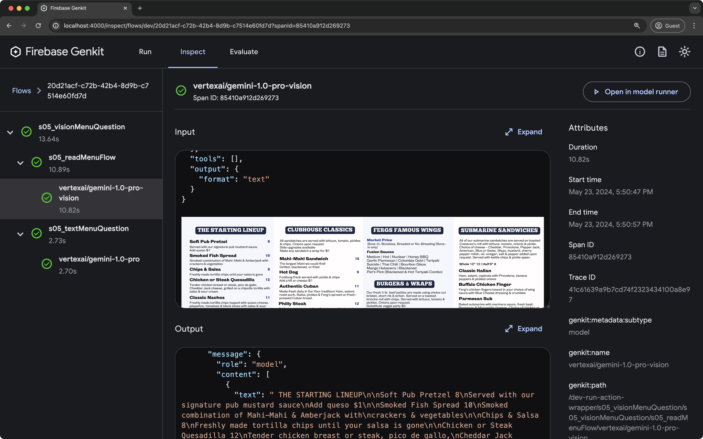

Genkit is a framework for building AI-powered applications. It provides open source libraries for Node.js and Go, along with tools to help you debug and iterate quickly.

Learn more in our documentation for [Node.js](https://firebase.google.com/docs/genkit) and [Go](https://firebase.google.com/docs/genkit-go/get-started-go).

## What can you build with Genkit?

Genkit is a versatile framework, which you can use to build many different types of AI applications. Common use cases include:

- **Intelligent agents:** Create agents that understand user requests and perform tasks autonomously, such as personalized travel planning or itinerary generation.

  - Example: [Compass Travel Planning App](https://developers.google.com/solutions/compass)

- **Data transformation:** Convert unstructured data, like natural language, into structured formats (e.g., objects, SQL queries, tables) for integration into your app or data pipeline.

  - Example: [Add Natural Language AI Data Filters with Genkit](https://medium.com/firebase-developers/how-to-add-natural-language-ai-data-filters-to-your-app-71d64a79624d)

- **Retrieval-augmented generation:** Create apps that provide accurate and contextually relevant responses by grounding generation with your own data sources, such as chatbots or question answering systems.
  - Example: [Build AI features powered by your data](https://firebase.google.com/codelabs/ai-genkit-rag#0)

## Who should use Genkit?

Genkit is built for developers seeking to add generative AI to their apps with Node.js or Go, and can run anywhere these runtimes are supported. It's designed around a plugin architecture that can work with any generative model API or vector database, with many integrations [already available](#plugin-ecosystem).

While developed by the [Firebase](https://firebase.google.com) team, Genkit can be used independently of Firebase or Google Cloud services.

## Get started

- [Node.js quickstart](https://firebase.google.com/docs/genkit/get-started)
- [Angular quickstart](https://firebase.google.com/docs/genkit/angular)
- [Next.js quickstart](https://firebase.google.com/docs/genkit/nextjs)
- [Go quickstart](https://firebase.google.com/docs/genkit-go/get-started-go)

> [!NOTE]
> Genkit for Go is in alpha, so we only recommend it for prototyping.

## Library key features

- **Unified generation API:** Generate text, media, structured objects, and tool calls from any generative model using a single, adaptable API.

- **Vector database support:** Add retrieval-augmented generation (RAG) to your apps with simple indexing and retrieval APIs that work across vector database providers.

- **Enhanced prompt engineering:** Define rich prompt templates, model configurations, input/output schemas, and tools all within a single, runnable [.prompt](https://firebase.google.com/docs/genkit/dotprompt) file.

- **AI workflows:** Organize your AI app logic into [Flows](https://firebase.google.com/docs/genkit/flows) - functions designed for observability, streaming, integration with Genkit devtools, and easy deployment as API endpoints.

- **Built-in streaming:** Stream content from your Genkit API endpoints to your client app to create snappy user experiences.

## Development tools

Genkit provides a CLI and a local UI to streamline your AI development workflow.

### CLI

The Genkit CLI includes commands for running and evaluating your Genkit functions (flows) and collecting telemetry and logs.

- **Install:** `npm i -g genkit`
- **Run a command, wrapped with telemetry, a interactive developer UI, etc:** `genkit start -- <command to run your code>`

### Developer UI

The Genkit developer UI is a local interface for testing, debugging, and iterating on your AI application.

Key features:

- **Run:** Execute and experiment with Genkit flows, prompts, queries, and more in dedicated playgrounds.
- **Inspect:** Analyze detailed traces of past executions, including step-by-step breakdowns of complex flows.
- **Evaluate:** Review the results of evaluations run against your flows, including performance metrics and links to relevant traces.

## Plugin ecosystem

Extend Genkit with plugins for specific AI models, vector databases, and platform integrations from providers like Google and OpenAI.

- **Node.js plugins:** [Explore on npm](https://www.npmjs.com/search?q=keywords:genkit-plugin)
- **Go plugins:** [Explore on pkg.go.dev](https://pkg.go.dev/github.com/firebase/genkit/go#section-directories)

Create and share your own plugins:

- **Write Node.js plugins:** [Plugin Authoring Guide](https://firebase.google.com/docs/genkit/plugin-authoring)
- **Write Go plugins:** [Plugin Authoring Guide](https://firebase.google.com/docs/genkit-go/plugin-authoring)

Find excellent examples of community-built plugins for OpenAI, Anthropic, Cohere, and more in this [repository](https://github.com/TheFireCo/genkit-plugins).

## Try Genkit in Firebase Studio

Want to skip the local setup? Click below to try out Genkit using [Firebase Studio](https://firebase.studio), Google's AI-assisted workspace for full-stack app development in the cloud.

## Sample apps

Take a look at some samples of Genkit in use:

- ["AI barista"](https://github.com/firebase/genkit/blob/main/samples/js-coffee-shop) -- demonstrates simple LLM usage
- [A simple chatbot with a JavaScript frontend](https://github.com/firebase/genkit/blob/main/samples/chatbot) -- add history to LLM sessions
- [Restaurant menu Q&A app](https://github.com/firebase/genkit/blob/main/samples/js-menu) -- this sample shows progressively
  more sophisticated versions of a menu understanding app.
- [Streaming to an Angular frontend](https://github.com/firebase/genkit/blob/main/samples/js-angular)
- [js-schoolAgent](https://github.com/firebase/genkit/blob/main/samples/js-schoolAgent/): A simple school assistant system with a routing agent and specialized agents
- [Prompts](https://github.com/firebase/genkit/blob/main/samples/prompts/): Shows off several prompting techniques

## Connect with us

- **Join the community:** Stay updated, ask questions, and share your work with other Genkit users on our [Discord server](https://discord.gg/qXt5zzQKpc).

- **Provide feedback:** Report issues or suggest new features using our GitHub [issue tracker](https://github.com/firebase/genkit/issues).

## Contributing

Contributions to Genkit are welcome and highly appreciated! See our [Contribution Guide](CONTRIBUTING.md) to get started.

## Authors

Genkit is built by [Firebase](https://firebase.google.com/products/genkit) with contributions from the [Open Source Community](https://github.com/firebase/genkit/graphs/contributors).
