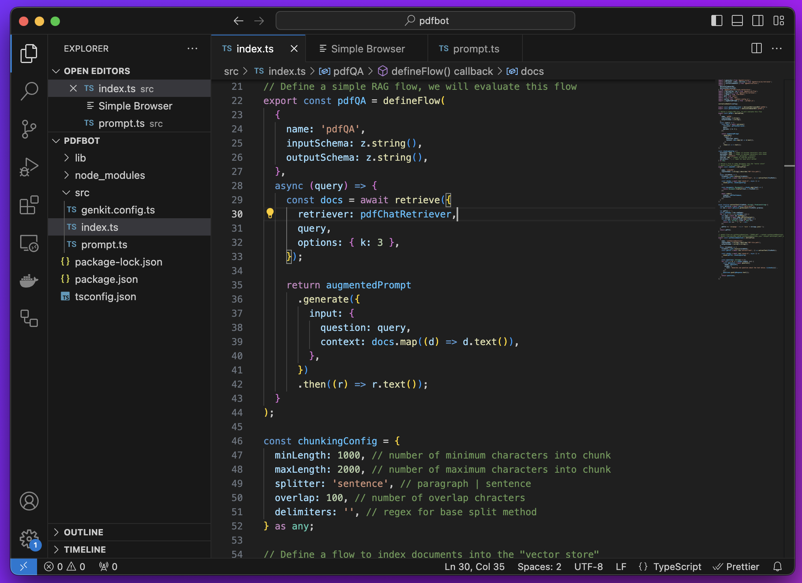
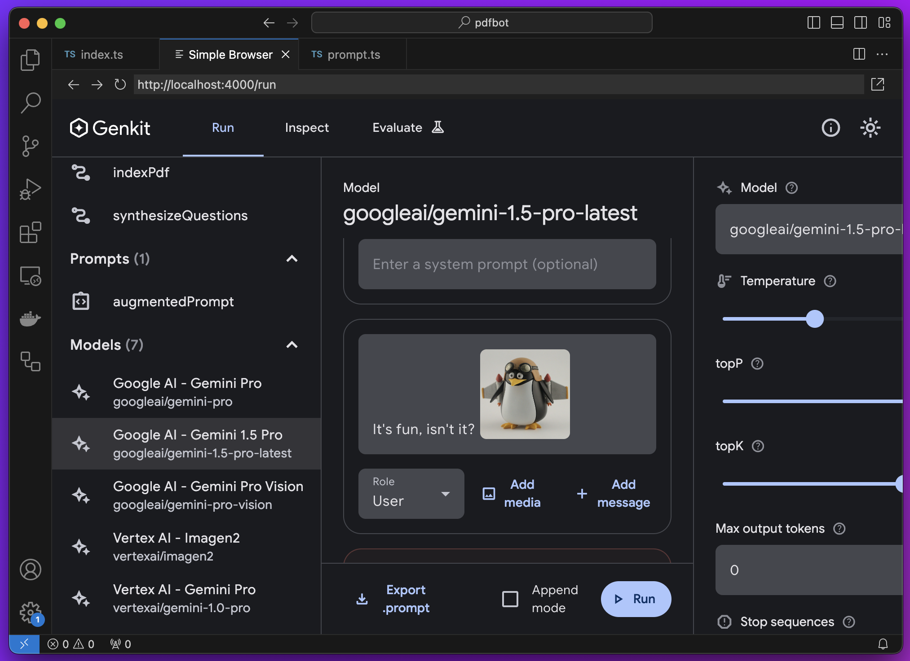

Firebase Genkit (beta) is a code-centric framework with built-in tooling to help app developers build, test, deploy, and monitor AI-powered features with confidence. The Genkit framework itself is free and [open source](./LICENSE), and integrates with many services that have free tiers to get started.

Genkit is available for Node.js (TypeScript), with Go support in active development.

Please note since Genkit is currently in beta, this means that the public API and framework design may change in backward-incompatible ways.

Getting started is easy:

Install Genkit: `npm i -g genkit`

Review the [documentation](https://firebase.google.com/docs/genkit) for details and samples.

## Contributing

Genkit is an open source framework, and we welcome contributions. Information on how to get started can be found in our [contributor guide](CONTRIBUTING.md).

## Key features

### Gen AI models

- **Unified API for generation** across AI models built by Google (Gemini, Gemma) and third party providers. Supports multimodal input, multimedia content generation, and custom options.
- **Generate structured output** as strongly-typed objects with custom schemas for easy integration into your app.
- **Define custom tools for your AI models** to fetch data, display UI, write to a database, and more.
- **Write and manage prompts** with all relevant metadata encapsulated in a single dotprompt file. Supports handlebars templating, history, multimedia, and more.



### Retrieval

**Build context-aware AI features** by indexing your data and dynamically retrieving relevant information from your database. Genkit provides flexible, light-weight abstractions for indexers and retrievers that work with any database provider.

### Evaluation

Evaluate your end-to-end AI workflow using a variety of pre-built and custom evaluators. As easy as:

```
genkit eval:flow myAiWorkflow --input testQuestions.json
```

### Extensibility with plugins

**Make use of pre-built components and integrations** for models, vector stores, tools, evaluators, observability, and more through Genkit’s open ecosystem of plugins built by Google and the community. To see this in action, you can explore Node.js plugins on [NPM](https://www.npmjs.com/search?q=keywords:genkit-plugin).

You can also use this extensibility to easily define custom components whenever existing plugins don’t fit your needs.

For more information:

- Genkit plugins on NPM
- Writing Genkit plugins

### Deployment

**Deploy your AI feature with a single command** through the Firebase or Google Cloud CLI to:

- Cloud Functions for Firebase (Node.js only)
- Google Cloud Run (Node.js or Go)

You can also deploy to any container platform where your chosen runtime is supported.

### Observability and monitoring

Genkit is **fully instrumented with OpenTelemetry** and provides hooks to export telemetry data. Easily log traces and telemetry to Google Cloud using pre-built plugins or set up with a custom provider for full end-to-end observability and monitoring in production.

## Genkit Developer UI

Genkit’s developer UI is a local web app downloaded by the Genkit CLI tooling package that gives developers sandboxed runners the Genkit actions (models, prompts, retrievers, etc) configured in your local environment.

Key features:

- **Action Runners:** Sandboxed environments that let developers run Genkit flows and perform other actions like chatting with models, running structured prompts or testing retrievers.
- **Trace Viewer:** View the previous executions of flows and actions, including step-by-step views of complex flows.
- **Evaluations:** See the results of running evaluations of flows against test sets, including scored metrics and links to the traces for those evaluation runs. See the evaluation documentation for more

Genkit's developer UI enables developers to prototype, develop, and test their AI features locally, resulting in quick turn-around times. Rich features like Genkit's action runners, trace viewer, and evaluations UI provide a great developer experience.



## Google Cloud and Firebase integrations

Genkit works great out-of-the-box with Firebase or Google Cloud projects thanks to official plugins and templates that make it easy to integrate Google Cloud and Firebase services for AI, databases, monitoring, authentication, and deployment. These include:

- [Google Cloud plugin](https://firebase.google.com/docs/genkit/plugins/google-cloud): Export logs, metrics, and traces from your AI-powered feature to Cloud Logging, Cloud Tracing, and Firestore.
- [Firebase plugin](https://firebase.google.com/docs/genkit/plugins/firebase): Integrate with Cloud Functions for Firebase, Firebase Authentication, App Check, Firestore, and more.
- [Google Cloud Vertex AI plugin](https://firebase.google.com/docs/genkit/plugins/vertex-ai): Integrate with Vertex AI models (Gemini, Imagen, …), evaluators, and more.
- [Google AI plugin](https://firebase.google.com/docs/genkit/plugins/google-genai): Integrate with Google AI Gemini APIs.
- [Ollama plugin](https://firebase.google.com/docs/genkit/plugins/ollama): Integrate with Ollama to access popular OSS models like Google’s Gemma.
- [pgvector template](https://firebase.google.com/docs/genkit/templates/pgvector): See our template for integrating with pgvector for CloudSQL and AlloyDB.

We appreciate you considering Genkit for your next project, remember to let us know of any issues by filing GitHub Issues or join our GitHub discussions to help shape the future of this product.

Firebase Genkit Team
