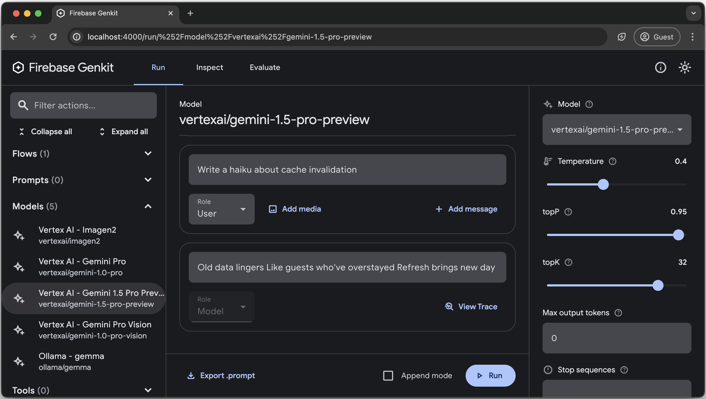

# Managing prompts with Dotprompt

Prompt engineering is the primary way that you, as an app developer, influence
the output of generative AI models. For example, when using LLMs, you can craft
prompts that influence the tone, format, length, and other characteristics of
the models' responses.

The way you write these prompts will depend on the model you're using; a prompt
written for one model might not perform well when used with another model.
Similarly, the model parameters you set (temperature, top-k, and so on) will
also affect output differently depending on the model.

Getting all three of these factors&mdash;the model, the model parameters, and
the prompt&mdash;working together to produce the output you want is rarely a
trivial process and often involves substantial iteration and experimentation.
Genkit provides a library and file format called Dotprompt, that aims to make
this iteration faster and more convenient.

Dotprompt is designed around the premise that **prompts are code**. You define
your prompts along with the models and model parameters they're intended for
separately from your application code. Then, you (or, perhaps someone not even
involved with writing application code) can rapidly iterate on the prompts and
model parameters using the Genkit Developer UI. Once your prompts are working
the way you want, you can import them into your application and run them using
Genkit.

Your prompt definitions each go in a file with a `.prompt` extension. Here's an
example of what these files look like:

```none
---
model: vertexai/gemini-1.5-flash-latest
config:
  temperature: 0.9
input:
  schema:
    location: string
    style?: string
    name?: string
  default:
    location: a restaurant
---

You are the world's most welcoming AI assistant and are currently working at {{location}}.

Greet a guest{{#if name}} named {{name}}{{/if}}{{#if style}} in the style of {{style}}{{/if}}.
```

The portion in the triple-dashes is YAML front matter, similar to the front
matter format used by GitHub Markdown and Jekyll; the rest of the file is the
prompt, which can optionally use
[Handlebars](https://handlebarsjs.com/guide/){:.external} templates. The
following sections will go into more detail about each of the parts that make a
`.prompt` file and how to use them.

## Before you begin

Before reading this page, you should be familiar with the content covered on the
[Generating content with AI models](models) page.

If you want to run the code examples on this page, first complete the steps in
the [Getting started](get-started) guide. All of the examples assume that you
have already installed Genkit as a dependency in your project.

## Installing the dotprompt plugin

Dotprompt Is an optional component of Genkit, so you must install the plugin
Into your project before you can use it:

```posix-terminal
npm i –save @genkit-ai/dotprompt
```

Then, import the `dotprompt` function and call it in your plugin configuration:

```ts
import { configureGenkit } from "@genkit-ai/core";
import { dotprompt} from "@genkit-ai/dotprompt";

configureGenkit({
  plugins: [
    // ...
    dotprompt(),
  ],
  // ...
});
```

The `dotprompt` configuration function can accept an optional parameter, `dir`,
which sets the directory in which the plug-in will look for prompt files.
Continue to the next section for more information.

## Creating prompt files

Although Dotprompt provides several [different ways](#alternatives) to create
and load prompts, it's optimized for projects that organize their prompts as
`.prompt` files within a single directory (or subdirectories thereof). This
section shows you how to create and load prompts using this recommended setup.

### Creating a prompt directory

The Dotprompt library expects to find your prompts in a directory at your
project root and automatically loads any prompts it finds there. By default,
this directory is named `prompts`. For example, using the default directory
name, your project structure might look something like this:

```none
your-project/
├── lib/
├── node_modules/
{{'<b>'}}├── prompts/
│   └── hello.prompt{{'</b>'}}
├── src/
├── package-lock.json
├── package.json
└── tsconfig.json
```

If you want to use a different directory, you can specify it when you configure
the plugin:

```ts
dotprompt({ dir: './llm_prompts'})
```

Alternatively, you can specify a complete path from which to load a single
prompt:

```ts
const helloPrompt = loadPromptFile('./llm_prompts/hello.prompt');
```

### Creating a prompt file

There are two ways to create a `.prompt` file: using a text editor, or with the
developer UI.

#### Using a text editor

If you want to create a prompt file using a text editor, create a text file with
the `.prompt` extension in your prompts directory: for example,
`prompts/hello.prompt`.

Here is a minimal example of a prompt file:

```none
---
model: vertexai/gemini-1.5-flash-latest
---

You are the world's most welcoming AI assistant. Greet the user and offer your assistance.
```

The portion in the dashes is YAML front matter, similar to the front matter
format used by GitHub markdown and Jekyll; the rest of the file is the prompt,
which can optionally use Handlebars templates. The front matter section is
optional, but most prompt files will at least contain metadata specifying a
model.

#### Using the developer UI

You can also create a prompt file using the model runner in the developer UI.
Start with application code that imports the Genkit library and configures it to
use the model plugin you're interested in. For example:

```ts
import { configureGenkit } from "@genkit-ai/core";
import { googleAI } from "@genkit-ai/googleai";

configureGenkit({ plugins: [googleAI()] });
```

It's okay if the file contains other code, but the above is all that's required.

Load the developer UI in the same project:

```posix-terminal
npx genkit start
```

In the Models section, choose the model you want to use from the list of models
provided by the plugin.



Then, experiment with the prompt and configuration until you get results you're
happy with. When you're ready, press the Export button and save the file to your
prompts directory.

## Running prompts

After you've created prompt files, you can run them from your application code,
or using the tooling provided by Genkit. Regardless of how you want to run your
prompts, first start with application code that imports the Genkit library as
well as the `dotprompt` plugin and the model plugins you're interested in. For
example:

```ts
import { configureGenkit } from "@genkit-ai/core";
import { dotprompt } from "@genkit-ai/dotprompt";
import { googleAI } from "@genkit-ai/googleai";

configureGenkit({
  plugins: [googleAI(),  dotprompt() ],
});
```

It's okay if the file contains other code, but the above is all that's required.
If you're storing your prompts in a directory other than the default, be sure to
specify it when you configure the plugin.

### Run prompts from code

To use a prompt, load it using `promptRef('file_name')`:

```ts
import { promptRef } from '@genkit-ai/dotprompt';

const greetingPrompt = promptRef('hello');
```

Then, call the prompt's `generate()` method:

```ts
const result = await greetingPrompt.generate({});
```

The `generate()` method is similar to the `generate()` function from
`@genkit-ai/ai`, and accepts most of the same options, with the exception of the
prompt itself. For example:

```ts
const response = await helloPrompt.generate({
  config: {
    temperature: 0.4,
  }
});
```

Any parameters you pass to the `generate()` method will override the same
parameters specified in the prompt file.

See [Generate content with AI models](models) for descriptions of the available
options.

### Using the developer UI

As you're refining your app's prompts, you can run them in the Genkit developer
UI to quickly iterate on prompts and model configurations, independently from
your application code.

Load the developer UI from your project directory:

```posix-terminal
npx genkit start
```


Once you've loaded prompts into the developer UI, you can run them with
different input values, and experiment with how changes to the prompt wording or
the configuration parameters affect the model output. When you're happy with the
result, you can click the **Export prompt** button to save the modified prompt
back into your project directory.

## Model configuration

In the front matter block of your prompt files, you can optionally specify model
configuration values for your prompt:

```none
---
config:
  temperature: 1.4
  topK: 50
  topP: 0.4
  maxOutputTokens: 400
  stopSequences:
    -   "<end>"
    -   "<fin>"
---
```

These values map directly to the `config` parameter accepted by `generate()`:

```ts
config: {
  temperature: 1.4,
  topK: 50,
  topP: 0.4,
  maxOutputTokens: 400,
  stopSequences: ["<end>", "<fin>"],
}
```

See [Generate content with AI models](models) for descriptions of the available
options.

## Input and output schemas

You can specify input and output schemas for your prompt by defining them in the
front matter section:

```none
---
model: googleai/gemini-1.5-flash-latest
input:
  schema:
    theme?: string
  default:
    theme: "pirate"
output:
  schema:
    dishname: string
    description: string
    calories: integer
    allergens(array): string
---
Invent a menu item for a {{theme}} themed restaurant.
```

These schemas are used in much the same way as those passed to a `generate()`
request or a flow definition. For example, the prompt defined above produces
structured output:

```ts
const menuPrompt = promptRef("menu");
const response = await menuPrompt.generate({
  input: { theme: "medieval" },
});

const menuItem = response.data();
const dishName = menuItem['dishname'];
const description = menuItem['description'];
```

You have several options for defining schemas in a `.prompt` file: Dotprompt's
own schema definition format, Picoschema; standard JSON Schema; or, as
references to schemas defined in your application code. The following sections
describe each of these options in more detail.

### Picoschema

The schemas in the example above are defined in a format called Picoschema.
Picoschema is a compact, YAML-optimized schema definition format that makes it
easy to define the most important attributes of a schema for LLM usage. Here's a
longer example of a schema, which specifies the information an app might store
about an article:

```yaml
schema:
  title: string # string, number, and boolean types are defined like this
  subtitle?: string # optional fields are marked with a `?`
  draft?: boolean, true when in draft state
  status?(enum, approval status): [PENDING, APPROVED]
  date: string, the date of publication e.g. '2024-04-09' # descriptions follow a comma
  tags(array, relevant tags for article): string # arrays are denoted via parentheses
  authors(array):
    name: string
    email?: string
  metadata?(object): # objects are also denoted via parentheses
    updatedAt?: string, ISO timestamp of last update
    approvedBy?: integer, id of approver
  extra?: any, arbitrary extra data
  (*): string, wildcard field
```

The above schema is equivalent to the following TypeScript interface:

```ts
interface Article {
  title: string;
  subtitle?: string | null;
  /** true when in draft state */
  draft?: boolean | null;
  /** approval status */
  status?: 'PENDING' | 'APPROVED' | null;
  /** the date of publication e.g. '2024-04-09' */
  date: string;
  /** relevant tags for article */
  tags: string[];
  authors: {
    name: string;
    email?: string | null;
  }[];
  metadata?: {
    /** ISO timestamp of last update */
    updatedAt?: string | null;
    /** id of approver */
    approvedBy?: number | null;
  } | null;
  /** arbitrary extra data */
  extra?: any;
  /** wildcard field */

}
```

Picoschema supports scalar types `string`, `integer`, `number`, `boolean`, and
`any`. Objects, arrays, and enums are denoted by a parenthetical after the field
name.

Objects defined by Picoschema have all properties required unless denoted
optional by `?`, and do not allow additional properties. When a property is
marked as optional, it is also made nullable to provide more leniency for LLMs
to return null instead of omitting a field.

In an object definition, the special key `(*)` can be used to declare a
"wildcard" field definition. This will match any additional properties not
supplied by an explicit key.

### JSON Schema

Picoschema does not support many of the capabilities of full JSON schema. If you
require more robust schemas, you may supply a JSON Schema instead:

```yaml
output:
  schema:
    type: object
    properties:
      field1:
        type: number
        minimum: 20
```

### Zod schemas defined in code

In addition to directly defining schemas in the `.prompt` file, you can
reference a schema registered with `defineSchema()` by name. If you're using
TypeScript, this approach will let you take advantage of the language's static
type checking features when you work with prompts.

To register a schema:

```ts
import { defineSchema } from '@genkit-ai/core';
import { z } from 'zod';

const MenuItemSchema = defineSchema(
  'MenuItemSchema',
  z.object({
    dishname: z.string(),
    description: z.string(),
    calories: z.coerce.number(),
    allergens: z.array(z.string())
  }),
);
```

Within your prompt, provide the name of the registered schema:

```none
---
model: vertexai/gemini-1.5-flash-latest
output:
  schema: MenuItemSchema
---
```

The Dotprompt library will automatically resolve the name to the underlying
registered Zod schema. You can then utilize the schema to strongly type the
output of a Dotprompt:

```ts
const menuPrompt = promptRef("menu");
const response = await menuPrompt.generate<typeof MenuItemSchema>({});

const menuItem = response.data(); // Now strongly typed as MenuItemSchema
```

## Prompt templates

The portion of a `.prompt` file that follows the front matter (if present) is
the prompt itself, which will be passed to the model. While this prompt could be
a simple text string, very often you will want to incorporate user input into
the prompt. To do so, you can specify your prompt using the
[Handlebars](https://handlebarsjs.com/guide/){:.external} templating language.
Prompt templates can include placeholders that refer to the values defined by
your prompt's input schema.

You already saw this in action in the section on input and output schemas:

```none
---
model: googleai/gemini-1.5-flash-latest
input:
  schema:
    theme?: string
  default:
    theme: "pirate"
---
Invent a menu item for a {{theme}} themed restaurant.
```

In this example, the Handlebars expression, `{{theme}}`, resolves to the value of the input's theme property when you run the prompt.
To pass input to the prompt, call generate as in the following example:

```ts
const menuPrompt = promptRef("menu");
const response = await menuPrompt.generate({
  input: { theme: "medieval" },
});
```

Note that because the input schema declared the theme property to be optional
and provided a default, you could have passed an empty object to generate, and
the prompt would have resolved using the default value.

Handlebars templates also support some limited logical constructs. For example,
as an alternative to providing a default, you could define the prompt using
Handlebars's `#if` helper:

```none
---
model: googleai/gemini-1.5-flash-latest
input:
  schema:
    theme?: string
---
Invent a menu item for a {{#if theme}}{{theme}} themed{{/if}} restaurant
```

In this example, the prompt renders as "Invent a menu item for a restaurant"
when the theme property is unspecified.

See the [Handlebars
documentation](https://handlebarsjs.com/guide/builtin-helpers.html){:.external}
for information on all of the built-in logical helpers.

In addition to properties defined by your input schema, your templates can also
refer to values automatically defined by Genkit. The next few sections describe
these automatically-defined values and how you can use them.

### Multi-message prompts

By default, Dotprompt constructs a single message with a "user" role.
However, some prompts are best expressed as a combination of multiple messages,
such as a system prompt.

The `{{role}}` helper provides a simple way to
construct multi-message prompts:

```none
---
model: vertexai/gemini-1.5-flash
input:
  schema:
    userQuestion: string
---

{{role "system"}}
You are a helpful AI assistant that really loves to talk about food. Try to work
food items into all of your conversations.
{{role "user"}}
{{userQuestion}}

```

### Multi-turn prompts and history

Dotprompt supports multi-turn prompts by passing the history option into the
`generate()` method:

```ts
const result = await multiTurnPrompt.generate({
  history: [
    { role: 'user', content: [{ text: 'Hello.' }] },
    { role: 'model', content: [{ text: 'Hi there!' }] },
  ],
});
```

By default, history will be inserted before the final message generated by the
prompt. However, you can manually position history using the `{{history}}` helper:

```none
{{role "system"}}
This is the system prompt.
{{history}}
{{role "user"}}
This is a user message.
{{role "model"}}
This is a model message.
{{role "user"}}
This is the final user message.
```

### Multi-modal prompts

For models that support multimodal input, such as images alongside text, you can
use the `{{media}}` helper:

```none
---
model: vertexai/gemini-1.5-flash
input:
  schema:
    photoUrl: string
---

Describe this image in a detailed paragraph:

{{media url=photoUrl}}
```

The URL can be `https:` or base64-encoded `data:` URIs for "inline" image usage.
In code, this would be:

```ts
const describeImagePrompt = promptRef('describe_image');

const result = await describeImagePrompt.generate({
  input: {
    photoUrl: 'https://example.com/image.png',
  },
});
```

### Partials

Partials are reusable templates that can be included inside any prompt. Partials
can be especially helpful for related prompts that share common behavior.

When loading a prompt directory, any file prefixed with an underscore (`_`) is
considered a partial. So a file `_personality.prompt` might contain:

```none
You should speak like a {{#if style}}{{style}}{{else}}helpful assistant.{{/else}}.
```

This can then be included in other prompts:

```none
---
model: vertexai/gemini-1.5-flash
input:
  schema:
    name: string
    style?: string
---

{{ role "system" }}
{{>personality style=style}}

{{ role "user" }}
Give the user a friendly greeting.

User's Name: {{name}}

```

Partials are inserted using the `{{>NAME_OF_PARTIAL args...}}`
syntax. If no arguments are provided to the partial, it executes with the same
context as the parent prompt.

Partials accept both named arguments as above or a single positional argument
representing the context. This can be helpful for tasks such as rendering
members of a list.

**_destination.prompt**

```none
-   {{name}} ({{country}})
```

**chooseDestination.prompt**

```none
---
model: googleai/gemini-1.5-flash-latest
input:
  schema:
    destinations(array):
      name: string
      country: string
---
Help the user decide between these vacation destinations:

{{#each destinations}}
{{>destination this}}
{{/each}}
```

#### Defining partials in code

You may also define partials in code using `definePartial`:

```ts
import { definePartial } from '@genkit-ai/dotprompt';

definePartial(
  'personality',
  'Talk like a {{#if style}}{{style}}{{else}}helpful assistant{{/if}}.'
);
```

Code-defined partials are available in all prompts.

### Defining Custom Helpers

You can define custom helpers to process and manage data inside of a prompt.
Helpers are registered globally using `defineHelper`:

```ts
import { defineHelper } from '@genkit-ai/dotprompt';

defineHelper('shout', (text: string) => text.toUpperCase());
```

Once a helper is defined you can use it in any prompt:

```none
---
model: vertexai/gemini-1.5-flash
input:
  schema:
    name: string
---

HELLO, {{shout name}}!!!
```

For more information about the arguments passed into helpers, see the Handlebars
documentation on creating custom helpers.

## Prompt variants

Because prompt files are just text, you can (and should!) commit them to your
version control system, allowing you to compare changes over time easily. Often,
tweaked versions of prompts can only be fully tested in a production environment
side-by-side with existing versions. Dotprompt supports this through its
variants feature.

To create a variant, create a `[name].[variant].prompt` file. For instance, if
you were using Gemini 1.5 Flash in your prompt but wanted to see if Gemini 1.5
Pro would perform better, you might create two files:

*   `my_prompt.prompt`: the "baseline" prompt
*   `my_prompt.gemini15pro.prompt`: a variant named `gemini15pro`

To use a prompt variant, specify the variant option when loading:

```ts
const myPrompt = promptRef('my_prompt', { variant: 'gemini15pro' });
```

The name of the variant is included in the metadata of generation traces, so you
can compare and contrast actual performance between variants in the Genkit trace
inspector.

## Alternative ways to define and load prompts {:#alternatives}

All of the examples discussed so far have assumed that your prompts are defined
in individual `.prompt` files in a single directory (or subdirectories thereof),
accessible to your app at runtime. Dotprompt is designed around this setup, and
its authors consider it to be the best developer experience overall.

However, if you have use cases that are not well supported by this setup,
Dotprompt provides some alternative ways to define and load prompts.

### Defining prompts in code

You can define prompts in code using the `defineDotprompt()` function:

```ts
import { defineDotprompt } from '@genkit-ai/dotprompt';
import { z } from 'zod';

const myPrompt = defineDotprompt(
  {
    model: 'vertexai/gemini-1.5-flash',
    input: {
      schema: z.object({
        name: z.string(),
      }),
    },
  },
  `Hello {{name}}, how are you today?`
);
```

The first parameter to this function is analogous to the front matter block of a
`.prompt` file.

### Loading prompts from specific files

You can load a prompt from an explicitly specified file path using the
`loadPromptFile()` function:

```ts
import { loadPromptFile } from '@genkit-ai/dotprompt';
import path from 'path';

const myPrompt = await loadPromptFile(
  path.resolve(__dirname, './path/to/my_prompt.pt')
);
```

### Loading prompts from URLs

You can load a prompt from a website using the `loadPromptUrl()` function:

```ts
import { loadPromptUrl } from '@genkit-ai/dotprompt';

const myPrompt = await loadPromptUrl('https://example.com/my_prompt.txt');
```
