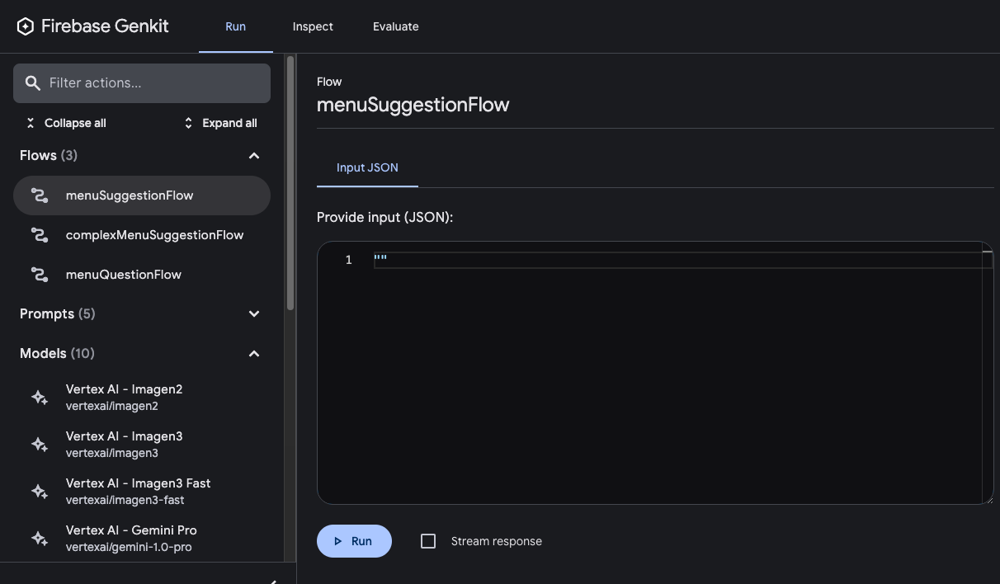
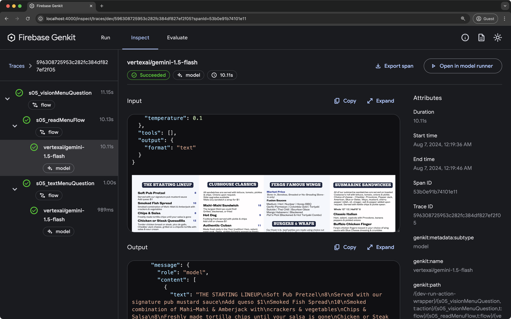

# Defining AI workflows

The core of your app's AI features are generative model requests, but it's rare
that you can simply take user input, pass it to the model, and display the model
output back to the user. Usually, there are pre- and post-processing steps that
must accompany the model call. For example:

*   Retrieving contextual information to send with the model call
*   Retrieving the history of the user's current session, for example in a chat
    app 
*   Using one model to reformat the user input in a way that's suitable to pass
    to another model 
*   Evaluating the "safety" of a model's output before presenting it to the user 
*   Combining the output of several models 

Every step of this workflow must work together for any AI-related task to
succeed.

In Genkit, you represent this tightly-linked logic using a construction called a
flow. Flows are written just like functions, using ordinary TypeScript code, but
they add additional capabilities intended to ease the development of AI
features:

*   **Type safety**: Input and output schemas defined using Zod, which provides
    both static and runtime type checking 
*   **Integration with developer UI**: Debug flows independently of your
    application code using the developer UI. In the developer UI, you can run
    flows and view traces for each step of the flow.
*   **Simplified deployment**: Deploy flows directly as web API endpoints, using
    Cloud Functions for Firebase or any platform that can host a web app.

Unlike similar features in other frameworks, Genkit's flows are lightweight and
unobtrusive, and don't force your app to conform to any specific abstraction.
All of the flow's logic is written in standard TypeScript, and code inside a
flow doesn't need to be flow-aware.

## Defining and calling flows

In its simplest form, a flow just wraps a function. The following example wraps
a function that calls `generate()`: 

```ts

```

Just by wrapping your `generate()` calls like this, you add some functionality:
doing so lets you run the flow from the Genkit CLI and from the developer UI,
and is a requirement for several of Genkit's features, including deployment and
observability (later sections discuss these topics).

### Input and output schemas 

One of the most important advantages Genkit flows have over directly calling a
model API is type safety of both inputs and outputs. When defining flows, you
can define schemas for them using Zod, in much the same way as you define the
output schema of a `generate()` call; however, unlike with `generate()`, you can
also specify an input schema.

Here's a refinement of the last example, which defines a flow that takes a
string as input and outputs an object:

```ts

```

Note that the schema of a flow does not necessarily have to line up with the
schema of the `generate()` calls within the flow (in fact, a flow might not even
contain `generate()` calls). Here's a variation of the example that passes a
schema to `generate()`, but uses the structured output to format a simple
string, which the flow returns.

```ts

```

### Calling flows

Once you've defined a flow, you can call it from your Node.js code:

```ts

```

The argument to the flow must conform to the input schema, if you defined one. 

If you defined an output schema, the flow response will conform to it. For
example, if you set the output schema to `MenuItemSchema`, the flow output will
contain its properties:

```ts

```

## Streaming flows 

Flows support streaming using an interface similar to `generate()`'s streaming
interface. Streaming is useful when your flow generates a large amount of
output, because you can present the output to the user as it's being generated,
which improves the perceived responsiveness of your app. As a familiar example,
chat-based LLM interfaces often stream their responses to the user as they are
generated.

Here's an example of a flow that supports streaming:

```ts

```

*   The `streamSchema` option specifies the type of values your flow streams.
    This does not necessarily need to be the same type as the `outputSchema`,
    which is the type of the flow's complete output.
*   `streamingCallback` is a callback function that takes a single parameter, of
    the type specified by `streamSchema`. Whenever data becomes available within
    your flow, send the data to the output stream by calling this function. Note
    that `streamingCallback` is only defined if the caller of your flow
    requested streaming output, so you need to check that it's defined before
    calling it.

In the above example, the values streamed by the flow are directly coupled to
the values streamed by the `generate()` call inside the flow. Although this is
often the case, it doesn't have to be: you can output values to the stream using
the callback as often as is useful for your flow.

### Calling streaming flows

Streaming flows are also callable, but they immediately return a response object
rather than a promise:

```ts

```

The response object has a stream property, which you can use to iterate over the
streaming output of the flow as it's generated:

```ts

```

You can also get the complete output of the flow, as you can with a
non-streaming flow:

```ts

```

Note that the streaming output of a flow might not be the same type as the
complete output; the streaming output conforms to `streamSchema`,  whereas the
complete output conforms to `outputSchema`.

## Running flows from the command line 

You can run flows from the command line using the Genkit CLI tool:

```posix-terminal
genkit flow:run menuSuggestionFlow '"French"'
```

For streaming flows, you can print the streaming output to the console by adding
the `-s` flag:

```posix-terminal
genkit flow:run menuSuggestionFlow '"French"' -s
```

Running a flow from the command line is useful for testing a flow, or for
running flows that perform tasks needed on an ad hoc basis&mdash;for example, to
run a flow that ingests a document into your vector database.

## Debugging flows 

One of the advantages of encapsulating AI logic within a flow is that you can
test and debug the flow independently from your app using the Genkit developer
UI.

To start the developer UI, run the following commands from your project
directory:

```posix-terminal
genkit start -- tsx --watch src/your-code.ts
```

From the **Run** tab of developer UI, you can run any of the flows defined in
your project:



After you've run a flow, you can inspect a trace of the flow invocation by
either clicking **View trace** or looking on the **Inspect** tab.

In the trace viewer, you can see details about the execution of the entire flow,
as well as details for each of the individual steps within the flow. For
example, consider the following flow, which contains several generation
requests:

```ts

```

When you run this flow, the trace viewer shows you details about each generation
request including its output:



### Flow steps

In the last example, you saw that each `generate()` call showed up as a separate
step in the trace viewer. Each of Genkit's fundamental actions show up as
separate steps of a flow:

*   `generate()`
*   `Chat.send()`
*   `embed()`
*   `index()`
*   `retrieve()`

If you want to include code other than the above in your traces, you can do so
by wrapping the code in a `run()` call. You might do this for calls to
third-party libraries that are not Genkit-aware, or for any critical section of
code.

For example, here's a flow with two steps: the first step retrieves a menu using
some unspecified method, and the second step includes the menu as context for a
`generate()` call.

```ts

```

Because the retrieval step is wrapped in a `run()` call, it's included as a step
in the trace viewer:


## Deploying flows

You can deploy your flows directly as web API endpoints, ready for you to call
from your app clients. Deployment is discussed in detail on several other pages,
but this section gives brief overviews of your deployment options.

### Cloud Functions for Firebase

To deploy flows with Cloud Functions for Firebase, use the `firebase` plugin. In
your flow definitions, replace `defineFlow` with `onFlow` and include an
`authPolicy`.

```ts

```

For more information, see the following pages:

*   [Deploy with Firebase](/docs/genkit/firebase)
*   [Authorization and integrity](/docs/genkit/auth#cloud_functions_for_firebase_integration)
*   [Firebase plugin](/docs/genkit/plugins/firebase)

### Express.js

To deploy flows using any Node.js hosting platform, such as Cloud Run, define
your flows using `defineFlow()` and then call `startFlowServer()`:

```ts

```

By default, `startFlowServer` will serve all the flows defined in your codebase
as HTTP endpoints (for example, `http://localhost:3400/menuSuggestionFlow`). You
can call a flow with a POST request as follows:

```posix-terminal
curl -X POST "http://localhost:3400/menuSuggestionFlow" \
  -H "Content-Type: application/json"  -d '{"data": "banana"}'
```

If needed, you can customize the flows server to serve a specific list of flows,
as shown below. You can also specify a custom port (it will use the PORT
environment variable if set) or specify CORS settings.

```ts

```

For information on deploying to specific platforms, see
[Deploy with Cloud Run](/docs/genkit/cloud-run) and
[Deploy flows to any Node.js platform](/docs/genkit/deploy-node).
