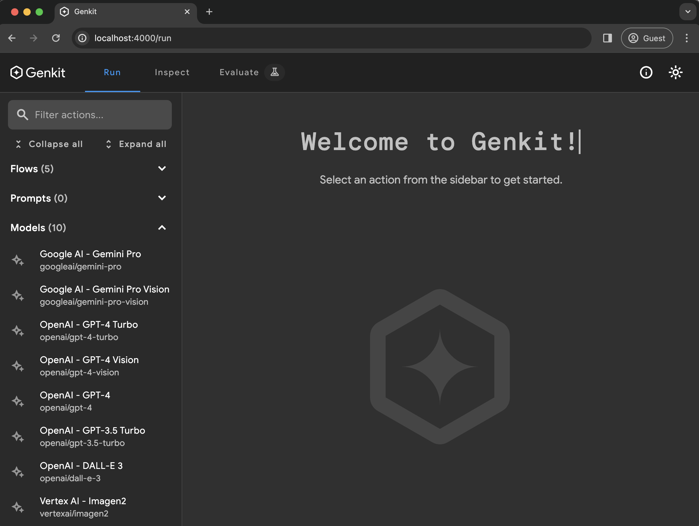

# Get started

To get started with Firebase Genkit, install the Genkit CLI and run
`genkit init` in a Node.js project. The rest of this page shows you how.

## Requirements

Node.js 18 or later.

## Procedure

1.  Install the Genkit CLI by running the following command:

    ```posix-terminal
    npm i -g genkit
    ```

1.  Create a new Node project:

    ```posix-terminal
    mkdir genkit-intro && cd genkit-intro

    npm init -y
    ```

    Look at package.json and make sure the `main` field is set to
    `lib/index.js`.

1.  Initialize a Genkit project:

    ```posix-terminal
    genkit init
    ```

    1. Select `Node.js` as the deployment platform option (templates for
       Firebase Cloud Functions and Google Cloud Run are also available).

    1. Select your model:

       - {Gemini (Google AI)}

         The simplest way to get started is with Google AI Gemini API. Make sure
         it's
         [available in your region](https://ai.google.dev/available_regions).

         [Generate an API key](https://aistudio.google.com/app/apikey) for the
         Gemini API using Google AI Studio. Then, set the `GOOGLE_GENAI_API_KEY`
         environment variable to your key:

         ```posix-terminal
         export GOOGLE_GENAI_API_KEY=<your API key>
         ```

       - {Gemini (Vertex AI)}

         If the Google AI Gemini API is not available in your region, consider
         using the Vertex AI API which also offers Gemini and other models. You
         will need to have a billing-enabled Google Cloud project, enable AI
         Platform API, and set some additional environment variable:

         ```posix-terminal
         gcloud services enable aiplatform.googleapis.com

         export GCLOUD_PROJECT=<your project ID>

         export GCLOUD_LOCATION=us-central1
         ```

         See https://cloud.google.com/vertex-ai/generative-ai/pricing for Vertex AI pricing.

    1. Choose default answers to the rest of the questions, which will
       initialize your project folder with some sample code.

    The `genkit init` command created two sample source files:

    - `genkit.config.ts`: this is where you configure Genkit for your project,
      and select and configure the plugins you want to load. The sample config
      loads a plugin to support the model provider you chose earlier.

      ```js
      export default configureGenkit({
        plugins: [googleAI()],
        logLevel: 'debug',
        enableTracingAndMetrics: true,
      });
      ```

    - `index.ts`: this is your project's entry point, where you export your AI
      flows and other resources you've defined. The sample file contains a
      single flow, `jokeFlow`, that simply calls the model provider's API with a
      simple prompt and returns the result.

      ```js
      export const jokeFlow = defineFlow(
        {
          name: 'jokeFlow',
          inputSchema: z.string(),
          outputSchema: z.string(),
        },
        async (subject) => {
          const llmResponse = await generate({
            prompt: `Tell me a long joke about ${subject}`,
            model: geminiPro,
            config: {
              temperature: 1,
            },
          });

          return llmResponse.text();
        }
      );
      ```

      As you build out your app's AI features with Genkit, you will likely
      create flows with multiple steps such as input preprocessing, more
      sophisticated prompt construction, integrating external information
      sources for retrieval-augmented generation (RAG), and more.

1.  Now you can run and explore Genkit features and the sample project locally
    on your machine. Download and start the Genkit Developer UI:

    ```posix-terminal
    genkit start
    ```

    

    The Genkit Developer UI is now running on your machine. When you run models
    or flows in the next step, your machine will perform the orchestration tasks
    needed to get the steps of your flow working together; calls to external
    services such as the Gemini API will continue to be made against live
    servers.

    Also, because you are in a dev environment, Genkit will store traces and
    flow state in local files.

1.  The Genkit Developer UI downloads and opens automatically when you run the
    `genkit start` command.

    The Developer UI lets you see which flows you have defined and models you
    configured, run them, and examine traces of previous runs. Try out some of
    these features:

    - On the **Run** tab, you will see a list of all of the flows that you have
      defined and any models that have been configured by plugins.

      Click **jokeFlow** and try running it with some input text (for example,
      `"manatees"`). If all goes well, you'll be rewarded with a joke about
      manatees. Run it a few more times and you might get one that's funny.

    - On the **Inspect** tab, you'll see a history of flow executions. For each
      flow, you can see the parameters that were passed to the flow and a
      trace of each step as they ran.

## Next steps

Check out how to build and deploy your Genkit app with [Firebase](firebase.md),
[Cloud Run](cloud-run.md), or any [Node.js platform](deploy-node.md).
