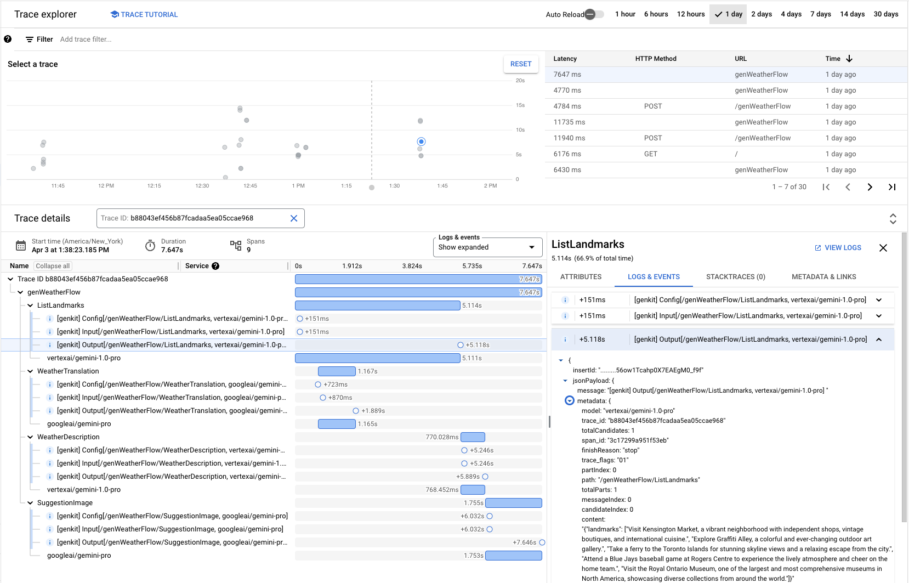

# Firebase Genkit

Firebase Genkit is an **open source framework** that helps you build, deploy,
and monitor **production-ready** **AI-powered apps**.

<picture class="attempt-right">
  <source
    srcset="/docs/genkit/resources/logo-vertical-dark.png"
    media="(prefers-color-scheme: light)"
    class="devsite-dark-theme"
    alt="Genkit logo">
  
</picture>

Genkit is **designed for app developers**, to help you easily integrate
powerful AI capabilities into your apps with familiar patterns and paradigms.
It's built by the same team behind Firebase, leveraging our experience in
building tools used by millions of developers worldwide.

Use Genkit to create apps that generate custom content, use semantic search,
handle unstructured inputs, answer questions with your business data,
autonomously make decisions, orchestrate tool calls, and much more!

Genkit currently supports server-side development in JavaScript/TypeScript
(Node.js) with Go support in active development.

Follow along with its development or make contributions of your own at its
[GitHub repository](https://github.com/firebase/genkit/).

## Key features

Genkit is here to help you through every step of your AI development journey,
from the beginning of your prototyping to monitoring in production&mdash;so
there's a lot to talk about.

To get you started, here are 10 key Genkit features we think you'll love:

### 1. Many models, one interface

Genkit provides plugins that give you access to popular models out of the box
and a flexible model abstraction that makes it easy to integrate any model API
and use community-maintained models.
Trying out a new model is as easy as changing a single argument, but each model
can specify custom configurations.

```js
import { geminiPro } from '@genkit-ai/vertexai';
import { ollama } from 'genkitx-ollama';
import { generate } from '@genkit-ai/ai';

function flipACoin(a, b) {
  return Math.random() > 0.5 ? a : b;
}

const result = await generate({
  model: flipACoin(geminiPro, 'ollama/gemma'),
  config: { temperature: 0.3, maxOutputTokens: 200 },
  prompt: 'What makes you the best LLM out there?',
});

console.log(result.text());
```

### 2. Structured output

Generate strongly-typed data with Genkit using Zod schema. This can help you
analyze unstructured text, generate creative content, select tasks, and send
results back to your app as structured type-safe objects.

```js
import { generate } from "@genkit-ai/ai";
import { geminiPro } from "@genkit-ai/vertexai";
import { z } from "zod";

const CreatureSchema = z.object({
  name: z.string().describe('the name of the creature'),
  hitPoints: z.number().describe('hit points, between 5 and 100'),
  attacks: z.array(z.object({
    name: z.string(),
    damage: z.number().describe('amount of damage, between 2 and 25'),
  })).describe('3 attacks the creature can use')
});

const createCreature = defineFlow({
    name: "createCreature",
    inputSchema: z.string(),
    outputSchema: CreatureSchema,
  },
  (habitat) => {
    const result = await generate({
      model: geminiPro,
      prompt: `You are a brilliant RPG designer. Generate a creature that lives in ${habitat}.`,
      output: {schema: CreatureSchema}
    });
    // strongly typed and ready to go
    return result.output();
  }
)

console.log(await createCreature("a developer conference"));
```

### 3. Multimodal, multimedia

Genkit provides a common format for content that supports mixtures of text,
data, and arbitrary media. This lets you use Genkit for models that perform any
generative task (such as image generation), not just LLMs.

```js
import { imagen2, geminiProVision } from '@genkit-ai/vertexai';
import { generate } from '@genkit-ai/ai';

const imageResult = await generate({
  model: imagen2,
  prompt: 'Generate an image of a very specific historical time and place.',
});
const generatedImage = imageResult.media();

const descriptionResult = await generate({
  model: geminiProVision,
  prompt: [
    {
      text: 'What is the historical time and place represented in this picture?',
    },
    { media: generatedImage },
  ],
});
console.log(descriptionResult.text());
```

### 4. Give LLMs tools

Genkit makes it simple to do function calling with LLMs through tools. Tools
make it possible for AI to fetch data, display UI, write to a database, or take
any other action you can code up.

```js
import { generate, defineTool } from "@genkit-ai/ai";
import { geminiPro } from "@genkit-ai/vertexai";
import { z } from "zod";

const createReminder = defineTool({
    name: "createReminder",
    description: "Use this to create reminders for things in the future",
    inputSchema: z.object({
      time: z.string().describe('ISO timestamp string, e.g. 2024-04-03T12:23:00Z'),
      reminder: z.string().describe('the content of the reminder'),
    }),
    outputSchema: z.number().describe('the ID of the created reminder'),
  },
  (reminder) => db.reminders.create(reminder)
);

const searchNotes = defineTool({
    name: "searchNotes",
    description: "Use this to search the user's notes for people or phrases",
    inputSchema: z.string().describe('the search query'),
    outputSchema: z.object({notes: z.array(NoteSchema)}),
  },
  (query) => db.notes.search(query)
);

const result = await generate({
  model: geminiPro,
  tools: [createReminder, searchNotes],
  prompt: `
  You are a note-taking assistant. Using the tools available, try to answer the provided query.
  If you create a reminder, describe in text the reminder you created as a response.

  Query: I took a note about a meeting with Anna - can you set a reminder for the time?
  `
});
console.log(result.text());
```

### 5. Prompt management with Dotprompt

Prompt engineering is more than just tweaking text. The model you use,
parameters you supply, and format you request all impact the quality of your
output. Genkit offers Dotprompt, a prompt file format that lets you put it all
into a single file for easier testing and organization.

```none
---
model: vertexai/gemini-1.0-pro
config:
  temperature: 0.9
input:
  schema:
    properties:
      location: {type: string}
      style: {type: string}
      name: {type: string}
    required: [location]
  default:
    location: a restaurant
---

You are the world's most welcoming AI assistant and are currently working at {{location}}.

Greet a guest{{#if name}} named {{name}}{{/if}}{{#if style}} in the style of {{style}}{{/if}}.
```

### 6. Run flows locally

Generative AI has a ton of variation in results, so experimenting is super
important. The local Genkit Developer UI lets you interact with essential AI
components like models and retrievers, as well as manually test your end-to-end
flows including all the custom code you wrote.

<video autoplay muted loop playsinline>
  <source src="resources/devui-run.webm" type="video/webm" />
</video>

### 7. Inspect traces

Debugging complex, multi-step workflows with AI can be challenging due to
randomness and hidden processes. Genkit provides a trace inspector in the
developer UI that lets you inspect traces for each model call and step in your
flow. It can view traces from production and even render images!

<video autoplay muted loop playsinline>
  <source src="resources/devui-trace.webm" type="video/webm" />
</video>

### 8. Open & extensible

The AI ecosystem is growing faster than any one team can keep up with. Genkit
has an open plugin model that provides pre-built integrations with new models,
retrievers, and more. While the Genkit team maintains a small set of official
plugins, anyone can feel free to publish their own Genkit plugins to NPM.

Can't find a plugin for a particular integration you want? No problem. Genkit's
abstractions are flexible and make it easy to build custom components that
integrate into the framework, like this custom Firestore retriever:

```js
import { embed } from '@genkit-ai/ai/embedder';
import { Document, defineRetriever } from '@genkit-ai/ai/retriever';
import { textEmbeddingGecko } from '@genkit-ai/vertexai';
import {
  FieldValue,
  VectorQuery,
  VectorQuerySnapshot,
} from '@google-cloud/firestore';
import { Firestore } from 'firebase-admin/firestore';
import * as z from 'zod';
import { augmentedPrompt } from './prompt';

const QueryOptions = z.object({
  k: z.number().optional(),
});

const firestoreArtifactsRetriever = defineRetriever(
  {
    name: 'firestore/artifacts',
    configSchema: QueryOptions,
  },
  async (input, options) => {
    const embedding = await embed({
      embedder: textEmbeddingGecko,
      content: input,
    });

    const db = new Firestore();
    const coll = db.collection('vectors' /* your collection name */);

    const vectorQuery: VectorQuery = coll.findNearest(
      'embedding' /* the name of the field that contains the vector */,
      FieldValue.vector(embedding),
      {
        limit: options.k ?? 3,
        distanceMeasure: 'COSINE',
      }
    );

    const vectorQuerySnapshot: VectorQuerySnapshot = await vectorQuery.get();
    return {
      documents: vectorQuerySnapshot.docs.map((doc) =>
        // doc.data() represents the Firestore document. You may process
        // it as needed to generate a Genkit document object, depending on your
        // storage format.
        Document.fromText(doc.data().content.text)
      ),
    };
  }
);
```

### 9. Built for production

Easily deploy your flows to any platform that can serve an Express.js app.
Genkit is fully instrumented with OpenTelemetry and custom metadata for
enterprise-grade production monitoring.

There are also official plugins for Google Cloud and Firebase that help you
export data to Google Cloud's operations suite and integrate with Firebase
services like Cloud Functions for Firebase, Firebase Authentication, App Check,
and Firestore.



### 10. Authorization & security handling

When building any public-facing application, it's important to protect the data
stored in your system. When it comes to LLMs, extra diligence is necessary to
ensure that the model is only accessing data it should, tool calls are properly
scoped to the user invoking the LLM, and the flow is being invoked only by
verified client applications.

Genkit provides mechanisms for managing authorization policies and contexts.

```js
import { defineFlow, runFlow } from '@genkit-ai/flow';

export const selfSummaryFlow = defineFlow(
  {
    name: 'selfSummaryFlow',
    inputSchema: z.object({uid: z.string()}),
    outputSchema: z.string(),
    authPolicy: (auth, input) => {
      if (!auth) {
        throw new Error('Authorization required.');
      }
      if (input.uid !== auth.uid) {
        throw new Error('You may only summarize your own profile data.');
      }
    }
  },
  async (input) => { ... });
```

## Integrations

Genkit provides integrations with AI models, vector databases, telemetry
platforms, and more through its plugin system. The following plugins are
maintained by the Genkit team:

<table class="responsive">
  <tr>
    <th colspan=2>Official plugins</th>
  </tr>
  <tr>
    <td><code>googleai</code></td>
    <td>
      <b>Generative models</b>: Gemini Pro, Gemini 1.5 Pro, Gemini Pro Vision<br>
      <b>Embedding models</b>: Gecko text embedding<br>
    </td>
  </tr>
  <tr>
    <td><code>vertexai</code></td>
    <td>
      <b>Generative models</b>: Gemini Pro, Gemini 1.5 Pro, Gemini Pro Vision, Imagen2,
        Anthropic Claude 3<br>
      <b>Embedding models</b>: Gecko text embedding<br>
      <b>Evaluators</b>: Vertex AI evaluation
    </td>
  </tr>
  <tr>
    <td><code>ollama</code></td>
    <td>
      <b>Generative models</b>: Many local models, including Gemma, Llama 3, Mistral, and more<br>
    </td>
  </tr>
  <tr>
    <td><code>chroma</code></td>
    <td>
      <b>Vector database</b>: ChromaDB<br>
    </td>
  </tr>
  <tr>
    <td><code>pinecone</code></td>
    <td>
      <b>Vector database</b>: Pinecone<br>
    </td>
  </tr>
  <tr>
    <td><code>google-cloud</code></td>
    <td>
      <b>Monitoring tools</b>: Google Cloud Trace, Google Cloud Logging<br>
    </td>
  </tr>
  <tr>
    <td><code>firebase</code></td>
    <td>
      <b>Cloud deployment</b>: Cloud Functions, Firebase Authentication, App Check<br>
      <b>Vector database</b>: Cloud Firestore vector store<br>
    </td>
  </tr>
  <tr>
    <td><code>langchain</code></td>
    <td>
      Use LangChain chains and utilities in Genkit flows
    </td>
  </tr>
</table>

## Get started

Read the [Getting started](get-started.md) guide to learn how to install Genkit
and run your first AI flow.
