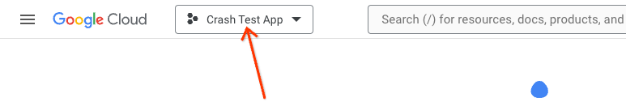
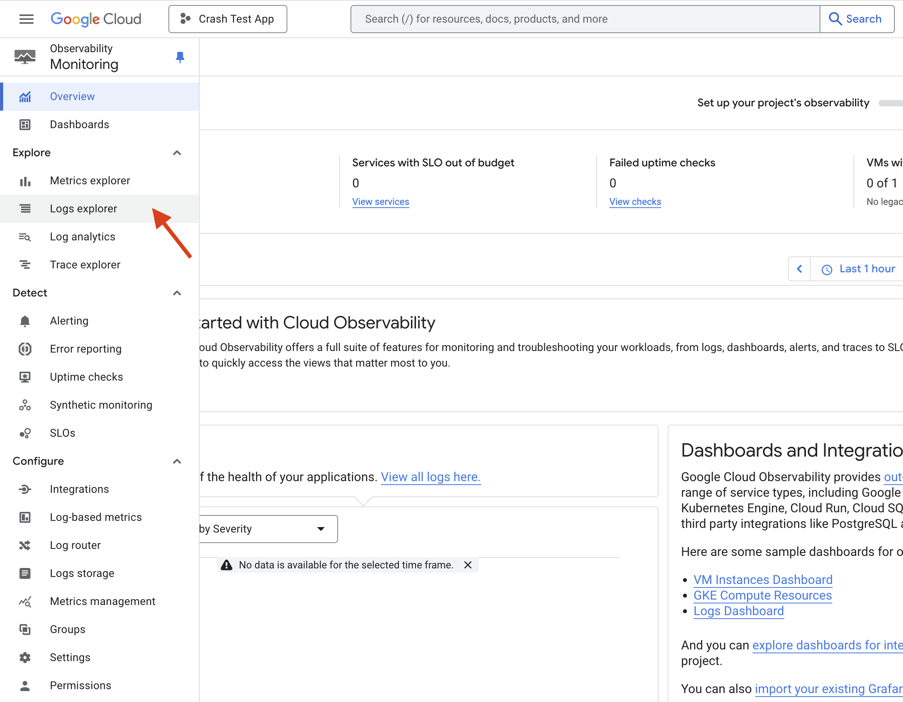
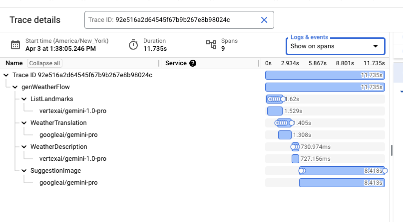
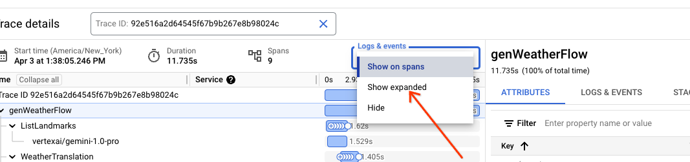
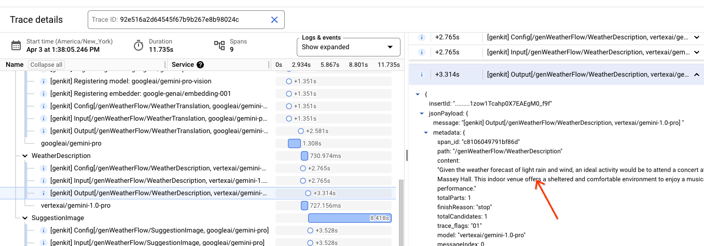
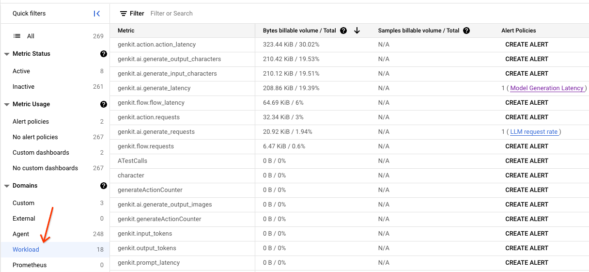
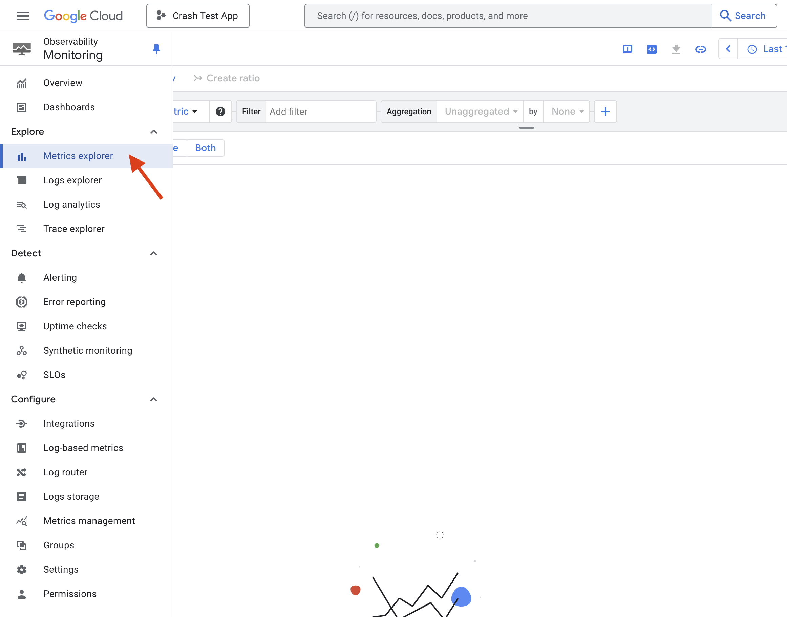

# Google Cloud plugin

The Google Cloud plugin exports Firebase Genkit's telemetry and logging data to
[Google Cloud's operation suite](https://cloud.google.com/products/operations).

> Note: Logging is facilitated by [Winston](https://github.com/winstonjs/winston) in favor of the [OpenTelemetry](https://opentelemetry.io/) logging APIs. Export of logs is done via a dedicated Winston Google Cloud exporter.

## Installation

```posix-terminal
npm i --save @genkit-ai/google-cloud
```

If you want to locally run flows that use this plugin, you also need the
[Google Cloud CLI tool](https://cloud.google.com/sdk/docs/install) installed.

## Set up a Google Cloud account

This plugin requires a Google Cloud account ([sign up](https://cloud.google.com/gcp) if you don't already have one) and a Google Cloud project.

Prior to adding the plugin, make sure that the following APIs are enabled for your project:

- [Cloud Logging API](https://console.cloud.google.com/apis/library/logging.googleapis.com)
- [Cloud Trace API](https://console.cloud.google.com/apis/library/cloudtrace.googleapis.com)
- [Cloud Monitoring API](https://console.cloud.google.com/apis/library/monitoring.googleapis.com)

These APIs should be listed in the [API dashboard](https://console.cloud.google.com/apis/dashboard) for your project.

Click [here](https://support.google.com/googleapi/answer/6158841) to learn more about enabling and disabling APIs.

## Genkit configuration

To enable exporting to Google Cloud Tracing, Logging, and Monitoring, add the `googleCloud` plugin to your Genkit configuration:

```ts
import { googleCloud } from '@genkit-ai/google-cloud';

export default configureGenkit({
  plugins: [googleCloud()],
  enableTracingAndMetrics: true,
  telemetry: {
    instrumentation: 'googleCloud',
    logger: 'googleCloud',
  },
});
```

When running in production, your telemetry gets automatically exported.

### Authentication

The plugin requires the Google Cloud project ID and your Google Cloud project credentials. If you're running your flow from a Google Cloud environment (Cloud Functions, Cloud Run, etc), the project ID and credentials are set automatically. 

#### Application Default Credentials

Running in other environments requires setting the `GCLOUD_PROJECT` environment variable to your Google Cloud project and authenticating using the `gcloud` tool:

```posix-terminal
gcloud auth application-default login
```

For more information, see the [Application Default Credentials](https://cloud.google.com/docs/authentication/provide-credentials-adc) docs.

#### Service Account Credentials

If you are using a service account and running outside of a Google Cloud environment, you can set your credentials as an environment variable. Follow instructions here to [set up your Google Cloud Service Account Key](https://cloud.google.com/iam/docs/keys-create-delete#creating).

Once you have downloaded the key file, you can specify the credentials in two ways a file location using the `GOOGLE_APPLICATION_CREDENTIALS` environment variable or directly copy the contents of the json file to the environment variable `GCLOUD_SERVICE_ACCOUNT`.

File path:

```
GOOGLE_APPLICATION_CREDENTIALS = "path/to/your/key/file"
```

Direct copy:

```
GCLOUD_SERVICE_ACCOUNT='{
  "type": "service_account",
  "project_id": "your-project-id",
  "private_key_id": "your-private-key-id",
  "private_key": "your-private-key",
  "client_email": "your-client-email",
  "client_id": "your-client-id",
  "auth_uri": "https://accounts.google.com/o/oauth2/auth",
  "token_uri": "https://accounts.google.com/o/oauth2/token",
  "auth_provider_x509_cert_url": "https://www.googleapis.com/oauth2/v1/certs",
  "client_x509_cert_url": "your-cert-url"
}'
```

## Plugin configuration

The `googleCloud()` plugin takes an optional configuration object:

```ts
{
    projectId?: string,
    telemetryConfig?: TelemetryConfig
}
```

### projectId

This option allows specifying the Google Cloud project ID explicitly. In most cases, this is unnecessary.

### telemetryConfig

This option configures the [OpenTelemetry NodeSDK](https://open-telemetry.github.io/opentelemetry-js/classes/_opentelemetry_sdk_node.NodeSDK.html) instance.

```ts
import { AlwaysOnSampler } from '@opentelemetry/sdk-trace-base';

googleCloud({
  telemetryConfig: {
    forceDevExport: false, // Set this to true to export telemetry for local runs
    sampler: new AlwaysOnSampler(),
    autoInstrumentation: true,
    autoInstrumentationConfig: {
      '@opentelemetry/instrumentation-fs': { enabled: false },
      '@opentelemetry/instrumentation-dns': { enabled: false },
      '@opentelemetry/instrumentation-net': { enabled: false },
    },
    metricExportIntervalMillis: 5_000,
  },
});
```

#### forceDevExport

This option will force Genkit to export telemetry and log data when running in the `dev` environment (e.g. locally).

> Note: When running locally, internal telemetry buffers may not fully flush prior to the process exiting, resulting in an incomplete telemetry export.

#### sampler

For cases where exporting all traces isn't practical, OpenTelemetry allows trace [sampling](https://opentelemetry.io/docs/languages/java/instrumentation/#sampler).

There are four preconfigured samplers:

- [AlwaysOnSampler](https://github.com/open-telemetry/opentelemetry-java/blob/main/sdk/trace/src/main/java/io/opentelemetry/sdk/trace/samplers/AlwaysOnSampler.java) - samples all traces
- [AlwaysOffSampler](https://github.com/open-telemetry/opentelemetry-java/blob/main/sdk/trace/src/main/java/io/opentelemetry/sdk/trace/samplers/AlwaysOffSampler.java) - samples no traces
- [ParentBased](https://github.com/open-telemetry/opentelemetry-java/blob/main/sdk/trace/src/main/java/io/opentelemetry/sdk/trace/samplers/ParentBasedSampler.java) - samples based on parent span
- [TraceIdRatioBased](https://github.com/open-telemetry/opentelemetry-java/blob/main/sdk/trace/src/main/java/io/opentelemetry/sdk/trace/samplers/TraceIdRatioBasedSampler.java) - samples a configurable percentage of traces

#### autoInstrumentation & autoInstrumentationConfig

Enabling [automatic instrumentation](https://opentelemetry.io/docs/languages/js/automatic/) allows OpenTelemetry to capture telemetry data from [third-party libraries](https://github.com/open-telemetry/opentelemetry-js-contrib/blob/main/metapackages/auto-instrumentations-node/src/utils.ts) without the need to modify code.

#### metricsExportInterval

This field specifies the metrics export interval in milliseconds.

> Note: The minimum export interval for Google Cloud Monitoring is 5000ms.

## Test your integration

When configuring the plugin, use `forceDevExport: true` to enable telemetry export for local runs. This is a quick way to send your first events for monitoring in Google Cloud.

# Production monitoring via Google Cloud's operations suite

Once a flow is deployed, navigate to [Google Cloud's operations suite](https://console.cloud.google.com/) and select your project.



## Logs and traces

From the side menu, find 'Logging' and click 'Logs explorer'.



You will see all logs that are associated with your deployed flow, including `console.log()`. Any log which has the prefix `[genkit]` is a Genkit-internal log that contains information that may be interesting for debugging purposes. For example, Genkit logs in the format `Config[...]` contain metadata such as the temperature and topK values for specific LLM inferences. Logs in the format `Output[...]` contain LLM responses while `Input[...]` logs contain the prompts. Cloud Logging has robust ACLs that allow fine grained control over sensitive logs.

> Note: Prompts and LLM responses are redacted from trace attributes in Cloud Trace.

For specific log lines, it is possible to navigate to their respective traces by clicking on the extended menu  icon and selecting "View in trace details".

 

This will bring up a trace preview pane providing a quick glance of the details of the trace. To get to the full details, click the "View in Trace" link at the top right of the pane.

 

The most prominent navigation element in Cloud Trace is the trace scatter plot. It contains all collected traces in a given time span.

 

Clicking on each data point will show its details below the scatter plot.

 

The detailed view contains the flow shape, including all steps, and important timing information. Cloud Trace has the ability to interleave all logs associated with a given trace within this view. Select the "Show expanded" option in the "Logs & events" drop down.

 

The resultant view allows detailed examination of logs in the context of the trace, including prompts and LLM responses.

 

## Metrics

Viewing all metrics that Genkit exports can be done by selecting "Logging" from the side menu and clicking on "Metrics management".


The metrics management console contains a tabular view of all collected metrics, including those that pertain to Cloud Run and its surrounding environment. Clicking on the 'Workload' option will reveal a list that includes Genkit-collected metrics. Any metric with the `genkit` prefix constitutes an internal Genkit metric.



Genkit collects several categories of metrics, including flow-level, action-level, and generate-level metrics. Each metric has several useful dimensions facilitating robust filtering and grouping.

Common dimensions include:

- `flow_name` - the top-level name of the flow.
- `flow_path` - the span and its parent span chain up to the root span.
- `error_code` - in case of an error, the corresponding error code.
- `error_message` - in case of an error, the corresponding error message.
- `model` - the name of the model.
- `temperature` - the inference temperature [value](https://ai.google.dev/docs/concepts#model-parameters).
- `topK` - the inference topK [value](https://ai.google.dev/docs/concepts#model-parameters).
- `topP` - the inference topP [value](https://ai.google.dev/docs/concepts#model-parameters).

### Flow-level metrics

| Name                 | Dimensions                           |
| -------------------- | ------------------------------------ |
| genkit/flow/requests | flow_name, error_code, error_message |
| genkit/flow/latency  | flow_name                            |

### Action-level metrics

| Name                   | Dimensions                           |
| ---------------------- | ------------------------------------ |
| genkit/action/requests | flow_name, error_code, error_message |
| genkit/action/latency  | flow_name                            |

### Generate-level metrics

| Name                                 | Dimensions                                                           |
| ------------------------------------ | -------------------------------------------------------------------- |
| genkit/ai/generate                   | flow_path, model, temperature, topK, topP, error_code, error_message |
| genkit/ai/generate/input_tokens      | flow_path, model, temperature, topK, topP                            |
| genkit/ai/generate/output_tokens     | flow_path, model, temperature, topK, topP                            |
| genkit/ai/generate/input_characters  | flow_path, model, temperature, topK, topP                            |
| genkit/ai/generate/output_characters | flow_path, model, temperature, topK, topP                            |
| genkit/ai/generate/input_images      | flow_path, model, temperature, topK, topP                            |
| genkit/ai/generate/output_images     | flow_path, model, temperature, topK, topP                            |
| genkit/ai/generate/latency           | flow_path, model, temperature, topK, topP, error_code, error_message |

Visualizing metrics can be done through the Metrics Explorer. Using the side menu, select 'Logging' and click 'Metrics explorer'



Select a metrics by clicking on the "Select a metric" dropdown, selecting 'Generic Node', 'Genkit', and a metric.


The visualization of the metric will depend on its type (counter, histogram, etc). The Metrics Explorer provides robust aggregation and querying facilities to help graph metrics by their various dimensions.


## Telemetry Delay

There may be a slight delay before telemetry for a particular execution of a flow is displayed in Cloud's operations suite. In most cases, this delay is under 1 minute.

## Quotas and limits

There are several quotas that are important to keep in mind:

- [Cloud Trace Quotas](http://cloud.google.com/trace/docs/quotas)
  - 128 bytes per attribute key
  - 256 bytes per attribute value
- [Cloud Logging Quotas](http://cloud.google.com/logging/quotas)
  - 256 KB per log entry
- [Cloud Monitoring Quotas](http://cloud.google.com/monitoring/quotas)

## Cost

Cloud Logging, Cloud Trace, and Cloud Monitoring have generous free tiers. Specific pricing can be found at the following links:

- [Cloud Logging Pricing](http://cloud.google.com/stackdriver/pricing#google-cloud-observability-pricing)
- [Cloud Trace Pricing](https://cloud.google.com/trace#pricing)
- [Cloud Monitoring Pricing](https://cloud.google.com/stackdriver/pricing#monitoring-pricing-summary)
