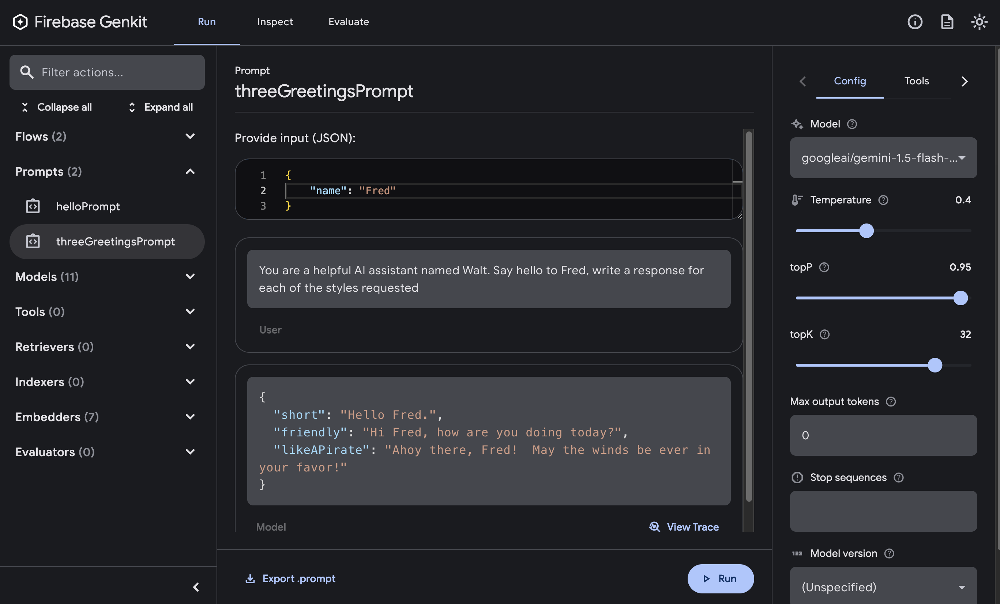

# Prompts

Prompt engineering is the primary way that you, as an app developer, influence
the output of generative AI models. For example, when using LLMs, you can craft
prompts that influence the tone, format, length, and other characteristics of
the models’ responses.

Genkit is designed around the premise that **prompts are code**. You write and
maintain your prompts in source files, track changes to them using the same version
control system that you use for your code, and you deploy them along with the code
that calls your generative AI models.

Genkit has a comprehensive tool for developing complex prompts called [Dotprompt](./dotprompt.md). See that documentation for the complete listing of features.

This document shows several ways prompts can be used in Genkit, starting from the simpliest and moving toward more complex.

## Defining prompts

Genkit's `generate()` helper function accepts string prompts, and you can
call models this way for straightforward use cases.

```ts
import { generate } from '@genkit-ai/ai';

generate({
  model: 'googleai/gemini-1.5-flash-latest',
  prompt: 'You are a helpful AI assistant named Walt, say hello',
});
```

In some cases you will need to include some customer provided inputs in your prompt.
You could define a function to render them like this.

```ts
const name = "Fred"

generate({
  model: 'googleai/gemini-1.5-flash-latest',
  prompt: `You are a helpful AI assistant named Walt. Say hello to ${name}.`,
});
```

However, Genkit provides a way to define your prompts in a standardized format that facilitates more advanced templating and rapid testing in the Developer UI.

Use the `defineDotprompt` function to define these structured prompts.

```ts
import { defineDotprompt } from '@genkit-ai/dotprompt'
import z from 'zod';

const helloPrompt = defineDotprompt(
  {
    name: 'helloPrompt',
    model: 'googleai/gemini-1.5-flash-latest',
    input: {
      schema: z.object({ name: z.string() }),
    },
  },
  `You are a helpful AI assistant named Walt. Say hello to {{name}}`
);
```

and then call the prompt via

```ts
helloPrompt.generate({ input: { name: 'Fred' } });
// Example output: Hello Fred! 👋 It's nice to meet you. How can I help you today? 😊
```

As shown above, prompts defined this way can specify the structured inputs they accept through the `input.schema` configuration.  This allows you a typesafe way to ensure that prompts can only be invoked with valid sets of inputs.

Dotprompts can also specify an output, which they will pass along to call to the LLM as a directive (either as an in-context message or as an API parameter for LLMs which support a structured output mode). This guarantees that you'll either get a conforming response, or an exception you can deal with cleanly.

```ts
const threeGreetingsPrompt = defineDotprompt(
  {
    name: 'threeGreetingsPrompt',
    model: 'googleai/gemini-1.5-flash-latest',
    input: {
      schema: z.object({ name: z.string() }),
    },
    output: {
      schema: z.object({
        short: z.string(),
        friendly: z.string(),
        likeAPirate: z.string()
      })    
    }
  },
  `You are a helpful AI assistant named Walt. Say hello to {{name}}, write a response for each of the styles requested`
);
```

You can then call `generate` on that prompt and work with the structred output in the response

```ts
threeGreetingsPrompt.generate({
   input: { name: 'Fred' } }).output();
/* Example output
{
  "short": "Hello Fred.",
  "friendly": "Hi Fred, how are you doing today?",
  "likeAPirate": "Ahoy there, Fred!  May the winds be ever in your favor!"
}
*/
```

In the Genkit Developer UI, you can run any prompt you have defined in this way.  This allows you to experiment with individual prompts outside of the scope of
the flows in which they might be used.



## Dotprompt

See the [Dotprompt](./dotprompt.md) page for more features of the Dotprompt library, including

- Loading prompts from `.prompt` source files
- Handlebars-based templates
- Support for multi-turn prompt templates and multimedia content
- Concise input and output schema definitions
