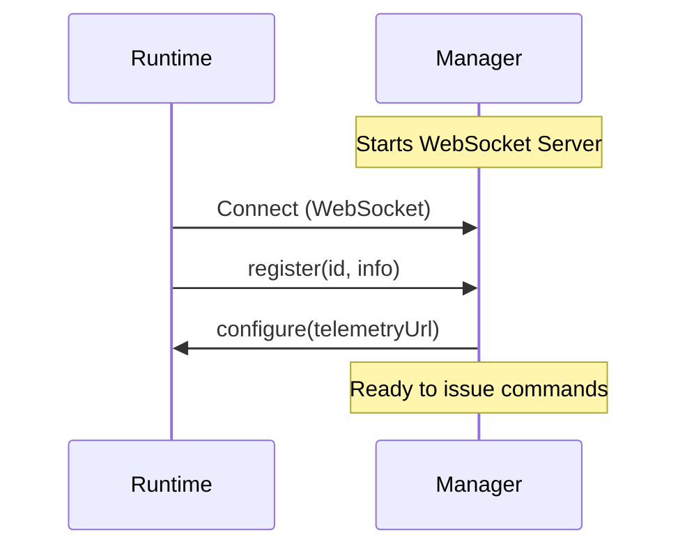
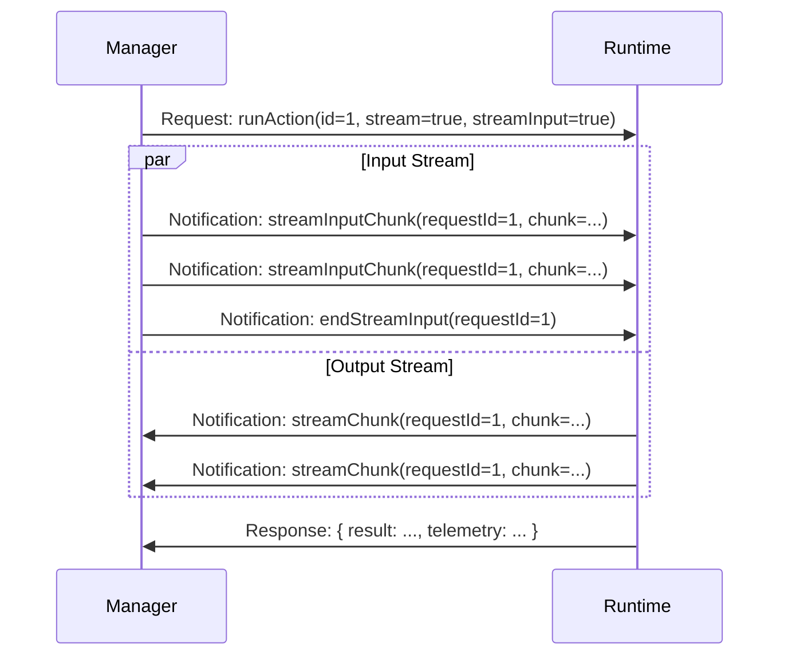

# RFC: Reflection API V2 (WebSocket)

## Summary

Introduces a new Reflection API (V2) based on WebSockets and JSON-RPC 2.0. This architecture reverses the connection direction of V1: the Genkit CLI (Runtime Manager) acts as the WebSocket server, and Genkit Runtimes connect to it as clients.

## Motivation

The V1 Reflection API (HTTP Server on Runtime) has limitations that V2 addresses:

1.  **Bidirectional Actions**: V1 uses HTTP, which is request/response based. Supporting "Bidi Actions" (streaming input and output) requires a full duplex connection, which WebSockets provide natively.
2.  **Environment Constraints**: In many environments (e.g., Web Browsers, Flutter Web, specific cloud sandboxes), it is impossible or impractical for the Runtime to bind to a TCP port and host an HTTP server. V2 allows these runtimes to connect *outbound* to the CLI, enabling support for a wider range of platforms.
3.  **Simplified Discovery**: V1 requires a complex discovery mechanism involving writing runtime info files to special directories. V2 simplifies this by using a single environment variable (`GENKIT_REFLECTION_API_URL`) to point the Runtime to the CLI's WebSocket address.

## Design

### Architecture

-   **Manager (CLI)**: Hosts the WebSocket server. It listens for connections from Runtimes.
-   **Runtime (Application)**: Connects to the Manager's WebSocket URL. It registers itself and waits for commands.



### Protocol

-   **Transport**: WebSocket
-   **Format**: JSON-RPC 2.0
-   **Streaming**: Extended via Notifications. Since JSON-RPC 2.0 is request/response, we use `Notification` messages to push stream chunks associated with a Request ID.

### API Methods

#### Method Reference

| Method | Direction | Type | Description |
| :--- | :--- | :--- | :--- |
| **`register`** | Runtime → Manager | Notification | Registers the runtime with the manager (ID, info). |
| **`configure`** | Manager → Runtime | Notification | Pushes configuration (e.g., Telemetry URL) to runtime. |
| **`listActions`** | Manager → Runtime | Request | Retrieves the list of available actions/flows. |
| **`runAction`** | Manager → Runtime | Request | Initiates action execution (unary or streaming). |
| **`runActionState`** | Runtime → Manager | Notification | Sends early status/metadata (e.g., `traceId`) during execution. |
| **`streamChunk`** | Runtime → Manager | Notification | Sends a chunk of output data during streaming execution. |
| **`streamInputChunk`** | Manager → Runtime | Notification | Sends a chunk of input data during bidi execution. |
| **`endStreamInput`** | Manager → Runtime | Notification | Signals the end of the input stream for bidi execution. |
| **`cancelAction`** | Manager → Runtime | Request | Requests cancellation of a specific action by `traceId`. |

#### Detailed Flows

**1. Connection & Discovery**
   - **Runtime** connects via WebSocket.
   - **Runtime** sends `register`.
   - **Manager** sends `configure`.
   - **Manager** sends `listActions` to populate the UI.

**2. Execution (`runAction`)**
The `runAction` method supports three modes:

-   **Unary**: Standard JSON-RPC request/response.
-   **Streaming Output**: The Runtime sends `streamChunk` notifications before the final result.
-   **Bidirectional**: The Manager sends `streamInputChunk` notifications to the Runtime while receiving `streamChunk` notifications.

**Bidi Flow Sequence:**



### Trace & Telemetry

-   **`runActionState` (Runtime -> Manager)**: Allows the Runtime to send early metadata (like `traceId`) to the Manager before execution completes. This enables real-time trace viewing in the Dev UI.

### Reliability & Error Handling

#### Connection Lifecycle
- **Reconnection**: Runtimes MUST attempt to reconnect if the WebSocket connection is lost. An exponential backoff strategy is recommended (e.g., start at 500ms, cap at 30s).
- **Re-registration**: Upon successfully re-establishing a connection, the Runtime MUST immediately send the `register` notification again. The Manager treats new connections as fresh runtimes until registered.
- **Dangling Streams**: If a connection drops, any active `runAction` streams are considered terminated. There is no resume capability for interrupted streams in V2; the Manager will report an error to the caller, and the Runtime should abort the local execution.

#### JSON-RPC Errors
The API uses standard JSON-RPC 2.0 error codes, with additional application-specific codes where necessary.

- **Parse Error (-32700)**: Invalid JSON received.
- **Invalid Request (-32600)**: The JSON is not a valid Request object.
- **Method Not Found (-32601)**: The method does not exist / is not available.
- **Invalid Params (-32602)**: Invalid method parameter(s).
- **Internal Error (-32603)**: Internal JSON-RPC error.
- **Application Errors (-32000 to -32099)**:
    - `-32000`: Generic Runtime Error (e.g. action threw an exception).
    - `-32001`: Action Not Found.
    - `-32002`: Cancellation Failed (e.g. traceId not found).

**Example Error Response:**
```json
{
  "jsonrpc": "2.0",
  "error": {
    "code": -32001,
    "message": "Action 'myFlow' not found"
  },
  "id": 1
}
```

## Compatibility

V2 is designed to coexist with V1. The Genkit CLI will determine which mode to use (likely via flags or auto-detection). Existing V1 runtimes will continue to work, but will not support Bidi Actions or the new connection model.
