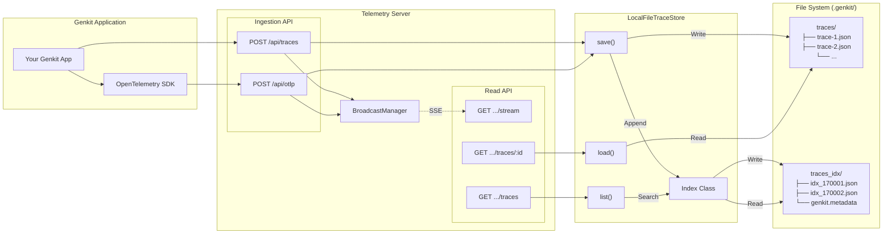

# Genkit Telemetry Server & Trace Store Architecture

## System Diagram



## Key Components

### 1. Ingestion

- **Endpoints:** Accepts traces via standard Genkit format (`/api/traces`) or OpenTelemetry protocol (`/api/otlp`).
- **Persistence:** Incoming data is immediately persisted to disk via `save()`.
- **Real-time:** Span events (start/end) are broadcast to connected UI clients via Server-Sent Events (SSE) for live visualization.

### 2. LocalFileTraceStore

- **Traces:** Full trace data is stored as individual JSON files in `.genkit/traces/`, named by `traceId`.
- **Indexing:** A lightweight index is maintained in `.genkit/traces_idx/` to support listing and filtering without reading every trace file.

### 3. Indexing Strategy

- **Writes:** Append-only to the current active index file (`idx_<timestamp>.json`). Uses file locking (`lockfile`) for concurrency.
- **Reads (`list`):** Reads all index files on every request, merges, filters, sorts by time, and paginates.
- **Rotation/Compaction:** On startup, if index files exceed 10, it wipes them and rebuilds a fresh index from the most recent 1000 trace files.

### 4. Real-time Updates

- **BroadcastManager:** Handles live updates for the Dev UI.
- **Streaming:** The UI subscribes to `GET /api/traces/:id/stream` to receive span updates via SSE as they happen.

## OTLP Support

OTLP traces are **converted to the Genkit format** before being stored.

In `src/index.ts`, the `/api/otlp` and `/api/otlp/:parentTraceId/:parentSpanId` endpoints both call
`traceDataFromOtlp(request.body)`:

```typescript
const traces = traceDataFromOtlp(request.body);
for (const traceData of traces) {
  // ...
  await params.traceStore.save(traceData.traceId, traceData);
}
```

This function (`traceDataFromOtlp`) transforms the incoming OTLP structure into Genkit's `TraceData` schema
The `LocalFileTraceStore` then saves this transformed `TraceData` object to disk. It does **not** store the
raw OTLP JSON payload.

So, all traces on disk—whether they originated from a Genkit SDK or an OpenTelemetry SDK—share the same
unified Genkit JSON format.

## Indexing - Searching and Filtering

The Genkit Telemetry Server uses a simple, append-only, file-based indexing mechanism designed
for local development. It is implemented in the `Index` class within `src/file-trace-store.ts`

### 1. Storage Format & Location

- **Location:** Index files are stored in `.genkit/traces_idx/`.
- **Format:** Each file is a **Line-Delimited JSON (LDJSON)** file. Every line is a valid JS
  object representing a summary of a single trace.
- **File Naming:** Files are named `idx_<timestamp>.json` (e.g., `idx_1707321600000.json`).

### 2. Index Content

The index does not store the full trace. It only stores lightweight metadata required for
listing and filtering. For each trace, it captures:

- `id`: The unique trace ID.
- `type`: The subtype (e.g., "flow", "prompt", "model") derived from
  `genkit:metadata:subtype`.
- `start` / `end`: Timestamps.
- `name`: The display name of the root span.
- `status`: The status code (e.g., "success", "error").
- `genkitx:*`: Any custom attributes starting with `genkitx:` (likely used for specific
  extensions).

### 3. File Splitting and Rotation

- **On Startup:** A **new index file** is created every time the telemetry server starts
  (specifically, when `LocalFileTraceStore` is instantiated). This prevents write conflicts with
  previous sessions and acts as a simple rotation mechanism.
- **Compaction (Re-indexing):** To prevent an infinite accumulation of small index files:
  _ When the server initializes, it checks if the number of index files exceeds
  `MAX_INDEX_FILES` (default: **10**).
  _ If exceeded, it triggers a **Re-Index**: 1. It deletes all existing index files. 2. It reads the most recent `MAX_TRACES` (default: **1000**) full trace files from
  disk. 3. It rebuilds a single new index file from those traces.

### 4. Writing to the Index

- **Append-Only:** New traces are appended to the _current_ index file.
- **Concurrency:** It uses a file locking mechanism (`lockfile`) to ensure that concurrent
  writes (e.g., multiple flows running in parallel) do not corrupt the index file.

### 5. Searching and Reading

The search implementation (`search` method) is designed for simplicity over scalability, which
is acceptable for local dev environments:

1.  **Read All:** It reads **all** `idx_*.json` files in the directory into memory.
2.  **Parse & Filter:** It parses every line and applies the requested filters.
3.  **Sort:** It sorts all results by start time (descending).
4.  **Deduplicate:** Since the same trace ID might appear multiple times (e.g., if a trace is
    updated), it dedupes the list, keeping the most recent entry.
5.  **Paginate:** Finally, it applies `limit` and `continuationToken` (offset) to return a pag
    of results.

### 6. Supported Filtering

The `search` method supports basic **exact match** filtering via the `TraceQueryFilter`
interface:

- **`eq` (Equals):** Matches if a field equals a specific value (e.g., `filter: { eq: { type
'flow' } }`).
- **`neq` (Not Equals):** Matches if a field does _not_ equal a specific value.

The filtering logic is applied in-memory after reading the index files.

## Genkit Trace Store Format

The transformation from OTLP to Genkit format is handled primarily by `toSpanData` in `src/utils/otlp.ts`. The followin
table summarizes how the fields are mapped:

| OTLP Field          | Genkit `SpanData` Field          | Transformation / Mapping                                                                                      |
| :------------------ | :------------------------------- | :------------------------------------------------------------------------------------------------------------ |
| `traceId`           | `traceId`                        | Directly copied.                                                                                              |
| `spanId`            | `spanId`                         | Directly copied.                                                                                              |
| `parentSpanId`      | `parentSpanId`                   | Directly copied.                                                                                              |
| `name`              | `displayName`                    | Directly copied.                                                                                              |
| `startTimeUnixNano` | `startTime`                      | Converted from nanoseconds (string) to milliseconds (number).                                                 |
| `endTimeUnixNano`   | `endTime`                        | Converted from nanoseconds (string) to milliseconds (number).                                                 |
| `kind`              | `spanKind`                       | Mapped via lookup: `1:INTERNAL`, `2:SERVER`, `3:CLIENT`, `4:PRODUCER`, `5:CONSUMER`, else `UNSPECIFIED`.      |
| `attributes`        | `attributes`                     | Flattens `OtlpValue` into a standard key-value `Record`. Supports `stringValue`, `intValue`, and `boolValue`. |
| `scope.name`        | `instrumentationLibrary.name`    | Taken from the wrapping `scopeSpans` object.                                                                  |
| `scope.version`     | `instrumentationLibrary.version` | Taken from the wrapping `scopeSpans` object.                                                                  |
| `status.code`       | `status.code`                    | Only mapped if OTLP status code is non-zero (i.e., not "OK").                                                 |
| `status.message`    | `status.message`                 | Mapped if present and code is non-zero.                                                                       |

**Key differences:**

- **Time Precision:** OTLP uses nanoseconds (as strings to avoid overflow), whereas Genkit uses milliseconds (as
  numbers).
- **Scope vs Library:** OTLP's "Instrumentation Scope" is mapped to Genkit's "Instrumentation Library."
- **Status:** Genkit only populates the `status` object if it's an error (non-zero), whereas OTLP might send it
  regardless.

## Model Spans

`getBasicUsageStats` is a helper function in `genkit/model` that calculates basic statistics about the inp
and output of a model generation call.

### How it works:

It takes two arguments:

1.  **`input`**: The array of messages sent to the model.
2.  **`response`**: The message(s) returned by the model.

It iterates through the content parts of these messages and counts:

- **Characters** (length of text parts)
- **Images**
- **Videos**
- **Audio files**

It returns a `GenerationUsage` object containing these counts (e.g., `inputCharacters`, `outputImages`).

### Relation to Model Trace Spans:

1.  **Usage Reporting:** Inside model plugins (like Vertex AI Gemini), `getBasicUsageStats` is called afte
    receiving a response from the underlying model API.

    ```typescript
        // plugins/vertexai/src/gemini.ts
        usage: {
        ...getBasicUsageStats(request.messages, candidateData),
        inputTokens: usageMetadata.promptTokenCount,
        outputTokens: usageMetadata.candidatesTokenCount,
        totalTokens: usageMetadata.totalTokenCount,
        }
    ```

2.  **Span Attributes:** The returned `usage` object (which includes these basic stats plus token counts)
    then attached to the `GenerateResponseData`. When the `generate` action completes, the Genkit tracing
    middleware automatically captures this response data and stores it in the **trace span attributes**. \* Specifically, you will see these stats in the trace under attributes like
    `genkit:usage:inputCharacters`, `genkit:usage:inputTokens`, etc.
3.  **Fallback:** For models that _don't_ return token counts (or if the API fails to provide them),
    `getBasicUsageStats` ensures that at least some usage metrics (like character count) are always available
    the trace for observability.

## Dev UI

The Genkit Dev UI relies on the following span attributes to categorize, structure, and display trace data:

| Attribute                                 | Category       | Description                                              | UI Usage                                                   |
| :---------------------------------------- | :------------- | :------------------------------------------------------- | ---------------------------------------------------------- |
| **`genkit:type`**                         | Identification | Primary action category (e.g., `flow`, `model`, `tool`). | Determines icons, labels, and routing to runner pages      |
| **`genkit:name`**                         | Identification | Registered name of the action.                           | Displayed as the primary heading in span details.          |
| **`genkit:metadata:subtype`**             | Identification | Sub-classification of the action.                        | Refines action type mapping (e.g., specific prompt types). |
| **`genkit:metadata:flow:name`**           | Identification | Human-readable flow name.                                | Displayed in the tree and headers instead of the flow ID.  |
| **`genkit:input`**                        | Data           | JSON string of input arguments.                          | Rendered in the Input viewer; used for dataset export.     |
| **`genkit:output`**                       | Data           | JSON string of the returned result.                      | Rendered in the Output viewer; used for token counting.    |
| **`genkit:metadata:context`**             | Data           | Supplemental execution context.                          | Rendered in the Context section (e.g., Auth metadata).     |
| **`genkit:state`**                        | State          | Status (success, error, in-progress).                    | Drives status iconography, colors, and badges.             |
| **`exception.message`**                   | Errors         | OTel standard exception message.                         | Shown in the error callout when a span fails.              |
| **`exception.stacktrace`**                | Errors         | OTel standard stacktrace.                                | Rendered in a code block within the error details.         |
| **`genkit:metadata:genkit-dev-internal`** | UI Logic       | Internal system span flag.                               | Filters/hides wrapper spans from the primary user view.    |
| **`genkit:metadata:flow:wrapperAction`**  | UI Logic       | Flow-specific internal wrapper flag.                     | Used to simplify and collapse noise in the trace tree.     |
| **`genkit:lastKnownParentSpanId`**        | UI Logic       | Fallback parent ID for streaming.                        | Maintains tree hierarchy during live trace updates.        |
| **`genkit:metadata:evaluator:evalRunId`** | Integration    | ID of the evaluation run.                                | Enables the "View in Eval" button for evaluation results.  |
| **`ui:isPlaceholder`**                    | Internal       | UI-only placeholder flag.                                | Marks "Loading..." nodes during live trace streaming.      |

### 1. Token Counts

Token counts are **not** stored as top-level attributes on the span. Instead, they are embedded within the JSON string of the span's **output**.

- **Individual Span (`getTokenCountsFromSpan`)**:

1.  The function retrieves the raw output string via `genkit:output` (or `output-json`).
2.  It parses this JSON string.
3.  It looks for a specific `usage` object within the parsed structure.
4.  It maps the fields:

- `usage.inputTokens` → `inputTokenCount`
- `usage.outputTokens` → `outputTokenCount`
- `usage.thoughtsTokens` → `reasoningTokenCount`

- **Trace Totals (`getRootSpanTokenCounts`)**:

1.  The UI calculates the total cost for a trace by traversing the entire span tree (starting from the root).
2.  It filters specifically for spans with `ActionType.MODEL`.
3.  It calls `getTokenCountsFromSpan` for each model span and sums the results.
4.  This ensures that the total reflects the actual model usage, ignoring tokens from other types of actions.

### 2. Other Metadata

- **Duration**: Calculated as `endTime - startTime`. If the duration is less than 1 second, it is formatted in milliseconds (e.g., "150ms"); otherwise, in seconds (e.g.,
  "1.25s").
- **State**: Derived hierarchically:

1.  If `endTime` is 0, it is **`in-progress`**.
2.  If `genkit:metadata:flow:state` exists, use that.
3.  If `genkit:state` exists, use that.
4.  Fallback: If `status.code` is 2, it is **`error`**; otherwise **`success`**.

- **Model Input/Output Previews**:
  _ For **Model** actions, the UI uses specialized parsers (`parseModelInput`, `parseModelOutput`) to dig into the complex JSON structure (e.g.,
  `messages[0].content[0].text` or `candidates[0].message...`) to show a clean text preview instead of raw JSON.
  _ For **Other** actions, it simply truncates the raw JSON string to 256 characters.
- **Context (Auth)**:
  _ Context is primarily looked up in `genkit:metadata:context`.
  _ **Fallback Logic:** If that is missing, the UI attempts to find authentication data by parsing the `genkit:input` of the parent wrapper span (or the current span in
  error states), specifically looking for an `auth` object.

```

```
