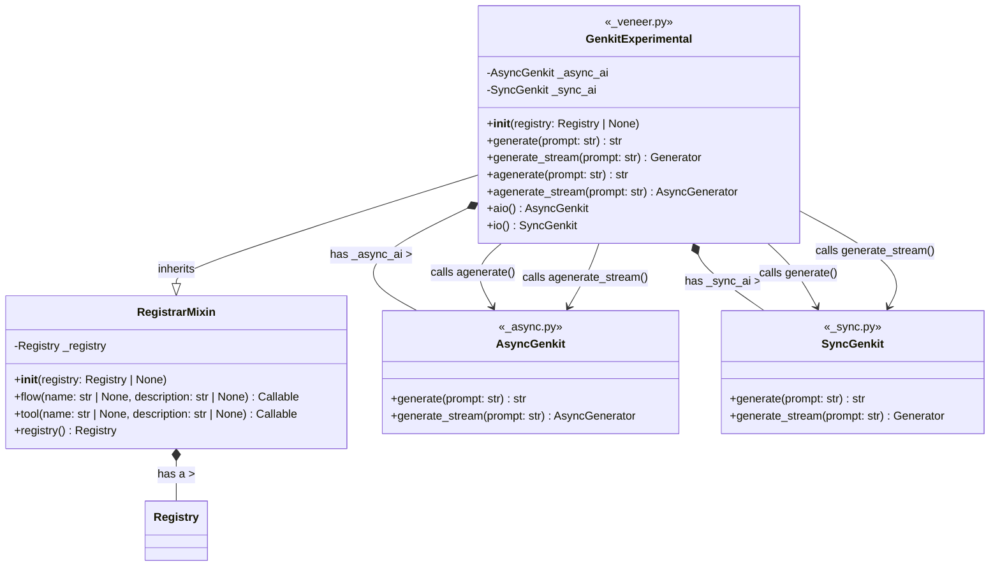

# API Design

Genkit is a framework for building AI-powered applications using generative
models. It provides a streamlined way to work with AI models, tools, prompts,
embeddings, and other AI-related functionality.

The API is structured to make it easy to:

* Define prompts that can be reused across your application.
* Create tools that AI models can call.
* Work with different AI models through a consistent interface.
* Build complex AI workflows through "flows".
* Store and retrieve data through embeddings and vector search.

## Design principles

Genkit is designed with several principles in mind:

* **Async-first**: Most communication among us and future interactive agents
  appear to be largely naturally asynchronous.
* **Type Safety**: Uses build-time and runtime-type information for strong
  typing.
* **Modularity**: Components can be mixed and matched.
* **Extensibility**: Plugin system allows adding new features.
* **Developer Experience**: Development tools like Reflection Server help debug
  applications.

## Veneer

The veneer refers to the user-facing API and exludes the internals of the
library.

### The `Genkit` Class

The `Genkit` class is the central part of the framework that:

* Manages a registry of AI-related components (models, tools, flows, etc.).
* Provides an API for working with AI models and flows.
* Handles configuration and initialization.
* Sets up development tools like the reflection server.

#### Key features

| Feature                 | Description                                                                   |
|-------------------------|-------------------------------------------------------------------------------|
| **Registry Management** | It maintains a registry to keep track of all components in a Genkit instance. |
| **Plugin System**       | Supports loading plugins to extend functionality.                             |
| **Prompt Management**   | Allows defining and using prompts both programmatically and from files.       |
| **Model Integration**   | Provides methods to work with generative AI models.                           |

#### Core Functionality

`Genkit` defines methods for the following:

| Category               | Function            | Description                                   |
|------------------------|---------------------|-----------------------------------------------|
| **Text Generation**    | `generate()`        | Generates text using AI models                |
|                        | `generate_stream()` | Streaming version for real-time results       |
| **Embedding**          | `embed()`           | Creates vector embeddings of content          |
|                        | `embed_many()`      | Batch embedding generation                    |
| **Retrieval & Search** | `retrieve()`        | Fetches documents based on queries            |
|                        | `index()`           | Indexes documents for fast retrieval          |
|                        | `rerank()`          | Re-orders retrieved documents by relevance    |
| **Tools & Functions**  | `define_tool()`     | Creates tools that models can use             |
|                        | `define_flow()`     | Creates workflows that combine multiple steps |
| **Evaluation**         | `evaluate()`        | Evaluates AI model outputs                    |

#### Helper Functions

The veneer Genkit module may also include:

* `genkit()`: A factory function to create new Genkit instances
* `shutdown()`: Handles clean shutdown of Genkit servers
* Event handlers for process termination signals

## Endpoints

### Telemetry Server

| Endpoint               | HTTP Method | Purpose                   | Request Body                               | Response                               | Content Type       |
|------------------------|-------------|---------------------------|--------------------------------------------|----------------------------------------|--------------------|
| `/api/__health`        | GET         | Health check              | -                                          | "OK" (200)                             | `text/plain`       |
| `/api/traces/:traceId` | GET         | Retrieve a specific trace | -                                          | Trace data JSON                        | `application/json` |
| `/api/traces`          | POST        | Save a new trace          | `TraceData` object                         | "OK" (200)                             | `text/plain`       |
| `/api/traces`          | GET         | List traces               | Query params: `limit`, `continuationToken` | List of traces with continuation token | `application/json` |

### Flow Server

| Endpoint                              | HTTP Method | Purpose                       | Request Body        | Response                                                                       | Content Type           |
|---------------------------------------|-------------|-------------------------------|---------------------|--------------------------------------------------------------------------------|------------------------|
| `/<pathPrefix><flowName>`             | POST        | Execute a flow                | `{ data: <input> }` | `{ result: <output> }` (200) or error (4xx/5xx)                                | `application/json`     |
| `/<pathPrefix><flowName>?stream=true` | POST        | Execute a flow with streaming | `{ data: <input> }` | `data: {"message": <chunk>}` (stream) and `data: {"result": <result>}` (final) | `text/plain` (chunked) |

### Reflection Server

TODO: Ideally, these should behave the same, but we're making a note of
differences here for now.

=== "TypeScript"

    | Endpoint                     | HTTP Method | Purpose                     | Request Body                                       | Response                             | Content Type           |
    |------------------------------|-------------|-----------------------------|----------------------------------------------------|--------------------------------------|------------------------|
    | `/api/__health`              | GET         | Health check                | -                                                  | "OK" (200)                           | `text/plain`           |
    | `/api/__quitquitquit`        | GET         | Terminate server            | -                                                  | "OK" (200) and server stops          | `text/plain`           |
    | `/api/actions`               | GET         | List registered actions     | -                                                  | Action metadata with schemas         | `application/json`     |
    | `/api/runAction`             | POST        | Run an action               | `{ key, input, context, telemetryLabels }`         | `{ result, telemetry: { traceId } }` | `application/json`     |
    | `/api/runAction?stream=true` | POST        | Run action with streaming   | `{ key, input, context, telemetryLabels }`         | Stream of chunks and final result    | `text/plain` (chunked) |
    | `/api/envs`                  | GET         | Get configured environments | -                                                  | List of environment names            | `application/json`     |
    | `/api/notify`                | POST        | Notify of telemetry server  | `{ telemetryServerUrl, reflectionApiSpecVersion }` | "OK" (200)                           | `text/plain`           |

=== "Go"

    | Endpoint         | HTTP Method | Purpose                    | Request Body                                       | Response                             | Content Type       |
    |------------------|-------------|----------------------------|----------------------------------------------------|--------------------------------------|--------------------|
    | `/api/__health`  | GET         | Health check               | -                                                  | 200 OK status                        | -                  |
    | `/api/actions`   | GET         | List registered actions    | -                                                  | Action metadata with schemas         | `application/json` |
    | `/api/runAction` | POST        | Run an action              | `{ key, input, context }`                          | `{ result, telemetry: { traceId } }` | `application/json` |
    | `/api/notify`    | POST        | Notify of telemetry server | `{ telemetryServerUrl, reflectionApiSpecVersion }` | OK response                          | `application/json` |

=== "Python"

    | Endpoint         | HTTP Method | Purpose                 | Request Body | Response                     | Content Type       |
    |------------------|-------------|-------------------------|--------------|------------------------------|--------------------|
    | `/api/__health`  | GET         | Health check            | -            | 200 OK status                | -                  |
    | `/api/actions`   | GET         | List registered actions | -            | Action metadata with schemas | `application/json` |
    | `/api/runAction` | POST        | Run an action           | Action input | Action output with traceId   | `application/json` |

## Common Patterns

* **Health check endpoints** (`/api/__health`): All servers implement a simple
  health check endpoint.
* **Action/flow execution**: All servers provide endpoints to execute
  actions/flows.
* **Streaming support**: JavaScript-based servers support streaming responses.
* **Telemetry integration**: All execution endpoints include telemetry data
  (trace IDs) in responses.
* **Error handling**: Standardized error formats with status codes and stack
  traces.
* **Content negotiation**: Different response formats based on accept headers or
  query parameters.

# Sync vs Async Design
Genkit is a library that allows application developers to create AI flows for
their applications using an API that abstracts over various components such as
indexers, retiervers, models, embedders, etc.

Ideally, as a user, one would like the API to be async-first because this
single-threaded model of dealing with concurrency is the direction that Python
frameworks are taking and Genkit naturally lives in an async world. Genkit is
majorly I/O-bound not as much computationally-bound since it's primary purpose
is composing various AI foundational components and setting up typed
communication patterns between them.

### Shape of the API

Before we begin, let's study `structlog`, a structured logging library that has
had to deal with this problem as well and exposes a well-defined set of APIs
that is familiar to the Python world:

```python
import asyncio
import structlog

logger = structlog.get_logger(__name__)

async def foo() -> str:
  """Foo.

  Returns:
    The name of this function.
  """
  await logger.ainfo('Returning foo from function', fn=foo.__name__)

  return foo.__name__


if __name__ == '__main__':
    asyncio.run(foo())

```

Running the program displays the following on the console:

```shell
zsh❯ uv run foo.py
2025-03-30 14:23:13 [info     ] Returning foo from function    fn=foo

```

`structlog` exposes the async equivalent (`await logger.ainfo()`) functionality
of their `logger.info()` calls using the minimally-invasive `a*` prefix, without
resorting to any sort of magic.

We propose to do the same:

```python
ai = Genkit()

@ai.flow()
async def async_flow(...):
    response = await ai.generate(f"Answer this: {query}")
    return {"answer": response.text}

@ai.flow()
def sync_flow(...):
    response = ai.generate(f"Answer this: {query}")
    return {"answer": response.text}

async def main() -> None:
    """Main entry-point."""
    ...

if __name__ == '__main__':
    asyncio.run(main())

```

!!! note

    In an initial iteration of this design, we were considering using decorators
    to detect whether the callable is a coroutine and change the meaning of the
    `ai` treating it as a special variable inside it, but this increases the
    complexity of the implementation and adds very little value.

    We have, therefore, decided to favor simplicity and add the `a*` prefix to
    every asynchronous method made available by the API.

To make this work, we could have a user-facing veneer
`genkit.ai.GenkitExperimental` class that composes 2 implementations of Genkit:

- `genkit.ai.AsyncGenkit`
- `genkit.ai.SyncGenkit`

#### ASCII Diagram

```ascii
+---------------------+      +-------------------+
|   RegistrarMixin    |      |      Registry     |
|---------------------|      |-------------------|
| - _registry         |<>----|(placeholder type) |  (Composition: RegistrarMixin has a Registry)
|---------------------|      +-------------------+
| + __init__(registry)|
| + flow()            |
| + tool()            |
| + registry (prop)   |
+--------^------------+
         | (Inheritance: GenkitExperimental is-a RegistrarMixin)
+--------|-----------------+      +----------------------+     +----------------------+
|  GenkitExperimental      |----->|      AsyncGenkit     |     |       SyncGenkit     |
| (in _veneer.py)          |<>--  | (in _async.py)       |     | (in _sync.py)        |
|--------------------------|  |   |----------------------|     |----------------------|
| - _registry (inherited)  |  |   | + generate()         |     | + generate()         |
| - _async_ai : AsyncGenkit|  |   | + generate_stream()  |     | + generate_stream()  |
| - _sync_ai : SyncGenkit  |  *-->+----------------------+     *-->+----------------------+
|--------------------------|        (Async Implementation)        (Independent Sync Impl.)
| + __init__(registry)     |
| + flow() (inherited)     |
| + tool() (inherited)     |
|                          |
| + generate() ----------> calls _sync_ai.generate()
| + generate_stream() ---> calls _sync_ai.generate_stream()
|                          |
| + agenerate() ---------> calls _async_ai.generate()
| + agenerate_stream() --> calls _async_ai.generate_stream()
|                          |
| + aio (prop) ---------> returns _async_ai instance
| + io (prop) ----------> returns _sync_ai instance
+--------------------------+
```

#### Mermaid Diagram



An instance of each of these would be exposed as a property on the veneer class.
The veneer class should use a mixin called `RegistrarMixin` to manage the
registration of AI blocks such as tools, flows, actions, etc

### Maintaining parity

This would imply we'd have 2 implementations of Genkit. There's 2 ways that
occur to me in which we could maintain parity:

1. Maintain two separate implementations one for async and another for sync.

2. Implement one in terms of the other.

We recommend option 1 for simplicity and easier maintenance.

## Implementation

Currently, the Veneer API contains an implementation that uses threads to start
a reflection server when Genkit is in use in an environment where the
`GENKIT_ENV` environment variable has been set to `'dev'`.

There are a few ways to set that environment variable, and running the development
server using `genkit start` also sets it.

Running the following command:

```bash
genkit start -- uv run sample.py
```

would set `GENKIT_ENV='dev'` within a running instance of `sample.py`.

`genkit start` exposes a developer UI (usually called dev UI for short) that is
used for debugging and that talks to a reflection API server implemented by the
veneer `Genkit` class instance.  The reflection API server provides a way for
the dev UI to allow users to debug their custom flows, test features such as
models and plugins, and also observe traces emitted by these components.

### Concurrency handling

We would like to avoid using threads since asyncio is primarily a
single-threaded design and threading complicates the internals of the API.
Synchronously-defined flows, tools, and other actions would execute using a
thread-pool executor used by the `SyncGenkit` implementation.

#### Scenarios

- For simple short lived applications, when we don't have the dev server we'd
  want the program to exit since that shouldn't start the reflection server.

- For simple short lived applications, when we have the dev server (meaning the
  `GENKIT_ENV=dev` environment variable has been set), we should start the
  reflection server and prevent the application's main thread from exiting and
  shutting down the process to enable debugging.

- For servers, we'd want the user to be able to add the reflection server to a
  manager object such as that used in @multi_server.py  passed into the
  arguments of the Genkit veneer class instance so that it attaches to the
  server manager alongside any application servers written by the end user.

The end user should not need to expliclity add code to their main thread to wait
for the reflection server when dev mode is enabled. Since we're building an
asyncio-first solution it should naturally do that since we'd be running the
reflection server on the same event loop.

```pseudocode
if short lived app:
  if dev mode enabled:
    add reflection server coroutine to the event loop so main thread waits for dev UI debugging
  else:
    complete all flows and exit normally
elif long-lived server:
  if dev mode enabled:
    add reflection server coroutine to the server manager to enable debuggging using dev UI
  else:
    run user-defined servers using server manager

```

Each of these can be demonstrated using individual entry-points sharing a common
set of flows and tools. For example, the sample would define all the flows in
`flows.py` and use them in both `server_example.py` and `short_lived_example.py`
as a demonstration:

- `flows.py`
- `server_example.py`
- `short_lived_example.py`
