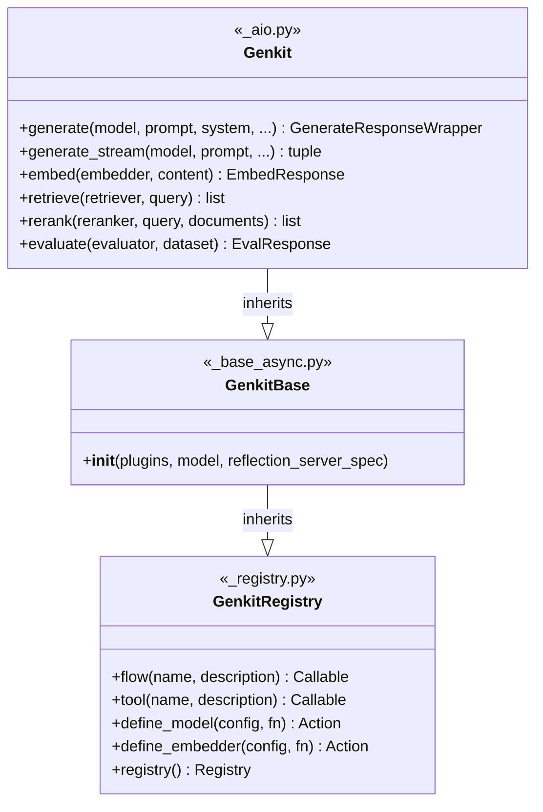

# API Design

Genkit is a framework for building AI-powered applications using generative
models. It provides a streamlined way to work with AI models, tools, prompts,
embeddings, and other AI-related functionality.

The API is structured to make it easy to:

* Define prompts that can be reused across your application.
* Create tools that AI models can call.
* Work with different AI models through a consistent interface.
* Build complex AI workflows through "flows".
* Store and retrieve data through embeddings and vector search.

## Design principles

Genkit is designed with several principles in mind:

* **Async-first**: Most communication among us and future interactive agents
  appear to be largely naturally asynchronous.
* **Type Safety**: Uses build-time and runtime-type information for strong
  typing.
* **Modularity**: Components can be mixed and matched.
* **Extensibility**: Plugin system allows adding new features.
* **Developer Experience**: Development tools like Reflection Server help debug
  applications.

## Veneer

The veneer refers to the user-facing API and exludes the internals of the
library.

### The `Genkit` Class

The `Genkit` class is the central part of the framework that:

* Manages a registry of AI-related components (models, tools, flows, etc.).
* Provides an API for working with AI models and flows.
* Handles configuration and initialization.
* Sets up development tools like the reflection server.

#### Key features

| Feature                 | Description                                                                   |
|-------------------------|-------------------------------------------------------------------------------|
| **Registry Management** | It maintains a registry to keep track of all components in a Genkit instance. |
| **Plugin System**       | Supports loading plugins to extend functionality.                             |
| **Prompt Management**   | Allows defining and using prompts both programmatically and from files.       |
| **Model Integration**   | Provides methods to work with generative AI models.                           |

#### Core Functionality

`Genkit` defines methods for the following:

| Category               | Function            | Description                                   |
|------------------------|---------------------|-----------------------------------------------|
| **Text Generation**    | `generate()`        | Generates text using AI models                |
|                        | `generate_stream()` | Streaming version for real-time results       |
| **Embedding**          | `embed()`           | Creates vector embeddings of content          |
|                        | `embed_many()`      | Batch embedding generation                    |
| **Retrieval & Search** | `retrieve()`        | Fetches documents based on queries            |
|                        | `index()`           | Indexes documents for fast retrieval          |
|                        | `rerank()`          | Re-orders retrieved documents by relevance    |
| **Tools & Functions**  | `define_tool()`     | Creates tools that models can use             |
|                        | `define_flow()`     | Creates workflows that combine multiple steps |
| **Evaluation**         | `evaluate()`        | Evaluates AI model outputs                    |

#### Helper Functions

The veneer Genkit module may also include:

* `genkit()`: A factory function to create new Genkit instances
* `shutdown()`: Handles clean shutdown of Genkit servers
* Event handlers for process termination signals

## Endpoints

### Telemetry Server

| Endpoint               | HTTP Method | Purpose                   | Request Body                               | Response                               | Content Type       |
|------------------------|-------------|---------------------------|--------------------------------------------|----------------------------------------|--------------------|
| `/api/__health`        | GET         | Health check              | -                                          | "OK" (200)                             | `text/plain`       |
| `/api/traces/:traceId` | GET         | Retrieve a specific trace | -                                          | Trace data JSON                        | `application/json` |
| `/api/traces`          | POST        | Save a new trace          | `TraceData` object                         | "OK" (200)                             | `text/plain`       |
| `/api/traces`          | GET         | List traces               | Query params: `limit`, `continuationToken` | List of traces with continuation token | `application/json` |

### Flow Server

| Endpoint                              | HTTP Method | Purpose                       | Request Body        | Response                                                                       | Content Type           |
|---------------------------------------|-------------|-------------------------------|---------------------|--------------------------------------------------------------------------------|------------------------|
| `/<pathPrefix><flowName>`             | POST        | Execute a flow                | `{ data: <input> }` | `{ result: <output> }` (200) or error (4xx/5xx)                                | `application/json`     |
| `/<pathPrefix><flowName>?stream=true` | POST        | Execute a flow with streaming | `{ data: <input> }` | `data: {"message": <chunk>}` (stream) and `data: {"result": <result>}` (final) | `text/plain` (chunked) |

### Reflection Server

TODO: Ideally, these should behave the same, but we're making a note of
differences here for now.

=== "TypeScript"

    | Endpoint                     | HTTP Method | Purpose                     | Request Body                                       | Response                             | Content Type           |
    |------------------------------|-------------|-----------------------------|----------------------------------------------------|--------------------------------------|------------------------|
    | `/api/__health`              | GET         | Health check                | -                                                  | "OK" (200)                           | `text/plain`           |
    | `/api/__quitquitquit`        | GET         | Terminate server            | -                                                  | "OK" (200) and server stops          | `text/plain`           |
    | `/api/actions`               | GET         | List registered actions     | -                                                  | Action metadata with schemas         | `application/json`     |
    | `/api/runAction`             | POST        | Run an action               | `{ key, input, context, telemetryLabels }`         | `{ result, telemetry: { traceId } }` | `application/json`     |
    | `/api/runAction?stream=true` | POST        | Run action with streaming   | `{ key, input, context, telemetryLabels }`         | Stream of chunks and final result    | `text/plain` (chunked) |
    | `/api/envs`                  | GET         | Get configured environments | -                                                  | List of environment names            | `application/json`     |
    | `/api/notify`                | POST        | Notify of telemetry server  | `{ telemetryServerUrl, reflectionApiSpecVersion }` | "OK" (200)                           | `text/plain`           |

=== "Go"

    | Endpoint         | HTTP Method | Purpose                    | Request Body                                       | Response                             | Content Type       |
    |------------------|-------------|----------------------------|----------------------------------------------------|--------------------------------------|--------------------|
    | `/api/__health`  | GET         | Health check               | -                                                  | 200 OK status                        | -                  |
    | `/api/actions`   | GET         | List registered actions    | -                                                  | Action metadata with schemas         | `application/json` |
    | `/api/runAction` | POST        | Run an action              | `{ key, input, context }`                          | `{ result, telemetry: { traceId } }` | `application/json` |
    | `/api/notify`    | POST        | Notify of telemetry server | `{ telemetryServerUrl, reflectionApiSpecVersion }` | OK response                          | `application/json` |

=== "Python"

    | Endpoint         | HTTP Method | Purpose                 | Request Body | Response                     | Content Type       |
    |------------------|-------------|-------------------------|--------------|------------------------------|--------------------|
    | `/api/__health`  | GET         | Health check            | -            | 200 OK status                | -                  |
    | `/api/actions`   | GET         | List registered actions | -            | Action metadata with schemas | `application/json` |
    | `/api/runAction` | POST        | Run an action           | Action input | Action output with traceId   | `application/json` |

## Common Patterns

* **Health check endpoints** (`/api/__health`): All servers implement a simple
  health check endpoint.
* **Action/flow execution**: All servers provide endpoints to execute
  actions/flows.
* **Streaming support**: JavaScript-based servers support streaming responses.
* **Telemetry integration**: All execution endpoints include telemetry data
  (trace IDs) in responses.
* **Error handling**: Standardized error formats with status codes and stack
  traces.
* **Content negotiation**: Different response formats based on accept headers or
  query parameters.

# Async-First Design

Genkit is a library that allows application developers to create AI flows for
their applications using an API that abstracts over various components such as
indexers, retrievers, models, embedders, etc.

The API is **async-first** because this single-threaded model of dealing with
concurrency is the direction that Python frameworks are taking and Genkit
naturally lives in an async world. Genkit is majorly I/O-bound, not as much
computationally-bound, since its primary purpose is composing various AI
foundational components and setting up typed communication patterns between them.

### Class Hierarchy

The implementation uses a three-level class hierarchy:

```ascii
+---------------------+
|   GenkitRegistry    |  (in _registry.py)
|---------------------|
| + flow()            |  Decorator to register flows
| + tool()            |  Decorator to register tools
| + define_model()    |  Register model actions
| + define_embedder() |  Register embedder actions
| + registry (prop)   |
+--------^------------+
         |
+--------|-----------+
|    GenkitBase      |  (in _base_async.py)
|--------------------|
| + __init__(        |
|     plugins,       |
|     model,         |
|     reflection_    |
|     server_spec)   |
+--------^-----------+
         |
+--------|-----------+
|      Genkit        |  (in _aio.py)
|--------------------|
| + generate()       |  async — text generation
| + generate_stream()|  streaming generation
| + embed()          |  async — create embeddings
| + retrieve()       |  async — fetch documents
| + rerank()         |  async — reorder documents
| + evaluate()       |  async — evaluate outputs
| + chat()           |  session-based chat
+--------------------+
```



All methods on the `Genkit` class are `async`. Synchronously-defined flows and
tools are executed using a thread-pool executor internally.

### Usage

```python
from genkit.ai import Genkit
from genkit.plugins.google_genai import GoogleAI

ai = Genkit(
    plugins=[GoogleAI()],
    model='googleai/gemini-2.0-flash',
)

@ai.flow()
async def my_flow(query: str) -> str:
    response = await ai.generate(prompt=f"Answer this: {query}")
    return response.text
```

## Implementation

The `Genkit` class starts a reflection server when the `GENKIT_ENV` environment
variable has been set to `'dev'`.

Running the following command:

```bash
genkit start -- uv run sample.py
```

sets `GENKIT_ENV='dev'` within a running instance of `sample.py`.

`genkit start` exposes a developer UI (usually called dev UI for short) that is
used for debugging and that talks to a reflection API server implemented by the
`Genkit` class instance. The reflection API server provides a way for the dev UI
to allow users to debug their custom flows, test features such as models and
plugins, and also observe traces emitted by these components.

### Concurrency handling

The implementation avoids using threads for server infrastructure since asyncio
is primarily a single-threaded design. The reflection server runs as a coroutine
on the same event loop.

#### Scenarios

- For simple short-lived applications without dev mode, the program exits
  normally after completing all flows.

- For simple short-lived applications with dev mode (`GENKIT_ENV=dev`), the
  reflection server starts and prevents the main thread from exiting to enable
  debugging.

- For long-lived servers, the reflection server attaches to the server manager
  alongside any application servers written by the end user.
