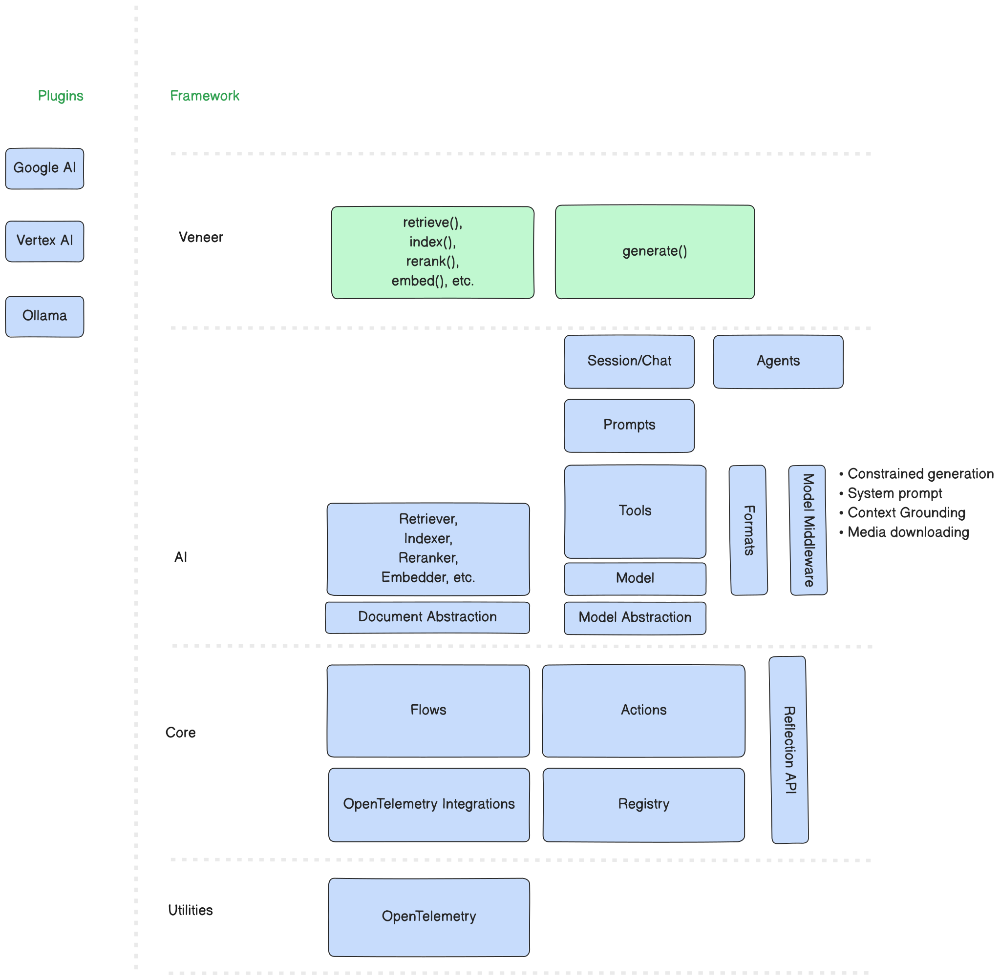

# Framework Architecture

!!! note

    If you're a user of Genkit and landed here,
    this is engineering documentation that someone contributing
    to Genkit would use, not necessarily only use it.

    For more information about how to get started with using
    Genkit, please see: [User Guide](.)

Genkit models a generative AI framework allowing application developers
to work with abstractions to allow the use of pluggable implementations of the
various elements of generative AI. It has SDKs for JavaScript, Go, and Python.

## Design



```d2
genkit: {
  ai: {
    style: {fill: "#E0F7FA"}
    Veneer API
  }
  blocks: {
    style: {fill: "#FFF3E0"}
    AI Components: {
      prompt: Prompt
      model: Model
      embedder: Embedder
      retriever: Retriever
    }
  }
  core: {
    style: {fill: "#E8F5E9"}
    Core Foundations: {
      flow: Flow
      actions: Actions
      registry: Registry
      reflection_server: Reflection Server
    }
  }
  plugins: {
    style: {fill: "#FCE4EC"}
    chroma
    pinecone
    google_genai
    google_cloud
    openai
    firebase
    ollama
  }
}

lib: {
  style: {fill: "#EDE7F6"}
  handlebars
  dotprompt
  pydantic
  starlette
  asgiref
  uvicorn
  opentelemetry
}

genkit.blocks -> genkit.core
genkit.blocks -> lib.dotprompt
genkit.core -> lib.asgiref
genkit.core -> lib.opentelemetry
genkit.core -> lib.pydantic
genkit.core -> lib.starlette
genkit.plugins.chroma -> genkit.ai
genkit.plugins.firebase -> genkit.ai
genkit.plugins.google_cloud -> genkit.ai
genkit.plugins.google_genai -> genkit.ai
genkit.plugins.ollama -> genkit.ai
genkit.plugins.pinecone -> genkit.ai
genkit.ai -> genkit.blocks
genkit.ai -> genkit.core
genkit.ai -> lib.uvicorn
lib.dotprompt -> lib.handlebars
```

The framework has several layers of abstraction. Think about it as peeling an
onion, starting from the outermost layer:

1. **User-facing Veneer** is the topmost layer consisting of the APIs exposed to
   the application developers.

2. **1st and 3rd Party Plugins** that extend the framework with additional
   functionality.

3. **AI Abstractions** are higher level generative AI components (e.g. tools,
   agents, rerankers, embedders, vector stores, etc.) built atop the core
   foundations.

4. **Core Foundations** (actions and flows) are the primitive building blocks
   upon which everything else has been built. Think of these as Lego bricks.

5. **OpenTelemetry** is used to enable tracing.

## User-friendly Veneer

A **flow** is a remotely callable function that wraps user-defined
functionality. A **plugin** extends the framework by adding additional models,
parsers, retrievers, and other components generally used in AI applications.

## AI Abstractions

A **prompt** is an instruction provided to a model. Prompt engineering tweaks
these prompts to attempt to coax the model to do what you want. A **prompt
action** is used to render a prompt template producing a request that can be
passed to a **model**. Prompt actions are defined as either code or as
configuration files bearing the `.prompt` (read "dotprompt") extension.
**Dotprompt files** contain configuration in the form of YAML frontmatter
delineated by `---` sequences followed by variable-interpolated UTF-8 encoded
text templates (e.g. using a templating language such as Handlebars):

```dotprompt
---
model: vertexai/gemini-1.5-flash
config:
  temperature: 0.9
input:
  schema:
    properties:
      location: {type: string}
      style: {type: string}
      name: {type: string}
    required: [location]
  default:
    location: a restaurant
---

You are the most welcoming AI assistant and are currently working at {{location}}.

Greet a guest{{#if name}} named {{name}}{{/if}}{{#if style}} in the style of {{style}}{{/if}}.
```

A **tool** is an action that can be used by a flow to complete tasks. An
**agent** can use tools (including other agents) to help automate complex tasks
and workflows.

## Core Foundations

An **action** is a locally or remotely (JSON based RPC) callable function. It is
strongly-typed, named, observable, uninterrupted operation that can be in
streaming or non-streaming mode. It wraps a function of type **Fn** that takes
an input of type **In**, and returns an output of type **Out**, optionally
streaming values of type **Stream** incrementally by invoking a
**StreamingCallback**.

An action is a typed JSON-based RPC-over-HTTP function that supports metadata,
streaming, reflection and discovery. A flow is a user-defined action. An action
can depend on other actions.

!!! note

    Bidirectional streaming is currently not supported.

It can have **metadata** like description and specifies the structure for its
input and output using language-native typed schema validation (e.g, Zod for
TypeScript and Pydantic for Python) to generate backing JSON schemas usable by
underlying paraphernalia such as a **model** or **plugin**. Every action is
registered in a central in-memory **registry** exposed via a **RESTful
reflection API** that can be used to look up an action by name, test for
membership, and loaded for execution.

!!! info "Obsolete definition"

    A **flow** used to be defined as an action that can be paused and resumed later,
    even on a different machine. While such a feature is useful for long-running
    tasks or situations where resources might become temporarily unavailable, this
    role is now handled by **Sessions**. **FlowState** used to store the current
    state of the flow, including its input, execution history, and cached steps.
    **FlowExecution** used to represent a single run of the Flow's function. A
    FlowState contains a history of FlowExecutions.

Most components of Genkit such as tools, agents, prompts, models, retrievers,
embedders, evaluators, rerankers, and indexers are *framework-defined* actions.
A **flow** is a *user-defined action*.

**OpenTelemetry** integration is baked into each action.

### Storage, Search and Indexing Actions

| Term                         | Definition                                                                                                                                                  |
|------------------------------|-------------------------------------------------------------------------------------------------------------------------------------------------------------|
| **Document**                 | A piece of **content** consisting of multiple **parts** and **metadata** that can be embedded.                                                              |
| **Embedder**                 | An action that embeds a document.                                                                                                                           |
| **Embedding**                | A way to represent a discrete variable, like a word or a sentence, as a continuous vector.                                                                  |
| **Evaluator**                | An action that \_\_\_\_\_.                                                                                                                                  |
| **Indexer**                  | An action that indexes content for future matching.                                                                                                         |
| **Part**                     | A component of content that may have a content type (MIME type) and kind (text, media, data, tool request, tool response, etc.) associated with it.         |
| **Reranker** (Cross-encoder) | A type of model that outputs a similarity score given a query and document pair. The score is used to reorder the documents by relevance to our query.      |
| **Retriever**                | An action that fetches documents from storage.                                                                                                              |
| **Vector Store**             | Stores vector embeddings and can be used to perform **similarity search** using algorithms such as cosine similarity, Euclidean distance, dot product, etc. |

## Communication

TODO

## System Architecture Diagram

```d2
vars: {
  d2-config: {
    layout-engine: elk
    theme-id: 300
    sketch: true
  }
}
runtime: "Runtime (Go, Python, Node.js, ...)" {
  app: User Application {
    shape: package
  }

  library: "Library" {
    plugins: "Plugins\n(pinecone,\ngoogleai,\nvertexai...)"
    veneers: "Veneers\n(ai.generateFlow,\nai.defineFlow, ...)"
    registry: {
      shape: stored_data
      style.multiple: true
    }
    otel: "OpenTelemetry"
    actions: "Actions"
    reflection_api: "Reflection API"

    plugins -> registry: Define models, etc.
    plugins -> actions: Define
    veneers -> registry
    veneers -> actions
    reflection_api -> registry: Lookup
    reflection_api -> actions: Run
    actions -> otel: Implement
  }

  app -> library.plugins: Uses
  app -> library.veneers: Uses
}
tooling: "Tooling" {
  runtime_manager
  dev_console: Developer Console UI {
    shape: document
  }
  telemetry_server: Telemetry Server
  trace_store: Trace Store {
    shape: cylinder
  }
  eval_and_dataset_store: Evaluation & Dataset Store {
    shape: cylinder
  }

  dev_console -> runtime_manager: Uses
  dev_console -> telemetry_server: Reports to
  dev_console -> eval_and_dataset_store: Reads from and writes to
  telemetry_server -> trace_store: Writes to
}

runtime.library.otel -> tooling.telemetry_server: Reports to
tooling.runtime_manager -> runtime.library.reflection_api: Uses

```
