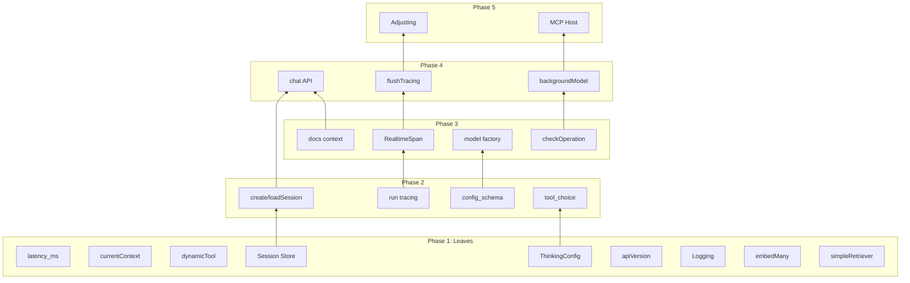
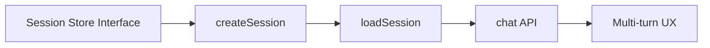
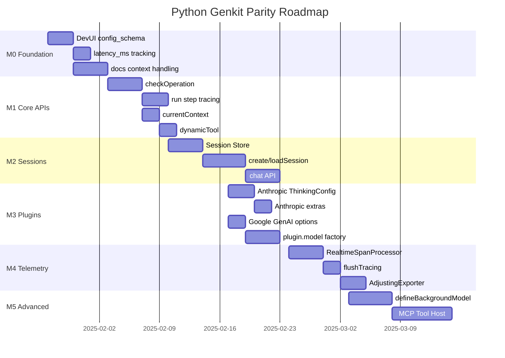
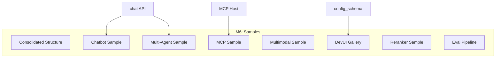
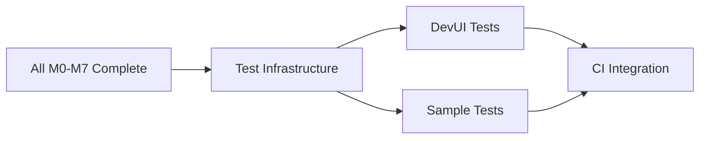

# Python Genkit Parity Roadmap

This document organizes the identified gaps into executable milestones with dependency relationships.

---

## Current Status (Updated 2026-01-30)

> [!IMPORTANT]
> **Overall Parity: ~99% Complete** - Nearly all milestones done!

### Completed Milestones ✅

| Milestone | Status | Notes |
|-----------|--------|-------|
| **M0: Foundation** | ✅ Complete | DevUI config, latency_ms, docs context |
| **M1: Core APIs** | ✅ Complete | check_operation, run, current_context, dynamic_tool |
| **M2: Sessions** | ✅ Complete | SessionStore, create/load_session, chat API |
| **M3: Plugin Parity** | ✅ Complete | Anthropic ThinkingConfig, Google apiVersion/baseUrl |
| **M4: Telemetry** | ✅ Complete | RealtimeSpanProcessor, flushTracing, AdjustingTraceExporter, GCP parity |
| **M5: Advanced** | ✅ Complete | embed_many ✅, define_simple_retriever ✅, define_background_model ✅ |
| **M6: Media Models** | ✅ Complete | Veo, Lyria, TTS, Gemini Image models |

### Remaining Work

| Priority | Task | Effort | Status |
|----------|------|--------|--------|
| **P0** | Testing Infrastructure (`genkit.testing`) | S | ✅ Complete |
| **P0** | Context Caching (google-genai) | M | ✅ Complete |
| **P1** | `define_background_model()` | M | ✅ Complete |
| **P1** | Veo support in google-genai plugin | M | ✅ Complete |
| **P1** | TTS (Text-to-Speech) models | S | ✅ Complete |
| **P1** | Gemini Image models | S | ✅ Complete |
| **P1** | Lyria audio generation (Vertex AI) | S | ✅ Complete |
| **P1** | Live/Realtime API | L | ❌ Not Started |
| **P2** | Multi-agent sample | M | ❌ Not Started |
| **P2** | MCP sample | M | ❌ Not Started |

---

## Remaining Gaps (Prioritized)

> [!NOTE]
> Most original gaps have been addressed. These are the remaining items.

| Gap | Description | Priority | Status |
|-----|-------------|----------|--------|
| **Testing Infrastructure** | JS has `echoModel`, `ProgrammableModel`, `TestAction` for unit testing. | **P0** | ✅ Complete |
| **Context Caching** | `ai.cacheContent()`, `cachedContent` option in generate | **P0** | ✅ Complete |
| **define_background_model** | Core API for background models (Veo, etc.) | **P1** | ✅ Complete |
| **Veo plugin support** | Add `veo.py` to google-genai plugin (JS has `veo.ts`) | **P1** | ✅ Complete |
| **TTS models** | Text-to-speech Gemini models (gemini-*-tts) | **P1** | ✅ Complete |
| **Gemini Image models** | Native image generation (gemini-*-image) | **P1** | ✅ Complete |
| **Lyria audio generation** | Audio generation via Vertex AI (lyria-002) | **P1** | ✅ Complete |
| **Live/Realtime API** | Google GenAI Live API for real-time streaming | **P1** | ❌ Not Started |
| **CLI/Tooling Parity** | `genkit` CLI commands and Python project behavior | Medium | ⚠️ Mostly Working |
| **Error Types** | Python error hierarchy parity check | Low | ⚠️ Needs Review |
| **Auth/Security Patterns** | Auth context flow through actions | Medium | ⚠️ Needs Review |
| **Performance Benchmarks** | Streaming latency, memory usage | Low | ❌ Not Started |
| **Migration Guide** | Documentation for JS to Python migration | Low | ❌ Not Started |

---

## Background Actions/Operations Audit (2026-01-30)

> [!NOTE]
> Detailed comparison between JS (canonical) and Python implementations.

### Function Parity

| Function | JS Location | Python Location | Status |
|----------|-------------|-----------------|--------|
| `checkOperation()` | `js/ai/src/check-operation.ts` | `py/.../blocks/background_model.py` | ✅ Complete |
| `lookupBackgroundAction()` | `js/core/src/background-action.ts` | `py/.../blocks/background_model.py` | ✅ Complete |
| `backgroundAction()` | `js/core/src/background-action.ts` | N/A (uses `define_background_model`) | ✅ Equivalent |
| `defineBackgroundAction()` | `js/core/src/background-action.ts` | `define_background_model()` | ✅ Complete |
| `registerBackgroundAction()` | `js/core/src/background-action.ts` | Internal in `define_background_model` | ✅ Complete |

### Type/Interface Parity

| Type | JS Definition | Python Definition | Status |
|------|---------------|-------------------|--------|
| `Operation<T>` | `action?, id, done?, output?, error?, metadata?` | Same fields via Pydantic | ✅ Complete |
| `BackgroundAction<I,O>` | `startAction, checkAction, cancelAction?, supportsCancel` | Same structure | ✅ Complete |
| `BackgroundActionRunOptions` | `context?, telemetryLabels?` | Implicit via ActionRunContext | ✅ Complete |
| `BackgroundActionParams` | Full config object | Split into function parameters | ✅ Complete |

### Error Message Parity

| Scenario | JS Error | Python Error | Status |
|----------|----------|--------------|--------|
| Missing action field | `"Provided operation is missing original request information"` | Same | ✅ Exact match |
| Action not found | `"Failed to resolve background action from original request: ${action}"` | Same | ✅ Exact match |
| Cancel not supported | `"${name} does not support cancellation."` | Returns operation unchanged (JS-compatible) | ✅ Complete |

### Action Key Format Parity

| Action Type | JS Key Format | Python Key Format | Status |
|-------------|---------------|-------------------|--------|
| Start | `/{actionType}/{name}` | Same | ✅ Match |
| Check | `/check-operation/{name}/check` | Same | ✅ Match |
| Cancel | `/cancel-operation/{name}/cancel` | Same | ✅ Match |

### Flow Comparison

**JS `checkOperation` flow:**
1. Validate `operation.action` exists
2. Call `registry.lookupBackgroundAction(key)`
3. Throw if not found
4. Call `backgroundAction.check(operation)`
5. Return updated operation

**Python `check_operation` flow:**
1. Validate `operation.action` exists ✅
2. Call `lookup_background_action(registry, key)` ✅
3. Raise if not found ✅
4. Call `background_action.check(operation)` ✅
5. Return updated operation ✅

### Registry Integration

| Feature | JS | Python | Status |
|---------|-----|--------|--------|
| Actions registered separately (start/check/cancel) | ✅ | ✅ | ✅ Match |
| Lookup by action key | ✅ | ✅ | ✅ Match |
| `supportsCancel` property | ✅ | ✅ | ✅ Match |
| Action metadata preserved | ✅ | ✅ | ✅ Match |

### Media Models Implementation

| Model | JS Support | Python Support | Status |
|-------|------------|----------------|--------|
| Veo (video) | `veo.ts` | `veo.py` | ✅ Complete |
| Lyria (audio) | `lyria.ts` | `lyria.py` | ✅ Complete |
| TTS (speech) | In `gemini.ts` | In `gemini.py` | ✅ Complete |
| Gemini Image | In `gemini.ts` | In `gemini.py` | ✅ Complete |
| Imagen | `imagen.ts` | `imagen.py` | ✅ Complete |

### Sample Parity

| Sample | JS | Python | Status |
|--------|-----|--------|--------|
| Media models demo | Various | `media-models-demo/` | ✅ Complete |
| Background model example | In plugin samples | Integrated in media demo | ✅ Complete |

### Remaining Minor Gaps

| Gap | Priority | Status |
|-----|----------|--------|
| `plugin.model()` factory pattern | Low | ⚠️ Different pattern (direct import) |
| Zod schema validation | N/A | Pydantic equivalent | ✅ Complete |

---

### Phase 1 Tasks ✅ COMPLETE (2026-01-26)

**1. Testing Infrastructure (`genkit.testing` module)** ✅
- Location: `py/packages/genkit/src/genkit/testing.py`
- Implemented:
  - `EchoModel` / `define_echo_model()` - Returns input as output for testing
  - `ProgrammableModel` / `define_programmable_model()` - Configurable responses
  - `StaticResponseModel` / `define_static_response_model()` - Fixed responses
  - Streaming support with countdown ("3", "2", "1")
  - Request tracking (`last_request`, `request_count`)

**2. Context Caching (google-genai plugin)** ✅
- Location: `py/plugins/google-genai/src/.../models/context_caching/`
- Already implemented:
  - `_retrieve_cached_content()` - Cache lookup/creation
  - `_build_messages()` - Extracts cache config from message metadata
  - Model integration with `cached_content` option
  - Supported models: gemini-1.5-flash, gemini-1.5-pro, gemini-2.0-flash, etc.

**3. Background Models (`define_background_model`)** ✅ (2026-01-27)
- Location: `py/packages/genkit/src/genkit/blocks/background_model.py`
- Implemented:
  - `Operation` - Typed operation tracking with start/check/cancel
  - `BackgroundAction` - Wrapper for background model actions
  - `define_background_model()` - Registers background model with registry
  - `lookup_background_action()` - Find registered background models
  - `ai.check_operation()` - Check operation status
  - `ai.cancel_operation()` - Cancel in-progress operations
- Sample: `py/samples/media-models-demo/` (comprehensive demo of all media models)
- Use cases: Video generation (Veo), Image generation (Imagen)

**4. Media Generation Models (google-genai plugin)** ✅ (2026-01-27)

Implemented full parity with JS for all media generation models:

| Model Type | Models | Location | Config Schema |
|------------|--------|----------|---------------|
| **Veo (Video)** | veo-2.0, veo-3.0, veo-3.0-fast, veo-3.1 | `models/veo.py` | `VeoConfig` |
| **Lyria (Audio)** | lyria-002 | `models/lyria.py` | `LyriaConfig` |
| **TTS (Speech)** | gemini-*-tts | `models/gemini.py` | `GeminiTtsConfigSchema` |
| **Gemini Image** | gemini-*-image | `models/gemini.py` | `GeminiImageConfigSchema` |

**Sample:** `py/samples/media-models-demo/` - Comprehensive demo with testing instructions.

Helper functions added:
- `is_veo_model()` - Detect Veo video models
- `is_lyria_model()` - Detect Lyria audio models  
- `is_tts_model()` - Detect TTS speech models
- `is_image_model()` - Detect Gemini image models

Example usage:
```python
from genkit import Genkit
from genkit.plugins.google_genai import GoogleAI, VeoVersion

ai = Genkit(plugins=[GoogleAI()])

# TTS (text-to-speech)
response = await ai.generate(
    model='googleai/gemini-2.5-flash-preview-tts',
    prompt='Hello, welcome to Genkit!',
    config={'speech_config': {'voice_config': {'prebuilt_voice_config': {'voice_name': 'Kore'}}}}
)

# Gemini Image generation
response = await ai.generate(
    model='googleai/gemini-2.5-flash-image',
    prompt='A serene mountain landscape at sunset',
)

# Veo (video) - uses background model pattern
veo = ai.lookup_background_model(f'googleai/{VeoVersion.VEO_2_0}')
operation = await veo.start(request)
while not operation.done:
    operation = await veo.check(operation)

# Lyria (audio) - Vertex AI only
response = await ai.generate(
    model='vertexai/lyria-002',
    prompt='A peaceful piano melody',
)
```

---

## Dependency Graph

```mermaid
flowchart TD
    subgraph M0["M0: Foundation (Unblocks Everything)"]
        A1[DevUI config_schema fix]
        A2[Model spec compliance: latency_ms]
        A3[Model spec compliance: docs context]
    end

    subgraph M1["M1: Core APIs"]
        B1[checkOperation API]
        B2[run step tracing]
        B3[currentContext API]
        B4[dynamicTool API]
    end

    subgraph M2["M2: Stateful Conversations"]
        C1[Session Store Interface]
        C2[createSession/loadSession]
        C3[chat API]
    end

    subgraph M3["M3: Plugin Parity"]
        D1[Anthropic ThinkingConfig]
        D2[Anthropic tool_choice/metadata]
        D3[Google GenAI apiVersion/baseUrl]
        D4[plugin.model factory pattern]
    end

    subgraph M4["M4: Telemetry & Observability"]
        E1[RealtimeSpanProcessor]
        E2[flushTracing API]
        E3[AdjustingTraceExporter]
        E4[Logging instrumentation]
    end

    subgraph M5["M5: Advanced Features"]
        F1[defineBackgroundModel]
        F2[MCP Tool Host]
        F3[embedMany API]
        F4[defineSimpleRetriever]
    end

    subgraph M6["M6: Samples"]
        S1[Consolidated plugin demos]
        S2[Chatbot sample]
        S3[Multi-agent sample]
        S4[MCP sample]
    end

    subgraph M7["M7: Documentation 📝"]
        Doc1[Session/Chat docs]
        Doc2[Plugin config docs]
        Doc3[Telemetry docs]
        Doc4[MCP docs]
        Doc5[Sample docs]
    end

    %% Feature Dependencies
    A1 --> D4
    A3 --> C3
    
    B1 --> F1
    B2 --> E1
    
    C1 --> C2
    C2 --> C3
    
    D1 --> D2
    
    E1 --> E2
    E2 --> E3
    
    F2 --> S4
    C3 --> S2
    C3 --> S3

    %% Documentation Dependencies (trigger docs after features)
    C3 --> Doc1
    D4 --> Doc2
    E3 --> Doc3
    F2 --> Doc4
    S1 --> Doc5
```



### ASCII Dependency Graph

```
┌─────────────────────────────────────────────────────────────────────────────┐
│                           M0: FOUNDATION                                     │
│  ┌──────────────────┐  ┌──────────────────┐  ┌──────────────────┐           │
│  │ A1: config_schema│  │ A2: latency_ms   │  │ A3: docs context │           │
│  └────────┬─────────┘  └──────────────────┘  └────────┬─────────┘           │
└───────────┼──────────────────────────────────────────┼──────────────────────┘
            │                                          │
            ▼                                          │
┌───────────────────────────────────────────┐          │
│              M3: PLUGINS                  │          │
│  ┌──────────────────┐                     │          │
│  │ D4: model()      │◄────────────────────┼──────────┘
│  │     factory      │                     │          │
│  └──────────────────┘                     │          │
└───────────────────────────────────────────┘          │
                                                       │
┌─────────────────────────────────────────────────────────────────────────────┐
│                           M1: CORE APIs                                      │
│  ┌──────────────────┐  ┌──────────────────┐  ┌──────────────────┐           │
│  │ B1: checkOp()    │  │ B2: run()        │  │ B3: context()    │           │
│  └────────┬─────────┘  └────────┬─────────┘  └──────────────────┘           │
└───────────┼─────────────────────┼───────────────────────────────────────────┘
            │                     │
            ▼                     ▼
┌───────────────────────┐  ┌───────────────────────┐
│ M5: ADVANCED          │  │ M4: TELEMETRY         │
│ ┌───────────────────┐ │  │ ┌───────────────────┐ │
│ │ F1: background    │ │  │ │ E1: RealtimeSpan  │ │
│ │     Model         │ │  │ └─────────┬─────────┘ │
│ └─────────┬─────────┘ │  │           ▼           │
│           ▼           │  │ ┌───────────────────┐ │
│ ┌───────────────────┐ │  │ │ E2: flushTracing  │ │
│ │ F2: MCP Host      │ │  │ └─────────┬─────────┘ │
│ └───────────────────┘ │  │           ▼           │
└───────────────────────┘  │ ┌───────────────────┐ │
                           │ │ E3: Adjusting     │ │
                           │ └───────────────────┘ │
                           └───────────────────────┘

┌─────────────────────────────────────────────────────────────────────────────┐
│                        M2: SESSIONS                                          │
│  ┌──────────────────┐       ┌──────────────────┐       ┌──────────────────┐ │
│  │ C1: Store        │──────►│ C2: create/load  │──────►│ C3: chat()       │ │
│  └──────────────────┘       └──────────────────┘       └──────────────────┘ │
│                                                              ▲               │
│                                                              │               │
│                                           A3: docs ──────────┘               │
└─────────────────────────────────────────────────────────────────────────────┘

┌─────────────────────────────────────────────────────────────────────────────┐
│                     M7: DOCUMENTATION 📝 (After Features)                    │
│                                                                              │
│  C3: chat() ────────► Doc1: Session/Chat docs                               │
│  D4: model() ───────► Doc2: Plugin config docs                              │
│  E3: Adjusting ─────► Doc3: Telemetry docs                                  │
│  F2: MCP Host ──────► Doc4: MCP docs                                        │
│  S1: Samples ───────► Doc5: Sample docs                                     │
└─────────────────────────────────────────────────────────────────────────────┘
```

---

## Reverse Topological Execution Order

> [!IMPORTANT]
> Execute tasks starting from **leaves** (no outgoing dependencies) working backwards to **roots**.

### Phase 1: Independent Leaves (Start Here)
*These tasks have NO dependencies - can all start in parallel*

| ID | Task | Effort | Milestone |
|----|------|--------|-----------|
| A2 | latency_ms tracking | S | M0 |
| B3 | currentContext() | S | M1 |
| B4 | dynamicTool() | S | M1 |
| C1 | Session Store Interface | M | M2 |
| D1 | Anthropic ThinkingConfig | M | M3 |
| D3 | Google GenAI apiVersion/baseUrl | S | M3 |
| E4 | Logging instrumentation | S | M4 |
| F3 | embedMany() | S | M5 |
| F4 | defineSimpleRetriever() | S | M5 |
| **S1** | **Consolidated plugin demo structure** | **M** | **M6** |
| **S5** | **Multimodal input sample** | **S** | **M6** |

### Phase 2: First Dependencies
*Unblocked after Phase 1 completes*

| ID | Task | Depends On | Effort |
|----|------|------------|--------|
| A1 | DevUI config_schema | — | S |
| B2 | run() step tracing | — | M |
| C2 | createSession/loadSession | C1 | L |
| D2 | Anthropic tool_choice/metadata | D1 | S |

### Phase 3: Second Dependencies
*Unblocked after Phase 2 completes*

| ID | Task | Depends On | Effort |
|----|------|------------|--------|
| A3 | docs context handling | — | M |
| B1 | checkOperation() | — | M |
| D4 | plugin.model() factory | A1 | M |
| E1 | RealtimeSpanProcessor | B2 | M |
| **S6** | **DevUI gallery sample** | **A1** | **M** |
| **S7** | **Reranker sample** | **—** | **S** |
| **S8** | **Eval pipeline sample** | **—** | **M** |

### Phase 4: Third Dependencies

| ID | Task | Depends On | Effort |
|----|------|------------|--------|
| C3 | chat() API | C2, A3 | M |
| E2 | flushTracing() | E1 | S |
| F1 | defineBackgroundModel() | B1 | L |

### Phase 5: Final Tasks

| ID | Task | Depends On | Effort |
|----|------|------------|--------|
| E3 | AdjustingTraceExporter | E2 | M |
| F2 | MCP Tool Host | F1 | L |
| **S2** | **Chatbot sample** | **C3** | **L** |
| **S3** | **Multi-agent sample** | **C3** | **L** |
| **S4** | **MCP integration sample** | **F2** | **M** |



### ASCII Execution Order

```
PHASE 1 (Leaves - Start Here)
═══════════════════════════════════════════════════════════════════════════════
│ A2: latency_ms │ B3: context │ B4: dynamicTool │ C1: Store │ D1: Thinking │
│ D3: apiVersion │ E4: Logging │ F3: embedMany   │ F4: simpleRetriever      │
═══════════════════════════════════════════════════════════════════════════════
        │               │              │              │              │
        ▼               ▼              ▼              ▼              ▼
PHASE 2
═══════════════════════════════════════════════════════════════════════════════
│ A1: config_schema │ B2: run() tracing │ C2: create/load │ D2: tool_choice │
═══════════════════════════════════════════════════════════════════════════════
        │                    │                 │
        ▼                    ▼                 ▼
PHASE 3
═══════════════════════════════════════════════════════════════════════════════
│ A3: docs context │ B1: checkOp() │ D4: model() factory │ E1: RealtimeSpan │
═══════════════════════════════════════════════════════════════════════════════
        │                 │                                      │
        ▼                 ▼                                      ▼
PHASE 4
═══════════════════════════════════════════════════════════════════════════════
│         C3: chat() API         │ F1: backgroundModel │ E2: flushTracing  │
═══════════════════════════════════════════════════════════════════════════════
                                          │                     │
                                          ▼                     ▼
PHASE 5 (Roots - End Here)
═══════════════════════════════════════════════════════════════════════════════
│                    F2: MCP Host                │ E3: AdjustingExporter    │
═══════════════════════════════════════════════════════════════════════════════
```

---

## Milestone Breakdown

### M0: Foundation (Week 1-2)
> **Goal:** Fix core issues that block DevUI and model spec compliance

| Task | Effort | Unblocks | Files |
|------|--------|----------|-------|
| **A1: DevUI config_schema fix** | S | Plugin model() factories | `gemini.py`, `models.py` |
| **A2: latency_ms tracking** | S | Monitoring dashboards | All model plugins |
| **A3: docs context handling** | M | RAG + Chat API | `generate.py` |

**Definition of Done:**
- [x] Model config shows in DevUI
- [x] latency_ms populated in GenerateResponse
- [x] `docs` field augments message history

---

### M1: Core APIs (Week 2-3)
> **Goal:** Add missing core Genkit API methods

| Task | Effort | Unblocks | Files |
|------|--------|----------|-------|
| **B1: checkOperation()** | M | Background models, Veo | `_aio.py` |
| **B2: run() step tracing** | M | Better flow debugging | `_registry.py` |
| **B3: currentContext()** | S | Auth in tools/flows | `_registry.py` |
| **B4: dynamicTool()** | S | Runtime tool creation | `_registry.py` |

**Definition of Done:**
- [x] `await ai.check_operation(op)` returns updated Operation
- [x] `await ai.run('step', fn)` creates traced sub-span
- [x] `ai.current_context()` returns ActionContext
- [x] `ai.dynamic_tool(config, fn)` returns unregistered ToolAction

---

### M2: Stateful Conversations (Week 3-5)
> **Goal:** Enable multi-turn conversations with history persistence



| Task | Effort | Dependencies | Files |
|------|--------|--------------|-------|
| **C1: Session Store Interface** | M | None | NEW: `session/store.py` |
| **C2: createSession/loadSession** | L | C1 | NEW: `session/session.py` |
| **C3: chat() API** | M | C2, A3 | `_aio.py` |

**Definition of Done:**
- [x] `SessionStore` abstract base class with `get/save/delete`
- [x] `session = await ai.create_session()` / `ai.load_session(id)`
- [x] `response = await session.chat('message')` maintains history
- [x] At least one store implementation (in-memory)

---

### M3: Plugin Parity (Week 4-6)
> **Goal:** Match JS plugin config schemas and APIs

| Task | Effort | Plugin | Files |
|------|--------|--------|-------|
| **D1: Anthropic ThinkingConfig** | M | anthropic | `models.py`, `plugin.py` |
| **D2: Anthropic tool_choice/metadata** | S | anthropic | `models.py` |
| **D3: Google GenAI apiVersion/baseUrl** | S | google-genai | `google.py` |
| **D4: plugin.model() factory** | M | All | All plugin `__init__.py` |

**Definition of Done:**
- [x] `config={'thinking': {'enabled': True, 'budgetTokens': 10000}}` works
- [x] `tool_choice={'type': 'tool', 'name': 'myTool'}` supported
- [x] `GoogleGenAI(api_version='v1beta')` accepted
- [ ] `google_ai.model('gemini-2.5-flash')` returns typed reference

---

### M4: Telemetry & Observability (Week 5-7)
> **Goal:** Match JS realtime tracing and observability features

| Task | Effort | Impact | Files |
|------|--------|--------|-------|
| **E1: RealtimeSpanProcessor** | M | Live DevUI tracing | NEW: `realtime_processor.py` |
| **E2: flushTracing() API** | S | Clean shutdown | `tracing.py` |
| **E3: AdjustingTraceExporter** | M | PII redaction | `google_cloud/telemetry/` |
| **E4: Logging instrumentation** | S | Log correlation | `google_cloud/telemetry/` |

**Definition of Done:**
- [x] Spans appear in DevUI as they START (not just on completion)
- [x] `GENKIT_ENABLE_REALTIME_TELEMETRY=true` env var supported
- [x] `await ai.flush_tracing()` available
- [x] Model I/O redacted before Cloud Trace export (via AdjustingTraceExporter)
- [x] Logging instrumentation enabled with trace correlation

---

### M5: Advanced Features (Week 7+)
> **Goal:** Complete feature parity for advanced use cases

| Task | Effort | Use Case | Files |
|------|--------|----------|-------|
| **F1: defineBackgroundModel()** | L | Veo, Imagen | `_registry.py`, block |
| **F2: MCP Tool Host** | L | External tools | NEW: `mcp/host.py` |
| **F3: embedMany()** | S | Batch embedding | `_aio.py` |
| **F4: defineSimpleRetriever()** | S | Quick RAG setup | `_registry.py` |

(Marking done for verified items)
- [x] F1: defineBackgroundModel() API
- [x] F3: embedMany() API
- [x] F4: defineSimpleRetriever()
- [x] S2: Chatbot sample (chat-demo)
- [x] Background model sample (background-model-demo)

---

---

## Timeline Overview



---

## Effort Legend

| Size | Days | Description |
|------|------|-------------|
| **S** | 1-2 | Simple addition, clear pattern |
| **M** | 3-5 | Moderate complexity, some design |
| **L** | 5-10 | Large feature, new subsystem |

---

## Quick Wins (Can Start Immediately)

These have no dependencies and provide immediate value:

1. ~~**A1: DevUI config_schema** - Uncomment and fix existing code~~
2. ~~**A2: latency_ms** - Add timing to model wrappers~~
3. ~~**B3: currentContext()** - Thread-local context access~~
4. ~~**D3: apiVersion/baseUrl** - Add to plugin options~~
5. ~~**E2: flushTracing()** - Simple exporter flush~~

---

## Files Reference

| Area | Key Files |
|------|-----------|
| Core APIs | `py/packages/genkit/src/genkit/ai/_aio.py`, `_registry.py` |
| Sessions | NEW: `py/packages/genkit/src/genkit/session/` |
| Google GenAI | `py/plugins/google-genai/src/.../models/gemini.py` |
| Anthropic | `py/plugins/anthropic/src/.../models.py` |
| Telemetry | `py/packages/genkit/src/genkit/core/tracing.py` |
| GCP Plugin | `py/plugins/google-cloud/src/.../telemetry/` |

---

## M6: Sample Parity

> **Goal:** Match JS sample coverage and consolidate plugin demos

See [sample_parity_analysis.md](sample_parity_analysis.md) for full analysis.

### Sample Tasks

| ID | Task | Effort | Depends On | Phase |
|----|------|--------|------------|-------|
| S1 | Consolidated plugin demo structure | M | — | 1 |
| S2 | Chatbot sample (like `js-chatbot`) | L | C3 (chat API) | 5 |
| S3 | Multi-agent sample (like `js-schoolAgent`) | L | C3 (chat API) | 5 |
| S4 | MCP integration sample | M | F2 (MCP Host) | 5 |
| S5 | Multimodal input sample | S | — | 1 |
| S6 | DevUI gallery sample | M | A1 (config_schema) | 3 |
| S7 | Reranker sample | S | Plugin parity | 3 |
| S8 | Full eval pipeline sample | M | — | 3 |

### Consolidated Plugin Demo Structure

Each plugin should demonstrate the same core features:

```
py/samples/plugin-demos/{plugin}/
├── 01_basic_generate.py      # Simple text generation
├── 02_streaming.py           # Streaming response
├── 03_structured_output.py   # JSON schema output
├── 04_tool_calling.py        # Tool/function calling
├── 05_multimodal.py          # Image/audio input (if supported)
├── 06_multi_turn.py          # Conversation history
├── 07_system_prompt.py       # System instructions
├── 08_middleware.py          # Request/response middleware
├── prompts/demo.prompt       # Dotprompt example
└── main.py                   # Entry point
```

### Sample Dependency Graph



### ASCII Sample Dependencies

```
┌─────────────────────────────────────────────────────────────────────────────┐
│                         M6: SAMPLES                                          │
│                                                                              │
│  Phase 1 (Independent):                                                      │
│  ┌───────────────────┐  ┌───────────────────┐                               │
│  │ S1: Consolidated  │  │ S5: Multimodal    │                               │
│  │     Structure     │  │     Sample        │                               │
│  └───────────────────┘  └───────────────────┘                               │
│                                                                              │
│  Phase 3 (After Foundation):                                                 │
│  ┌───────────────────┐  ┌───────────────────┐  ┌───────────────────┐        │
│  │ S6: DevUI Gallery │  │ S7: Reranker      │  │ S8: Eval Pipeline │        │
│  └─────────▲─────────┘  └───────────────────┘  └───────────────────┘        │
│            │                                                                 │
│            │ (depends on A1)                                                 │
│                                                                              │
│  Phase 5 (After Chat/MCP):                                                   │
│  ┌───────────────────┐  ┌───────────────────┐  ┌───────────────────┐        │
│  │ S2: Chatbot       │  │ S3: Multi-Agent   │  │ S4: MCP Sample    │        │
│  └─────────▲─────────┘  └─────────▲─────────┘  └─────────▲─────────┘        │
│            │                      │                      │                   │
│            └──────────────────────┼──────────────────────┘                   │
│                                   │                                          │
│                          C3: chat() API                                      │
│                                   │                                          │
│                          F2: MCP Tool Host                                   │
└─────────────────────────────────────────────────────────────────────────────┘
```

---

## M7: Documentation (Docsite Updates)

> **Goal:** Keep [genkit-ai/docsite](https://github.com/genkit-ai/docsite) updated with Python feature parity

> [!WARNING]
> After completing each milestone, update the docsite to reflect Python support.

### Documentation Tasks

| ID | Task | After Milestone | Priority |
|----|------|-----------------|----------|
| D1 | Update Session/Chat docs for Python | M2 | P0 |
| D2 | Add Python examples to all feature docs | M0-M5 | P1 |
| D3 | Document Python plugin config options | M3 | P1 |
| D4 | Add Python telemetry setup guide | M4 | P2 |
| D5 | Document MCP Python support | M5 (F2) | P2 |
| D6 | Add Python sample links | M6 | P2 |
| D7 | Python API reference (if applicable) | M1 | P3 |

### Docsite Files Analysis

**Repository:** [genkit-ai/docsite](https://github.com/genkit-ai/docsite)  
**Docs path:** `src/content/docs/docs/`

#### Core Feature Docs (Need Python Examples)

| File | Size | Python Status | Action |
|------|------|---------------|--------|
| `chat.mdx` | 18KB | ❌ **JS/Go only** (`supportedLanguages="js go"`) | Add Python after M2 |
| `models.mdx` | 78KB | Partial | Add Python config examples |
| `flows.mdx` | 39KB | Partial | Verify Python examples current |
| `dotprompt.mdx` | 40KB | Partial | Verify Python examples |
| `tool-calling.mdx` | 32KB | Partial | Add tool config examples |
| `rag.mdx` | 30KB | Partial | Add Python retriever examples |
| `evaluation.mdx` | 44KB | Partial | Add Python evaluator examples |
| `interrupts.mdx` | 26KB | ? | Check if Python supported |
| `agentic-patterns.mdx` | 31KB | ? | Add Python multi-agent examples |
| `multi-agent.mdx` | 6KB | ? | Add after M2/Sessions |
| `mcp-server.mdx` | 12KB | ? | Add after MCP support |
| `model-context-protocol.mdx` | 20KB | ❌ **JS only** | Add after F2 MCP Host |
| `context.mdx` | 7KB | ? | Add `currentContext()` after B3 |
| `durable-streaming.mdx` | 12KB | ? | Check if applicable to Python |

#### Integration/Plugin Docs (Need Python)

| File | Python Plugin | Action |
|------|---------------|--------|
| `integrations/google-genai.mdx` | ✅ Exists | Add config_schema examples |
| `integrations/vertex-ai.mdx` | ✅ (in google-genai) | Update with Python |
| `integrations/anthropic.mdx` | ✅ Exists | Add ThinkingConfig after D1 |
| `integrations/ollama.mdx` | ✅ Exists | Verify examples |
| `integrations/openai-compatible.mdx` | ✅ compat-oai | Verify examples |
| `integrations/deepseek.mdx` | ✅ Exists | Add/verify Python |
| `integrations/xai.mdx` | ✅ Exists | Add/verify Python |
| `integrations/google-cloud.mdx` | ✅ Exists | Add telemetry examples after M4 |
| `integrations/dev-local-vectorstore.mdx` | ✅ Exists | Add Python examples |
| `integrations/cloud-firestore.mdx` | ✅ Exists | Add Python retriever examples |
| `integrations/vectorsearch-firestore.mdx` | ✅ Exists | Add Python examples |
| `integrations/vectorsearch-bigquery.mdx` | ✅ Exists | Add Python examples |
| `integrations/chroma.mdx` | ❌ Missing plugin | Skip until plugin exists |
| `integrations/pinecone.mdx` | ❌ Missing plugin | Skip until plugin exists |
| `integrations/pgvector.mdx` | ❌ Missing plugin | Skip until plugin exists |

#### Detailed Doc Tasks (by Dependency)

| Task ID | Docsite File | Change Required | Depends On |
|---------|--------------|-----------------|------------|
| **Doc-01** | `chat.mdx` | Add `supportedLanguages="js go python"`, add Python tab content | C3 chat API |
| **Doc-02** | `chat.mdx` | Python Session/SessionStore examples | C1, C2 |
| **Doc-03** | `model-context-protocol.mdx` | Add Python MCP client examples | F2 MCP Host |
| **Doc-04** | `mcp-server.mdx` | Add Python MCP server examples | Exists |
| **Doc-05** | `integrations/anthropic.mdx` | Add ThinkingConfig Python example | D1 |
| **Doc-06** | `integrations/google-genai.mdx` | Add apiVersion/baseUrl examples | D3 |
| **Doc-07** | `integrations/google-cloud.mdx` | Add Python telemetry examples | E3 |
| **Doc-08** | `context.mdx` | Add `ai.current_context()` Python examples | B3 |
| **Doc-09** | `multi-agent.mdx` | Add Python multi-agent examples | C3, S3 |
| **Doc-10** | `evaluation.mdx` | Update Python evaluator examples | Exists |
| **Doc-11** | `rag.mdx` | Add `define_simple_retriever()` examples | F4 |
| **Doc-12** | `models.mdx` | Add `define_background_model()` examples | F1 |

### Docsite Language Component

The docsite uses `<LanguageSelector>` and `<LanguageContent>` components:

```mdx
<LanguageSelector supportedLanguages="js go python" />

<LanguageContent lang="python">
<!-- Python content here -->
</LanguageContent>
```

**Key change:** Files with `supportedLanguages="js go"` need `python` added.

### Post-Milestone Checklist

```
After completing each milestone:
1. ✅ Merge code to main
2. ✅ Update CHANGELOG
3. 📝 Identify affected docsite files from table above
4. 📝 Fork genkit-ai/docsite
5. 📝 Add `python` to LanguageSelector
6. 📝 Add <LanguageContent lang="python"> sections
7. 📝 Open PR on genkit-ai/docsite
8. 📝 Update any "JavaScript only" / "JS/Go only" warnings
```

---

## M8: Automated Testing (Future - Low Priority)

> **Goal:** Automate sample validation and DevUI E2E testing

> [!NOTE]
> This milestone is intentionally last. Complete all feature work first.

### Overview

Use Playwright (Python) to automate:
1. DevUI E2E tests - verify flows work through the UI
2. Sample validation - run each sample and verify output
3. Regression testing - catch breaking changes

### Testing Tasks

| ID | Task | Effort | Description |
|----|------|--------|-------------|
| T1 | Playwright test infrastructure | M | Set up pytest-playwright, fixtures |
| T2 | DevUI flow runner tests | M | Test running flows through DevUI |
| T3 | DevUI model config tests | S | Verify config_schema appears in UI |
| T4 | Sample smoke tests | L | Run each sample, verify no errors |
| T5 | CI integration | M | Add to GitHub Actions workflow |

### Example Test Structure

```python
# tests/e2e/test_devui.py
import pytest
from playwright.async_api import async_playwright

@pytest.fixture
async def devui_page():
    async with async_playwright() as p:
        browser = await p.chromium.launch()
        page = await browser.new_page()
        await page.goto("http://localhost:4000")
        yield page
        await browser.close()

async def test_flow_list_loads(devui_page):
    """Verify flow list appears in DevUI."""
    await devui_page.wait_for_selector('[data-testid="flow-list"]')
    flows = await devui_page.query_selector_all('[data-testid="flow-item"]')
    assert len(flows) > 0

async def test_run_menu_flow(devui_page):
    """Run menuSuggestionFlow and verify output."""
    await devui_page.click('text=menuSuggestionFlow')
    await devui_page.fill('[data-testid="input"]', '{"theme": "Italian"}')
    await devui_page.click('[data-testid="run-button"]')
    
    output = await devui_page.wait_for_selector('[data-testid="output"]')
    text = await output.text_content()
    assert len(text) > 0

async def test_model_config_visible(devui_page):
    """Verify model config schema appears."""
    await devui_page.click('[data-testid="models-tab"]')
    await devui_page.click('text=gemini-2.0-flash')
    
    config = await devui_page.wait_for_selector('[data-testid="config-schema"]')
    assert "temperature" in await config.text_content()
```

### CI Workflow Addition

```yaml
# .github/workflows/python-e2e.yml
name: Python E2E Tests

on:
  push:
    paths: ['py/**']

jobs:
  e2e:
    runs-on: ubuntu-latest
    steps:
      - uses: actions/checkout@v4
      - uses: actions/setup-python@v5
        with:
          python-version: '3.12'
      
      - name: Install dependencies
        run: |
          pip install playwright pytest-playwright
          playwright install chromium
      
      - name: Start sample server
        run: |
          cd py/samples/menu
          uv run genkit start &
          sleep 10
      
      - name: Run E2E tests
        run: pytest tests/e2e/ -v
```

### Dependencies



