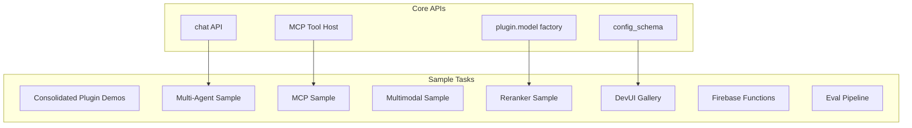

# Sample Parity Analysis: JS vs Python

This document analyzes the sample/testapp coverage between JS and Python implementations.

---

## Summary

**JS Sample Locations:**
- `/samples/` - 9 polished demo samples (js-angular, js-chatbot, js-menu, etc.)
- `/js/testapps/` - 32 internal test/demo apps (advanced scenarios)

**Python Sample Location:**
- `/py/samples/` - 25 samples

| Metric | JS (`samples/` + `testapps/`) | Python (`py/samples/`) | Gap |
|--------|-------------------------------|------------------------|-----|
| Polished demos | 9 | 0 | **-9** |
| Plugin demos | 8 | 12 | +4 ✅ |
| Advanced scenarios | 15 | 3 | **-12** |
| RAG samples | 5 | 3 | -2 |
| Chat/Chatbot | 2 (`js-chatbot`, menu) | 0 | **-2** |
| Multi-agent | 2 (`js-schoolAgent`, multiagents-demo) | 0 | **-2** |

---

## Sample Category Comparison

### Plugin Hello World Demos

| Plugin | JS | Python | Notes |
|--------|-----|--------|-------|
| Google GenAI | ✅ `basic-gemini` | ✅ `google-genai-hello` | Parity ✅ |
| Vertex AI | ✅ (in basic-gemini) | ✅ `google-genai-vertexai-hello` | Parity ✅ |
| Anthropic | ✅ `anthropic` | ✅ `anthropic-hello` | Parity ✅ |
| Ollama | ✅ `ollama` | ✅ `ollama-hello` | Parity ✅ |
| OpenAI Compat | ✅ `compat-oai` | ✅ `compat-oai-hello` | Parity ✅ |
| xAI (Grok) | ❌ | ✅ `xai-hello` | Python extra ✅ |
| DeepSeek | ❌ | ✅ `deepseek-hello` | Python extra ✅ |
| Model Garden | ✅ `vertexai-modelgarden` | ✅ `model-garden` | Parity ✅ |

### Image Generation

| Feature | JS | Python | Notes |
|---------|-----|--------|-------|
| Imagen (Google AI) | ✅ (in multimodal) | ✅ `google-genai-image` | Parity ✅ |
| Imagen (Vertex) | ✅ (in multimodal) | ✅ `google-genai-vertexai-image` | Parity ✅ |
| Multimodal input | ✅ `multimodal` | ❌ | **Python missing** |

### Context & Caching

| Feature | JS | Python | Notes |
|---------|-----|--------|-------|
| Context Caching | ✅ `context-caching`, `context-caching2` | ✅ `google-genai-context-caching` | Parity ✅ |
| Code Execution | ✅ (in basic-gemini) | ✅ `google-genai-code-execution` | Parity ✅ |

### RAG (Retrieval Augmented Generation)

| Feature | JS | Python | Notes |
|---------|-----|--------|-------|
| Basic RAG | ✅ `rag` | ✅ `menu` (has RAG case) | Parity ✅ |
| Vector Search (Firestore) | ✅ `vertexai-vector-search-firestore` | ✅ `vertex-ai-vector-search-firestore` | Parity ✅ |
| Vector Search (BigQuery) | ✅ `vertexai-vector-search-bigquery` | ✅ `vertex-ai-vector-search-bigquery` | Parity ✅ |
| Vector Search (Custom) | ✅ `vertexai-vector-search-custom` | ❌ | Python missing |
| Local Vector Store | ❌ | ✅ `dev-local-vectorstore-hello` | Python extra ✅ |
| Firestore Retriever | ❌ | ✅ `firestore-retreiver` ⚠️ typo | Python extra ✅ |
| Reranker | ✅ `vertexai-reranker` | ❌ | **Python missing** |

### Evaluation

| Feature | JS | Python | Notes |
|---------|-----|--------|-------|
| Custom Evaluators | ✅ `custom-evaluators` | ✅ `evaluator-demo` | Parity ✅ |
| Eval Pipelines | ✅ `evals` | ❌ | **Python missing** |
| Model Tester | ✅ `model-tester` | ❌ | Python missing |
| Format Tester | ✅ `format-tester` | ✅ `format-demo` | Parity ✅ |

### Multi-Agent & Advanced

| Feature | JS | Python | Notes |
|---------|-----|--------|-------|
| Multi-Agent Demo | ✅ `multiagents-demo` | ❌ | **Python missing** |
| MCP Integration | ✅ `mcp` | ❌ | **Python missing** |
| Durable Streaming | ✅ `durable-streaming` | ❌ | Python missing |
| Tool Interrupts | ❌ | ✅ `tool-interrupts` | Python extra ✅ |

### Web Frameworks

| Feature | JS | Python | Notes |
|---------|-----|--------|-------|
| Express | ✅ `express` | N/A | |
| Next.js | ✅ `next` | N/A | |
| Flask | N/A | ✅ `flask-hello` | |
| Firebase Functions | ✅ `firebase-functions-sample1` | ❌ | Python missing |

### Prompts & Flows

| Feature | JS | Python | Notes |
|---------|-----|--------|-------|
| Prompt Files | ✅ `prompt-file` | ✅ `prompt-demo` | Parity ✅ |
| Flow Samples | ✅ `flow-sample1`, `flow-simple-ai` | ✅ (in menu) | Parity ✅ |
| Menu Demo | ✅ `menu`, `docs-menu-basic`, `docs-menu-rag` | ✅ `menu` | Parity ✅ |
| DevUI Gallery | ✅ `dev-ui-gallery` | ❌ | **Python missing** |

### Multi-Server

| Feature | JS | Python | Notes |
|---------|-----|--------|-------|
| Multi-Server | ❌ | ✅ `multi-server` | Python extra ✅ |
| Short 'n Long | ❌ | ✅ `short-n-long` | Python extra ✅ |

---

## Critical Missing Samples (Python)

### P0 - Must Have

| Sample | Description | JS Reference |
|--------|-------------|--------------|
| **multiagents-demo** | Multi-agent orchestration | `js/testapps/multiagents-demo` |
| **mcp** | MCP tool host integration | `js/testapps/mcp` |
| **multimodal** | Multimodal input (images, audio) | `js/testapps/multimodal` |

### P1 - Important

| Sample | Description | JS Reference |
|--------|-------------|--------------|
| **vertexai-reranker** | Reranker for RAG quality | `js/testapps/vertexai-reranker` |
| **evals** | Full evaluation pipeline | `js/testapps/evals` |
| **dev-ui-gallery** | DevUI feature showcase | `js/testapps/dev-ui-gallery` |
| **firebase-functions** | Cloud Functions deployment | `js/testapps/firebase-functions-sample1` |

### P2 - Nice to Have

| Sample | Description | JS Reference |
|--------|-------------|--------------|
| **durable-streaming** | Persistence for streaming | `js/testapps/durable-streaming` |
| **model-tester** | Model capability testing | `js/testapps/model-tester` |
| **vector-search-custom** | Custom vector search | `js/testapps/vertexai-vector-search-custom` |

---

## Consolidated Plugin Demo Proposal

To ensure consistent feature demonstration across plugins, each plugin should have a **unified sample** that demonstrates:

### Core Features (All Plugins Must Demo)

```
plugin-demo/
├── flows/
│   ├── 01_basic_generate.py      # Simple text generation
│   ├── 02_streaming.py           # Streaming response
│   ├── 03_structured_output.py   # JSON schema output
│   ├── 04_tool_calling.py        # Tool/function calling
│   ├── 05_multimodal.py          # Image/audio input (if supported)
│   ├── 06_multi_turn.py          # Conversation history
│   ├── 07_system_prompt.py       # System instructions
│   └── 08_middleware.py          # Request/response middleware
├── prompts/
│   └── demo.prompt               # Dotprompt example
└── main.py                       # Entry point
```

### Plugin Feature Matrix

| Feature | google-genai | anthropic | ollama | openai-compat |
|---------|--------------|-----------|--------|---------------|
| Basic Generate | ✅ | ✅ | ✅ | ✅ |
| Streaming | ✅ | ✅ | ✅ | ✅ |
| Structured Output | ✅ | ✅ | ✅ | ✅ |
| Tool Calling | ✅ | ✅ | ✅ | ✅ |
| Multimodal | ✅ | ✅ | ❌ | Varies |
| Context Caching | ✅ | ❌ | ❌ | ❌ |
| Code Execution | ✅ | ❌ | ❌ | ❌ |
| Thinking Mode | ❌ | ✅ | ❌ | ❌ |

### Proposed Directory Structure

```
py/samples/
├── plugin-demos/                    # NEW: Consolidated demos
│   ├── google-genai/
│   │   └── (all 8 flows)
│   ├── anthropic/
│   │   └── (all 8 flows)
│   ├── ollama/
│   │   └── (flows 1-4, 6-8)
│   └── openai-compat/
│       └── (all 8 flows)
├── advanced/                        # NEW: Advanced scenarios
│   ├── multiagent/
│   ├── mcp-integration/
│   ├── rag-pipeline/
│   └── eval-pipeline/
└── integrations/                    # Existing
    ├── flask-hello/
    ├── firestore-retriever/
    └── ...
```

---

## Roadmap Integration

### New Tasks for Sample Parity

| ID | Task | Effort | Phase | Depends On |
|----|------|--------|-------|------------|
| S1 | Consolidated plugin demo structure | M | 1 | — |
| S2 | Multi-agent sample | L | 4 | Session API |
| S3 | MCP integration sample | M | 4 | MCP Tool Host |
| S4 | Multimodal input sample | S | 2 | — |
| S5 | Reranker sample | S | 3 | Plugin parity |
| S6 | DevUI gallery sample | M | 4 | config_schema |
| S7 | Firebase Functions sample | M | 3 | — |
| S8 | Full eval pipeline sample | M | 3 | Evaluator APIs |

### Updated Dependency Graph



---

## Execution Plan Update

### Phase 1 Additions
- **S1: Consolidated plugin demo structure** - Set up the standardized flow structure

### Phase 2 Additions  
- **S4: Multimodal input sample** - Basic image input with Gemini

### Phase 3 Additions
- **S5: Reranker sample** (after plugin parity)
- **S7: Firebase Functions sample**
- **S8: Full eval pipeline sample**

### Phase 4 Additions
- **S2: Multi-agent sample** (after Session/Chat API)
- **S3: MCP integration sample** (after MCP Tool Host)
- **S6: DevUI gallery sample** (after config_schema fix)

---

## Quick Wins for Samples

These can be done immediately with minimal dependencies:

1. **S1: Consolidated structure** - Just reorganize existing samples
2. **S4: Multimodal sample** - Gemini already supports images
3. **Rename `firestore-retreiver` → `firestore-retriever`** - Typo fix
