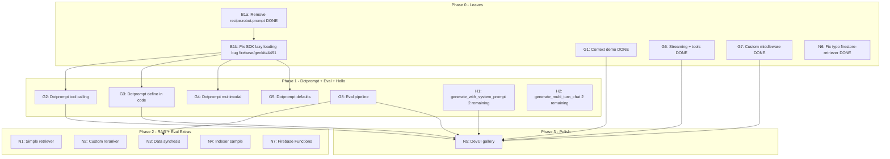

# Sample Parity Analysis: JS vs Python

> **Updated:** 2026-02-07
> **Scope:** Every JS code sample on genkit.dev docs -> Python `py/samples/` counterpart.
>
> **Exclusions (per team decision):**
> - **Chat/Session API** -- Deprecated, skip
> - **Agents / Multi-Agent** -- Not yet in Python SDK, skip
> - **MCP** -- Will come later, skip
> - **Durable Streaming** -- Not yet in Python SDK, skip
> - **Client SDK** -- JS client-side only, not applicable to Python backend SDK

---

## Summary

**JS Sample Locations:**
- `/samples/` - 9 polished demo samples (js-angular, js-chatbot, js-menu, etc.)
- `/js/testapps/` - 32 internal test/demo apps (advanced scenarios)

**Python Sample Location:**
- `/py/samples/` - 36 samples (including shared, sample-test)

| Metric | JS (`samples/` + `testapps/`) | Python (`py/samples/`) | Gap |
|--------|-------------------------------|------------------------|-----|
| Plugin hello demos | 8 | 14 | **Python superset** |
| Advanced feature demos | 15 | 10 | **-5** |
| RAG samples | 5 | 4 | -1 |
| Evaluation | 2 | 2 | Parity |
| Media generation | 1 | 3 | **Python superset** |
| Observability | 0 | 2 | **Python superset** |

---

## 1. genkit.dev Docs -> Python Sample Coverage

This is the authoritative mapping from every JS code feature demonstrated in
the genkit.dev documentation to its Python sample coverage. Only in-scope
features are listed (exclusions above apply).

### `/docs/models` -- Generating Content with AI Models

| Feature | JS Doc Example | Python Sample | Status |
|---------|---------------|---------------|--------|
| Basic generation | `ai.generate('prompt')` | All hello samples (`generate_greeting`) | Covered |
| Model reference | `googleAI.model('gemini-2.5-flash')` | All hello samples | Covered |
| Model string ID | `model: 'googleai/gemini-2.5-flash'` | All hello samples | Covered |
| System prompts | `system: "..."` | `provider-google-genai-hello` + most hello samples | Covered |
| Multi-turn (messages) | `messages: [{role, content}]` | `provider-google-genai-hello` + most hello samples | Covered |
| Model parameters | `config: {maxOutputTokens, temperature, ...}` | Most hello samples (`generate_with_config`) | Covered |
| Structured output | `output: { schema: ZodSchema }` | Most samples (`generate_character`) | Covered |
| Streaming text | `ai.generateStream()` | Most samples (`generate_streaming_story`) | Covered |
| Streaming + structured | `generateStream() + output schema` | `provider-google-genai-hello` | Covered |
| Multimodal input (image URL) | `prompt: [{media: {url}}, {text}]` | `provider-google-genai-hello`, `provider-anthropic-hello`, `provider-xai-hello`, etc. | Covered |
| Multimodal input (base64) | `data:image/jpeg;base64,...` | `provider-google-genai-hello` describe_image | Covered |
| Generating media (images) | `output: {format: 'media'}` (Imagen) | `provider-google-genai-media-models-demo` | Covered |
| Generating media (TTS) | Text-to-speech | `provider-google-genai-media-models-demo`, `provider-compat-oai-hello` | Covered |
| Middleware (retry) | `use: [retry({...})]` | `framework-middleware-demo` | Covered |
| Middleware (fallback) | `use: [fallback({...})]` | `framework-middleware-demo` | Covered |

> **SDK Status:** Python has `use=` middleware infrastructure in `generate()`.
> `framework-middleware-demo` demonstrates custom retry and logging middleware.

### `/docs/tool-calling` -- Tool Calling

| Feature | JS Doc Example | Python Sample | Status |
|---------|---------------|---------------|--------|
| Define tools | `ai.defineTool()` | All samples with tools | Covered |
| Use tools in generate | `tools: [getWeather]` | Most samples (`generate_weather`) | Covered |
| `maxTurns` | `maxTurns: 8` | 3 samples use `max_turns=2` | Covered |
| `returnToolRequests` | `returnToolRequests: true` | `provider-google-genai-context-caching` | Covered |
| Interrupts (tool-based) | `ctx.interrupt()` | `framework-tool-interrupts`, `provider-google-genai-hello` | Covered |
| Dynamic tools at runtime | Tool defined inline at generate() | `framework-dynamic-tools-demo` uses `ai.dynamic_tool()` | Covered |
| Streaming + tool calling | Stream with tools | All provider hello samples (`generate_streaming_with_tools`) | Covered |

> **SDK Status:** `ai.dynamic_tool()` exists. Streaming + tools is demonstrated
> in all 12 provider hello samples via `generate_streaming_with_tools` flow.

### `/docs/interrupts` -- Interrupts

| Feature | JS Doc Example | Python Sample | Status |
|---------|---------------|---------------|--------|
| Tool-based interrupt | `@ai.tool(interrupt=True)` + `ctx.interrupt()` | `framework-tool-interrupts`, `provider-google-genai-hello` | Covered |
| Check response.interrupts | Loop checking for interrupts | `framework-tool-interrupts` | Covered |
| Resume with respond | `resume: { respond: [...] }` | `framework-tool-interrupts`, `provider-google-genai-hello` | Covered |
| `defineInterrupt()` | Standalone interrupt API | Not in Python SDK | N/A (SDK gap) |
| Restartable interrupts | `restart` option | Not in Python SDK | N/A (SDK gap) |

> **SDK Status:** Python only supports tool-based interrupts via
> `@ai.tool(interrupt=True)`. No standalone `define_interrupt()` API exists.
> This is a SDK feature gap, not a sample gap.

### `/docs/context` -- Context

| Feature | JS Doc Example | Python Sample | Status |
|---------|---------------|---------------|--------|
| Context in generate() | `context: { auth: {...} }` | `framework-context-demo` (`context_in_generate`) | Covered |
| Context in flow | `{context}` destructured | `framework-context-demo` (`context_in_flow`) | Covered |
| Context in tool | `{context}` in tool handler | `framework-context-demo` | Covered |
| Context propagation | Auto-propagation to sub-actions | `framework-context-demo` (`context_propagation_chain`) | Covered |
| `ai.current_context()` | Access current context | `framework-context-demo` (`context_current_context`) | Covered |

> **SDK Status:** Full context support exists: `context=` on `generate()` and
> flows, `ActionRunContext`, `ai.current_context()`, and auto-propagation.
> `framework-context-demo` provides comprehensive coverage with 4 dedicated flows.

### `/docs/dotprompt` -- Managing Prompts with Dotprompt

| Feature | JS Doc Example | Python Sample | Status |
|---------|---------------|---------------|--------|
| .prompt files | YAML frontmatter + template | `framework-prompt-demo` | Covered (bug: see below) |
| Running prompts from code | `ai.prompt('name')` | `framework-prompt-demo` | Covered (bug: see below) |
| Streaming prompts | `prompt.stream()` | `framework-prompt-demo` | Covered (bug: see below) |
| Input/Output schemas (Picoschema) | `schema:` in frontmatter | `framework-prompt-demo` | Covered (bug: see below) |
| Schema references | `ai.defineSchema()` + name ref | `framework-prompt-demo` | Covered (bug: see below) |
| Model configuration | `config:` in frontmatter | `framework-prompt-demo` | Covered (bug: see below) |
| Handlebars templates | `{{variable}}`, `{{#if}}` | `framework-prompt-demo` | Covered (bug: see below) |
| Multi-message prompts | `{{role "system"}}` | `framework-prompt-demo` (in partial) | Covered (bug: see below) |
| Partials | `{{>partialName}}` | `framework-prompt-demo` (`_style.prompt`) | Covered (bug: see below) |
| Custom helpers | `ai.defineHelper()` | `framework-prompt-demo` (`list` helper) | Covered (bug: see below) |
| Prompt variants | `.variant.prompt` files | Blocked by SDK bug | **BUG** |
| **Tool calling in prompts** | `tools: [...]` in frontmatter | Not in framework-prompt-demo | **GAP** |
| **Multimodal prompts** | `{{media url=photoUrl}}` | Not in framework-prompt-demo | **GAP** |
| **Defining prompts in code** | `ai.definePrompt()` | Not in framework-prompt-demo | **GAP** |
| **Default input values** | `default:` in frontmatter | Not in framework-prompt-demo | **GAP** |

> **SDK Bug (B1b):** `framework-prompt-demo` had a P0 bug: `Failed to load lazy
> action recipe.robot: maximum recursion depth exceeded`. Root cause is a
> **self-referential lazy loading loop** in the SDK's `create_prompt_from_file()`
> at `py/packages/genkit/src/genkit/blocks/prompt.py` -- when loading a variant
> prompt, `resolve_action_by_key()` is called with the action's own key before
> `_cached_prompt` is set, which triggers `_trigger_lazy_loading()` to re-invoke
> `create_prompt_from_file()` for the same action, causing infinite recursion.
> This is NOT a dotprompt library bug. Only Python is affected (JS uses a
> `lazy()` wrapper guaranteeing single evaluation).
>
> **Workaround (B1a):** `recipe.robot.prompt` was removed to unblock the sample.
> **Fix:** Tracked at [firebase/genkit#4491](https://github.com/firebase/genkit/issues/4491).
> Once fixed, variant demo should be re-added.

### `/docs/flows` -- Flows

| Feature | JS Doc Example | Python Sample | Status |
|---------|---------------|---------------|--------|
| Define flows | `@ai.flow()` decorator | All samples | Covered |
| Input/output schemas | Pydantic models | All samples | Covered |
| Streaming flows | `ctx.send_chunk()` | Several samples | Covered |
| Deploy with Flask | Flask integration | `web-flask-hello` | Covered |
| Flow steps (`ai.run()`) | Named trace spans | `provider-google-genai-hello` (line 434), `framework-realtime-tracing-demo` | Covered |

> All flow features documented on genkit.dev are covered.

### `/docs/rag` -- Retrieval-Augmented Generation

| Feature | JS Doc Example | Python Sample | Status |
|---------|---------------|---------------|--------|
| Basic RAG flow | Retriever + generate | `framework-restaurant-demo` (case_04/05), `provider-firestore-retriever` | Covered |
| Embedders | `ai.embed()` | `provider-google-genai-hello`, `provider-ollama-hello` | Covered |
| Custom retriever | `ai.defineRetriever()` | `provider-firestore-retriever` | Covered |
| Simple retriever | `ai.defineSimpleRetriever()` | No equivalent | **GAP** (minor) |
| Vector search (Firestore) | Firestore vector store | `provider-vertex-ai-vector-search-firestore` | Covered |
| Vector search (BigQuery) | BigQuery vector store | `provider-vertex-ai-vector-search-bigquery` | Covered |
| Reranker | `ai.rerank()` | `provider-vertex-ai-rerank-eval` | Covered |
| Custom reranker | `ai.defineReranker()` | No sample | **GAP** (minor) |
| **Indexer** | `ai.index()` + flow | **No indexer sample** | **GAP** |

> **SDK Status:** Python SDK does not have a built-in local dev vector store
> plugin (like JS `@genkit-ai/dev-local-vectorstore`). Indexing is done via
> external SDKs (Firestore, etc.). The RAG Python tab on genkit.dev shows
> Firestore-based retrieval only.

### `/docs/evaluation` -- Evaluation

| Feature | JS Doc Example | Python Sample | Status |
|---------|---------------|---------------|--------|
| Custom evaluator | `ai.defineEvaluator()` | `framework-evaluator-demo` | Covered |
| Built-in metrics | `GenkitMetric.MALICIOUSNESS` | `provider-vertex-ai-rerank-eval` (BLEU, ROUGE, etc.) | Covered |
| **Full eval pipeline** | Dataset -> inference -> metrics -> results | **No end-to-end pipeline sample** | **GAP** |
| **Data synthesis** | Generate test questions from docs | **No sample** | **GAP** |

> The JS `evals` testapp demonstrates dataset creation, flow evaluation, and
> result analysis as a complete pipeline. Python needs an equivalent.

---

## 2. Plugin Hello World Demos

| Plugin | JS | Python | Notes |
|--------|-----|--------|-------|
| Google GenAI | Yes | `provider-google-genai-hello` | Parity |
| Vertex AI | Yes (in basic-gemini) | `provider-google-genai-vertexai-hello` | Parity |
| Anthropic | Yes | `provider-anthropic-hello` | Parity |
| Ollama | Yes | `provider-ollama-hello` | Parity |
| OpenAI Compat | Yes | `provider-compat-oai-hello` | Parity |
| xAI (Grok) | No | `provider-xai-hello` | Python extra |
| DeepSeek | No | `provider-deepseek-hello` | Python extra |
| Model Garden | Yes | `provider-vertex-ai-model-garden` | Parity |
| Mistral | No | `provider-mistral-hello` | Python extra |
| HuggingFace | No | `provider-huggingface-hello` | Python extra |
| Amazon Bedrock | No | `provider-amazon-bedrock-hello` | Python extra |
| Cloudflare Workers AI | No | `provider-cloudflare-workers-ai-hello` | Python extra |
| Microsoft Foundry | No | `provider-microsoft-foundry-hello` | Python extra |

---

## 3. Incomplete Hello Samples

Several hello samples are missing `generate_with_system_prompt` and/or
`generate_multi_turn_chat` flows that other hello samples already have.

### `generate_with_system_prompt` flow

- [x] `provider-microsoft-foundry-hello` -- DONE
- [x] `provider-mistral-hello` -- DONE
- [x] `provider-huggingface-hello` -- DONE
- [x] `provider-google-genai-vertexai-hello` -- DONE
- [ ] `web-short-n-long` (still uses old name `system_prompt`)
- [ ] `provider-vertex-ai-model-garden` (still uses old name `system_prompt`)

### `generate_multi_turn_chat` flow

- [x] `provider-microsoft-foundry-hello` -- DONE
- [x] `provider-google-genai-vertexai-hello` -- DONE
- [ ] `web-short-n-long` (still uses old name `multi_turn_chat`)
- [ ] `provider-vertex-ai-model-garden` (still uses old name `multi_turn_chat`)

---

## 4. Items Already Covered (verified)

These were previously flagged as gaps but are now confirmed covered:

| Feature | Sample | Notes |
|---------|--------|-------|
| Streaming + structured output | `provider-google-genai-hello` | Has streaming structured output flow |
| Media generation (images) | `provider-google-genai-media-models-demo` | Imagen, Gemini Image, image editing |
| Media generation (TTS) | `provider-google-genai-media-models-demo`, `provider-compat-oai-hello` | Google TTS, OpenAI TTS |
| Reranker | `provider-vertex-ai-rerank-eval` | Vertex AI semantic reranker + eval metrics |
| Dynamic tools | `framework-dynamic-tools-demo` | Standalone sample with `ai.dynamic_tool()` |
| Flow steps (`ai.run()`) | `provider-google-genai-hello`, `framework-realtime-tracing-demo` | Named trace spans |
| Multimodal input | Multiple hello samples | Image, video, audio input |
| Tool interrupts | `framework-tool-interrupts`, `provider-google-genai-hello` | Full interrupt + resume flow |
| Context propagation | `framework-context-demo` | 4 flows covering generate, flow, tool, and current_context |
| Custom middleware | `framework-middleware-demo` | Retry, logging, and chained middleware |
| Streaming + tool calling | All provider hello samples | `generate_streaming_with_tools` flow in all 12 |

---

## 5. Items Out of Scope (not in Python SDK)

| Feature | Doc Page | Reason |
|---------|----------|--------|
| Chat/Session API | `chat.mdx` | Deprecated |
| Agents / Multi-Agent | `agentic-patterns.mdx`, `multi-agent.mdx` | Not yet in Python SDK |
| MCP | `mcp-server.mdx`, `model-context-protocol.mdx` | Will come later |
| Durable Streaming | `durable-streaming.mdx` | Not in Python SDK |
| `defineInterrupt()` | `interrupts.mdx` | Only tool-based interrupts in Python |
| Client SDK | `client.mdx` | JS client-side only |

---

## 6. Execution Roadmap

### Dependency Graph



### Edge List

`A -> B` means "A must complete before B can start":

- `B1a -> B1b` (removing the bad variant file makes the sample usable; SDK fix restores variant support)
- `B1b -> G2` (SDK fix unblocks dotprompt tool calling)
- `B1b -> G3` (SDK fix unblocks dotprompt define-in-code)
- `B1b -> G4` (SDK fix unblocks dotprompt multimodal)
- `B1b -> G5` (SDK fix unblocks dotprompt defaults)
- `G8 -> N3` (eval pipeline design informs data synthesis)
- `{G1, G2, G3, G6, G7, G8, H1} -> N5` (DevUI gallery showcases all features)

**Critical path:** `B1a -> B1b -> G2/G3/G4/G5 -> N5`

---

### Phase 0: Leaves (no dependencies, all parallel) -- MOSTLY DONE

All tasks in this phase are independent (except B1a -> B1b which are sequential).

| Task | Description | Status | Notes |
|------|-------------|--------|-------|
| **B1a** | Remove `recipe.robot.prompt` from framework-prompt-demo to unblock the sample. | **DONE** | Variant file and code removed |
| **B1b** | Fix the SDK lazy loading bug in `create_prompt_from_file()` that causes infinite recursion when loading `.variant.prompt` files. Root cause: self-referential loop where `resolve_action_by_key()` is called with own key before `_cached_prompt` is set. Once fixed, re-add variant demo. | **BLOCKED** | Tracked at [firebase/genkit#4491](https://github.com/firebase/genkit/issues/4491). Only Python affected. |
| **G1** | Context demo -- `framework-context-demo` with flows for `context=` in generate, context in flows, context in tools, auto-propagation, `ai.current_context()`. | **DONE** | 4 flows: `context_in_generate`, `context_in_flow`, `context_current_context`, `context_propagation_chain` |
| **G6** | Streaming + tool calling -- `generate_streaming_with_tools` flow added to all 12 provider hello samples. | **DONE** | Uses shared `generate_streaming_with_tools_logic` |
| **G7** | Custom middleware demo -- `framework-middleware-demo` with retry, logging, and chained middleware. | **DONE** | 3 flows: `logging_demo`, `request_modifier_demo`, `chained_middleware_demo` |
| **N6** | Rename `firestore-retreiver` to `firestore-retriever` (typo fix). Now `provider-firestore-retriever`. | **DONE** | Directory renamed |

---

### Phase 1: Dotprompt Completion + Eval + Hello Consistency

G2-G5 are all unblocked by B1b. G8, H1, H2 are independent leaves placed here
for workload balancing.

| Task | Description | Depends On | Status |
|------|-------------|------------|--------|
| **G2** | Dotprompt: tool calling in prompts -- add a `.prompt` file with `tools: [search, calculate]` in frontmatter, plus a flow that loads and runs it. | B1b | Pending |
| **G3** | Dotprompt: define prompts in code -- add `ai.define_prompt()` usage (no `.prompt` file, purely programmatic). | B1b | Pending |
| **G4** | Dotprompt: multimodal prompts -- add a `.prompt` file using `{{media url=photoUrl}}` helper with image input schema. | B1b | Pending |
| **G5** | Dotprompt: default input values -- add `default:` section to an existing or new `.prompt` file. | B1b | Pending |
| **G8** | Eval pipeline sample -- end-to-end evaluation: define a custom evaluator, prepare a dataset, run inference-based eval, report results. | -- | Pending |
| **H1** | Add `generate_with_system_prompt` flow to 2 remaining samples: `web-short-n-long`, `provider-vertex-ai-model-garden`. | -- | 4/6 Done |
| **H2** | Add `generate_multi_turn_chat` flow to 2 remaining samples: `web-short-n-long`, `provider-vertex-ai-model-garden`. | -- | 4/6 Done |

**Parallelizable:** G2-G5 are independent of each other (all just need B1b).
G8, H1, H2 are independent of everything.

---

### Phase 2: RAG and Eval Extras

Lower-priority items that round out coverage for `rag.mdx` and `evaluation.mdx`.
N3 depends on G8. All others are independent leaves.

| Task | Description | Depends On | Status |
|------|-------------|------------|--------|
| **N1** | Simple retriever -- `ai.define_simple_retriever()` equivalent if SDK supports it, or a minimal custom retriever pattern. | -- | Pending |
| **N2** | Custom reranker -- `ai.define_reranker()` with custom scoring logic. | -- | Pending |
| **N3** | Data synthesis -- generate test questions from documents using an LLM. | G8 | Pending |
| **N4** | Indexer sample -- document ingestion pipeline: chunk PDFs, generate embeddings, store in vector DB. | -- | Pending |
| **N7** | Firebase Functions sample -- Python Cloud Functions deployment with Genkit. | -- | Pending |

---

### Phase 3: Polish

DevUI gallery depends on most features being in place so it can showcase them all.

| Task | Description | Depends On | Status |
|------|-------------|------------|--------|
| **N5** | DevUI gallery -- a single sample that showcases all DevUI features: prompts, flows, tools, evaluators, structured output, streaming, context, middleware. | G1, G2, G3, G6, G7, G8, H1 | Pending |

---

### Execution Timeline

```
TIME -->
==========================================================================

P0:  [B1a: remove recipe.robot.prompt] DONE
     [B1b: fix SDK lazy loading bug] BLOCKED (firebase/genkit#4491)
     [G1: context demo] DONE
     [G6: streaming+tools] DONE
     [G7: custom middleware] DONE
     [N6: typo fix] DONE
     (5 of 6 P0 tasks complete; B1b awaits SDK fix)
                |
     --- P0 partially complete (B1b on critical path) ---
                |
SDK: [S1: fix plugin structlog blowaway ~~~~] (HIGH - 5 plugins)
     [S2: fix awarn protocol gap ~~~~~~~~~~~] (LOW)
     [S3: fix ToolRunContext sole param ~~~~] (MEDIUM - #4492)
     [S4: fix lazy loading recursion ~~~~~~~] (MEDIUM - #4491, same as B1b)
     (all independent, each a separate PR)
                |
P1:  [G2: dotprompt tools ~~]  [G8: eval pipeline ~~~~~~]
     [G3: dotprompt code ~~~]  [H1: system_prompt x2 ~~~]
     [G4: dotprompt media ~~]  [H2: multi_turn x2 ~~~~~~]
     [G5: dotprompt defaults]
     (G2-G5 blocked by B1b/S4; G8/H1/H2 ready now)
                |
     --- all P1 complete ---
                |
P2:  [N1: simple retriever ~~~]  [N4: indexer ~~~~~~~~]
     [N2: custom reranker ~~~~]  [N7: firebase funcs ~]
     [N3: data synthesis ~~~~~~~~~~]
     (N1/N2/N4/N7 parallel, N3 after G8)
                |
     --- all P2 complete ---
                |
P3:  [N5: DevUI gallery ~~~~~~~~~~~~~~]
                |
     === SAMPLE PARITY COMPLETE ===
```

---

### Progress Summary

| Phase | Tasks | Done | Remaining | Blockers |
|-------|-------|------|-----------|----------|
| **P0** | B1a, B1b, G1, G6, G7, N6 | 5/6 | B1b | firebase/genkit#4491 |
| **P1** | G2, G3, G4, G5, G8, H1, H2 | 0/7 (H1 4/6, H2 4/6) | All | G2-G5 blocked by B1b |
| **P2** | N1, N2, N3, N4, N7 | 0/5 | All | N3 blocked by G8 |
| **P3** | N5 | 0/1 | All | Broad P0-P2 deps |
| **SDK** | S1, S2, S3, S4 | 0/4 | All | Separate PRs needed |
| **Total** | 23 tasks | ~5.5 | ~17.5 | 1 SDK bug + 4 SDK fixes |

---

## 7. Pending SDK / Infrastructure Fixes (Separate PRs)

Issues discovered during the sample consolidation and logging refactoring.
These should NOT be fixed in the samples PR -- each needs its own PR touching
core SDK or plugin code.

### SDK Bugs

| ID | Severity | Description | Affected Code | Notes |
|----|----------|-------------|---------------|-------|
| ~~**S1**~~ | ~~**HIGH**~~ | ~~**Observability plugins blow away structlog config.** Five plugins call `structlog.configure(processors=new_processors)` with *only* the `processors` kwarg. Since `structlog.configure()` is a full-replace (not partial-update), this resets `wrapper_class`, `logger_factory`, `cache_logger_on_first_use` back to defaults -- silently destroying any custom structlog setup (e.g. the `setup_sample()` stdlib integration). **Fix:** Use `structlog.configure(**{**structlog.get_config(), 'processors': new_processors})` to preserve the full config.~~ | ~~All 5 plugins~~ | ✅ Done — all 5 plugins fixed |
| **S2** | LOW | **`awarn` gap in `Logger` protocol.** `genkit.core.logging.Logger` declares `awarn()` but `structlog.stdlib.BoundLogger` only has `awarning` (no `awarn` alias). Calling `logger.awarn(...)` would raise `AttributeError`. Previously masked because `make_filtering_bound_logger` dynamically creates all method names. **Fix:** Either remove `awarn`/`warn` from the protocol, or add runtime aliases. | `py/packages/genkit/src/genkit/core/logging.py` | Only matters if `awarn` is actually called somewhere |
| **S3** | MEDIUM | **`ToolRunContext` as sole parameter crashes with `PydanticSchemaGenerationError`.** When a `@ai.tool()` has `ToolRunContext` as its only parameter, the SDK tries to create a `TypeAdapter` for it (which fails) and would also dispatch the tool input instead of the context at runtime. **Workaround:** Use `Genkit.current_context()` with zero-arg tools. | `py/packages/genkit/src/genkit/core/action/_action.py` (lines 493-494, 592-598), `py/packages/genkit/src/genkit/ai/_registry.py` (lines 555-565) | Tracked at [firebase/genkit#4492](https://github.com/firebase/genkit/issues/4492) |
| **S4** | MEDIUM | **SDK lazy loading infinite recursion for `.variant.prompt` files.** `create_prompt_from_file()` self-references via `resolve_action_by_key()` before caching, causing `RecursionError`. | `py/packages/genkit/src/genkit/blocks/prompt.py` | Tracked at [firebase/genkit#4491](https://github.com/firebase/genkit/issues/4491) |

### Sample Naming Convention

All samples follow a consistent prefix scheme:

| Prefix | Category | Examples |
|--------|----------|----------|
| `provider-` | Model provider-specific | `provider-google-genai-hello`, `provider-anthropic-hello`, `provider-vertex-ai-model-garden` |
| `framework-` | Genkit framework features | `framework-context-demo`, `framework-middleware-demo`, `framework-prompt-demo` |
| `web-` | Web framework integration | `web-flask-hello`, `web-multi-server`, `web-short-n-long` |
| (none) | Other | `dev-local-vectorstore-hello` |
