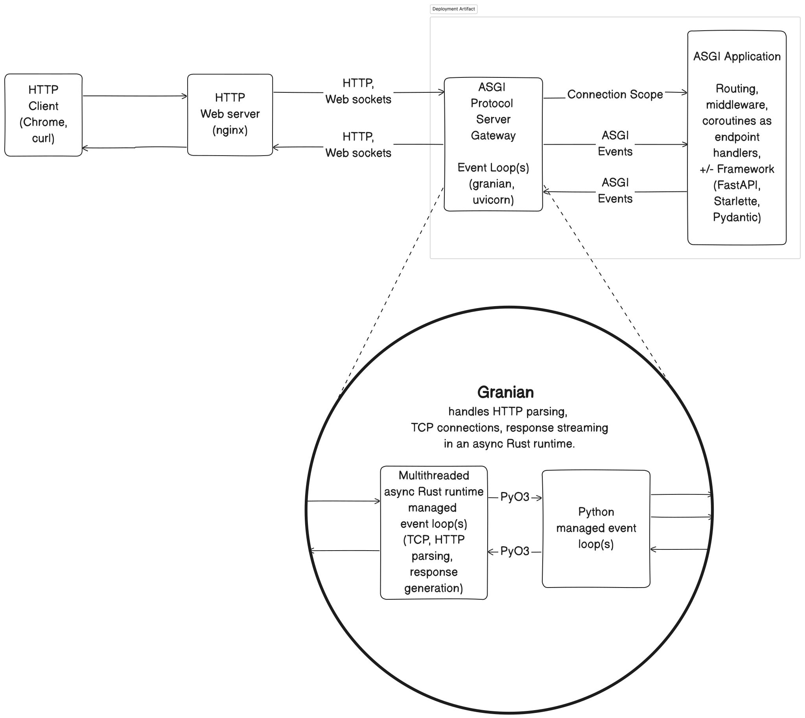

# Overview

The Genkit Python AI SDK exposes components as remotely callable
functions called **actions** or **flows** via a reflection API using the
Asynchronous Server Gateway Interface
([ASGI](https://asgi.readthedocs.io/en/latest/specs/main.html)) over HTTP.

An action is a typed JSON-based RPC-over-HTTP function that supports metadata,
streaming, reflection and discovery.  A flow is a user-defined action. An action
can depend on other actions.

!!! note "Caveat"

    While a Python ASGI application implements bidirectional streaming,
    the Genkit SDK defines only unidirectional streaming
    callables for its actions.

## Dealing with Concurrency

Concurrency refers to the ability of our programs to deal with multiple,
potentially different, tasks all at once. This might mean interleaving tasks or
even running them in parallel. Parallelism requires multiple resources for
execution, whereas concurrent code isn't necessarily parallel and can apply even
to a single resource. There are several different ways of dealing with
concurrency among which are the following:

| Model                    | Description                                                                               |
|--------------------------|-------------------------------------------------------------------------------------------|
| Multiprocessing          | Running multiple independent processes in a single program                                |
| Multithreading           | Using multiple threads in a single process                                                |
| Asynchronous programming | Handling I/O operations without blocking the main program flow                            |
| Coroutines               | Lightweight resumable cooperatively-scheduled concurrent units of work                    |
| Goroutines (Go) and CSP  | Lightweight, managed concurrent execution units that use messaging over concurrent queues |
| Actors                   | Independent units of computation that communicate via mailboxes                           |

The Genkit Python SDK makes use of coroutines, event loops, and asynchronous I/O
to manage concurrency. For synchronous situations, it makes use of [thread pool
executors](https://docs.python.org/3/library/concurrent.futures.html#threadpoolexecutor).

!!! info "Runnables, callables, and coroutines"

    A **runnable** or **callable** is a unit of executable work&mdash;for example,
    threads, processes, green threads, goroutines, and coroutines are runnables.

    **Asynchronous** runnables can wait for multiple steps to complete out of order
    as opposed to **synchronous** runnables that require a specific order and cannot
    proceed to execute subsequent steps without having completed waiting for any
    previous blocking steps.  The Python standard library offers an
    [asyncio](https://docs.python.org/3/library/asyncio.html) module that works with
    cooperatively-scheduled multitasking coroutines to manage I/O asynchronously.

    A **coroutine** is a resumable runnable that can pause its execution and then at
    a later point in time resume from where it left off.  Coroutines are:

    * **Non-blocking** because they do not block the thread of execution when paused
      and yield control to the event loop to switch execution to another.

    * **Stateful** because they store their state when paused and resume from where
      they left off and therefore do not require restarting.

    * **Cooperative** because they require the programmer to suspend cooperatively
      at well-defined suspend points unlike threads that may be pre-emptively
      scheduled.

    * **Cancelable** because Python supports terminating their execution by
      bubbling up exceptions.

## Handling Web Requests: WSGI vs ASGI

WSGI and ASGI are both standards for Python Web applications, but they differ
significantly in how they handle requests and their overall capabilities.

### WSGI (Web Server Gateway Interface)

[WSGI](https://wsgi.readthedocs.io/en/latest/what.html), in essence, is embodied
by:

!!! quote inline end

    "Call into this function with an HTTP request, and wait until an HTTP response
    is returned."

```python
def app(env, start_response):
    start_response('200 OK', [('Content-Type','text/plain')])
    return [b"Hello World"]


```

WSGI is the yesteryear standard interface for Python Web applications. It is:

* **Synchronous:** Processes one request at a time. Each request must be fully
  completed before the server can move on to the next one.

* **Blocking:**  When a request is being processed, it "blocks" the server from
  doing anything else until it's finished.

* **Limited to HTTP:** WSGI only supports the HTTP protocol.

### ASGI (Asynchronous Server Gateway Interface)

ASGI, in essence, is embodied by:

!!! quote inline end

    "Here’s some information about the connection and the protocol, and a pair of
    channels between which the  server and application can communicate via event
    streams."

```python
async def app(scope, receive, send):
    await logger.adebug('Debugging', scope=pformat(value))

    await send({
        'type': 'http.response.start',
        'status_code': 200,
        'headers': [],
    })

    # ...

    buffer = bytearray()
    more = True
    while more:
          msg = await receive()
          buffer.extend(await msg['body'])
          more = msg.get('more_body', False)

    await send({
        'type': 'http.response.body',
        'body': buffer,
    })

    # ...
```

[ASGI](https://asgi.readthedocs.io/en/latest/) (Asynchronous Server Gateway
Interface) is a spiritual successor to WSGI, intended to provide a standard
interface between async-capable Python Web servers, frameworks, and
applications. ASGI decomposes protocols into a series of *events* that an
application must *receive* and react to, and *events* the application might
*send* in response.

#### Applications and Deployment

An ASGI application is:

* **Asynchronous:** Can handle concurrent requests without waiting for each one
  to finish and in no particular order.

* **Non-blocking:** Allows the server to work on other tasks while waiting for a
  request to complete (e.g., waiting for data from a database).

* **Supports HTTP and WebSockets:** ASGI supports both HTTP for traditional Web
  requests and WebSockets for real-time, two-way communication.

* **Protocol-independent application** The ASGI protocol server handles the
  nitty-gritties of managing connections, parsing input and rendering output in
  the correct protocol format.  It communicates with the ASGI application in the
  form of event streams.

An ASGI deployment artifact has 2 components:

* **Protocol server**, which terminates sockets and translates them into
  connections and per-connection event messages. Examples of protocol servers
  are [Granian](https://github.com/emmett-framework/granian) and
  [Uvicorn](https://www.uvicorn.org/).

* **Application**, which lives inside a protocol server, is called once per
  connection, and handles event messages as they happen, emitting its own event
  messages back when necessary.



While one can write applications using the low-level primitives provided by
the ASGI specification, libraries such as
[FastAPI](https://fastapi.tiangolo.com/),
[Starlette](https://www.starlette.io/), and [Litestar](https://litestar.dev/)
provide more convenient interfaces for application development.

### Key Differences Summarized

| Feature               | WSGI                                             | ASGI                                                                       |
|-----------------------|--------------------------------------------------|----------------------------------------------------------------------------|
| **Programming Model** | Synchronous, Blocking                            | Asynchronous, Non-blocking                                                 |
| **Concurrency**       | Limited                                          | Excellent                                                                  |
| **Protocol Support**  | HTTP Only                                        | HTTP, WebSocket, HTTP/2                                                    |
| **Use Cases**         | Traditional Web applications (blogs, e-commerce) | Real-time applications (chat, online games), high-concurrency applications |

#### When to Choose WSGI

* For simpler Web applications that primarily serve content and don't require real-time features.

* When using frameworks like Flask or Django (although Django now has ASGI support).

#### When to Choose ASGI

* For applications that need real-time, bidirectional communication (e.g., chat applications, online games).

* When dealing with high traffic and concurrency.

* When using modern asynchronous frameworks like Starlette or FastAPI.

In essence, ASGI is the more modern and versatile standard, offering improved
performance and capabilities for demanding Web applications. However, WSGI
remains relevant for simpler projects where its limitations aren't a significant
concern.
