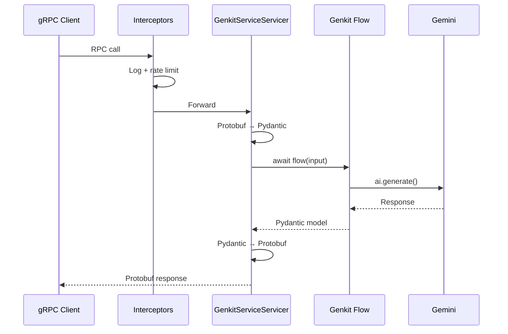

# gRPC Endpoints

The gRPC service is defined in `protos/genkit_sample.proto` under package
`genkit.sample.v1`. Every RPC delegates to the same Genkit flow used by
REST, so traces are identical regardless of protocol.

## Service definition

| RPC | Type | Request | Response | Genkit Flow |
|-----|------|---------|----------|-------------|
| `Health` | Unary | `HealthRequest{}` | `HealthResponse{status}` | *(direct)* |
| `TellJoke` | Unary | `JokeRequest{name, username}` | `JokeResponse{joke, username}` | `tell_joke` |
| `TranslateText` | Unary | `TranslateRequest{text, target_language}` | `TranslationResponse{...}` | `translate_text` |
| `DescribeImage` | Unary | `ImageRequest{image_url}` | `ImageResponse{description, image_url}` | `describe_image` |
| `GenerateCharacter` | Unary | `CharacterRequest{name}` | `RpgCharacter{name, back_story, ...}` | `generate_character` |
| `PirateChat` | Unary | `ChatRequest{question}` | `ChatResponse{answer, persona}` | `pirate_chat` |
| `TellStory` | **Server streaming** | `StoryRequest{topic}` | `stream StoryChunk{text}` | `tell_story` |
| `GenerateCode` | Unary | `CodeRequest{description, language}` | `CodeResponse{code, ...}` | `generate_code` |
| `ReviewCode` | Unary | `CodeReviewRequest{code, language}` | `CodeReviewResponse{review}` | `review_code` |

## Reflection

gRPC **reflection** is enabled, so `grpcui` and `grpcurl` can discover
all methods without needing the `.proto` file.

## Request flow



## Interceptors

The gRPC server applies interceptors in this order:

1. **GrpcLoggingInterceptor** — logs every RPC call with method, duration,
   and status via structlog
2. **GrpcRateLimitInterceptor** — token-bucket rate limiting (same algorithm
   as REST)
3. **Max message size** — `grpc.max_receive_message_length` set to 1 MB

## Testing

### Interactive web UI

```bash
just grpcui
# Or directly:
grpcui -plaintext localhost:50051
```

### CLI with grpcurl

```bash
# List services
grpcurl -plaintext localhost:50051 list

# Describe the service
grpcurl -plaintext localhost:50051 describe genkit.sample.v1.GenkitService

# Call a unary RPC
grpcurl -plaintext -d '{"name": "Waffles"}' \
  localhost:50051 genkit.sample.v1.GenkitService/TellJoke

# Server-streaming RPC
grpcurl -plaintext -d '{"topic": "a robot learning to paint"}' \
  localhost:50051 genkit.sample.v1.GenkitService/TellStory
```

### Automated tests

```bash
./test_grpc_endpoints.sh
# Or: just test-grpc-endpoints
```

## Regenerating stubs

If you modify `protos/genkit_sample.proto`:

```bash
just proto
# Or: ./scripts/generate_proto.sh
```

This generates Python stubs into `src/generated/`.
