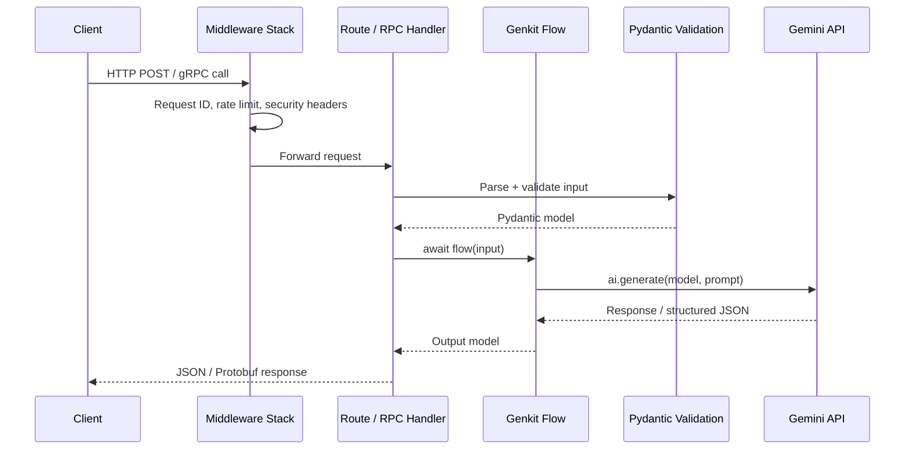
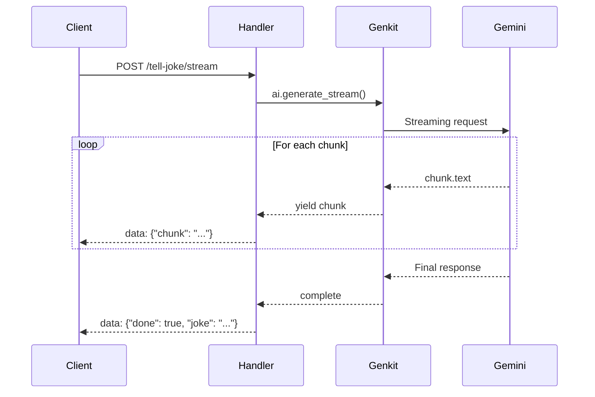
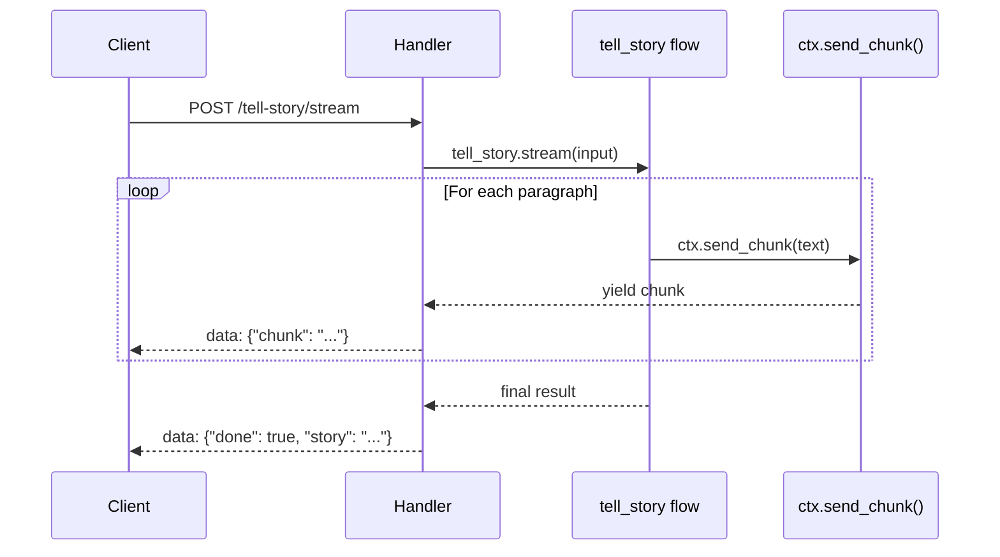
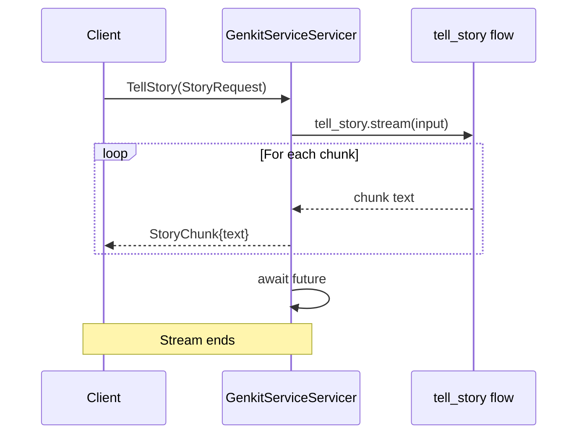
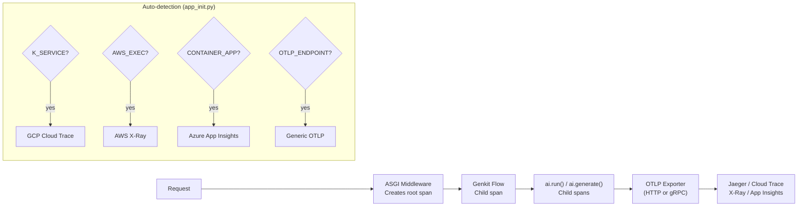
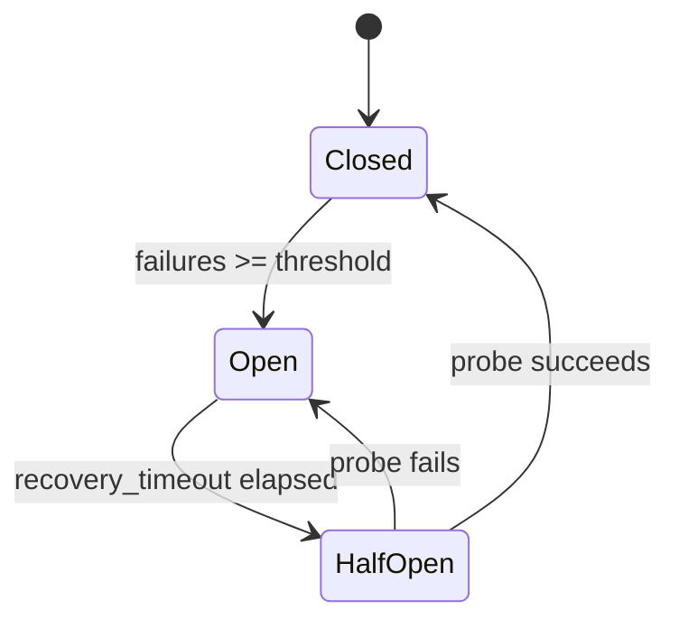

# Dataflow

## Request lifecycle

Every request — whether REST or gRPC — follows the same path through
the Genkit runtime.



### ASCII variant

```
  Client                 Server                         External
  ──────                 ──────                         ────────

  HTTP POST              ┌───────────────┐
  /tell-joke ──────────▶ │  FastAPI /     │
  Content-Type:          │  Litestar /    │
  application/json       │  Quart         │
                         │  (route handler)│
                         └───────┬────────┘
                                 │
  grpcurl TellJoke       ┌───────┴────────┐
  -plaintext ──────────▶ │  gRPC servicer │
  localhost:50051        │  (grpc_server) │
                         └───────┬────────┘
                                 │
                                 ▼
                         ┌───────────────┐      ┌─────────────────┐
                         │  Genkit Flow  │─────▶│  Pydantic       │
                         │  (flows.py)   │      │  validate input │
                         └───────┬───────┘      └─────────────────┘
                                 │
                      ┌──────────┼──────────┐
                      ▼          ▼          ▼
               ┌──────────┐ ┌────────┐ ┌────────┐
               │ai.generate│ │ai.run()│ │@ai.tool│
               │  (model)  │ │(traced │ │get_    │
               │           │ │ step)  │ │current_│
               │           │ │        │ │time    │
               └─────┬─────┘ └────────┘ └────────┘
                     │
                     ▼
              ┌──────────────┐
              │  Gemini API  │
              │  (generate)  │
              └──────┬───────┘
                     │
                     ▼
              ┌──────────────┐      ┌──────────────────┐
              │  Structured  │─────▶│  Pydantic model  │
              │  JSON output │      │  (response_model) │
              └──────┬───────┘      └──────────────────┘
                     │
                     ▼
              ┌──────────────┐
              │  JSON / SSE  │ ←── REST response
              │  Protobuf    │ ←── gRPC response
              └──────────────┘
```

## Streaming dataflow

The sample supports two streaming patterns — handler-level streaming
with `ai.generate_stream()` and flow-level streaming with `flow.stream()`.

### REST SSE streaming



### Flow-level streaming (tell-story)



### gRPC server streaming



### ASCII variant

```
  REST streaming (/tell-joke/stream, /tell-story/stream):

    Client                   Handler                     Genkit
    ──────                   ───────                     ──────
    POST /tell-joke/stream
    ─────────────────────▶  ai.generate_stream()  ────▶  Gemini
                                                          │
                            ◀──── chunk.text ◀────────────┘
    ◀── data: {"chunk":...}                               │
                            ◀──── chunk.text ◀────────────┘
    ◀── data: {"chunk":...}                               │
    ...                     ...                           ...
                            ◀──── final response ◀────────┘
    ◀── data: {"done":true}


  gRPC server streaming (TellStory):

    Client                   Servicer                    Flow
    ──────                   ────────                    ────
    TellStory(StoryRequest)
    ─────────────────────▶  tell_story.stream()  ────▶  ctx.send_chunk()
                                                          │
                            ◀──── chunk ◀─────────────────┘
    ◀── StoryChunk{text}                                  │
                            ◀──── chunk ◀─────────────────┘
    ◀── StoryChunk{text}                                  │
    ...                     ...                           ...
    ◀── (stream ends)       await future
```

## Telemetry dataflow



### ASCII variant

```
  Request
    │
    ▼
  ┌──────────────────┐    ┌──────────────────────────────────────┐
  │  ASGI middleware  │    │  Telemetry auto-detection            │
  │  (OpenTelemetry)  │    │  (app_init.py at import time)        │
  │                   │    │                                      │
  │  Creates root     │    │  K_SERVICE?  ──▶ GCP Cloud Trace     │
  │  span for each    │    │  AWS_EXEC?   ──▶ AWS X-Ray           │
  │  HTTP request     │    │  CONTAINER?  ──▶ Azure App Insights  │
  └────────┬──────────┘    │  OTLP_EP?   ──▶ Generic OTLP        │
           │               │  (none)     ──▶ No export            │
           ▼               └──────────────────────────────────────┘
  ┌──────────────────┐
  │  Genkit flow     │──▶ child span: "tell_joke"
  │                   │──▶ child span: "sanitize-input" (ai.run)
  │                   │──▶ child span: "ai.generate" (model call)
  └────────┬──────────┘
           │
           ▼
  ┌──────────────────┐
  │  OTLP exporter   │──▶  Jaeger / Cloud Trace / X-Ray / etc.
  │  (HTTP or gRPC)  │
  └──────────────────┘
```

## Circuit breaker state machine



```
CLOSED ──[failures >= threshold]──► OPEN
  ▲                                   │
  │                              [recovery_timeout]
  │                                   │
  └───[probe succeeds]─── HALF_OPEN ◄─┘
```
