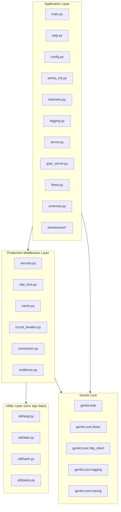

# Module Reference

## Directory structure

```
src/
├── __init__.py          — Package marker
├── __main__.py          — python -m src entry point
├── app_init.py          — Genkit singleton, plugin loading, platform telemetry
├── asgi.py              — ASGI app factory for gunicorn (multi-worker production)
├── cache.py             — TTL + LRU response cache for idempotent flows
├── circuit_breaker.py   — Circuit breaker for LLM API failure protection
├── config.py            — Settings (pydantic-settings), env files, CLI args
├── connection.py        — Connection pool / keep-alive tuning for outbound HTTP
├── flows.py             — @ai.flow() and @ai.tool() definitions
├── logging.py           — Structured logging (Rich + structlog, JSON mode)
├── main.py              — CLI entry point: parse args → create app → start servers
├── rate_limit.py        — Token-bucket rate limiting (ASGI + gRPC)
├── resilience.py        — Shared singletons for cache + circuit breaker
├── schemas.py           — Pydantic input/output models (shared by all adapters)
├── security.py          — Security headers, body size, request ID middleware
├── sentry_init.py       — Optional Sentry error tracking
├── server.py            — ASGI server helpers (granian / uvicorn / hypercorn)
├── telemetry.py         — OpenTelemetry OTLP setup + framework instrumentation
├── frameworks/
│   ├── __init__.py      — Framework adapter package
│   ├── fastapi_app.py   — FastAPI create_app(ai) factory + routes
│   ├── litestar_app.py  — Litestar create_app(ai) factory + routes
│   └── quart_app.py     — Quart create_app(ai) factory + routes
├── generated/           — Protobuf + gRPC stubs (auto-generated)
│   ├── genkit_sample_pb2.py
│   └── genkit_sample_pb2_grpc.py
├── grpc_server.py       — GenkitServiceServicer + serve_grpc()
└── util/
    ├── __init__.py      — Utility package marker
    ├── asgi.py          — Low-level ASGI response helpers
    ├── date.py          — Timezone-aware date formatting
    ├── hash.py          — Deterministic SHA-256 cache keys
    └── parse.py         — Rate string and comma-list parsing
```

## Layer diagram

The codebase is organized into four layers. Each layer depends only on
the layers below it.



### ASCII variant

```
┌──────────────────────────────────────────────────────────────────┐
│                      APPLICATION LAYER                           │
│                                                                  │
│   main.py ──────────┬──── config.py (Settings, CLI args)        │
│     │               │                                            │
│     ├── asgi.py     ├──── sentry_init.py                        │
│     │               ├──── telemetry.py                           │
│     ├── server.py   ├──── logging.py                             │
│     │               └──── grpc_server.py                         │
│     │                     │                                      │
│     └── flows.py ─────────┼── schemas.py (Pydantic models)      │
│                           │                                      │
└───────────────────────────┼──────────────────────────────────────┘
                            │
┌───────────────────────────┼──────────────────────────────────────┐
│            PRODUCTION MIDDLEWARE LAYER                            │
│                           │                                      │
│   security.py ────────────┤  RequestIdMiddleware                 │
│   rate_limit.py ──────────┤  RateLimitMiddleware (ASGI + gRPC)  │
│   cache.py ───────────────┤  FlowCache (TTL + LRU)              │
│   circuit_breaker.py ─────┤  CircuitBreaker                     │
│   connection.py ──────────┤  HTTP pool + keep-alive tuning      │
│   resilience.py ──────────┤  Global cache + breaker singletons  │
│                           │                                      │
└───────────────────────────┼──────────────────────────────────────┘
                            │
┌───────────────────────────┼──────────────────────────────────────┐
│               UTILITY LAYER (zero app deps)                      │
│                           │                                      │
│   util/asgi.py ───────────┤  send_json_error, get_client_ip     │
│   util/date.py ───────────┤  utc_now_str, format_utc            │
│   util/hash.py ───────────┤  make_cache_key                     │
│   util/parse.py ──────────┤  parse_rate, split_comma_list       │
│                           │                                      │
└──────────────────────────────────────────────────────────────────┘
                            │
┌───────────────────────────┼──────────────────────────────────────┐
│                  GENKIT CORE                                     │
│                                                                  │
│   genkit.web.manager ─────┤  ServerManager, adapters, ports     │
│   genkit.core.flows ──────┤  /__health, flow execution          │
│   genkit.core.http_client ┤  Per-loop httpx client pool         │
│   genkit.core.logging ────┤  structlog typed wrapper            │
│   genkit.core.tracing ────┤  OpenTelemetry spans                │
│                                                                  │
└──────────────────────────────────────────────────────────────────┘
```

## Module summary

### Application layer

| Module | Responsibility |
|--------|---------------|
| `main.py` | CLI entry point — parse args, create ASGI app, start REST + gRPC |
| `asgi.py` | App factory for gunicorn/external process managers |
| `config.py` | Pydantic settings with CLI arg overrides and env file loading |
| `flows.py` | All `@ai.flow()` and `@ai.tool()` definitions |
| `schemas.py` | Pydantic input/output models shared by REST and gRPC |
| `grpc_server.py` | gRPC servicer that delegates each RPC to a Genkit flow |
| `server.py` | ASGI server helpers for granian, uvicorn, and hypercorn |
| `app_init.py` | Genkit singleton creation and platform telemetry auto-detection |
| `logging.py` | Dev (Rich console) vs production (JSON) structured logging |
| `telemetry.py` | OpenTelemetry OTLP trace export and ASGI instrumentation |
| `sentry_init.py` | Optional Sentry SDK initialization with framework detection |

### Framework adapters

| Module | Framework | Factory |
|--------|-----------|---------|
| `frameworks/fastapi_app.py` | FastAPI | `create_app(ai) -> FastAPI` |
| `frameworks/litestar_app.py` | Litestar | `create_app(ai) -> Litestar` |
| `frameworks/quart_app.py` | Quart | `create_app(ai) -> Quart` |

All three adapters register identical routes. The only differences are
framework-specific request parsing and response serialization.

### Middleware layer

| Module | What it provides |
|--------|-----------------|
| `security.py` | Request-ID propagation, OWASP security headers, body size limits, CORS, trusted hosts |
| `rate_limit.py` | Token-bucket rate limiting for ASGI and gRPC |
| `cache.py` | In-memory TTL + LRU response cache for idempotent flows |
| `circuit_breaker.py` | Circuit breaker for LLM API call protection |
| `connection.py` | HTTP connection pool sizing and keep-alive tuning |
| `resilience.py` | Shared singleton instances for cache and circuit breaker |

### Utility layer

| Module | Functions |
|--------|-----------|
| `util/asgi.py` | `send_json_error()`, `get_client_ip()`, `get_header()` |
| `util/date.py` | `utc_now_str()`, `format_utc()` |
| `util/hash.py` | `make_cache_key()` — deterministic SHA-256 |
| `util/parse.py` | `parse_rate()`, `split_comma_list()` |
