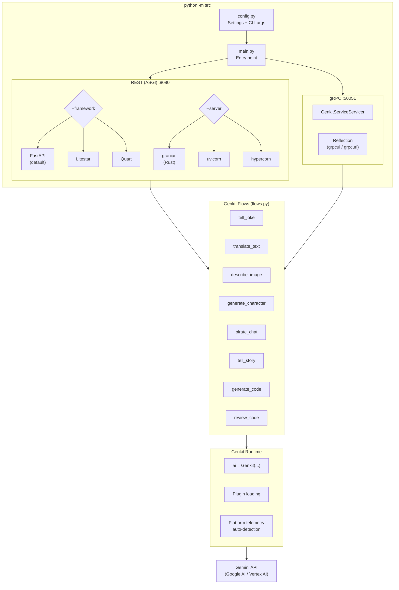

# Architecture Overview

## System overview

The sample runs two parallel servers — REST and gRPC — that both delegate
to the same Genkit flows. A shared middleware stack handles security, rate
limiting, and observability.



### ASCII variant

```
┌─────────────────────────────────────────────────────────────────────┐
│                        python -m src                                │
│                                                                     │
│  ┌─────────────┐   ┌───────────────────────────────────────────┐   │
│  │  CLI + Config│──▶│           main.py  (entry point)          │   │
│  │  config.py   │   │                                           │   │
│  └─────────────┘   │   _create_app()         _serve_both()     │   │
│                     │        │                   │    │          │   │
│                     └────────┼───────────────────┼────┼──────────┘   │
│                              ▼                   ▼    ▼              │
│  ┌──────────── REST (ASGI) ──────────┐  ┌──── gRPC ────────────┐   │
│  │                                   │  │                       │   │
│  │  --framework selects one:         │  │  grpc_server.py       │   │
│  │  ┌───────────┐ ┌──────────┐       │  │  GenkitServiceServicer│   │
│  │  │  FastAPI   │ │ Litestar │       │  │  grpc.aio.server()   │   │
│  │  │  (default) │ │          │       │  │                       │   │
│  │  └─────┬─────┘ └────┬─────┘       │  │  Reflection enabled  │   │
│  │        │    ┌────────┘             │  │  (grpcui / grpcurl)  │   │
│  │        │    │  ┌──────────┐        │  │                       │   │
│  │        │    │  │  Quart   │        │  └───────────┬───────────┘   │
│  │        │    │  └────┬─────┘        │              │               │
│  │        └────┴───────┘              │              │               │
│  │              │                     │              │               │
│  │  --server selects one:            │              │               │
│  │  granian (Rust) │ uvicorn │ hyper │              │               │
│  │  :8080                            │              │  :50051        │
│  └───────────────┬───────────────────┘              │               │
│                  │                                   │               │
│                  ▼                                   ▼               │
│  ┌──────────────────────────────────────────────────────────────┐   │
│  │                     Genkit flows  (flows.py)                  │   │
│  │                                                               │   │
│  │  tell_joke  translate_text  describe_image  generate_character│   │
│  │  pirate_chat  tell_story  generate_code  review_code          │   │
│  │                                                               │   │
│  │  Shared: @ai.flow() + @ai.tool() + Pydantic schemas          │   │
│  └──────────────────────────┬───────────────────────────────────┘   │
│                             │                                       │
│  ┌──────────────────────────┼───────────────────────────────────┐   │
│  │           Genkit runtime (ai = Genkit(...))                   │   │
│  │  app_init.py — singleton, plugin loading, telemetry detect   │   │
│  └──────────────────────────┬───────────────────────────────────┘   │
│                             │                                       │
└─────────────────────────────┼───────────────────────────────────────┘
                              │
                              ▼
               ┌──────────────────────────┐
               │      Gemini API          │
               │  (Google AI / Vertex AI) │
               └──────────────────────────┘
```

## Middleware stack

Every HTTP request passes through a layered middleware stack before
reaching a framework route handler. The gRPC server applies equivalent
interceptors.

```mermaid
graph LR
    REQ["Incoming<br/>Request"] --> RID["RequestIdMiddleware<br/>X-Request-ID"]
    RID --> SEC["SecurityHeadersMiddleware<br/>OWASP headers"]
    SEC --> BODY["MaxBodySizeMiddleware<br/>413 if too large"]
    BODY --> RL["RateLimitMiddleware<br/>429 if over limit"]
    RL --> CORS["CORSMiddleware<br/>Cross-origin policy"]
    CORS --> TRUST["TrustedHostMiddleware<br/>Host header check"]
    TRUST --> FW["Framework Route<br/>Handler"]
    FW --> FLOW["Genkit Flow"]
```



### gRPC interceptor chain

```
gRPC Request
    │
    ▼
┌──────────────────────────┐
│  GrpcLoggingInterceptor  │  Log method, duration, status
├──────────────────────────┤
│  GrpcRateLimitInterceptor│  Token bucket per peer IP
├──────────────────────────┤
│  Max message size (1 MB) │  grpc.max_receive_message_length
└──────────┬───────────────┘
           │
           ▼
    GenkitServiceServicer
    (delegates to Genkit flow)
```

## Key design decisions

| Decision | Choice | Rationale |
|----------|--------|-----------|
| Framework pattern | Factory function `create_app(ai)` | Swap frameworks without touching flows |
| Server pattern | `asyncio.gather(rest, grpc)` | Both servers share one event loop |
| Config precedence | CLI > env > dotenv > defaults | Standard 12-factor app layering |
| Middleware approach | Pure ASGI (no framework deps) | Works identically across FastAPI, Litestar, Quart |
| gRPC mapping | 1:1 with REST endpoints | Same Genkit flows serve both protocols |
| Telemetry | Auto-detect cloud platform | Zero-config for GCP, AWS, Azure |
