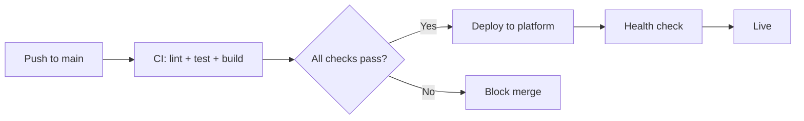

# CI/CD

The sample includes GitHub Actions workflows for continuous integration
and deployment to all supported cloud platforms.

## Workflows

### CI (`ci.yml`)

Runs on every push and pull request:

| Step | Tool | What it checks |
|------|------|----------------|
| Lint | `ruff check` | Code style, imports, security |
| Format | `ruff format --check` | Consistent formatting |
| Type check | `ty`, `pyright` | Static type safety |
| Unit tests | `pytest` | All tests pass |
| Build | `podman build` | Container builds successfully |

### Deploy workflows

Each platform has a dedicated deploy workflow that triggers on push
to `main` (or manual dispatch):

| Workflow | Platform | Trigger |
|----------|----------|---------|
| `deploy-cloudrun.yml` | Google Cloud Run | Push to `main` |
| `deploy-appengine.yml` | Google App Engine | Push to `main` |
| `deploy-firebase.yml` | Firebase Hosting | Push to `main` |
| `deploy-aws.yml` | AWS App Runner | Push to `main` |
| `deploy-azure.yml` | Azure Container Apps | Push to `main` |
| `deploy-flyio.yml` | Fly.io | Push to `main` |

## Required secrets

Configure these in your GitHub repository settings under
**Settings → Secrets and variables → Actions**:

### Google Cloud (Cloud Run, App Engine, Firebase)

| Secret | Description |
|--------|-------------|
| `GCP_PROJECT_ID` | Google Cloud project ID |
| `GCP_SA_KEY` | Service account JSON key (or use Workload Identity) |
| `GEMINI_API_KEY` | Google AI API key |

### AWS (App Runner)

| Secret | Description |
|--------|-------------|
| `AWS_ACCESS_KEY_ID` | IAM access key |
| `AWS_SECRET_ACCESS_KEY` | IAM secret key |
| `AWS_REGION` | Target region (e.g. `us-east-1`) |
| `GEMINI_API_KEY` | Google AI API key |

### Azure (Container Apps)

| Secret | Description |
|--------|-------------|
| `AZURE_CREDENTIALS` | Service principal JSON |
| `AZURE_RESOURCE_GROUP` | Resource group name |
| `GEMINI_API_KEY` | Google AI API key |

### Fly.io

| Secret | Description |
|--------|-------------|
| `FLY_API_TOKEN` | Fly.io API token |
| `GEMINI_API_KEY` | Google AI API key |

## Local CI

Run the same checks locally with `just`:

```bash
just lint        # ruff check + format + type checkers
just test        # pytest
just build       # Container build
just audit       # Vulnerability scan
just licenses    # License compliance
```

## Pipeline flow


