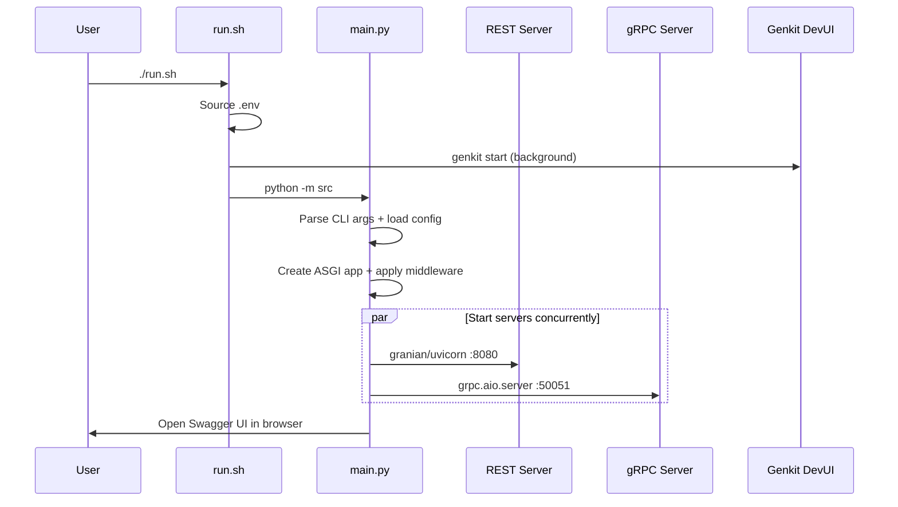

# Running Locally

## Dev mode

```bash
./run.sh                            # FastAPI + uvicorn + gRPC (default)
./run.sh --framework litestar       # Litestar + uvicorn + gRPC
./run.sh --framework quart          # Quart + uvicorn + gRPC
./run.sh --server uvicorn           # FastAPI + uvicorn + gRPC
./run.sh --server hypercorn         # FastAPI + hypercorn + gRPC
./run.sh --no-grpc                  # REST only, no gRPC server
./run.sh --grpc-port 50052          # Custom gRPC port
```

This starts four services:

| Service | URL | Description |
|---------|-----|-------------|
| REST API | `http://localhost:8080` | ASGI server (uvicorn by default) |
| gRPC server | `localhost:50051` | Reflection enabled for grpcui/grpcurl |
| Genkit DevUI | `http://localhost:4000` | Flow debugging and trace viewer |
| Swagger UI | `http://localhost:8080/docs` | Auto-opens in browser |

### Startup sequence



## CLI options

```
python -m src [OPTIONS]
```

| Option | Default | Description |
|--------|---------|-------------|
| `--framework {fastapi,litestar,quart}` | `fastapi` | ASGI framework |
| `--server {granian,uvicorn,hypercorn}` | `uvicorn` | ASGI server |
| `--env ENV` | *(none)* | Load `.<ENV>.env` on top of `.env` |
| `--port PORT` | `$PORT` or `8080` | REST API port |
| `--grpc-port PORT` | `$GRPC_PORT` or `50051` | gRPC server port |
| `--no-grpc` | *(off)* | Disable gRPC server |
| `--no-telemetry` | *(off)* | Disable telemetry export |
| `--otel-endpoint URL` | *(none)* | OpenTelemetry collector URL |
| `--otel-protocol` | `http/protobuf` | OTLP export protocol |
| `--otel-service-name` | `genkit-endpoints-hello` | Service name in traces |

### Configuration priority

Settings are resolved highest-wins:

```
CLI arguments  >  Environment variables  >  .<env>.env file  >  .env file  >  Defaults
```

### Examples

```bash
# Default: FastAPI + uvicorn on port 8080, load .env
python -m src

# Litestar with staging config (.env + .staging.env)
python -m src --framework litestar --env staging

# Production with uvicorn on custom port
python -m src --env production --server uvicorn --port 9090
```

## Using `just` (recommended)

```bash
just dev                # Start app + Jaeger (with tracing)
just dev-litestar       # Same with Litestar framework
just dev-quart          # Same with Quart framework
just stop               # Stop all services
```

`just dev` automatically starts a Jaeger container for local trace visualization.

## Server comparison

| Server | Language | Event Loop | HTTP/2 | Best For |
|--------|----------|-----------|--------|----------|
| **uvicorn** (default) | Python | uvloop | No | Ecosystem compatibility |
| **granian** | Rust | tokio | Yes | Production throughput |
| **hypercorn** | Python | anyio | Yes | Quart users, HTTP/2 |

## Framework comparison

| Feature | **FastAPI** (default) | **Litestar** | **Quart** |
|---------|----------------------|-------------|-----------|
| API style | Decorator + type hints | Decorator + type hints | Flask-style |
| Auto API docs | Swagger UI + ReDoc | Built-in schema UI | Manual |
| Pydantic models | Native (v1 + v2) | Native (v2 + attrs) | Manual `.model_dump()` |
| SSE streaming | `StreamingResponse` | `Stream` | `Response` generator |
| OpenTelemetry | Dedicated instrumentation | Built-in contrib | Generic ASGI middleware |
| Best for | New async projects | Performance-critical APIs | Migrating from Flask |

## Production mode

Set `GENKIT_ENV` to anything other than `dev` (or leave unset) to disable
the DevUI reflection server:

```bash
GENKIT_ENV=prod python -m src
```

| Mode | `GENKIT_ENV` | Servers |
|------|-------------|---------|
| Development | `dev` | REST :8080 + gRPC :50051 + DevUI :4000 |
| Production | unset / any other | REST :8080 + gRPC :50051 |

For multi-worker production deployments, see [Performance](../production/performance.md).
