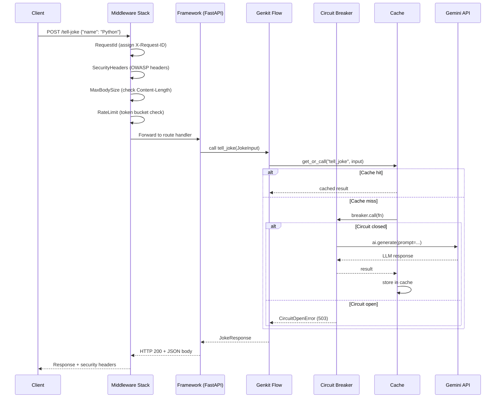
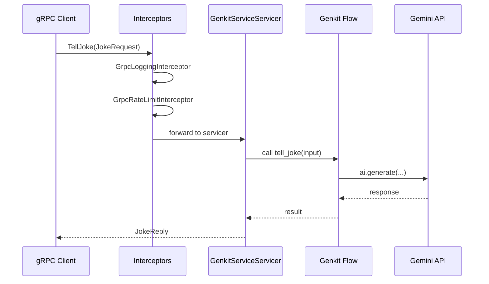

# How It Works

This page explains how a request flows through the system, from
HTTP/gRPC ingress to LLM response.

## Request lifecycle (REST)



## Request lifecycle (gRPC)



## Startup sequence

When you run `python -m src`, the following happens:

1. **Parse CLI arguments** (`config.py`)
   - `--port`, `--server`, `--framework`, `--otel-endpoint`, etc.

2. **Load settings** (`config.py`)
   - Environment variables → `.env` files → defaults

3. **Initialize Genkit** (`app_init.py`)
   - Create `ai = Genkit(...)` singleton
   - Auto-detect cloud platform for telemetry
   - Load plugins (Google AI, Vertex AI, etc.)

4. **Register flows** (`flows.py`)
   - `@ai.flow()` decorators register all flows

5. **Create resilience singletons** (`main.py`)
   - `FlowCache` with configured TTL and max size
   - `CircuitBreaker` with configured thresholds

6. **Create REST app** (`main.py`)
   - Select framework (FastAPI/Litestar/Quart)
   - Call `create_app(ai)` factory

7. **Apply middleware** (`main.py`)
   - Security headers, CORS, body size, request ID, rate limiting

8. **Instrument with OpenTelemetry** (`telemetry.py`)
   - If `--otel-endpoint` is set

9. **Start servers** (`main.py`)
   - `asyncio.gather(serve_rest(), serve_grpc())`
   - REST on `:8080`, gRPC on `:50051`

## Flow execution

Every Genkit flow follows this pattern:

```python
@ai.flow()
async def my_flow(ai: Genkit, input: MyInput) -> MyOutput:
    # 1. Optionally run sub-steps (creates trace spans)
    cleaned = await ai.run("sanitize", lambda: sanitize(input.text))

    # 2. Call the LLM
    response = await ai.generate(
        model="googleai/gemini-2.0-flash",
        prompt=cleaned,
        output=Output(schema=MyOutput),
    )

    # 3. Return structured output
    return response.output
```

The flow is wrapped by the resilience layer in `flows.py`:

1. **Cache check** → return cached result if available
2. **Circuit breaker** → reject if circuit is open
3. **Execute flow** → call the LLM
4. **Record result** → cache the response, update breaker stats

## Configuration precedence

Settings are resolved in this order (highest priority first):

```
CLI args  >  Environment vars  >  .<env>.env file  >  .env file  >  Defaults
```

This follows the [12-factor app](https://12factor.net/config)
methodology. Environment-specific files (`.staging.env`,
`.production.env`) layer on top of shared defaults (`.env`).
