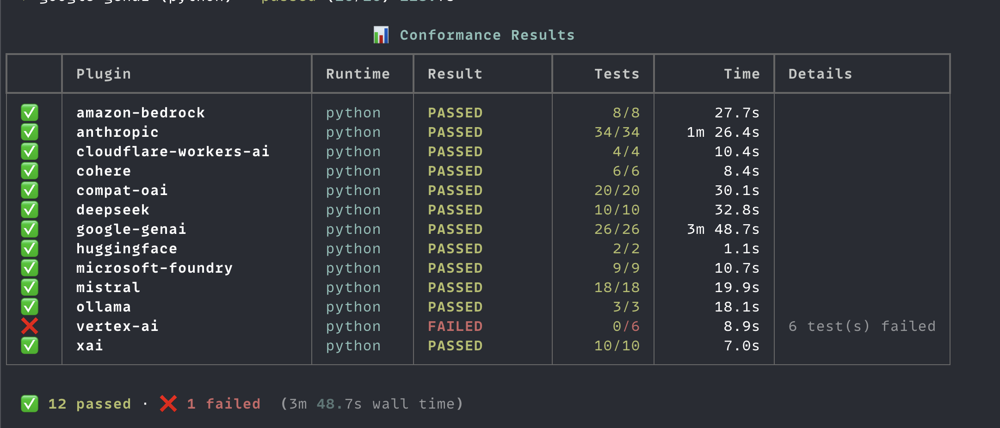
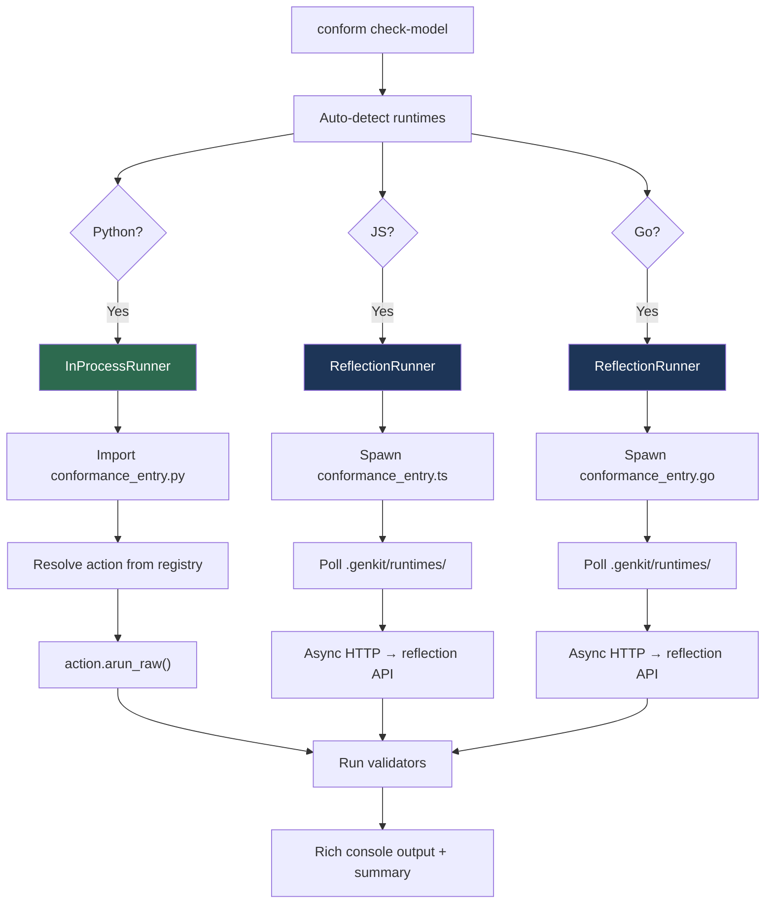
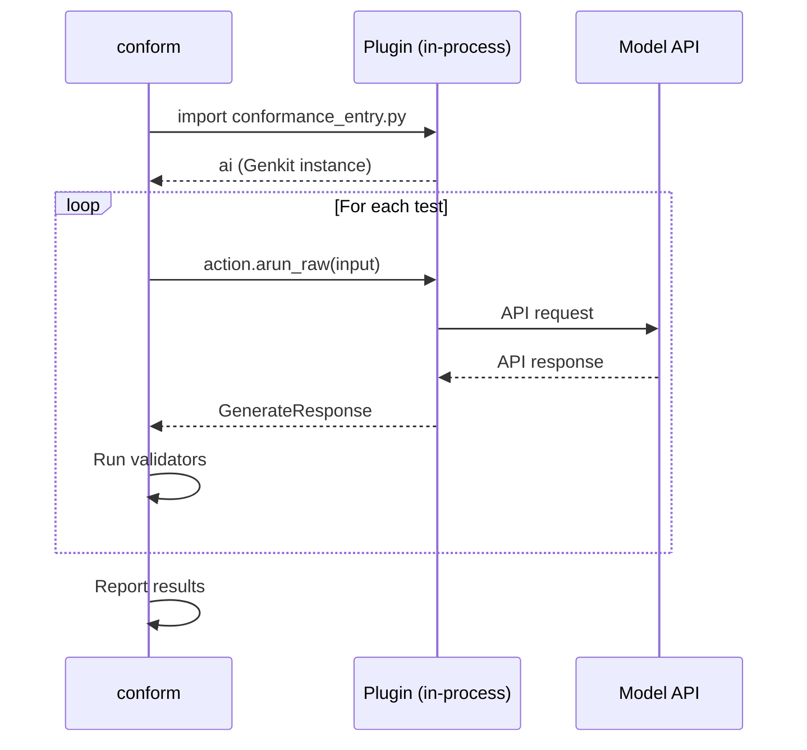
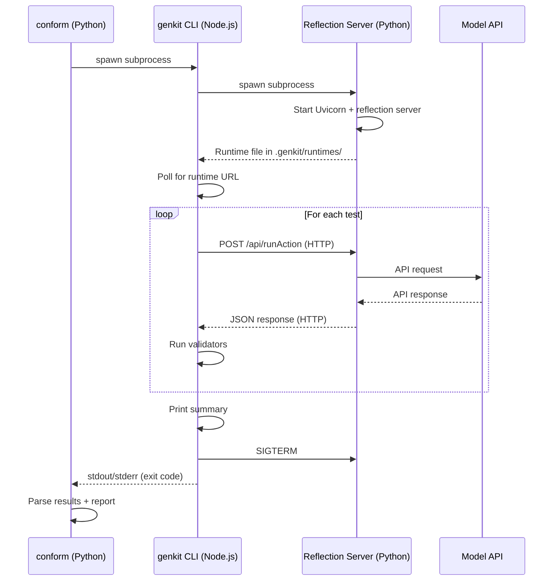

# Conform — Model Conformance Test Runner

A private (non-publishable) tool for running Genkit model conformance
tests across all configured runtimes (Python, JS, Go).

Supports the Python runtime natively (in-process, no subprocess)
and all other runtimes via async HTTP to their reflection servers.
**No genkit CLI dependency.**

## Why This Tool Exists

The Genkit SDK supports **13+ model plugins** (Anthropic, Google GenAI,
Amazon Bedrock, Mistral, DeepSeek, Cohere, xAI, Ollama, …) across
**3 runtimes** (Python, JS, Go).  Every plugin must correctly handle
text generation, structured output, tool calling, streaming, media
input/output, and reasoning — and behave consistently across runtimes.

Before Conform, the only way to run conformance tests was through the
JS-based `genkit dev:test-model` CLI.  For Python plugins, this meant:

1. **3 processes** — Conform (Python) → genkit CLI (Node.js) → Python
   reflection server (Uvicorn)
2. **Node.js required** — even for testing pure-Python plugins
3. **HTTP overhead** — every test serialized as JSON over localhost HTTP
4. **Rate-limiting** — the JS CLI dispatched all tests concurrently via
   `Promise.all`, overwhelming model APIs and causing "aborted" errors
5. **Slow feedback** — subprocess startup, server discovery, and HTTP
   round-trips added ~80s per plugin
6. **Hard to debug** — failures spread across 3 processes with no
   shared stack traces

Conform solves this by running Python plugins **in-process** — importing
the plugin directly, calling `action.arun_raw()` as a normal function
call, and validating the response with the same 10 validators and 12
test cases as the JS canonical source.  No subprocess, no HTTP, no
Node.js.  One process, zero overhead.

The `--use-cli` flag is retained for cross-runtime parity checks (JS,
Go), but the native runner is the default and recommended path.

## Quick Start

```bash
# List available plugins, runtimes, and env-var readiness
conform list

# Run a single plugin's model conformance tests (native runner)
conform check-model google-genai

# Run all plugins across all runtimes (native runner)
conform check-model

# Run all plugins using the legacy genkit CLI runner
conform check-model --use-cli

# Run against a specific runtime only
conform --runtime python check-model google-genai

# Check that every model plugin has conformance files (used by bin/lint)
conform check-plugin
```

### Example Output



13 plugins.  150+ tests.  Under 4 minutes wall time.

## Architecture

### High-Level Overview

```
conform check-model google-genai
        │
        ├── Auto-detect runtimes with entry points
        │   ├── python? ──→ InProcessRunner
        │   │   │   Import conformance_entry.py
        │   │   │   Get `ai` (Genkit instance)
        │   │   │   Call action.arun_raw() directly
        │   │   │   No subprocess, no HTTP, no reflection server
        │   │   └── ✅ Fastest path
        │   │
        │   ├── js? ──→ ReflectionRunner
        │   │   │   Start conformance_entry.ts subprocess
        │   │   │   Poll .genkit/runtimes/ for URL
        │   │   │   Async HTTP (httpx) → reflection API
        │   │   └── ✅ Cross-runtime
        │   │
        │   └── go? ──→ ReflectionRunner
        │       └── Same as JS
        │
        All runners share:
        ├── ActionRunner Protocol  ← common interface
        ├── Validators (10 validators, Protocol + @register)
        ├── Test cases (12 built-in, 1:1 with JS)
        └── Rich console output + summary
```



### Native Runner vs CLI Runner

The native runner (default) and the `--use-cli` runner take very
different paths to execute the same tests.

#### Native Runner (default) — In-Process

A single Python process imports the plugin, calls the model action
directly, and validates the response.  No subprocess, no HTTP, no
serialization.

```
conform check-model google-genai
    │
    │  Single Python process
    │  ─────────────────────
    │
    ├─ Import conformance_entry.py
    │      ├─ Import plugin (google-genai)
    │      └─ Return `ai` (Genkit instance)
    │
    ├─ Resolve model action from registry
    │
    │  For each model in spec:
    │  ┌──────────────────────────────────────┐
    │  │ For each test (sequential):          │
    │  │                                      │
    │  │  action.arun_raw(input)              │
    │  │       │                              │
    │  │       ▼                              │
    │  │  Model API call (e.g. Google GenAI)  │
    │  │       │                              │
    │  │       ▼                              │
    │  │  GenerateResponse (Python object)    │
    │  │       │                              │
    │  │  Run validators on response          │
    │  └──────────────────────────────────────┘
    │
    └─ Report result

    Processes:  1
    Hops:       conform ──direct call──► Model API
    Overhead:   None
```



#### CLI Runner (`--use-cli`) — Subprocess + Reflection HTTP

Three processes coordinate via subprocess spawning and HTTP.  The
genkit CLI (Node.js) spawns a Python reflection server, then sends
each test as an HTTP request.

> **Note:** The CLI runner is inherently flaky.  The multi-process
> architecture introduces race conditions during server discovery,
> and the JS CLI historically dispatched all tests for a model
> concurrently via `Promise.all`, overwhelming model APIs with
> parallel requests and causing widespread "aborted" errors.
> The native runner avoids all of these issues and is strongly
> recommended for day-to-day use.

```
conform check-model --use-cli google-genai
    │
    │  Python (conform)                     Node.js (genkit CLI)
    │  ────────────────                     ────────────────────
    │
    ├─ Spawn subprocess ─────────────────►  genkit dev:test-model
    │                                           │
    │                                           ├─ Parse YAML spec
    │                                           ├─ Spawn subprocess ──►  Python entry point
    │                                           │                            │
    │                                           │                            ├─ Import plugin
    │                                           │                            ├─ Start Uvicorn
    │                                           │                            ├─ Start reflection server
    │                                           │                            │   (HTTP on localhost)
    │                                           │                            └─ Wait for requests
    │                                           │
    │                                           ├─ Poll .genkit/runtimes/ for URL
    │                                           ├─ Wait for all model actions
    │                                           │
    │                                           │  For each model in spec:
    │                                           │  ┌──────────────────────────────────────┐
    │                                           │  │ For each test (sequential):          │
    │                                           │  │                                      │
    │                                           │  │  POST /api/runAction ──► Reflection  │
    │                                           │  │       (HTTP)                │        │
    │                                           │  │                             ▼        │
    │                                           │  │                      action.arun_raw │
    │                                           │  │                             │        │
    │                                           │  │                             ▼        │
    │                                           │  │                      Model API call  │
    │                                           │  │                             │        │
    │                                           │  │  ◄──── JSON response ──────┘        │
    │                                           │  │                                      │
    │                                           │  │  Run validators on response          │
    │                                           │  └──────────────────────────────────────┘
    │                                           │
    │                                           ├─ Print summary
    │                                           └─ SIGTERM → Python server
    │
    ├─ Capture stdout/stderr
    ├─ Parse "Tests Completed: X Passed, Y Failed"
    └─ Report result

    Processes:  3 (conform → genkit CLI → Python server)
    Hops:       conform ──subprocess──► genkit CLI ──HTTP──► reflection server ──► Model API
    Overhead:   Node.js startup + Uvicorn startup + HTTP serialization per test
```



#### Comparison

| | Native runner (default) | CLI runner (`--use-cli`) |
|---|---|---|
| **Processes** | 1 | 3 (conform → genkit CLI → Python server) |
| **Network hops per test** | 0 (direct function call) | 2 (HTTP to reflection server) |
| **Subprocess spawns** | 0 | 2 (Node.js + Python) |
| **Serialization** | None (native Python objects) | JSON over HTTP per test |
| **Server startup** | None | Uvicorn + reflection server |
| **Node.js required** | No | Yes |
| **genkit CLI required** | No | Yes |
| **Cross-runtime** | Python only | Python, JS, Go |
| **Debugging** | Easy (single process, breakpoints) | Hard (3 processes, HTTP) |
| **Typical speed** | ~4 min for 13 plugins | ~80s per plugin |
| **Best for** | Day-to-day development | Cross-runtime parity checks |

### ActionRunner Protocol

All execution modes implement the same `ActionRunner` protocol:

```python
class ActionRunner(Protocol):
    async def run_action(
        self, key: str, input_data: dict, *, stream: bool = False,
    ) -> tuple[dict, list[dict]]: ...
    async def close(self) -> None: ...
```

Three implementations:

| Runner | When | How |
|--------|------|-----|
| `InProcessRunner` | Python runtime (default) | Imports entry point, calls `action.arun_raw()` via Genkit SDK |
| `ReflectionRunner` | JS/Go/other runtimes | Subprocess + async HTTP to reflection server |
| genkit CLI (legacy) | `--use-cli` flag | Delegates to `genkit dev:test-model` via `runner.py` |

## Layout

```
py/
├── tools/conform/                  ← This package (the CLI tool)
│   ├── pyproject.toml              ← Private package + [tool.conform] config
│   ├── README.md
│   └── src/conform/
│       ├── cli.py                  ← Argument parsing + subcommand dispatch
│       ├── config.py               ← TOML config loader
│       ├── checker.py              ← check-plugin: verify conformance files exist
│       ├── display.py              ← Rich tables, Rust-style errors, emoji status
│       ├── paths.py                ← Path constants derived from package location
│       ├── plugins.py              ← Plugin discovery and env-var checking
│       ├── reflection.py           ← Async HTTP client for reflection API (httpx)
│       ├── runner.py               ← Legacy parallel runner (genkit CLI subprocess)
│       ├── test_cases.py           ← 12 built-in test cases (1:1 parity with JS)
│       ├── test_model.py           ← Native test runner with ActionRunner Protocol
│       ├── types.py                ← Shared types (PluginResult, Status, Runtime)
│       └── validators/             ← Protocol-based validator registry
│           ├── __init__.py         ← Validator Protocol + @register decorator
│           ├── helpers.py          ← Shared response parsing utilities
│           ├── json.py             ← valid-json
│           ├── media.py            ← valid-media
│           ├── reasoning.py        ← reasoning
│           ├── streaming.py        ← stream-text-includes, stream-has-tool-request, stream-valid-json
│           ├── text.py             ← text-includes, text-starts-with, text-not-empty
│           └── tool.py             ← has-tool-request
│
└── tests/conform/                  ← Conformance spec files (per plugin)
    ├── anthropic/
    │   ├── model-conformance.yaml ← Test suite spec
    │   ├── conformance_entry.py   ← Genkit entry point (Python)
    │   ├── conformance_entry.ts   ← Genkit entry point (JS)
    │   └── conformance_entry.go   ← Genkit entry point (Go)
    ├── google-genai/
    │   └── ...
    └── ...
```

## Global Flags

These flags apply to all subcommands and can appear before or after
the subcommand name:

| Flag | Description |
|------|-------------|
| `--runtime NAME` | Runtime to use (default: all configured runtimes) |
| `--specs-dir DIR` | Override specs directory |

## Subcommands

### `conform check-model [PLUGIN...]`

The primary command.  Runs model conformance tests using the native
runner by default.  Optionally filter by plugin name.

**Python runtime:** Imports the entry point in-process — no subprocess,
no HTTP server, no genkit CLI.  This is the fastest path.

**Other runtimes (JS, Go):** Starts the entry point as a subprocess,
discovers the reflection server URL from `.genkit/runtimes/`, and
communicates via async HTTP.

When multiple runtimes are active, results from all runtimes are
displayed in a unified table with a Runtime column.

A live Rich progress table updates as results arrive (log lines scroll
above, table pinned at bottom), followed by a final summary table.

**Concurrency control:** An `asyncio.Semaphore` bounds the number of
concurrent plugin tests.  The default is 4 (configurable via TOML or
`-j` flag).

**Pre-flight checks:** Before running tests, the runner verifies that
the plugin's spec file, entry point, and required environment variables
exist.  Missing env vars cause the plugin to be skipped (not errored).

| Flag | Description |
|------|-------------|
| `--use-cli` | Use legacy genkit CLI (`genkit dev:test-model`) instead of the native runner |
| `-j N` | Maximum concurrent plugins |
| `-v` | Verbose mode: plain-text log lines (no live table), full output on failure |

### `conform check-plugin`

Verifies that every model plugin has:
1. `tests/conform/<plugin>/model-conformance.yaml`
2. `tests/conform/<plugin>/conformance_entry.py`

This subcommand is called by `py/bin/check_consistency` (check 21)
during `bin/lint`.

### `conform list`

Displays a table of all plugins with conformance specs, showing:

- **Runtimes** — which runtimes have entry points (green = available,
  dim = not available)
- **Environment variables** — which are set (blue) and missing (red)
- **Readiness** — green ● = ready, red ○ = missing env vars

## Validators

10 validators ported 1:1 from the canonical JS source
(`genkit-tools/cli/src/commands/dev-test-model.ts`):

| Validator | Module | What it checks |
|-----------|--------|----------------|
| `text-includes` | `text.py` | Response text contains expected substring |
| `text-starts-with` | `text.py` | Response text starts with expected prefix |
| `text-not-empty` | `text.py` | Response text is non-empty |
| `valid-json` | `json.py` | Response text is valid JSON |
| `has-tool-request` | `tool.py` | Response contains a tool request part |
| `valid-media` | `media.py` | Response contains a media part with valid URL |
| `reasoning` | `reasoning.py` | Response contains a reasoning/thinking part |
| `stream-text-includes` | `streaming.py` | Streamed chunks contain expected text |
| `stream-has-tool-request` | `streaming.py` | Streamed chunks contain a tool request |
| `stream-valid-json` | `streaming.py` | Final streamed chunk is valid JSON |

Custom validators can be added by creating a function and decorating it
with `@register('name')` in a new module under `validators/`.

## Configuration

The tool reads `[tool.conform]` from its own `pyproject.toml`:

```toml
[tool.conform]
concurrency = 4
additional-model-plugins = ["google-genai", "vertex-ai", "ollama"]

[tool.conform.env]
anthropic = ["ANTHROPIC_API_KEY"]
google-genai = ["GEMINI_API_KEY"]
# ...

[tool.conform.runtimes.python]
specs-dir = "py/tests/conform"
plugins-dir = "py/plugins"
entry-command = ["uv", "run", "--project", "py", "--active"]

[tool.conform.runtimes.js]
specs-dir = "py/tests/conform"
plugins-dir = "js/plugins"
entry-command = ["npx", "tsx"]
cwd = "js"

[tool.conform.runtimes.go]
specs-dir = "py/tests/conform"
plugins-dir = "go/plugins"
entry-command = ["go", "run"]
cwd = "go"
```

CLI flags override TOML values:

| Flag | TOML Key | Description |
|------|----------|-------------|
| `--runtime NAME` | — | Filter to a single runtime |
| `--specs-dir DIR` | `runtimes.<name>.specs-dir` | Override specs directory |
| `-j N` | `concurrency` | Max concurrent plugins |
| `--verbose` | — | Print full output for failures |

## Adding a New Plugin

1. Create `tests/conform/<plugin>/model-conformance.yaml` with test
   suites.
2. Create entry points for each runtime:
   - `tests/conform/<plugin>/conformance_entry.py` (Python)
   - `tests/conform/<plugin>/conformance_entry.ts` (JS)
   - `tests/conform/<plugin>/conformance_entry.go` (Go)
3. Add the plugin's env vars to `[tool.conform.env]` in
   `tools/conform/pyproject.toml`.
4. If the plugin lacks `model_info.py`, add it to
   `additional-model-plugins`.
5. Run `conform check-plugin` to verify.

## Python Version Support

Supports Python 3.10 through 3.14.  On Python 3.10, the `tomli` package
is used as a backport for `tomllib` (added in 3.11).

## Design: Canonical JS Parity

The validators, test cases, and reflection client are ported from the
canonical JS implementation in:

    genkit-tools/cli/src/commands/dev-test-model.ts

The `waitForActions` function was also backported to the JS source to
ensure both implementations poll for model action registration before
dispatching tests (prevents 404 race conditions).
