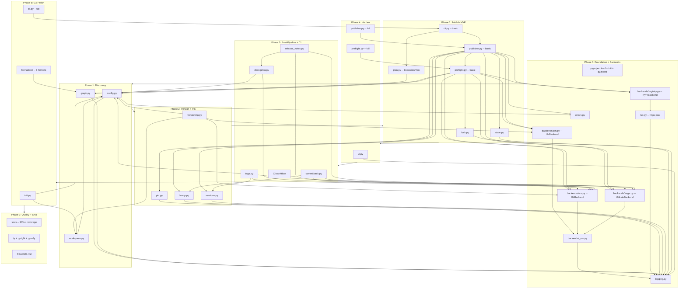

# releasekit Implementation Roadmap

Release orchestration for uv workspaces -- publish Python packages in
topological order with ephemeral version pinning, level gating, and
crash-safe file restoration.

**Target location**: `py/tools/release/` in `firebase/genkit`
**Published as**: `releasekit` on PyPI
**Invocation**: `uvx releasekit publish`

---

## Why This Tool Exists

The genkit Python SDK is a uv workspace with 21+ packages that have
inter-dependencies. Publishing them to PyPI requires dependency-ordered
builds with ephemeral version pinning -- and no existing tool does this.

**Why not use an existing tool?**

| Tool | Why it doesn't work for us |
|------|---------------------------|
| **python-semantic-release** | Monorepo support has been the [#1 most requested feature](https://github.com/python-semantic-release/python-semantic-release/issues/168) since **Feb 2020** -- still unresolved. No workspace discovery, no dependency graph, no topological publish, no ephemeral pinning. |
| **changesets** | npm only. No topological ordering. [No --dry-run for publish](https://github.com/changesets/changesets/issues/614) (open since 2021). Suffers from [unexpected major version bumps](https://github.com/changesets/changesets/issues/1011) (62 upvotes) from transitive deps. |
| **lerna** | npm only. [Lock file not updated](https://github.com/lerna/lerna/issues/1171) after internal dep version bumps (40 upvotes, open since **Dec 2017**). [No --dry-run](https://github.com/lerna/lerna/issues/51) (open since **Feb 2016**). |
| **cargo-release** | Rust only. [Can't exclude unchanged crates](https://github.com/crate-ci/cargo-release/issues/298) by default (open since 2021). Not portable to Python. |
| **Bash scripts** | Current approach. No dependency ordering, no resume, no safety, untestable. |

These tools have had critical gaps open for years. Rather than wait,
releasekit solves these problems natively for Python/uv workspaces.

**Problems we avoid by design** (learned from their issue trackers):

- **Lock file staleness**: `uv lock --upgrade-package` after version bump,
  included in the version commit. (lerna #1171, open since 2017)
- **Prerelease changelog empty on full release**: rollup mode merges
  prerelease entries into the final release. (PSR #555, open since 2023)
- **Unchanged packages published needlessly**: skip packages with no commits
  since last tag. (cargo-release #298, open since 2021)
- **Concurrent release race conditions**: advisory lock + CI concurrency
  key guidance. (PSR #168 comments)
- **No dry run**: `--dry-run` and `plan` alias from day one.
  (lerna #51, open since 2016; changesets #614, open since 2021)
- **Protected branch conflicts**: `--publish-from=ci` creates a PR, never
  pushes directly. (lerna #1957, cargo-release #119)

---

## Major Design Issues Addressed

Issues found through cross-verification with `uv` docs, PSR, cargo-release,
changesets, and lerna issue trackers.

| ID | Sev. | Issue | Solution | Phase |
|----|------|-------|---------|-------|
| D-1 | Crit | **Version commit missing from pipeline.** Both PSR and cargo-release do: version bump -> commit -> tag -> publish. Without a commit step, git tags point to a commit with the *old* version. | Add commit step after version bump: `versioning.py` -> `uv lock --upgrade-package` -> `git commit` -> `git tag` -> publish. | 2 |
| D-2 | Crit | **`uv.lock` stale after version bump.** Same bug open on [lerna since 2017](https://github.com/lerna/lerna/issues/1171) (40 upvotes). PSR [documents the fix](https://python-semantic-release.readthedocs.io/en/stable/configuration/configuration-guides/uv_integration.html). | Run `uv lock --upgrade-package <pkg>` for each bumped package, `git add uv.lock` before version commit. | 2 |
| D-3 | Crit | **`uv build --no-sources` required.** [uv docs](https://docs.astral.sh/uv/guides/package/) recommend `--no-sources` for publishing to verify the package builds without workspace source overrides. | Use `uv build --no-sources` in `publisher.py`. | 3 |
| D-4 | High | **Prerelease changelog empty on full release.** [PSR #555](https://github.com/python-semantic-release/python-semantic-release/issues/555) (open since 2023). Promoting rc1 to stable produces empty changelog. | `changelog_prerelease_mode = "rollup"` (default): merge prerelease entries into full release. | 5 |
| D-5 | High | **Unchanged packages published needlessly.** [cargo-release #298](https://github.com/crate-ci/cargo-release/issues/298) (open since 2021). | Skip packages with no commits since last tag. `--force-unchanged` to override. | 2, 3 |
| D-6 | High | **Concurrent CI release race condition.** [PSR #168](https://github.com/python-semantic-release/python-semantic-release/issues/168) comments. | Advisory lock locally. `concurrency: release` in CI. Detect in-progress draft releases in preflight. | 3 |
| D-7 | High | **`uv publish` has native retry flags.** `--check-url` and `--skip-existing` handle partial upload retries. | Use `uv publish --check-url` instead of custom 409 handling. | 3 |
| D-8 | Med | **Attestation support.** `uv publish` auto-discovers `.publish.attestation` files. | Document support. Don't interfere with attestation files. Passthrough `--no-attestations`. | 4 |
| D-9 | Med | **`resolve_check` uses wrong tool.** Plan said `pip install --dry-run`. | Use `uv pip install --dry-run` for consistency. | 3 |
| D-10 | Med | **`gh` CLI not installed.** | Graceful degradation: skip GitHub Releases with warning. Core publish works without `gh`. | 3, 5 |
| D-11 | Med | **Transitive major bump propagation.** [changesets #1011](https://github.com/changesets/changesets/issues/1011) (62 upvotes). | Per-package bump from own commits only. No transitive propagation. | 2 |
| D-12 | Med | **`uv version` command overlap.** `uv version --bump` already handles PEP 440. | Evaluate delegating version writing to `uv version --frozen` during Phase 2. | 2 |

### Corrected Pipeline (incorporating D-1 through D-12)

All external tool calls go through the backend shim layer (see Phase 0).
`vcs.*` = VCS/GitBackend, `pm.*` = PackageManager/UvBackend,
`forge.*` = Forge/GitHubBackend, `registry.*` = Registry/PyPIBackend.

```
 0. preflight         vcs.is_clean(), pm.lock() --check, forge.is_available() (D-10),
                      forge.list_releases() concurrent detection (D-6),
                      vcs.is_shallow(), OSS file checks
 1. versioning        vcs.log() + vcs.diff_files() -> compute semver (skip unchanged D-5)
 2. lock update       pm.lock(upgrade_package=<pkg>) for each bumped package (D-2)
 3. commit            vcs.commit("chore(release): <umbrella_tag>") (D-1)
 4. tag               vcs.tag() per-package tags + umbrella tag
 5. for each topo level:
      pin ──► pm.build(no_sources=True) (D-3) ──► verify ──► checksum
          ──► pm.publish(check_url=...) (D-7) ──► pm.resolve_check() (D-9)
          ──► registry.poll_available() ──► pm.smoke_test() ──► restore
 6. push              vcs.push() commit + tags
 7. GitHub Release    forge.create_release() (graceful skip, D-10)
 8. changelog         vcs.log() + prerelease rollup mode (D-4)
 9. commitback        vcs.commit() + vcs.push() + forge.create_pr() (optional)
```

---

## Module Dependency Graph

### ASCII (viewable in any editor / terminal / git diff)

```
Phase 0: Foundation
┌─────────────────────────────────────────────────────────┐
│  scaffold (pyproject.toml, __init__.py, py.typed)       │
│  errors.py (diagnostic lib, RK-XXXX codes)             │
│  logging.py (structlog + Rich)                          │
│                                                         │
│  backends/ (Protocol-based shim layer):                 │
│    _run.py ──► logging.py (subprocess abstraction)      │
│    pm.py ──► _run.py (PackageManager + UvBackend)       │
│    vcs.py ──► _run.py (VCS + GitBackend)                │
│    forge.py ──► _run.py (Forge + GitHubBackend, async)  │
│    registry.py ──► net.py (Registry + PyPIBackend,async)│
│  net.py ──► logging.py (httpx connection pool, retry)   │
└──────────────────────────┬──────────────────────────────┘
                           │
Phase 1: Discovery         ▼
┌─────────────────────────────────────────────────────────┐
│  config.py ──► errors.py, logging.py                    │
│  workspace.py ──► config.py                             │
│  graph.py ──► logging.py                                │
│                                                         │
│  ✓ releasekit discover                                 │
│  ✓ releasekit graph                                    │
│  ✓ releasekit check-cycles                             │
└──────────────────────────┬──────────────────────────────┘
                           │
Phase 2: Version + Pin     ▼
┌─────────────────────────────────────────────────────────┐
│  versioning.py ──► config.py, workspace.py              │
│    + skip unchanged packages (D-5)                      │
│    + uv lock --upgrade-package (D-2)                    │
│    + git commit version bump (D-1)                      │
│  pin.py ──► logging.py                                  │
│  bump.py ──► logging.py                                 │
│  versions.py ──► logging.py                             │
│                                                         │
│  ✓ releasekit version (skips unchanged)                │
│  ✓ releasekit pin --apply                              │
│  ✓ Version commit includes uv.lock                      │
└──────────────────────────┬──────────────────────────────┘
                           │
Phase 3: Publish MVP ★     ▼    ← CRITICAL MILESTONE
┌─────────────────────────────────────────────────────────┐
│  lock.py ──► logging.py                                 │
│  state.py ──► logging.py                                │
│  plan.py ──► graph.py (ExecutionPlan + table/JSON/CSV)  │
│  preflight.py (basic) ──► lock, graph, config, backends │
│    + forge.is_available() check (D-10, graceful)        │
│    + concurrent release detection (D-6)                 │
│  publisher.py (basic) ──► pin, state, preflight,        │
│                           versions, bump, errors,       │
│                           backends (pm, vcs, forge, reg)│
│    + pm.build(no_sources=True) (D-3)                    │
│    + pm.publish(check_url=...) (D-7)                    │
│    + pm.resolve_check() (D-9)                           │
│  cli.py (basic) ──► publisher, plan                     │
│    + --force-unchanged (D-5)                            │
│                                                         │
│  ★ releasekit publish --publish-from=local             │
│  ★ Corrected: preflight → version → uv lock → commit   │
│    → tag → [pin → build → publish → poll → smoke →     │
│    restore] per level → push                            │
└──────────────────────────┬──────────────────────────────┘
                           │
Phase 4: Harden            ▼
┌─────────────────────────────────────────────────────────┐
│  ui.py ──► logging.py                                   │
│  preflight.py (full) ──► + OSS checks, pip-audit,       │
│                            metadata validation          │
│  publisher.py (full) ──► + staging, manifest, Test PyPI,│
│                            resume-from-registry,        │
│                            attestation passthrough (D-8)│
│                                                         │
│  ✓ Rich progress table                                  │
│  ✓ --stage, --index=testpypi, --resume-from-registry    │
└──────────────────────────┬──────────────────────────────┘
                           │
Phase 5: Post-Pipeline     ▼
┌─────────────────────────────────────────────────────────┐
│  tags.py ──► config, versions, vcs, forge               │
│    (graceful forge.is_available() skip, D-10)           │
│  changelog.py ──► config, vcs (prerelease rollup, D-4) │
│  release_notes.py ──► changelog, vcs, forge             │
│  commitback.py ──► bump, vcs, forge                     │
│  .github/workflows/publish_python_v2.yml                │
│                                                         │
│  ✓ releasekit publish --publish-from=ci                │
│  ✓ Structured changelog + rich release notes            │
│  ✓ GitHub Releases + draft/promote                      │
└──────────────────────────┬──────────────────────────────┘
                           │
Phase 6: UX Polish         ▼
┌─────────────────────────────────────────────────────────┐
│  init.py ──► config, workspace                          │
│  formatters/ (6 formats) ──► graph                      │
│  cli.py (full) ──► + rollback, completion, --explain,   │
│                      --no-tag, --no-push, --version-only│
│                                                         │
│  ✓ releasekit init                                     │
│  ✓ releasekit graph --format dot|mermaid|ascii|d2|json │
│  ✓ releasekit rollback                                 │
│  ✓ releasekit completion bash|zsh|fish                 │
└──────────────────────────┬──────────────────────────────┘
                           │
Phase 7: Quality + Ship    ▼
┌─────────────────────────────────────────────────────────┐
│  tests (90%+ coverage, all 30 modules)                  │
│  type checking (ty, pyright, pyrefly -- zero errors)    │
│  README.md (21 sections, mermaid diagrams)              │
│  workspace config (releasekit init on genkit repo)     │
│                                                         │
│  ✓ Ship v0.1.0 to PyPI                                  │
└─────────────────────────────────────────────────────────┘
```

### Mermaid (renders on GitHub / docs)



---

## Phase Details

### Phase 0: Foundation + Backends

| Module | Description | Est. Lines |
|--------|-------------|-----------|
| `pyproject.toml` | Package scaffold with `[project.scripts]`, hatchling build, 8 deps | ~40 |
| `__init__.py` | `__version__` only | ~3 |
| `py.typed` | PEP 561 marker | 0 |
| `errors.py` | Error system using `diagnostic` library (v3.0.0). Subclass `DiagnosticError` and `DiagnosticWarning` with `RK-XXXX` codes. Code ranges: 0xxx config, 1xxx workspace, 2xxx graph, 3xxx version, 4xxx preflight, 5xxx build/publish, 6xxx post-pipeline, 7xxx state/resume. Error catalog as constants. `--explain RK-XXXX` flag. | ~150 |
| `logging.py` | `structlog` configuration. Rich console when TTY, plain text otherwise. `--json-log` for machine-readable output. `--verbose` / `--quiet` levels. | ~60 |
| `backends/_run.py` | Central `run_command()` subprocess abstraction. Dry-run support, structured logging, configurable timeout. All external tool calls go through this one function. | ~60 |
| `backends/pm.py` | `PackageManager` Protocol + `UvBackend`. Methods: `build()`, `publish()`, `lock()`, `version_bump()`, `resolve_check()`, `smoke_test()`. All via `run_command()`. | ~120 |
| `backends/vcs.py` | `VCS` Protocol + `GitBackend`. Methods: `is_clean()`, `is_shallow()`, `log()`, `commit()`, `tag()`, `push()`, `tag_exists()`, `delete_tag()`, `current_sha()`, `diff_files()`. Sync (git is fast locally). | ~100 |
| `backends/forge.py` | `Forge` Protocol (async) + `GitHubBackend`. Methods: `is_available()`, `create_release()`, `delete_release()`, `promote_release()`, `list_releases()`, `create_pr()`, `pr_data()`. Graceful degradation if `gh` unavailable. | ~120 |
| `backends/registry.py` | `Registry` Protocol (async) + `PyPIBackend`. Methods: `check_published()`, `poll_available()`, `project_exists()`, `latest_version()`. Async HTTP via `httpx`. Connection pooling. | ~80 |
| `net.py` | HTTP utilities for `PyPIBackend`. Shared `httpx.AsyncClient` session with connection pooling, retry with backoff, rate limiting. | ~60 |

**Done when**: `import releasekit` works, errors render with Rich formatting,
structlog outputs to stderr. All 4 backend protocols defined with default
implementations. `run_command()` logs and supports dry-run.

**Milestone**: Project skeleton passes `uv build`. Backends are injectable and mockable.

### Phase 1: Discovery

| Module | Description | Est. Lines |
|--------|-------------|-----------|
| `config.py` | Read `[tool.releasekit]` from root `pyproject.toml`. `ReleaseConfig` dataclass. Config validation with fuzzy suggestions for typos (`difflib.get_close_matches`). Value type checking. Group integrity validation. | ~120 |
| `workspace.py` | Discover packages from `[tool.uv.workspace].members` globs. Parse each member's `pyproject.toml`. Classify internal vs external deps. Return `list[Package]`. | ~100 |
| `graph.py` | `Package` dataclass, `build_graph()`, `detect_cycles()` (DFS), `topo_sort()` (Kahn's returning levels), `reverse_deps()` (BFS), `forward_deps()` (transitive closure), `filter_graph()` (dependency-aware: auto-include deps, check PyPI, group/package/exclude filters). | ~200 |

**Done when**: `releasekit discover` prints JSON package list,
`releasekit graph` prints topological levels,
`releasekit check-cycles` exits 0 on acyclic graph.

**Milestone**: Can discover and visualize the genkit workspace.

### Phase 2: Version + Pin

| Module | Description | Est. Lines |
|--------|-------------|-----------|
| `versioning.py` | Parse Conventional Commits via `vcs.log()`, compute per-package semver bumps. Monorepo-aware scoping via `vcs.diff_files()`. Configurable `tag_format`. PEP 440 compliance. Skip unchanged packages (D-5). No transitive bump propagation (D-11). `--bump`, `--no-auto-version`, `--prerelease`, `--force-unchanged`. After version writes: `pm.lock()` (D-2) + `vcs.commit()` (D-1) + `vcs.tag()`. | ~220 |
| `pin.py` | Ephemeral `tomlkit`-based pinning. Context manager with triple-layer crash safety (atexit + signal + `.bak` backup). Byte-identical restore verified by SHA-256. | ~120 |
| `bump.py` | Version string rewriting in arbitrary files (`__init__.py`, constants). Regex-based with `BumpTarget(path, pattern)` config. | ~80 |
| `versions.py` | JSON version manifest. `ReleaseManifest` dataclass with export/import for CI handoff. | ~80 |

**Done when**: `releasekit version` shows computed bumps (skipping unchanged),
`releasekit pin --apply` modifies and restores pyproject.toml correctly,
version commit includes updated `uv.lock`.

**Milestone**: Version computation, ephemeral pinning, and version commit work
end-to-end.

### Phase 3: Publish MVP (Critical Path)

This is the most important milestone. Everything before it is a prerequisite;
everything after it is enhancement.

| Module | Description | Est. Lines |
|--------|-------------|-----------|
| `lock.py` | Advisory lock file (`.releasekit.lock`). PID/hostname/timestamp. Stale detection. `atexit` cleanup. | ~60 |
| `state.py` | `RunState` dataclass. Per-package status tracking. Atomic save via `tempfile` + `os.replace`. Resume support with git SHA validation. | ~100 |
| `plan.py` | `ExecutionPlan` dataclass. Per-package rows: order, level, name, current version, next version, status, reason. Output as Rich table (with emoji status), JSON, or CSV. Shared between `plan` and `publish` subcommands. Status values: `included`, `skipped`, `excluded`, `already_published`, `dependency_only`. | ~80 |
| `preflight.py` (basic) | Receives `vcs: VCS`, `pm: PackageManager`, `forge: Forge`, `registry: Registry` via DI. Lock acquisition, `vcs.is_clean()`, `pm.lock()` check, cycle detection, `registry.latest_version()` validation, `vcs.is_shallow()` detection, `forge.is_available()` check (D-10), concurrent release detection via `forge.list_releases()` (D-6). | ~150 |
| `publisher.py` (basic) | Receives all 4 backends via DI. Async level-by-level orchestration. Atomic step: `pin -> pm.build(no_sources=True) (D-3) -> verify -> checksum -> pm.publish(check_url=...) (D-7) -> pm.resolve_check() (D-9) -> registry.poll_available() -> pm.smoke_test() -> restore`. Semaphore concurrency, retry, fail-fast. | ~350 |
| `cli.py` (basic) | Constructs backends, injects into modules. argparse with `publish`, `plan` (ExecutionPlan table/JSON/CSV output), `discover`, `graph`, `check-cycles`. `--dry-run`, `--force/-y`, `--force-unchanged`, `--publish-from=local`. TTY-aware confirmation. | ~220 |

**Done when**: `releasekit publish --publish-from=local` executes the full
corrected pipeline via backend shims. `releasekit plan` outputs an
ExecutionPlan table with status/emoji/reason for each package, and `--format=json`
outputs machine-readable JSON.

**Milestone**: Can release the genkit Python SDK to PyPI with a single command.

### Phase 4: Harden

| Module | Description | Est. Lines |
|--------|-------------|-----------|
| `ui.py` | Rich Live progress table. Status icons per package (waiting -> building -> publishing -> done/fail). Duration tracking. Summary footer. | ~100 |
| `preflight.py` (full) | Add: OSS file checks (LICENSE, README), `pip-audit` vulnerability scan (warn by default, `--strict-audit` to block, `--skip-audit` to skip), metadata validation (wheel zip, METADATA fields, long description), backup file detection, dist clean, trusted publisher check. | +150 |
| `publisher.py` (full) | Add: `--stage` two-phase (Test PyPI then real PyPI), `--index=testpypi`, manifest mode, `--resume-from-registry`, OIDC token handling, rate limiting, attestation passthrough (D-8). | +200 |

**Done when**: Rich progress UI shows real-time status during publish. Staging
workflow completes both phases. Pre-flight catches common mistakes.

**Milestone**: Production-hardened publish with rich UI and safety checks.

### Phase 5: Post-Pipeline + CI

| Module | Description | Est. Lines |
|--------|-------------|-----------|
| `tags.py` | Git tag creation via `vcs.tag()` + `vcs.push()`. GitHub Release via `forge.create_release()` / `forge.promote_release()` (graceful skip via `forge.is_available()`, D-10). Configurable `tag_format` / `umbrella_tag_format`. Dual-mode: CI (draft + manifest + workflow trigger) and local (tags after publish). Tag-exists handling. Rate limit awareness. | ~180 |
| `changelog.py` | Structured changelog grouped by Conventional Commits type (Breaking Changes, Features, Bug Fixes, etc.). Commit data via `vcs.log()`. Exclusion patterns. PR references preserved. Prerelease-to-release rollup mode (D-4). | ~100 |
| `release_notes.py` | Umbrella release notes. Data collection via `vcs.log()`, `forge.pr_data()`, `vcs.diff_files()`, `vcs.tag_exists()`. Jinja2 template rendering (default + custom). AI drafting stub (off by default, future). | ~220 |
| `commitback.py` | Post-release PR to bump to next dev version. Branch creation via `vcs.commit()` + `vcs.push()`, PR creation via `forge.create_pr()`. Uses `bump.py` + `tomlkit`. | ~150 |
| CI workflow | `.github/workflows/publish_python_v2.yml`: download manifest from draft release, `uvx releasekit publish --publish-from=local --manifest=...`, promote release. | ~50 |

**Done when**: `releasekit publish --publish-from=ci` creates tags + draft
release + manifest, triggers CI workflow, CI publishes and promotes release.
Structured changelog and rich release notes appear in GitHub Release body.

**Milestone**: Full CI-driven release pipeline with GitHub Releases.

### Phase 6: UX Polish

| Module | Description | Est. Lines |
|--------|-------------|-----------|
| `init.py` | Workspace-aware config scaffolding. Auto-detect groups from directory structure. Generate/update `[tool.releasekit]` in root + per-package `pyproject.toml`. Update `.gitignore`. Show diff, prompt on TTY. Idempotent. | ~120 |
| `formatters/` | 6 graph output formats: `dot.py` (Graphviz), `json_fmt.py`, `levels.py`, `ascii_art.py`, `mermaid.py`, `d2.py`. All are pure functions: `graph -> str`. | ~300 |
| `cli.py` (full) | Add: `rollback` subcommand, `init` subcommand, `completion` subcommand, `--explain RK-XXXX`, granular flags (`--no-tag`, `--no-push`, `--no-release`, `--version-only`), `--rdeps`/`--deps` on graph, `rich-argparse` formatter, `argcomplete` shell completion. | +150 |

**Done when**: `releasekit init` scaffolds config for the genkit workspace.
All 6 graph formats produce correct output. Rollback automates tag/release
deletion. Shell completion works in bash/zsh/fish.

**Milestone**: Developer experience is polished and discoverable.

### Phase 7: Quality + Ship

| Item | Description | Est. Lines |
|------|-------------|-----------|
| Tests | 90%+ line coverage across all 30 modules. Mocked subprocess calls via `run_command()` abstraction. Snapshot tests for formatters. Integration tests with `--dry-run`. | ~2000 |
| Type checking | Zero errors from `ty`, `pyright`, and `pyrefly` in strict mode. | config |
| `README.md` | 21 sections with Mermaid workflow diagrams, CLI reference, config reference, testing workflow, vulnerability scanning, migration guide. | ~800 |
| Workspace config | Run `releasekit init` on the genkit repo. Review auto-detected groups. Commit generated config. | config |

**Done when**: `pytest --cov-fail-under=90` passes, all three type checkers
report zero errors, README is complete.

**Milestone**: Ship `releasekit` v0.1.0 to PyPI.

---

## Critical Path

The critical path runs through the modules that block the first usable release:

```
scaffold ──► errors.py ──► logging.py ──► config.py ──► workspace.py
    │                                         │
    │                                         ▼
    │                                     graph.py
    │                                         │
    ▼                                         ▼
versioning.py ──► uv lock ──► git commit ──► git tag
                                                │
                                                ▼
               pin.py ──► publisher.py ──► cli.py
                                │
                     ┌──────────┼──────────┐
                     ▼          ▼          ▼
                  net.py    state.py   preflight.py
```

**Phase 3 is the gate**: once `publisher.py` and `cli.py` (basic) are done,
the tool can publish packages with the corrected pipeline (D-1 through D-7).
Everything else (UI, changelog, release notes, init, formatters, rollback,
shell completion) is enhancement.

---

## Estimated Effort

| Phase | Modules | New Lines | Cumulative |
|-------|---------|-----------|------------|
| 0: Foundation + Backends | 8 (+scaffolding) | ~750 | ~750 |
| 1: Discovery | 3 | ~420 | ~1170 |
| 2: Version + Pin | 4 | ~500 | ~1670 |
| 3: Publish MVP | 6 | ~960 | ~2630 |
| 4: Harden | 3 (extended) | ~450 | ~3080 |
| 5: Post-Pipeline | 4 (+CI workflow) | ~700 | ~3780 |
| 6: UX Polish | 3 (+ 6 formatters) | ~570 | ~4350 |
| 7: Quality + Ship | tests + docs | ~2800 | ~7150 |

Total: ~37 modules (including 6 formatters), ~4350 lines of production code,
~2800 lines of tests + docs.

---

## Dependencies (pyproject.toml)

```toml
[project]
name = "releasekit"
version = "0.1.0"
description = "Release orchestration for uv workspaces"
requires-python = ">=3.10"
license = "Apache-2.0"
dependencies = [
  "tomlkit>=0.13.0",       # Style-preserving TOML manipulation
  "structlog>=25.1.0",     # Structured logging
  "rich>=13.0.0",          # Rich terminal UI + progress
  "rich-argparse>=1.6.0",  # Colorful CLI help
  "argcomplete>=3.0.0",    # Shell tab completion
  "jinja2>=3.1.0",         # Release notes templates
  "diagnostic>=3.0.0",     # Rust-style error rendering
  "httpx>=0.27.0",         # Async HTTP with connection pooling (PyPIBackend)
]

[project.scripts]
releasekit = "releasekit.cli:main"
uvx-releasekit = "releasekit.cli:main"  # backward-compat shim

[build-system]
requires = ["hatchling"]
build-backend = "hatchling.build"
```

8 runtime dependencies, ~6MB total installed size.

---

## Scalability

releasekit is designed to scale from a handful of packages (genkit today) to
hundreds (releasekit v2 vision):

- **Async-first pipeline**: `publisher.py` uses `asyncio.Semaphore` for
  controlled parallelism within each topological level. `Forge` and `Registry`
  protocols are `async def` from day one, avoiding a sync-to-async migration
  later.

- **Connection pooling**: `net.py` provides a shared `httpx.AsyncClient` with
  configurable pool size (`[tool.releasekit] http_pool_size = 10`). Reused
  across all PyPI API calls within a run.

- **Batch operations**: `vcs.push()` pushes all tags in a single `git push`
  call. `forge.create_release()` can be batched with `asyncio.gather()` per
  level.

- **Graph efficiency**: Kahn's algorithm in `graph.py` is O(V+E), already
  efficient for hundreds of nodes. Level-based processing avoids redundant
  traversals.

- **UI at scale**: `ui.py` uses Rich Live with virtual scrolling. Only visible
  rows are rendered, capped at terminal height. Summary footer shows
  aggregated counts. Works for 500+ packages without lag.

- **Memory management**: Streaming git log parsing (no full history in memory).
  Wheel verification reads in chunks. State file is per-package append-only.

---

## Growth Path to releasekit v2

The Protocol-based backend shim layer makes releasekit v1 a foundation for v2:

| What stays (v1 -> v2) | What changes |
|------------------------|-------------|
| `PackageManager` protocol | Add `NpmBackend`, `CargoBackend`, `PnpmBackend` |
| `VCS` protocol + `GitBackend` | Unchanged (git is universal) |
| `Forge` protocol + `GitHubBackend` | Add `GitLabBackend`, `BitbucketBackend` |
| `Registry` protocol + `PyPIBackend` | Add `NpmRegistryBackend`, `CratesBackend` |
| Graph algorithms | Unchanged (language-agnostic) |
| Error system (RK-XXXX) | Expand code ranges |
| Rich UI, structured logging | Unchanged |
| CLI structure | Add language auto-detection |

**Migration path**: No breaking changes. v2 adds new backends and a
`language` field to package config. Existing `[tool.releasekit]` configs
continue to work. The `uvx-releasekit` shim ensures old invocations keep
working.

---

## File Tree

```
py/tools/release/
  pyproject.toml
  README.md
  roadmap.md                          ← this file
  src/
    releasekit/
      __init__.py
      py.typed
      errors.py                       ← diagnostic lib, RK-XXXX codes
      logging.py                      ← structlog + Rich
      backends/                       ← Protocol-based shim layer
        __init__.py                   ← re-exports all protocols + defaults
        _run.py                       ← run_command() subprocess abstraction
        pm.py                         ← PackageManager protocol + UvBackend
        vcs.py                        ← VCS protocol + GitBackend
        forge.py                      ← Forge protocol + GitHubBackend (async)
        registry.py                   ← Registry protocol + PyPIBackend (async)
      net.py                          ← httpx connection pool, retry, rate limit
      cli.py                          ← argparse + rich-argparse + argcomplete
      config.py                       ← [tool.releasekit] reader + validator
      workspace.py                    ← uv workspace discovery
      graph.py                        ← dep graph, topo sort, filter
      plan.py                         ← ExecutionPlan dataclass + table/JSON/CSV
      formatters/
        __init__.py
        dot.py                        ← Graphviz DOT
        json_fmt.py                   ← JSON adjacency list
        levels.py                     ← human-readable levels
        ascii_art.py                  ← box-drawing diagram
        mermaid.py                    ← Mermaid syntax
        d2.py                         ← D2 syntax
      init.py                         ← workspace config scaffolding
      versioning.py                   ← Conventional Commits -> semver
      pin.py                          ← ephemeral version pinning
      bump.py                         ← version string rewriting
      versions.py                     ← JSON manifest + ReleaseManifest
      lock.py                         ← advisory lock file
      state.py                        ← run state + resume
      preflight.py                    ← safety checks + pip-audit
      publisher.py                    ← level-by-level orchestration
      tags.py                         ← git tags + GitHub Releases
      changelog.py                    ← structured changelog
      release_notes.py                ← umbrella release notes (Jinja2)
      commitback.py                   ← post-release version bump PR
      ui.py                           ← Rich Live progress table
      templates/
        release_notes.md.j2           ← default release notes template
  tests/
    conftest.py
    errors_test.py
    logging_test.py
    backends/
      run_test.py
      pm_test.py
      vcs_test.py
      forge_test.py
      registry_test.py
    net_test.py
    plan_test.py
    cli_test.py
    config_test.py
    workspace_test.py
    graph_test.py
    formatters/
      dot_test.py
      json_fmt_test.py
      levels_test.py
      ascii_art_test.py
      mermaid_test.py
      d2_test.py
    init_test.py
    versioning_test.py
    pin_test.py
    bump_test.py
    versions_test.py
    lock_test.py
    state_test.py
    preflight_test.py
    publisher_test.py
    tags_test.py
    changelog_test.py
    release_notes_test.py
    commitback_test.py
    ui_test.py
```

---

## What This Replaces

The existing release process uses:

| Current tool | What it does | Problem |
|-------------|-------------|---------|
| `py/bin/publish_pypi.sh` | Single-package publish | No dependency ordering |
| `py/bin/build_dists` | Build all packages | No topological order |
| `py/bin/bump_version` | Bump all to same version | No per-package semver |
| `.github/workflows/publish_python.yml` | Matrix publish | No level gating |

`releasekit` replaces all four with: `uvx releasekit publish`
