# Backend System

ReleaseKit interacts with five categories of external systems. Each category
is defined by a **Python `Protocol`**, with concrete implementations that
can be swapped at construction time.

## Architecture

```mermaid
graph TB
    subgraph "Protocols (Abstract)"
        VCS_P["VCS Protocol"]
        PM_P["PackageManager Protocol"]
        FORGE_P["Forge Protocol"]
        REG_P["Registry Protocol"]
        WS_P["Workspace Protocol"]
    end

    subgraph "Concrete Implementations"
        GIT["GitBackend"]
        HG["MercurialBackend"]
        UV_PM["UvPackageManager"]
        PNPM_PM["PnpmPackageManager"]
        GH_CLI["GitHubCLIBackend"]
        GH_API["GitHubAPIBackend"]
        GL["GitLabCLIBackend"]
        BB["BitbucketAPIBackend"]
        PYPI["PyPIBackend"]
        NPM["NpmBackend"]
        UV_WS["UvWorkspace"]
        PNPM_WS["PnpmWorkspace"]
    end

    VCS_P --> GIT & HG
    PM_P --> UV_PM & PNPM_PM
    FORGE_P --> GH_CLI & GH_API & GL & BB
    REG_P --> PYPI & NPM
    WS_P --> UV_WS & PNPM_WS

    style VCS_P fill:#1976d2,color:#fff
    style PM_P fill:#1976d2,color:#fff
    style FORGE_P fill:#1976d2,color:#fff
    style REG_P fill:#1976d2,color:#fff
    style WS_P fill:#1976d2,color:#fff
```



## VCS Protocol

Abstracts version control operations. Used for git log, tagging,
diff computation, and working tree status.

```python
class VCS(Protocol):
    def log(self, *, since: str, paths: list[str]) -> list[Commit]: ...
    def tag_exists(self, tag: str) -> bool: ...
    def create_tag(self, tag: str, message: str) -> None: ...
    def delete_tag(self, tag: str, *, remote: bool) -> None: ...
    def push_tags(self) -> None: ...
    def is_clean(self) -> bool: ...
    def head_sha(self) -> str: ...
    def is_shallow(self) -> bool: ...
    def diff_files(self, since: str) -> list[str]: ...
    def current_branch(self) -> str: ...
```

| Implementation | Backend | Notes |
|---|---|---|
| `GitBackend` | Git | Shells out to `git` CLI |
| `MercurialBackend` | Mercurial | Shells out to `hg` CLI |

## PackageManager Protocol

Abstracts build and publish operations for language-specific package managers.

```python
class PackageManager(Protocol):
    def build(self, package_dir: Path) -> Path: ...
    def publish(self, dist_dir: Path, *, check_url: str, index_url: str) -> None: ...
    def lock_check(self, workspace_root: Path) -> bool: ...
```

| Implementation | Tool | Ecosystem |
|---|---|---|
| `UvPackageManager` | uv | Python |
| `PnpmPackageManager` | pnpm | JavaScript |

## Forge Protocol

Abstracts code forge operations (PRs, releases, labels). Features
**graceful degradation** — operations not supported by a forge are
logged as warnings rather than errors.

```python
class Forge(Protocol):
    def create_pr(self, *, title: str, body: str, head: str, base: str) -> str: ...
    def update_pr(self, pr_number: int, *, title: str, body: str) -> None: ...
    def list_prs(self, *, label: str, state: str) -> list[PrInfo]: ...
    def pr_data(self, pr_number: int) -> PrInfo: ...
    def add_label(self, pr_number: int, label: str) -> None: ...
    def remove_label(self, pr_number: int, label: str) -> None: ...
    def create_release(self, *, tag: str, title: str, body: str, draft: bool) -> str: ...
    def upload_release_asset(self, release_url: str, path: Path) -> None: ...
    def publish_release(self, release_url: str) -> None: ...
    def delete_release(self, tag: str) -> None: ...
```

| Implementation | Forge | Transport | Draft Releases | Labels |
|---|---|---|---|---|
| `GitHubCLIBackend` | GitHub | `gh` CLI | ✅ | ✅ |
| `GitHubAPIBackend` | GitHub | REST API | ✅ | ✅ |
| `GitLabCLIBackend` | GitLab | `glab` CLI | ❌ | ✅ (on MRs) |
| `BitbucketAPIBackend` | Bitbucket | REST API | ❌ | ❌ (no-op) |

!!! info "Choosing a forge backend"
    Use `--forge-backend cli` (default) for local development with `gh`
    installed. Use `--forge-backend api` in CI where only `GITHUB_TOKEN`
    is available.

## Registry Protocol

Abstracts package registry queries for version existence checks and
post-publish checksum verification.

```python
class Registry(Protocol):
    def version_exists(self, name: str, version: str) -> bool: ...
    def checksum(self, name: str, version: str, filename: str) -> ChecksumResult: ...
    def poll_version(self, name: str, version: str, *, timeout: float) -> bool: ...
```

| Implementation | Registry | Notes |
|---|---|---|
| `PyPIBackend` | PyPI | Uses JSON API, async `httpx` |
| `NpmBackend` | npm | Uses npm registry API |

## Workspace Protocol

Abstracts workspace discovery — scanning the workspace definition file
to enumerate all packages with their metadata.

```python
class Workspace(Protocol):
    async def discover(self) -> list[Package]: ...
```

| Implementation | Tool | Discovery Source |
|---|---|---|
| `UvWorkspace` | uv | `pyproject.toml` `[tool.uv.workspace]` |
| `PnpmWorkspace` | pnpm | `pnpm-workspace.yaml` |

## Testing with Fake Backends

All protocols have simple implementations that can be used in tests:

```python
class FakeVCS:
    """In-memory VCS for tests."""
    def __init__(self):
        self.tags: dict[str, str] = {}
        self.commits: list[Commit] = []
        self._clean = True

    def tag_exists(self, tag: str) -> bool:
        return tag in self.tags

    def is_clean(self) -> bool:
        return self._clean
    # ... etc
```

See `tests/conftest.py` and individual test files for complete fake
backend implementations.
