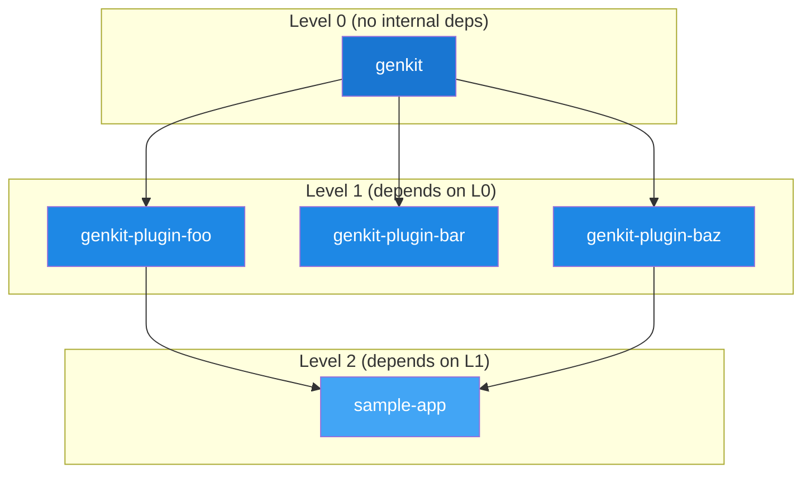

# Dependency Graph

ReleaseKit builds a **directed acyclic graph** (DAG) of internal workspace
dependencies to determine the safe publish order.

## Edge Direction

```
Forward edges (edges):     dependent → dependency  (who needs what)
Reverse edges (reverse_edges): dependency → dependent (who uses me)

    genkit-plugin-foo ──→ genkit ←── genkit-plugin-bar
                           ↑
                       genkit-plugin-baz
```

Only **internal** dependencies (packages within the workspace) are included.
External PyPI/npm dependencies are ignored.

## Building the Graph

```python
from releasekit.graph import build_graph, topo_sort, detect_cycles
from releasekit.workspace import discover_packages

packages = discover_packages(Path('.'))
graph = build_graph(packages)

# Check for circular dependencies
cycles = detect_cycles(graph)
if cycles:
    raise RuntimeError(f"Circular deps: {cycles}")

# Compute publish order
levels = topo_sort(graph)
```

## Topological Sort with Levels

ReleaseKit uses **Kahn's algorithm** to compute topological levels:



Packages within the same level have **no mutual dependencies** and can
be published in parallel.

## Cycle Detection

Uses DFS with grey/black coloring to detect all cycles simultaneously.
Cycles make topological sorting (and therefore ordered publishing) impossible.

```python
cycles = detect_cycles(graph)
# Returns: [['A', 'B', 'C', 'A']]  — cycle path
# Returns: []  — acyclic (safe to publish)
```

## Transitive Dependencies

Two BFS-based functions compute transitive dependency closures:

```python
from releasekit.graph import forward_deps, reverse_deps

# What does sample-app transitively depend on?
forward_deps(graph, 'sample-app')
# → {'genkit', 'genkit-plugin-foo', 'genkit-plugin-baz'}

# What depends on genkit (transitively)?
reverse_deps(graph, 'genkit')
# → {'genkit-plugin-foo', 'genkit-plugin-bar', 'genkit-plugin-baz', 'sample-app'}
```

## Graph Visualization

ReleaseKit supports 8 output formats via `releasekit graph --format`:

| Format | Command | Use Case |
|--------|---------|----------|
| ASCII art | `--format ascii` | Terminal viewing |
| Mermaid | `--format mermaid` | Markdown documentation |
| DOT | `--format dot` | Graphviz rendering |
| D2 | `--format d2` | Terrastruct diagrams |
| JSON | `--format json` | Programmatic consumption |
| CSV | `--format csv` | Spreadsheets |
| Table | `--format table` | Formatted terminal output |
| Levels | `--format levels` | Quick level overview |

!!! example "Generating a Mermaid diagram"
    ```bash
    releasekit graph --format mermaid > deps.md
    ```
    Output:
    ```
    graph LR
        genkit-plugin-foo --> genkit
        genkit-plugin-bar --> genkit
        sample-app --> genkit-plugin-foo
    ```

## Filtering

The graph respects `exclude`, `exclude_publish`, and `--group` filters
from configuration. Excluded packages are removed from the graph before
topological sorting, so their dependents are correctly reclassified.
