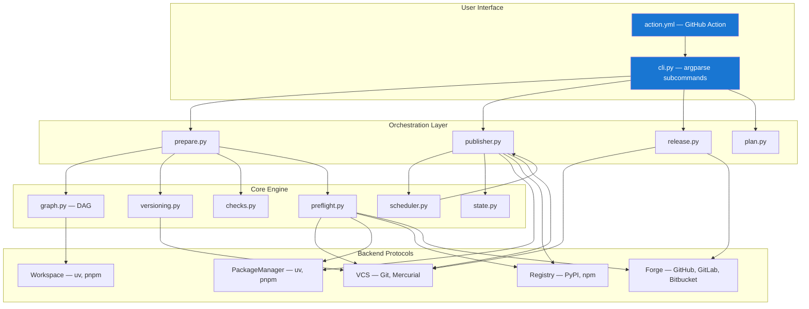
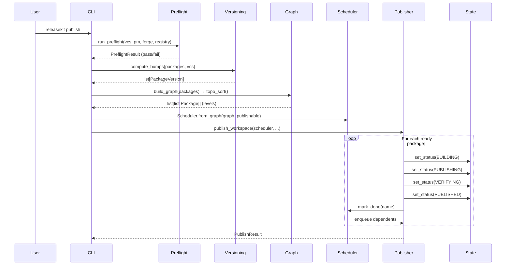

# Architecture Overview

ReleaseKit follows a **layered architecture** with clean separation between
the CLI surface, orchestration logic, and pluggable backends.

## Layered Design



## Design Principles

### 1. Backend Abstraction via Protocols

Every external system (git, PyPI, GitHub, uv) is accessed through a
Python `Protocol` class. This enables:

- **Testing** — Fake backends for deterministic unit tests
- **Extensibility** — New ecosystems without touching core logic
- **Forge agnosticism** — Same flow works on GitHub, GitLab, Bitbucket

### 2. Dependency Injection

All backends are instantiated in `cli.py` and passed as arguments to
orchestration functions. No module ever creates its own backend instance.

```python
# cli.py creates backends once
vcs = GitBackend(workspace_root)
pm = UvPackageManager(workspace_root)
forge = GitHubCLIBackend()
registry = PyPIBackend()

# Orchestration functions receive them
result = publish_workspace(
    vcs=vcs, pm=pm, forge=forge, registry=registry, ...
)
```

### 3. Crash Safety

The publish pipeline writes state to `.releasekit-state.json` after
every step. If the process crashes, `releasekit publish` detects the
state file and resumes from the last checkpoint.

### 4. Topological Ordering with Parallelism

Packages are published in dependency order (leaf packages first), but
packages at the same level can publish concurrently via the
[Scheduler](scheduler.md).

## Module Interaction Flow


