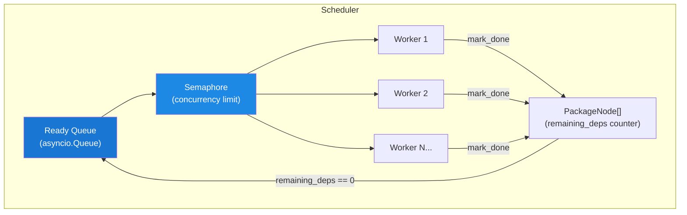
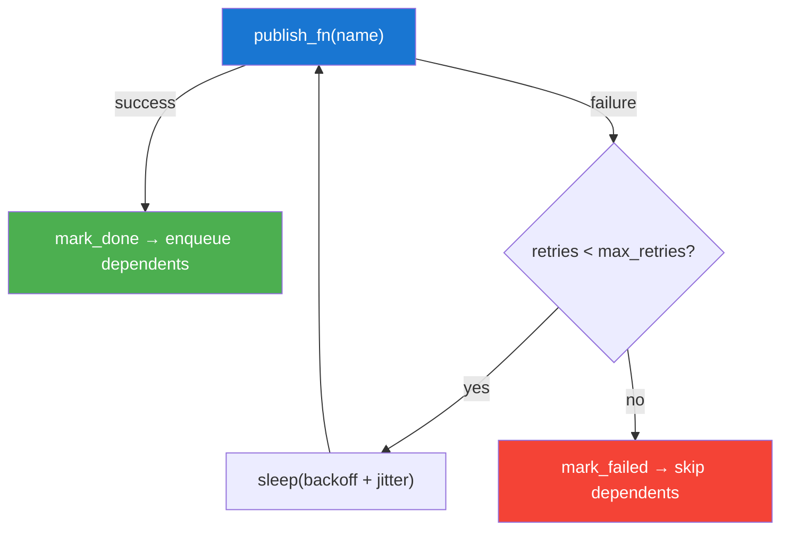

# Scheduler

The `Scheduler` is the heart of ReleaseKit's publish performance. It
replaces level-based lockstep dispatch with **dependency-triggered**
queueing — packages start publishing as soon as all their dependencies
complete.

## Before vs After

### Level-Based Lockstep (Old)

```
Level 0: [A, B, C]  ─── all must finish ───▶  Level 1: [D, E, F]
                                                  ↑
                                        D waits for C even though
                                        D only depends on A
```

### Dependency-Triggered (Current)

```
A completes ──▶ D starts immediately (A is D's only dep)
B completes ──▶ E starts immediately (B is E's only dep)
C completes ──▶ F starts immediately (A + C are F's deps, both done)
```

## Architecture



## How It Works

1. **Initialization**: `from_graph()` builds `PackageNode` objects from the
   dependency graph. Each node tracks `remaining_deps` (count of
   unfinished dependencies).

2. **Seeding**: Packages with `remaining_deps == 0` are immediately
   enqueued in the ready queue.

3. **Worker Loop**: Workers pull from the queue, acquire the semaphore,
   and call `publish_fn(name)`.

4. **Completion**: When a package finishes, `mark_done(name)` decrements
   `remaining_deps` for all its dependents. Any dependent that reaches
   zero is enqueued.

5. **Termination**: When all packages are done (published, skipped, or
   failed), sentinel values are queued to terminate workers.

## Retry with Exponential Backoff

Failed publishes are retried with **exponential backoff + full jitter**:



The backoff formula:

```
delay = min(base_delay * 2^attempt, MAX_BACKOFF) * random(0, 1)
```

Where `MAX_BACKOFF = 60 seconds`.

## Failure Propagation

When a package fails (exhausts retries), all its transitive dependents
are **skipped** — they cannot publish because their dependency is
unavailable on the registry.

## Cancellation

The scheduler supports graceful cancellation:

- `cancel()` sets a flag that prevents new packages from being enqueued
- In-flight publishes run to completion
- The result marks remaining packages as skipped

## Configuration

| Parameter | Default | Description |
|-----------|---------|-------------|
| `concurrency` | 5 | Max packages publishing simultaneously |
| `max_retries` | 0 | Retry count per package |
| `retry_base_delay` | 1.0s | Base delay for exponential backoff |
| `task_timeout` | 600s | Per-package timeout |

## Usage

```python
from releasekit.scheduler import Scheduler

scheduler = Scheduler.from_graph(
    graph=graph,
    publishable={'genkit', 'genkit-plugin-foo'},
    concurrency=5,
    max_retries=2,
    retry_base_delay=1.0,
)

result = await scheduler.run(publish_fn=my_publish_callback)
print(f"Published: {result.published}")
print(f"Failed: {result.failed}")
```

## Dynamic Package Management

The scheduler supports adding and removing packages at runtime:

```python
# Add a package after scheduler creation
scheduler.add_package('new-plugin', deps=['genkit'])

# Remove a package (its dependents are rescheduled)
scheduler.remove_package('old-plugin')
```
