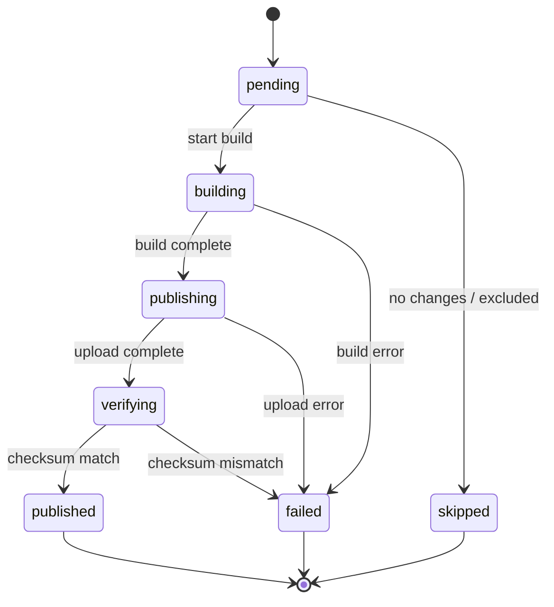
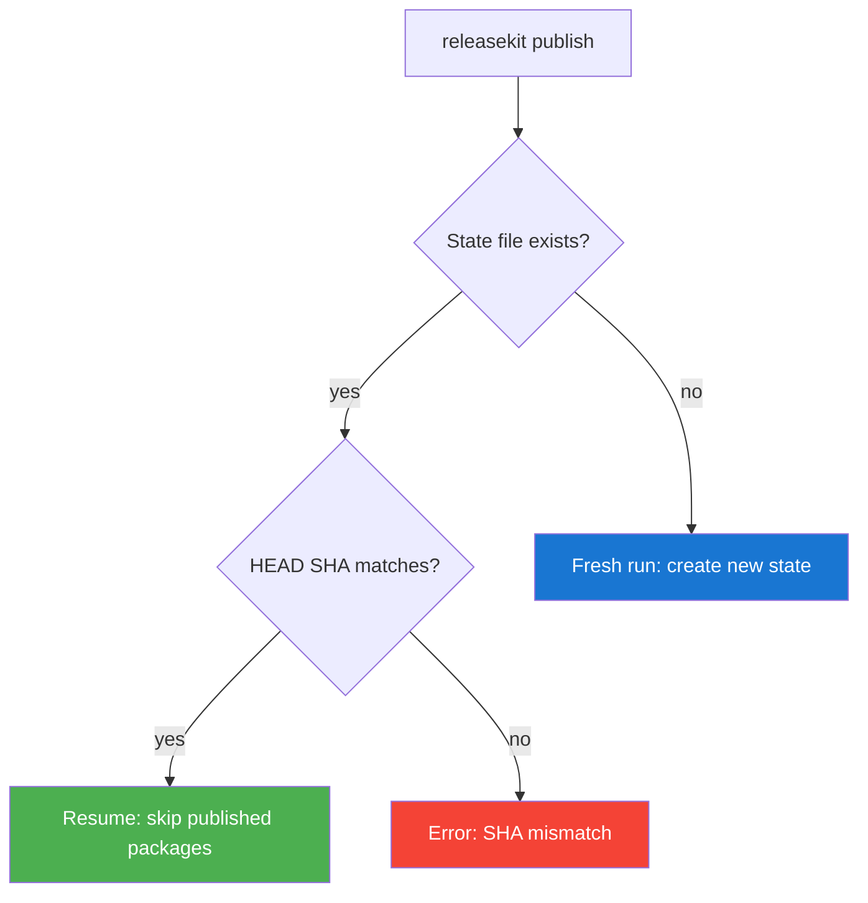

# State Machine

Every package in a release run transitions through a well-defined
state machine. State is persisted to `.releasekit-state.json` after
every transition for crash recovery.

## Status Transitions



## Status Descriptions

| Status | Description |
|--------|-------------|
| `pending` | Package is queued but not yet started |
| `building` | Package is being built (`uv build` / `pnpm build`) |
| `publishing` | Distribution artifacts are being uploaded to the registry |
| `verifying` | Post-publish checksum verification in progress |
| `published` | Successfully published and verified |
| `skipped` | No changes detected, or excluded by config |
| `failed` | An error occurred at any stage |

## State File Format

The state file `.releasekit-state.json` is written to the workspace root:

```json
{
  "git_sha": "abc123def456...",
  "started_at": "2026-02-11T10:30:00Z",
  "packages": {
    "genkit": {
      "name": "genkit",
      "status": "published",
      "version": "0.6.0",
      "error": "",
      "level": 0
    },
    "genkit-plugin-foo": {
      "name": "genkit-plugin-foo",
      "status": "failed",
      "version": "0.6.0",
      "error": "Upload timed out after 600s",
      "level": 1
    }
  }
}
```

## Crash Recovery

When `releasekit publish` starts, it checks for an existing state file:



!!! warning "SHA Validation"
    Resume only works if `HEAD` hasn't changed since the original run.
    A different HEAD means different commits, which could mean different
    version bumps. The state file is rejected and the user must start fresh.

## Atomic Persistence

State writes use `tempfile` + `os.replace` for crash safety:

1. Write new state to a temporary file in the same directory
2. `os.replace()` atomically replaces the old state file
3. If the process crashes during step 1, the old state file is untouched

```python
state.set_status('genkit', PackageStatus.PUBLISHED)
state.save(state_path)  # atomic write
```

## Clearing State

After a successful publish (all packages published or skipped), the
state file is automatically cleaned up. For manual cleanup:

```bash
rm .releasekit-state.json
```
