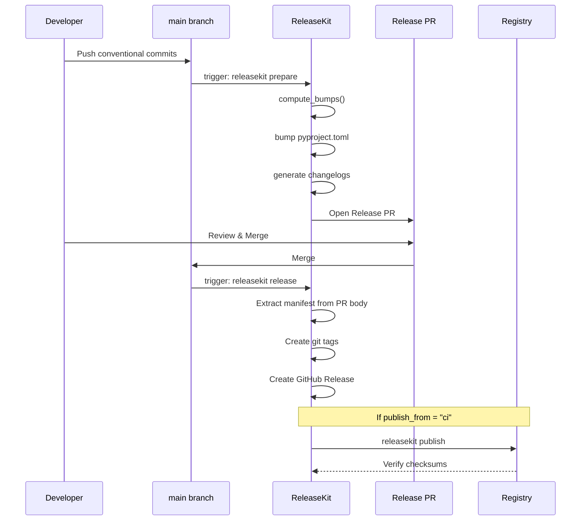

# CI/CD Integration

ReleaseKit ships as both a CLI tool and a **GitHub Action** for
seamless CI integration.

## Release Flow



## GitHub Action

### Basic Usage

```yaml
name: Release
on:
  push:
    branches: [main]

jobs:
  release:
    runs-on: ubuntu-latest
    permissions:
      contents: write
      id-token: write  # For OIDC trusted publishing
    steps:
      - uses: actions/checkout@v4
        with:
          fetch-depth: 0  # Full history for version computation

      - uses: ./py/tools/releasekit
        with:
          command: prepare
          working-directory: py
```

### Two-Step Release (Prepare + Publish)

```yaml
name: Release
on:
  push:
    branches: [main]
  pull_request:
    types: [closed]

jobs:
  # Step 1: On push to main, prepare a Release PR
  prepare:
    if: github.event_name == 'push'
    runs-on: ubuntu-latest
    permissions:
      contents: write
      pull-requests: write
    steps:
      - uses: actions/checkout@v4
        with:
          fetch-depth: 0
      - uses: ./py/tools/releasekit
        with:
          command: prepare
          working-directory: py
          forge-backend: api

  # Step 2: On Release PR merge, tag + publish
  publish:
    if: >-
      github.event.pull_request.merged == true &&
      contains(github.event.pull_request.labels.*.name, 'autorelease: pending')
    runs-on: ubuntu-latest
    permissions:
      contents: write
      id-token: write
    steps:
      - uses: actions/checkout@v4
        with:
          fetch-depth: 0

      - uses: ./py/tools/releasekit
        with:
          command: release
          working-directory: py
          forge-backend: api

      - uses: ./py/tools/releasekit
        with:
          command: publish
          working-directory: py
          concurrency: "5"
          max-retries: "2"
```

### Action Inputs

| Input | Default | Description |
|-------|---------|-------------|
| `command` | `plan` | Subcommand: `publish`, `plan`, `prepare`, `release`, `check`, `discover`, `version`, `rollback` |
| `group` | `""` | Release group name (from `releasekit.toml` groups) |
| `dry-run` | `"false"` | Preview mode |
| `force` | `"false"` | Skip confirmations and preflight checks |
| `forge-backend` | `"api"` | `cli` (needs `gh`) or `api` (REST, needs `GITHUB_TOKEN`) |
| `check-url` | `""` | URL for `uv publish --check-url` |
| `index-url` | `""` | Custom registry URL (e.g., Test PyPI) |
| `concurrency` | `"5"` | Max packages publishing simultaneously |
| `max-retries` | `"2"` | Retry count with exponential backoff |
| `python-version` | `"3.12"` | Python version to install |
| `uv-version` | `"latest"` | uv version to install |
| `working-directory` | `"."` | Path to workspace root |
| `extra-args` | `""` | Additional CLI arguments |

### Action Outputs

| Output | Description |
|--------|-------------|
| `exit-code` | Exit code from the releasekit command |
| `plan-json` | JSON output (only when `command=plan`) |

## OIDC Trusted Publishing

For PyPI trusted publishing (no tokens needed):

```yaml
permissions:
  id-token: write  # Required for OIDC

steps:
  - uses: ./py/tools/releasekit
    with:
      command: publish
```

ReleaseKit's preflight checks will warn if trusted publishing is not
configured.

## GitLab CI

```yaml
release:
  stage: deploy
  image: python:3.12
  before_script:
    - pip install uv
    - uv sync --active
  script:
    - uv run releasekit prepare --forge-backend cli
  only:
    - main
```

## Testing Releases

### Test PyPI

```bash
releasekit publish \
  --index-url https://test.pypi.org/simple/ \
  --check-url https://test.pypi.org/simple/ \
  --dry-run
```

### Local Dry Run

```bash
# Preview the full plan
releasekit plan --format json

# Dry-run publish (no uploads)
releasekit publish --dry-run
```
