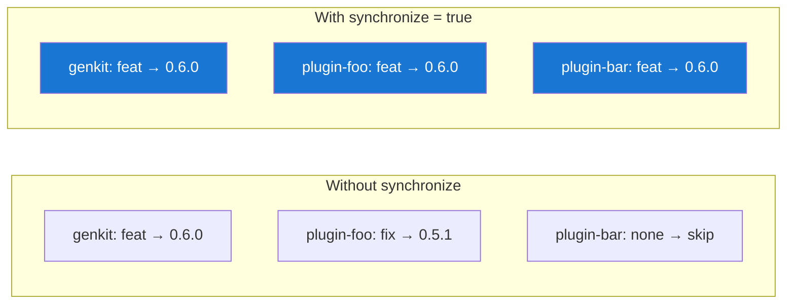

# Configuration

ReleaseKit reads configuration from `releasekit.toml` at the monorepo
root. All keys are top-level (no `[tool.releasekit]` nesting) so it
works for any ecosystem.

## Validation Pipeline

```
releasekit.toml
┌──────────────────┐
│ tag_fromat = ...  │  ← typo!
└────────┬─────────┘
         │
         ▼
┌──────────────────┐     ┌──────────────────────────────┐
│ 1. Key check     │────→│ RK-CONFIG-UNKNOWN-KEY:        │
│                  │     │ "Did you mean tag_format?"    │
└────────┬─────────┘     └──────────────────────────────┘
         │
         ▼
┌──────────────────┐     ┌──────────────────────────────┐
│ 2. Type check    │────→│ RK-CONFIG-INVALID-TYPE:       │
│                  │     │ "exclude must be a list"      │
└────────┬─────────┘     └──────────────────────────────┘
         │
         ▼
┌──────────────────┐     ┌──────────────────────────────┐
│ 3. Value check   │────→│ RK-CONFIG-INVALID-VALUE:      │
│                  │     │ "publish_from must be         │
│                  │     │  'local' or 'ci'"             │
└────────┬─────────┘     └──────────────────────────────┘
         │
         ▼
┌──────────────────┐
│ ReleaseConfig()  │  ← frozen dataclass, ready to use
└──────────────────┘
```

## Complete Reference

### Tagging

```toml
# Per-package tag format. Placeholders: {name}, {version}
tag_format = "{name}-v{version}"

# Umbrella tag format. Placeholder: {version}
umbrella_tag = "v{version}"
```

### Publishing

```toml
# Where to publish from: "local" or "ci"
#   local — publish directly from developer machine
#   ci    — create draft Release; CI workflow publishes
publish_from = "local"
```

### Exclusions

```toml
# Packages to exclude from everything (discovery, bumps, publish)
exclude = ["sample-*", "internal-tool"]

# Packages to exclude from version bumps only
exclude_bump = ["legacy-package"]

# Packages to exclude from publishing only
exclude_publish = ["private-lib"]
```

!!! tip "Group references in exclusions"
    You can reference groups in exclude lists:
    ```toml
    exclude_publish = ["group:samples"]

    [groups]
    samples = ["sample-*"]
    ```

### Groups

```toml
[groups]
core    = ["genkit"]
plugins = ["genkit-plugin-*"]
samples = ["sample-*"]
all     = ["group:core", "group:plugins"]
```

Groups support **glob patterns** and **nested group references** via
`group:<name>` syntax.

### Feature Flags

```toml
# Generate changelogs during prepare
changelog = true

# Prerelease mode: "rollup" or "separate"
#   rollup   — roll pre-release bumps into the next stable
#   separate — each pre-release gets its own version
prerelease_mode = "rollup"

# Connection pool size for async HTTP (PyPI checks)
http_pool_size = 10

# Run smoke tests after publish
smoke_test = true

# Synchronize versions across all packages (lockstep versioning)
synchronize = false

# Allow breaking changes on 0.x to produce major bumps (0.x → 1.0.0)
major_on_zero = false

# Template for the Release PR title
pr_title_template = "chore(release): v{version}"

# Extra files containing version strings to bump
extra_files = []
```

### Synchronize Mode

When `synchronize = true`, all packages get the **same version bump**
(the highest bump across all packages):



## Defaults

If `releasekit.toml` doesn't exist, sensible defaults are used:

| Key | Default |
|-----|---------|
| `tag_format` | `"{name}-v{version}"` |
| `umbrella_tag` | `"v{version}"` |
| `publish_from` | `"local"` |
| `exclude` | `[]` |
| `exclude_bump` | `[]` |
| `exclude_publish` | `[]` |
| `groups` | `{}` |
| `changelog` | `true` |
| `prerelease_mode` | `"rollup"` |
| `http_pool_size` | `10` |
| `smoke_test` | `true` |
| `synchronize` | `false` |
| `major_on_zero` | `false` |
| `pr_title_template` | `"chore(release): v{version}"` |
| `extra_files` | `[]` |

## Example: Full Config

```toml
tag_format      = "{name}-v{version}"
umbrella_tag    = "v{version}"
publish_from    = "ci"
changelog       = true
synchronize     = true
smoke_test      = true
http_pool_size  = 20
major_on_zero   = false
pr_title_template = "chore(release): v{version}"
extra_files     = ["packages/genkit/src/genkit/_version.py"]

exclude         = ["internal-*"]
exclude_publish = ["sample-*", "group:experimental"]

[groups]
core         = ["genkit"]
google       = ["genkit-plugin-google-*", "genkit-plugin-vertex-*"]
community    = ["genkit-plugin-ollama", "genkit-plugin-anthropic"]
experimental = ["genkit-plugin-experimental-*"]
all_plugins  = ["group:google", "group:community"]
```
