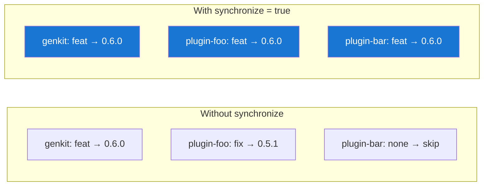

# Configuration

ReleaseKit reads configuration from `releasekit.toml` at the monorepo
root. All keys are top-level (no `[tool.releasekit]` nesting) so it
works for any ecosystem.

## Validation Pipeline

```
releasekit.toml
┌──────────────────┐
│ tag_fromat = ...  │  ← typo!
└────────┬─────────┘
         │
         ▼
┌──────────────────┐     ┌──────────────────────────────┐
│ 1. Key check     │────→│ RK-CONFIG-UNKNOWN-KEY:        │
│                  │     │ "Did you mean tag_format?"    │
└────────┬─────────┘     └──────────────────────────────┘
         │
         ▼
┌──────────────────┐     ┌──────────────────────────────┐
│ 2. Type check    │────→│ RK-CONFIG-INVALID-TYPE:       │
│                  │     │ "exclude must be a list"      │
└────────┬─────────┘     └──────────────────────────────┘
         │
         ▼
┌──────────────────┐     ┌──────────────────────────────┐
│ 3. Value check   │────→│ RK-CONFIG-INVALID-VALUE:      │
│                  │     │ "publish_from must be         │
│                  │     │  'local' or 'ci'"             │
└────────┬─────────┘     └──────────────────────────────┘
         │
         ▼
┌──────────────────┐
│ ReleaseConfig()  │  ← frozen dataclass, ready to use
└──────────────────┘
```

## Complete Reference

### Tagging

```toml
# Per-package tag format. Placeholders: {name}, {version}
tag_format = "{name}-v{version}"

# Umbrella tag format. Placeholder: {version}
umbrella_tag = "v{version}"
```

### Publishing

```toml
# Where to publish from: "local" or "ci"
#   local — publish directly from developer machine
#   ci    — create draft Release; CI workflow publishes
publish_from = "local"
```

### Exclusions

```toml
# Packages to exclude from everything (discovery, bumps, publish)
exclude = ["sample-*", "internal-tool"]

# Packages to exclude from version bumps only
exclude_bump = ["legacy-package"]

# Packages to exclude from publishing only
exclude_publish = ["private-lib"]
```

!!! tip "Group references in exclusions"
    You can reference groups in exclude lists:
    ```toml
    exclude_publish = ["group:samples"]

    [groups]
    samples = ["sample-*"]
    ```

### Groups

```toml
[groups]
core    = ["genkit"]
plugins = ["genkit-plugin-*"]
samples = ["sample-*"]
all     = ["group:core", "group:plugins"]
```

Groups support **glob patterns** and **nested group references** via
`group:<name>` syntax.

### Feature Flags

```toml
# Generate changelogs during prepare
changelog = true

# Prerelease mode: "rollup" or "separate"
#   rollup   — roll pre-release bumps into the next stable
#   separate — each pre-release gets its own version
prerelease_mode = "rollup"

# Connection pool size for async HTTP (PyPI checks)
http_pool_size = 10

# Run smoke tests after publish
smoke_test = true

# Synchronize versions across all packages (lockstep versioning)
synchronize = false

# Allow breaking changes on 0.x to produce major bumps (0.x → 1.0.0)
major_on_zero = false

# Template for the Release PR title
pr_title_template = "chore(release): v{version}"

# Extra files containing version strings to bump
extra_files = []
```

### Versioning Scheme

```toml
# Versioning scheme: "semver" (default), "pep440", or "calver"
# Auto-detected from ecosystem if not set (python → pep440, all others → semver)
versioning_scheme = "semver"

# CalVer format (only used when versioning_scheme = "calver")
calver_format = "YYYY.MM.MICRO"
```

See [Versioning Schemes](versioning-schemes.md) for a full guide.

### Per-Package Overrides

Override workspace-level settings for specific packages or groups:

```toml
[workspace.mono.packages."my-js-lib"]
versioning_scheme = "semver"
dist_tag = "next"

[workspace.mono.packages."my-experimental-lib"]
registry_url = "https://test.pypi.org/legacy/"
smoke_test = false
```

See [Per-Package Configuration](per-package-config.md) for all available
fields and resolution rules.

### Synchronize Mode

When `synchronize = true`, all packages get the **same version bump**
(the highest bump across all packages):



## Defaults

If `releasekit.toml` doesn't exist, sensible defaults are used:

| Key | Default |
|-----|---------|
| `tag_format` | `"{name}-v{version}"` |
| `umbrella_tag` | `"v{version}"` |
| `publish_from` | `"local"` |
| `exclude` | `[]` |
| `exclude_bump` | `[]` |
| `exclude_publish` | `[]` |
| `groups` | `{}` |
| `changelog` | `true` |
| `prerelease_mode` | `"rollup"` |
| `http_pool_size` | `10` |
| `smoke_test` | `true` |
| `synchronize` | `false` |
| `major_on_zero` | `false` |
| `pr_title_template` | `"chore(release): v{version}"` |
| `extra_files` | `[]` |

## Advanced Configuration

The following configuration sections control release automation,
scheduling, hooks, and branch-to-channel mapping.

### Override Hierarchy

ReleaseKit uses a 3-tier config model. More specific tiers override
less specific ones:

```
package > workspace > root > built-in default
```

Each `[workspace.*]` section can override root-level defaults. Package-level
`releasekit.toml` files can override workspace settings where applicable.

#### Override scope

| Setting | Root | Workspace | Package | Notes |
|---------|:----:|:---------:|:-------:|-------|
| `release_mode` | ✅ | ✅ | ❌ | JS continuous, Python PR-based |
| `[schedule]` (all keys) | ✅ | ✅ | ❌ | Different cadence per ecosystem |
| `[hooks]` (all keys) | ✅ | ✅ | ✅ | Concatenated by default (see below) |
| `[branches]` | ✅ | ✅ | ❌ | JS ships `next` channel, Python doesn't |
| `versioning_scheme` | ✅ | ✅ | ❌ | One workspace CalVer, another semver |
| `calver_format` | ✅ | ✅ | ❌ | Follows `versioning_scheme` |

#### Existing settings gaining workspace override

| Setting | New Scope | Rationale |
|---------|:---------:|-----------|
| `publish_from` | Root + Workspace | Python from CI, Go via git tags locally |
| `concurrency` | Root + Workspace | PyPI slower than npm — different limits |
| `max_retries` | Root + Workspace | npm rarely retries, PyPI often does |
| `poll_timeout` | Root + Workspace | Maven Central ~10min sync vs PyPI ~30s |
| `verify_checksums` | Root + Workspace | Not all registries support it |
| `major_on_zero` | Root + Workspace | JS ships 0.x breaking changes, Python doesn't |
| `prerelease_mode` | Root + Workspace | Different rollup strategies per ecosystem |

Settings that remain **root-only**: `pr_title_template`, `http_pool_size`,
`forge`, `repo_owner`, `repo_name`, `default_branch`.

### Release Mode

```toml
# Release mode: "pr" (default) or "continuous"
#   pr         — create a Release PR, publish after merge (default)
#   continuous — skip PR, tag + publish directly on push
release_mode = "pr"

# Per-workspace override:
[workspace.js]
release_mode = "continuous"
```

### Schedule

```toml
# Cadence release settings (used by `releasekit should-release`)
[schedule]
cadence          = "daily"          # daily | weekly:monday | biweekly | on-push
release_window   = "14:00-16:00"   # UTC time range for releases
cooldown_minutes = 60               # minimum time between releases
min_bump         = "patch"          # skip release if only chore/docs commits

# Per-workspace override:
[workspace.py.schedule]
cadence          = "weekly:monday"
release_window   = "10:00-12:00"
```

### Lifecycle Hooks

```toml
# Shell commands executed at lifecycle points
# Template variables: ${version}, ${name}, ${tag}
[hooks]
before_prepare = ["./scripts/pre-release-checks.sh"]
after_tag      = ["./scripts/notify-slack.sh ${version}"]
before_publish = ["./scripts/build-docs.sh"]
after_publish  = [
  "./scripts/update-homebrew-formula.sh ${version}",
  "./scripts/announce-release.sh ${name} ${version}",
]
```

#### Hook merge semantics

Hooks **concatenate** across tiers (root → workspace → package) by
default. This ensures global hooks always run while workspace/package
hooks add specifics.

```toml
# Root
[hooks]
before_publish = ["./scripts/lint.sh"]

# Workspace
[workspace.py.hooks]
before_publish = ["./scripts/build-wheels.sh"]

# Package (py/packages/genkit/releasekit.toml)
[hooks]
before_publish = ["./scripts/validate-schema.sh"]
```

Effective order for `genkit`:

1. `./scripts/lint.sh` ← root
2. `./scripts/build-wheels.sh` ← workspace
3. `./scripts/validate-schema.sh` ← package

To **replace** instead of concatenate, set `hooks_replace = true`:

```toml
# py/packages/special/releasekit.toml
hooks_replace = true

[hooks]
before_publish = ["./scripts/special-only.sh"]
```

### Branch-to-Channel Mapping

```toml
# Map branches to release channels (dist-tags / pre-release suffixes)
[branches]
main          = "latest"
"release/v1.*" = "v1-maintenance"
next          = "next"
beta          = "beta"

# Per-workspace override:
[workspace.js.branches]
main          = "latest"
next          = "next"
```

### CalVer

```toml
# Calendar-based versioning (alternative to semver)
versioning_scheme = "calver"    # "semver" (default) or "calver"
calver_format     = "YYYY.MM.DD"  # YYYY.MM.DD | YYYY.MM.MICRO
```

## Example: Full Config

```toml
tag_format      = "{name}-v{version}"
umbrella_tag    = "v{version}"
publish_from    = "ci"
changelog       = true
synchronize     = true
smoke_test      = true
http_pool_size  = 20
major_on_zero   = false
pr_title_template = "chore(release): v{version}"
extra_files     = ["packages/genkit/src/genkit/_version.py"]

exclude         = ["internal-*"]
exclude_publish = ["sample-*", "group:experimental"]

[groups]
core         = ["genkit"]
google       = ["genkit-plugin-google-*", "genkit-plugin-vertex-*"]
community    = ["genkit-plugin-ollama", "genkit-plugin-anthropic"]
experimental = ["genkit-plugin-experimental-*"]
all_plugins  = ["group:google", "group:community"]
```
