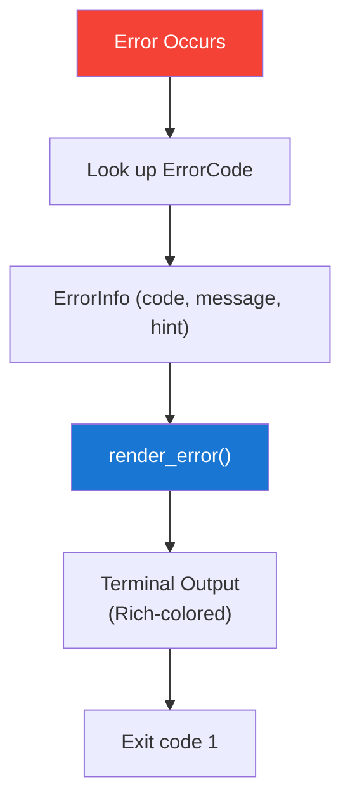

# Error Codes

Every ReleaseKit error uses a structured `RK-NAMED-KEY` code with a
human-readable message and actionable hint.

## Error Rendering

Errors are rendered in **Rust-compiler style** with color:

```
error[RK-CONFIG-NOT-FOUND]: No releasekit.toml found in workspace root.
  |
  = hint: Run 'releasekit init' to generate a default configuration.
```

## Looking Up Errors

```bash
releasekit explain RK-GRAPH-CYCLE-DETECTED
```

## Error Categories

### Configuration Errors (`RK-CONFIG-*`)

| Code | Message | Fix |
|------|---------|-----|
| `RK-CONFIG-NOT-FOUND` | No `releasekit.toml` found | Run `releasekit init` |
| `RK-CONFIG-UNKNOWN-KEY` | Unrecognized key (with typo suggestion) | Check spelling; run `releasekit init` for template |
| `RK-CONFIG-INVALID-TYPE` | Wrong value type (e.g., string instead of list) | Fix the type in `releasekit.toml` |
| `RK-CONFIG-INVALID-VALUE` | Invalid enum value | Use one of the allowed values |
| `RK-CONFIG-PARSE-ERROR` | TOML syntax error | Fix TOML syntax |

### Workspace Errors (`RK-WORKSPACE-*`)

| Code | Message | Fix |
|------|---------|-----|
| `RK-WORKSPACE-NO-ROOT` | No workspace root found | Ensure `pyproject.toml` has `[tool.uv.workspace]` |
| `RK-WORKSPACE-NO-PACKAGES` | No packages discovered | Check workspace member globs |

### Graph Errors (`RK-GRAPH-*`)

| Code | Message | Fix |
|------|---------|-----|
| `RK-GRAPH-CYCLE-DETECTED` | Circular dependency found | Break the cycle; run `releasekit graph` to visualize |

### Version Errors (`RK-VERSION-*`)

| Code | Message | Fix |
|------|---------|-----|
| `RK-VERSION-INVALID` | Invalid semver string | Fix the version in `pyproject.toml` |
| `RK-VERSION-CONFLICT` | Version already exists on registry | Bump the version or check if already published |

### Preflight Errors (`RK-PREFLIGHT-*`)

| Code | Message | Fix |
|------|---------|-----|
| `RK-PREFLIGHT-DIRTY-TREE` | Uncommitted changes in working tree | Commit or stash changes |
| `RK-PREFLIGHT-LOCK-STALE` | `uv.lock` is out of date | Run `uv lock` |
| `RK-PREFLIGHT-SHALLOW-CLONE` | Repository is a shallow clone | Run `git fetch --unshallow` |

### Publish Errors (`RK-PUBLISH-*`)

| Code | Message | Fix |
|------|---------|-----|
| `RK-PUBLISH-BUILD-FAILED` | Package build failed | Check build logs; fix source errors |
| `RK-PUBLISH-UPLOAD-FAILED` | Upload to registry failed | Check credentials and network |
| `RK-PUBLISH-CHECKSUM-MISMATCH` | Post-publish checksum doesn't match | Re-publish; check for registry corruption |

### Changelog Errors (`RK-CHANGELOG-*`)

| Code | Message | Fix |
|------|---------|-----|
| `RK-CHANGELOG-GENERATION-FAILED` | Changelog generation failed | Check git log access; ensure conventional commits |

### State Errors (`RK-STATE-*`)

| Code | Message | Fix |
|------|---------|-----|
| `RK-STATE-CORRUPTED` | State file is malformed | Delete `.releasekit-state.json` and retry |
| `RK-STATE-SHA-MISMATCH` | HEAD doesn't match saved state | Delete state file and start fresh |

### Lock Errors (`RK-LOCK-*`)

| Code | Message | Fix |
|------|---------|-----|
| `RK-LOCK-ACQUISITION-FAILED` | Another release is in progress | Wait for the other release to finish or delete the lock file |

## Error Flow


