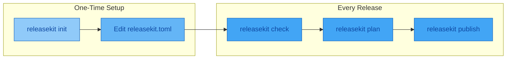

# Getting Started

This guide walks you through installing ReleaseKit, initializing
configuration, and publishing your first release.

## Prerequisites

- **Python 3.10+**
- **Git** with Conventional Commits
- One or more ecosystem tools: **uv** (Python), **pnpm** (JS), **go** (Go),
  **cargo** (Rust), **dart** / **melos** (Dart), **mvn** / **gradle** (Java/Kotlin),
  **bazel** (Bazel)

## Installation

=== "uv tool (recommended)"

    ```bash
    uv tool install releasekit
    ```

=== "uvx (no install)"

    ```bash
    uvx releasekit --help
    ```

=== "pip"

    ```bash
    pip install releasekit
    ```

## Workflow Overview



## Step 1: Initialize Configuration

From your workspace root (the directory containing `pyproject.toml` with
`[tool.uv.workspace]`):

```bash
releasekit init
```

This auto-detects your ecosystem and generates `releasekit.toml`:

```toml
tag_format      = "{name}-v{version}"
umbrella_tag    = "v{version}"
publish_from    = "local"

[groups]
core    = ["genkit"]
plugins = ["genkit-plugin-*"]
```

## Step 2: Discover Your Workspace

```bash
releasekit discover
```

Output:

```
┌──────────────────────────────┬─────────┬──────────────────────────────────┐
│ Package                      │ Version │ Path                             │
├──────────────────────────────┼─────────┼──────────────────────────────────┤
│ genkit                       │ 0.5.0   │ packages/genkit                  │
│ genkit-plugin-google-genai   │ 0.5.0   │ plugins/google-genai             │
│ genkit-plugin-ollama         │ 0.5.0   │ plugins/ollama                   │
│ sample-basic                 │ 0.1.0   │ samples/basic                    │
└──────────────────────────────┴─────────┴──────────────────────────────────┘
```

## Step 3: Visualize Dependencies

```bash
releasekit graph --format ascii
```

```
┌─────────────────────────────────────────────┐
│ Level 0                                     │
│ ┌─────────┐                                 │
│ │ genkit  │                                 │
│ └────┬────┘                                 │
├──────┼──────────────────────────────────────┤
│ Level 1                                     │
│ ┌────┴───────────────────┐ ┌──────────────┐ │
│ │ genkit-plugin-google   │ │ genkit-plg-  │ │
│ │ -genai                 │ │ ollama       │ │
│ └────────────┬───────────┘ └──────────────┘ │
├──────────────┼──────────────────────────────┤
│ Level 2                                     │
│ ┌────────────┴───────────┐                  │
│ │ sample-basic           │                  │
│ └────────────────────────┘                  │
└─────────────────────────────────────────────┘
```

## Step 4: Run Health Checks

```bash
releasekit check
```

This runs all workspace validation checks:

```
✓ dependency_cycles         No circular dependencies
✓ lockfile_staleness        uv.lock is up to date
✓ type_markers              All packages have py.typed
⚠ version_consistency       genkit-plugin-ollama has version 0.4.0 (expected 0.5.0)
✓ naming_convention         All names match genkit-plugin-{dir} pattern
```

## Step 5: Preview the Plan

```bash
releasekit plan
```

```
┌──────────────────────────────┬──────────┬───────────┬───────────┐
│ Package                      │   Bump   │ Current   │  Next     │
├──────────────────────────────┼──────────┼───────────┼───────────┤
│ genkit                       │  minor   │ 0.5.0     │ 0.6.0     │
│ genkit-plugin-google-genai   │  patch   │ 0.5.0     │ 0.5.1     │
│ genkit-plugin-ollama         │  none    │ 0.5.0     │ (skip)    │
└──────────────────────────────┴──────────┴───────────┴───────────┘
```

Bumps are automatically calculated from your
[Conventional Commits](https://www.conventionalcommits.org/) — a
`feat:` commit triggers a **minor** bump, a `fix:` triggers a
**patch**, and packages with no matching commits are skipped.

## Step 6: Publish

```bash
# Dry run first
releasekit publish --dry-run

# Publish for real
releasekit publish
```

The publish pipeline for each package:

```
pin ──▶ build ──▶ publish ──▶ poll ──▶ verify ──▶ restore
 │        │         │           │        │          │
 │        │         │           │        │          └─ Restore original
 │        │         │           │        │             pyproject.toml
 │        │         │           │        └─ SHA-256 checksum
 │        │         │           │           verification
 │        │         │           └─ Poll registry until
 │        │         │              version appears
 │        │         └─ Upload to PyPI/npm
 │        └─ uv build / pnpm build
 └─ Lock internal deps to exact versions
    for a reproducible build
```

## Next Steps

- [Configuration](configuration.md) — Customize `releasekit.toml`
- [Versioning Schemes](versioning-schemes.md) — Understand semver vs PEP 440 vs CalVer
- [Per-Package Config](per-package-config.md) — Override settings for individual packages
- [Multi-Ecosystem](multi-ecosystem.md) — Python + JavaScript + Go in one monorepo
- [Publish Pipeline](publish-pipeline.md) — The 6-stage publish pipeline explained
- [Health Checks & Doctor](health-checks.md) — Validate your workspace
- [Snapshots & Pre-Releases](snapshots.md) — Dev builds, RCs, and promoting to stable
- [Signing & Verification](signing.md) — Sigstore keyless artifact signing
- [CI/CD Integration](ci-cd.md) — Automate releases in CI
- [Workflow Templates](workflow-templates.md) — Copy-paste GitHub Actions workflows
- [Migration](migration.md) — Migrate from release-please, semantic-release, etc.
- [FAQ](faq.md) — Common questions and edge cases
- [Error Codes](error-codes.md) — Troubleshoot common issues

---

## Advanced Setup

### Shell Completions

=== "Bash"

    ```bash
    eval "$(releasekit completion bash)"
    ```

=== "Zsh"

    ```bash
    eval "$(releasekit completion zsh)"
    ```

=== "Fish"

    ```bash
    releasekit completion fish | source
    ```
