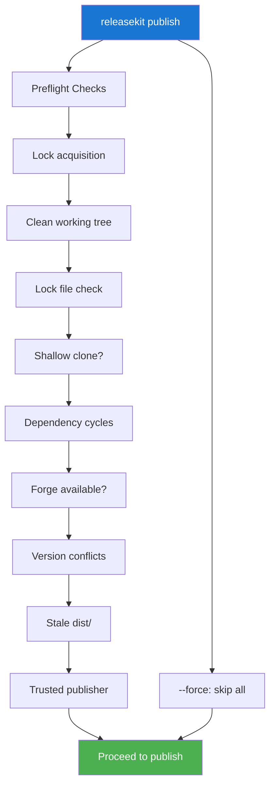

# Health Checks & Doctor

ReleaseKit has two levels of workspace validation:

- **`check`** — Quick validation of package metadata and structure
- **`doctor`** — Deep diagnostics including VCS, forge, and config health

## ELI5: check vs doctor

| | `releasekit check` | `releasekit doctor` |
|---|---|---|
| **Speed** | Fast (seconds) | Slower (network calls) |
| **Scope** | Package metadata | Whole environment |
| **When** | Every commit / PR | Before first release, debugging |
| **Analogy** | "Are all the boxes labeled correctly?" | "Is the whole warehouse ready to ship?" |

## Quick Start

```bash
# Run health checks
releasekit check

# Auto-fix what can be fixed
releasekit check --fix

# Deep diagnostics
releasekit doctor
```

## Health Checks (`check`)

### What Gets Checked

`releasekit check` runs **33 checks** split into two categories:

**Universal checks (8 — always run):**

- `cycles` — circular dependency chains
- `self_deps` — package depends on itself
- `orphan_deps` — internal dep not in workspace
- `missing_license` — no LICENSE file
- `missing_readme` — no README.md
- `stale_artifacts` — leftover .bak or dist/ files
- `ungrouped_packages` — all packages appear in at least one `[groups]` pattern
- `lockfile_staleness` — lock file is in sync with manifest

**Language-specific checks (25 — via `CheckBackend` protocol):**

- `type_markers` — py.typed PEP 561 marker
- `version_consistency` — plugin version matches core
- `naming_convention` — directory matches package name
- `metadata_completeness` — pyproject.toml required fields
- `python_version` — consistent `requires-python` across packages
- `python_classifiers` — Python version classifiers (3.10–3.14)
- `dependency_resolution` — `uv pip check` passes
- `namespace_init` — no `__init__.py` in namespace directories
- `readme_field` — publishable packages declare `readme` in `[project]`
- `changelog_url` — publishable packages have `Changelog` in `[project.urls]`
- `publish_classifier_consistency` — `exclude_publish` agrees with `Private :: Do Not Upload`
- `test_filename_collisions` — no duplicate test file paths across packages
- `build_system` — `[build-system]` present with `build-backend`
- `version_field` — `version` present or declared dynamic
- `duplicate_dependencies` — no duplicate entries in `[project.dependencies]`
- `pinned_deps_in_libraries` — libraries don't pin deps with `==`
- `requires_python` — publishable packages declare `requires-python`
- `readme_content_type` — readme file extension matches content-type
- `version_pep440` — versions are PEP 440 compliant
- `placeholder_urls` — no placeholder URLs in `[project.urls]`
- `legacy_setup_files` — no leftover `setup.py` or `setup.cfg`
- `deprecated_classifiers` — no deprecated trove classifiers
- `license_classifier_mismatch` — license classifiers match LICENSE file
- `unreachable_extras` — optional-dependencies reference valid packages
- `self_dependencies` — no package lists itself in dependencies

### Per-Ecosystem Checks

Different ecosystems run different checks:

| Check | Python | JS | Go | Rust | Dart | Java |
|-------|:------:|:--:|:--:|:----:|:----:|:----:|
| Dependency cycles | ✅ | ✅ | ✅ | ✅ | ✅ | ✅ |
| Lock file | ✅ | ✅ | — | ✅ | ✅ | — |
| Type markers | ✅ | — | — | — | — | — |
| Version consistency | ✅ | ✅ | — | ✅ | ✅ | ✅ |
| Naming convention | ✅ | ✅ | — | ✅ | ✅ | — |
| Metadata completeness | ✅ | ✅ | — | ✅ | ✅ | ✅ |
| OSS files | ✅ | ✅ | ✅ | ✅ | ✅ | ✅ |
| Classifiers | ✅ | — | — | — | — | — |
| Namespace init | ✅ | — | — | — | — | — |

### Auto-Fix

`releasekit check --fix` runs **17 auto-fixers**:

**Universal fixers (3):**

- `fix_missing_readme` — create empty README.md
- `fix_missing_license` — copy bundled Apache 2.0 LICENSE
- `fix_stale_artifacts` — delete .bak files and dist/ directories

**Python-specific fixers (14 — via `PythonCheckBackend.run_fixes()`):**

- `fix_publish_classifiers` — sync `Private :: Do Not Upload` with `exclude_publish`
- `fix_readme_field` — add `readme = "README.md"` to `[project]`
- `fix_changelog_url` — add `Changelog` to `[project.urls]`
- `fix_namespace_init` — delete `__init__.py` in namespace directories
- `fix_type_markers` — create `py.typed` PEP 561 markers
- `fix_deprecated_classifiers` — replace/remove deprecated classifiers
- `fix_duplicate_dependencies` — deduplicate `[project.dependencies]`
- `fix_requires_python` — add `requires-python` (inferred from classifiers)
- `fix_build_system` — add `[build-system]` with hatchling
- `fix_version_field` — add `"version"` to `dynamic` list
- `fix_readme_content_type` — fix content-type to match file extension
- `fix_placeholder_urls` — remove placeholder URLs
- `fix_license_classifier_mismatch` — fix license classifier to match LICENSE file
- `fix_self_dependencies` — remove self-referencing dependencies

### Reading Check Output

```
✓ dependency_cycles         No circular dependencies
✓ lockfile_staleness        uv.lock is up to date
✓ type_markers              All packages have py.typed
⚠ version_consistency       genkit-plugin-foo has version 0.4.0 (expected 0.5.0)
✓ naming_convention         All names match genkit-plugin-{dir} pattern
```

- **✓** = passed
- **⚠** = warning (non-blocking, but should be fixed)
- **✗** = error (blocks publishing)

### Source-Level Diagnostics

When a check fails, ReleaseKit shows **Rust-compiler-style** diagnostics
with file paths and line numbers:

```
error[version_consistency]: genkit-plugin-foo has version 0.4.0 (expected 0.5.0)
  --> plugins/foo/pyproject.toml:3
   |
 3 | version = "0.4.0"
   |           ^^^^^^^ expected 0.5.0
   |
  = hint: Run 'releasekit check --fix' or update the version manually.
```

## Doctor (`doctor`)

The `doctor` command runs deeper diagnostics that require network
access and environment checks:

```bash
releasekit doctor
```

```
✅ vcs_reachable: Git repository is accessible
✅ forge_auth: GitHub API token is valid
⚠️  shallow_clone: Repository is a shallow clone
   → Run 'git fetch --unshallow' for accurate version computation
✅ config_valid: releasekit.toml passes all validation
✅ ecosystem_detected: Python (uv) workspace found
❌ lockfile_stale: uv.lock is out of date
   → Run 'uv lock' to update

5 passed, 1 warnings, 1 failures
```

### Doctor Checks

| Check | What It Validates |
|-------|------------------|
| `vcs_reachable` | Git repo exists and is accessible |
| `forge_auth` | GitHub/GitLab token is valid |
| `shallow_clone` | Repo has full history |
| `config_valid` | `releasekit.toml` passes all validation |
| `ecosystem_detected` | Workspace ecosystem is recognized |
| `lockfile_stale` | Lock file matches manifest |
| `tag_reachable` | Last release tags are reachable |
| `registry_auth` | Registry credentials are configured |

### When to Use Doctor

- **First time setup** — after `releasekit init`
- **CI debugging** — when releases fail unexpectedly
- **After environment changes** — new machine, new CI runner
- **Before first release** — sanity check everything

## Preflight Checks (Automatic)

Before every `publish`, ReleaseKit automatically runs **preflight
checks** that are separate from `check`:



Skip preflight with `--force` (not recommended for production).

## Next Steps

- [Publish Pipeline](publish-pipeline.md) — What happens after checks pass
- [Error Codes](error-codes.md) — All `RK-*` error codes
- [FAQ](faq.md) — Common troubleshooting questions
