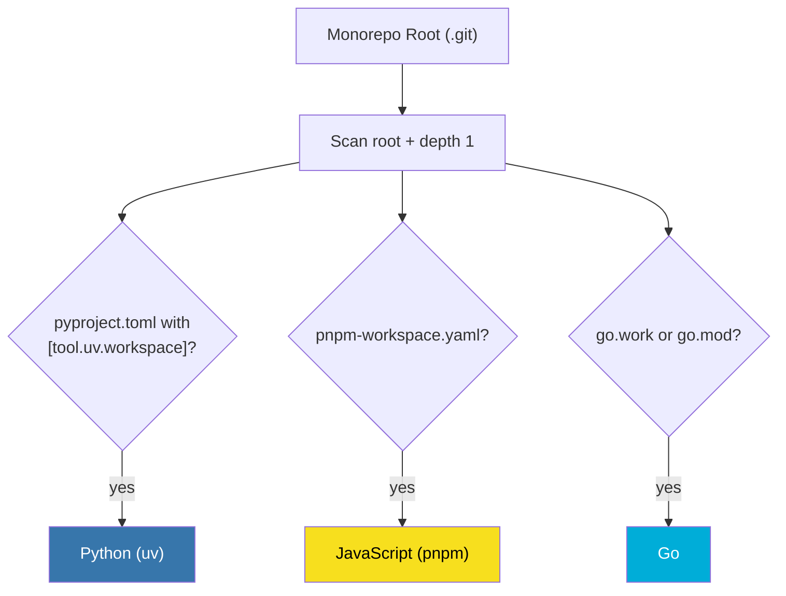
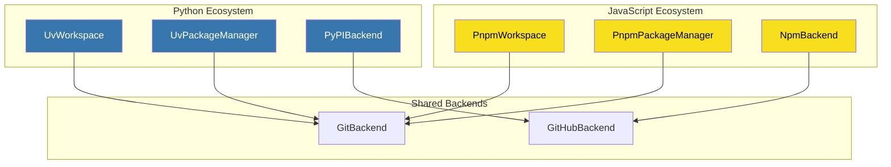

# Multi-Ecosystem Support

ReleaseKit auto-detects and manages multiple package ecosystems within
a single monorepo.

## Detection Strategy



## Detection Signals

| Ecosystem | Marker File | Location |
|-----------|------------|----------|
| Python (uv) | `pyproject.toml` with `[tool.uv.workspace]` | Root or `py/` subdirectory |
| JavaScript (pnpm) | `pnpm-workspace.yaml` | Root or `js/` subdirectory |
| Go | `go.work` or `go.mod` | Root or `go/` subdirectory |

## Example Monorepo Layout

```
monorepo/
├── .git/
├── releasekit.toml          ← shared config
├── py/                      ← Python ecosystem
│   ├── pyproject.toml       ← [tool.uv.workspace]
│   ├── packages/
│   │   └── genkit/
│   └── plugins/
│       ├── google-genai/
│       └── ollama/
├── js/                      ← JavaScript ecosystem
│   ├── pnpm-workspace.yaml
│   └── packages/
│       ├── genkit/
│       └── plugins/
└── go/                      ← Go ecosystem
    ├── go.work
    └── genkit/
```

## Filtering by Ecosystem

```bash
# Discover only Python packages
releasekit discover --ecosystem python

# Graph for JavaScript only
releasekit graph --ecosystem js --format mermaid

# Publish only Python packages
releasekit publish --ecosystem python
```

## Ecosystem-Specific Backends

Each detected ecosystem gets its own set of backends:



## Cross-Ecosystem Dependencies

!!! note "Current limitation"
    Cross-ecosystem dependencies (e.g., a Python package depending on
    a JS package) are not tracked in the dependency graph. Each ecosystem
    is treated independently for publish ordering.

## Workspace Backends

### UvWorkspace

Discovers packages by parsing `pyproject.toml`:

1. Read `[tool.uv.workspace]` → `members` globs
2. Expand globs to find package directories
3. Parse each `pyproject.toml` for name, version, dependencies
4. Return `list[Package]`

### PnpmWorkspace

Discovers packages by parsing `pnpm-workspace.yaml`:

1. Read `packages:` array of globs
2. Expand globs to find package directories
3. Parse each `package.json` for name, version, dependencies
4. Return `list[Package]`

## Supported Ecosystems

ReleaseKit has workspace backends for all major ecosystems:

| Ecosystem | Workspace Backend | Registry Backend |
|-----------|------------------|------------------|
| Python (uv) | `UvWorkspace` | `PyPIBackend` |
| JavaScript (pnpm) | `PnpmWorkspace` | `NpmRegistry` |
| Go | `GoWorkspace` | Go module proxy |
| Rust (Cargo) | `CargoWorkspace` | crates.io |
| Dart (pub) | `DartWorkspace` | pub.dev |
| Java (Maven/Gradle) | `MavenWorkspace` | Maven Central |

## Adding a New Ecosystem

To add support for a new ecosystem:

1. Create `backends/workspace/<eco>.py` implementing the `Workspace` protocol
2. Create `backends/pm/<eco>.py` implementing the `PackageManager` protocol
3. Create `backends/registry/<eco>.py` implementing the `Registry` protocol
4. Add detection logic in `detection.py`
5. Add the `Ecosystem.<ECO>` variant
