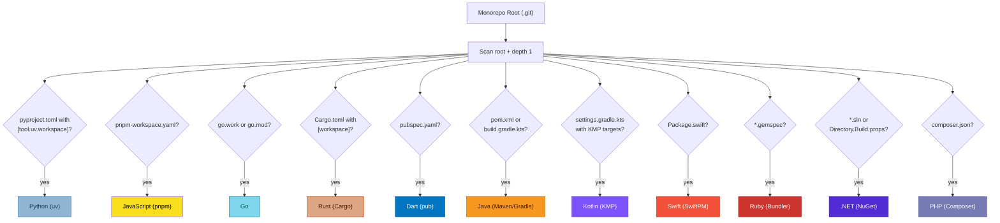

# Multi-Ecosystem Support

ReleaseKit auto-detects and manages multiple package ecosystems within
a single monorepo.

## Detection Strategy



## Detection Signals

| Ecosystem | Marker File | Location |
|-----------|------------|----------|
| Python (uv) | `pyproject.toml` with `[tool.uv.workspace]` | Root or `py/` subdirectory |
| JavaScript (pnpm) | `pnpm-workspace.yaml` | Root or `js/` subdirectory |
| Go | `go.work` or `go.mod` | Root or `go/` subdirectory |
| Rust (Cargo) | `Cargo.toml` with `[workspace]` | Root or subdirectory |
| Dart (pub) | `pubspec.yaml` | Root or subdirectory |
| Java (Maven/Gradle) | `pom.xml` or `build.gradle.kts` | Root or subdirectory |
| Kotlin (KMP) | `settings.gradle.kts` with KMP targets | Root or subdirectory |
| Swift (SwiftPM) | `Package.swift` | Root or subdirectory |
| CocoaPods | `*.podspec` | Root or subdirectory |
| Ruby (Bundler) | `*.gemspec` | Root or subdirectory |
| .NET (NuGet) | `*.sln` or `Directory.Build.props` | Root or subdirectory |
| PHP (Composer) | `composer.json` with `"type": "library"` | Root or subdirectory |

## Example Monorepo Layout

```
monorepo/
├── .git/
├── releasekit.toml          ← shared config
├── py/                      ← Python ecosystem
│   ├── pyproject.toml       ← [tool.uv.workspace]
│   ├── packages/
│   │   └── genkit/
│   └── plugins/
│       ├── google-genai/
│       └── ollama/
├── js/                      ← JavaScript ecosystem
│   ├── pnpm-workspace.yaml
│   └── packages/
│       ├── genkit/
│       └── plugins/
└── go/                      ← Go ecosystem
    ├── go.work
    └── genkit/
```

## Filtering by Ecosystem

```bash
# Discover only Python packages
releasekit discover --ecosystem python

# Graph for JavaScript only
releasekit graph --ecosystem js --format mermaid

# Publish only Python packages
releasekit publish --ecosystem python
```

## Ecosystem-Specific Backends

Each detected ecosystem gets its own set of backends:

```mermaid
graph TB
    subgraph "Python Ecosystem"
        UV_WS["UvWorkspace"]
        UV_PM["UvPackageManager"]
        PYPI["PyPIBackend"]
    end

    subgraph "JavaScript Ecosystem"
        PNPM_WS["PnpmWorkspace"]
        PNPM_PM["PnpmPackageManager"]
        NPM["NpmBackend"]
    end

    subgraph "Go Ecosystem"
        GO_WS["GoWorkspace"]
        GO_PM["GoBackend"]
        GOPROXY["GoProxyBackend"]
    end

    subgraph "Rust Ecosystem"
        CARGO_WS["CargoWorkspace"]
        CARGO_PM["CargoBackend"]
        CRATES["CratesIoBackend"]
    end

    subgraph "Java/Kotlin Ecosystem"
        MVN_WS["MavenWorkspace"]
        MVN_PM["MavenBackend"]
        MVN_REG["MavenCentralBackend"]
    end

    subgraph "Dart Ecosystem"
        DART_WS["DartWorkspace"]
        DART_PM["DartBackend"]
        PUBDEV["PubDevBackend"]
    end

    subgraph "Planned Ecosystems"
        direction TB
        SWIFT_WS["SwiftWorkspace 🔜"]
        RUBY_WS["RubyWorkspace 🔜"]
        DOTNET_WS["DotnetWorkspace 🔜"]
        PHP_WS["PhpWorkspace 🔜"]
    end

    subgraph "Shared Backends"
        GIT["GitBackend"]
        GH["GitHubBackend"]
    end

    UV_WS & PNPM_WS & GO_WS & CARGO_WS & MVN_WS & DART_WS --> GIT
    PYPI & NPM & GOPROXY & CRATES & MVN_REG & PUBDEV --> GH

    style UV_WS fill:#90b4d4,stroke:#3776ab,color:#1a3a5c
    style UV_PM fill:#90b4d4,stroke:#3776ab,color:#1a3a5c
    style PYPI fill:#90b4d4,stroke:#3776ab,color:#1a3a5c
    style PNPM_WS fill:#f7df1e,color:#000
    style PNPM_PM fill:#f7df1e,color:#000
    style NPM fill:#f7df1e,color:#000
    style GO_WS fill:#80d6ec,stroke:#00838f,color:#004d40
    style GO_PM fill:#80d6ec,stroke:#00838f,color:#004d40
    style GOPROXY fill:#80d6ec,stroke:#00838f,color:#004d40
    style CARGO_WS fill:#dea584,stroke:#b7410e,color:#3e1a00
    style CARGO_PM fill:#dea584,stroke:#b7410e,color:#3e1a00
    style CRATES fill:#dea584,stroke:#b7410e,color:#3e1a00
    style MVN_WS fill:#f89820,stroke:#b07219,color:#3e1a00
    style MVN_PM fill:#f89820,stroke:#b07219,color:#3e1a00
    style MVN_REG fill:#f89820,stroke:#b07219,color:#3e1a00
    style DART_WS fill:#0175c2,stroke:#02569b,color:#fff
    style DART_PM fill:#0175c2,stroke:#02569b,color:#fff
    style PUBDEV fill:#0175c2,stroke:#02569b,color:#fff
```



## Cross-Ecosystem Dependencies

!!! note "Current limitation"
    Cross-ecosystem dependencies (e.g., a Python package depending on
    a JS package) are not tracked in the dependency graph. Each ecosystem
    is treated independently for publish ordering.

## Workspace Backends

### UvWorkspace

Discovers packages by parsing `pyproject.toml`:

1. Read `[tool.uv.workspace]` → `members` globs
2. Expand globs to find package directories
3. Parse each `pyproject.toml` for name, version, dependencies
4. Return `list[Package]`

### PnpmWorkspace

Discovers packages by parsing `pnpm-workspace.yaml`:

1. Read `packages:` array of globs
2. Expand globs to find package directories
3. Parse each `package.json` for name, version, dependencies
4. Return `list[Package]`

### GoWorkspace

Discovers modules from `go.work` or standalone `go.mod`:

1. Read `go.work` → `use` directives list module directories
2. Parse each `go.mod` for module path, Go version, dependencies
3. Return `list[Package]`

### CargoWorkspace

Discovers crates from `Cargo.toml` workspace:

1. Read `[workspace]` → `members` globs
2. Parse each crate's `Cargo.toml` for name, version, `[dependencies]`
3. Return `list[Package]`

### DartWorkspace

Discovers packages from `pubspec.yaml` files:

1. Scan for `pubspec.yaml` files (or use `melos.yaml` if present)
2. Parse each for name, version, `dependencies`
3. Return `list[Package]`

### MavenWorkspace

Discovers modules from Maven/Gradle projects:

1. Read `pom.xml` `<modules>` or `settings.gradle.kts` `include()`
2. Parse each module's manifest for groupId, artifactId, version
3. Return `list[Package]`

## Supported Ecosystems

ReleaseKit has workspace backends for all major ecosystems:

| Ecosystem | Workspace Backend | PM Backend | Registry Backend | Status |
|-----------|------------------|-----------|-----------------|--------|
| Python (uv) | `UvWorkspace` | `UvBackend` | `PyPIBackend` | ✅ Shipped |
| JavaScript (pnpm) | `PnpmWorkspace` | `PnpmBackend` | `NpmRegistry` | ✅ Shipped |
| Go | `GoWorkspace` | `GoBackend` | `GoProxyBackend` | ✅ Shipped |
| Rust (Cargo) | `CargoWorkspace` | `CargoBackend` | `CratesIoBackend` | ✅ Shipped |
| Dart (pub) | `DartWorkspace` | `DartBackend` | `PubDevBackend` | ✅ Shipped |
| Java (Maven/Gradle) | `MavenWorkspace` | `MavenBackend` | `MavenCentralBackend` | ✅ Shipped |
| Bazel (polyglot) | `BazelWorkspace` | `BazelBackend` | *(per-ecosystem)* | ✅ Shipped |
| Kotlin (KMP) | `KotlinWorkspace` | `KotlinBackend` | `MavenCentralBackend` | 🔜 Planned |
| Swift (SwiftPM) | `SwiftWorkspace` | `SwiftBackend` | `SwiftRegistry` | 🔜 Planned |
| CocoaPods | `CocoaPodsWorkspace` | `CocoaPodsBackend` | `CocoaPodsRegistry` | 🔜 Planned |
| Ruby (Bundler) | `RubyWorkspace` | `RubyBackend` | `RubyGemsBackend` | 🔜 Planned |
| .NET (NuGet) | `DotnetWorkspace` | `DotnetBackend` | `NuGetBackend` | 🔜 Planned |
| PHP (Composer) | `PhpWorkspace` | `PhpBackend` | `PackagistBackend` | 🔜 Planned |
| VS Code Extension | — | `VscodeBackend` | `VscodeMarketplace` | 🔜 Planned |
| IntelliJ Plugin | — | `IntelliJBackend` | `JetBrainsMarketplace` | 🔜 Planned |
| Browser Extension | `BrowserExtWorkspace` | `BrowserExtBackend` | `ChromeWebStore` / `FirefoxAddons` | 🔜 Planned |

## Adding a New Ecosystem

To add support for a new ecosystem:

1. Create `backends/workspace/<eco>.py` implementing the `Workspace` protocol
2. Create `backends/pm/<eco>.py` implementing the `PackageManager` protocol
3. Create `backends/registry/<eco>.py` implementing the `Registry` protocol
4. Add detection logic in `detection.py`
5. Add the `Ecosystem.<ECO>` variant
