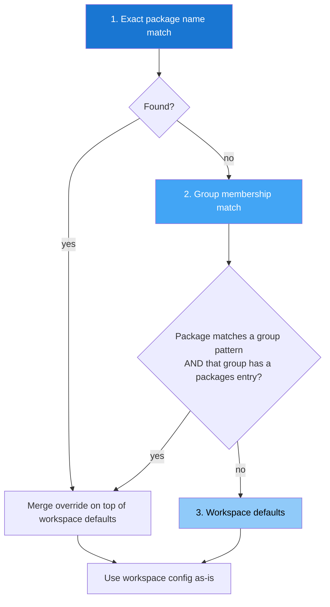

# Per-Package Configuration

Sometimes a single workspace contains packages with different needs —
a Python library that publishes to PyPI and a JS wrapper that publishes
to npm, or a package that needs a custom registry URL for testing.

Per-package configuration lets you override workspace-level settings
for specific packages without splitting them into separate workspaces.

## ELI5: How It Works

```
┌─────────────────────────────────────────────────────────┐
│                   Your Workspace                         │
│                                                         │
│  [workspace.mono]                                       │
│  versioning_scheme = "pep440"    ← default for all      │
│  smoke_test = true                                      │
│                                                         │
│  ┌─────────────┐  ┌─────────────┐  ┌─────────────┐     │
│  │ my-py-lib   │  │ my-py-util  │  │ my-js-sdk   │     │
│  │             │  │             │  │             │     │
│  │ pep440  ✓   │  │ pep440  ✓   │  │ semver  ★   │     │
│  │ (inherited) │  │ (inherited) │  │ (override)  │     │
│  └─────────────┘  └─────────────┘  └─────────────┘     │
│                                                         │
│  ✓ = inherited from workspace                           │
│  ★ = overridden per-package                             │
└─────────────────────────────────────────────────────────┘
```

## Quick Start

Add a `[workspace.<label>.packages."<name>"]` section to your
`releasekit.toml`:

```toml
[workspace.mono]
ecosystem = "python"
root = "."

# Override for one specific package
[workspace.mono.packages."my-js-sdk"]
versioning_scheme = "semver"
dist_tag = "latest"
```

That's it. `my-js-sdk` now uses semver while everything else uses
pep440 (the Python default).

## Available Override Fields

| Field | Type | What It Does |
|-------|------|-------------|
| `versioning_scheme` | `string` | `"semver"`, `"pep440"`, or `"calver"` |
| `calver_format` | `string` | CalVer format (e.g. `"YYYY.MM.MICRO"`) |
| `prerelease_label` | `string` | Default pre-release label (`"alpha"`, `"beta"`, `"rc"`, `"dev"`) |
| `changelog` | `bool` | Generate CHANGELOG.md entries for this package |
| `changelog_template` | `string` | Path to a custom Jinja2 changelog template |
| `smoke_test` | `bool` | Run install smoke test after publishing |
| `major_on_zero` | `bool` | Allow `0.x` → `1.0.0` on breaking changes |
| `extra_files` | `list[string]` | Extra files with version strings to bump |
| `dist_tag` | `string` | npm dist-tag (e.g. `"latest"`, `"next"`) |
| `registry_url` | `string` | Custom registry URL for publishing |
| `provenance` | `bool` | Generate npm provenance attestation |
| `skip_checks` | `list[string]` | Health checks to skip for this package (see [Skipping Checks](skip-checks.md)) |

!!! tip "Only set what you need"
    You don't need to repeat workspace-level values. Unset fields
    automatically inherit from the workspace. Only specify the fields
    you want to override.

## Resolution Order

ReleaseKit resolves configuration in this order (most specific wins):



### Example: Exact Name vs Group

```toml
[workspace.mono]
versioning_scheme = "pep440"

[workspace.mono.groups]
plugins = ["myorg-plugin-*"]

# Group-level override: all plugins use semver
[workspace.mono.packages.plugins]
versioning_scheme = "semver"

# Package-level override: this one plugin uses calver
[workspace.mono.packages."myorg-plugin-special"]
versioning_scheme = "calver"
calver_format = "YYYY.MM.MICRO"
```

Resolution for each package:

| Package | Matches | Resolved Scheme |
|---------|---------|-----------------|
| `myorg-core` | no override | `pep440` (workspace default) |
| `myorg-plugin-foo` | group `plugins` | `semver` (group override) |
| `myorg-plugin-special` | exact name | `calver` (exact override wins) |

## Codelab: Publishing to Test PyPI

**Goal:** Publish one experimental package to Test PyPI while everything
else goes to production PyPI.

### Step 1: Add the override

```toml
[workspace.py]
ecosystem = "python"
root = "py"

[workspace.py.packages."myorg-experimental"]
registry_url = "https://test.pypi.org/legacy/"
smoke_test = false  # Test PyPI doesn't always have deps
```

### Step 2: Verify

```bash
releasekit plan
```

All packages show their normal versions. The override only affects
*where* `myorg-experimental` publishes, not *how* it's versioned.

### Step 3: Publish

```bash
releasekit publish
```

`myorg-experimental` goes to Test PyPI. Everything else goes to
production PyPI.

## Codelab: Mixed Python + JS Workspace

**Goal:** A monorepo with Python libraries and a JS SDK, all in one
workspace.

### Step 1: Configure groups and overrides

```toml
[workspace.mono]
ecosystem = "python"
root = "."

[workspace.mono.groups]
py-libs = ["myproject-*"]
js-sdk  = ["myproject-js-*"]

# JS packages use semver and publish to npm
[workspace.mono.packages.js-sdk]
versioning_scheme = "semver"
dist_tag = "latest"
provenance = true
```

### Step 2: Check the plan

```bash
releasekit plan --prerelease rc
```

Python packages get PEP 440 pre-releases (`1.2.0rc1`), JS packages
get semver pre-releases (`1.2.0-rc.1`).

## Advanced: Group Overrides

You can apply overrides to an entire group by using the group name
as the package key:

```toml
[workspace.mono.groups]
plugins   = ["myorg-plugin-*"]
internals = ["myorg-internal-*"]

# All plugins: disable changelog, enable provenance
[workspace.mono.packages.plugins]
changelog = false
provenance = true

# All internals: publish to private registry
[workspace.mono.packages.internals]
registry_url = "https://private.registry.example.com"
smoke_test = false
```

!!! warning "Group names must match"
    The key in `[workspace.X.packages.GROUP]` must exactly match a
    group name defined in `[workspace.X.groups]`. If the group doesn't
    exist, the override is treated as a literal package name.

## How Merging Works

When an override is found, non-empty fields replace the workspace
default. Empty or unset fields inherit from the workspace:

```
Workspace:  versioning_scheme = "pep440"
            dist_tag          = "latest"
            major_on_zero     = true
            smoke_test        = true

Override:   registry_url      = "https://test.pypi.org"
            smoke_test        = false

Result:     versioning_scheme = "pep440"    ← inherited
            dist_tag          = "latest"    ← inherited
            major_on_zero     = true        ← inherited
            smoke_test        = false       ← overridden
            registry_url      = "https://test.pypi.org"  ← overridden
```

## Next Steps

- [Versioning Schemes](versioning-schemes.md) — Deep dive into semver vs PEP 440 vs CalVer
- [Configuration Reference](../reference/config-file.md) — Full schema
- [CI/CD Integration](ci-cd.md) — Automate releases with GitHub Actions
