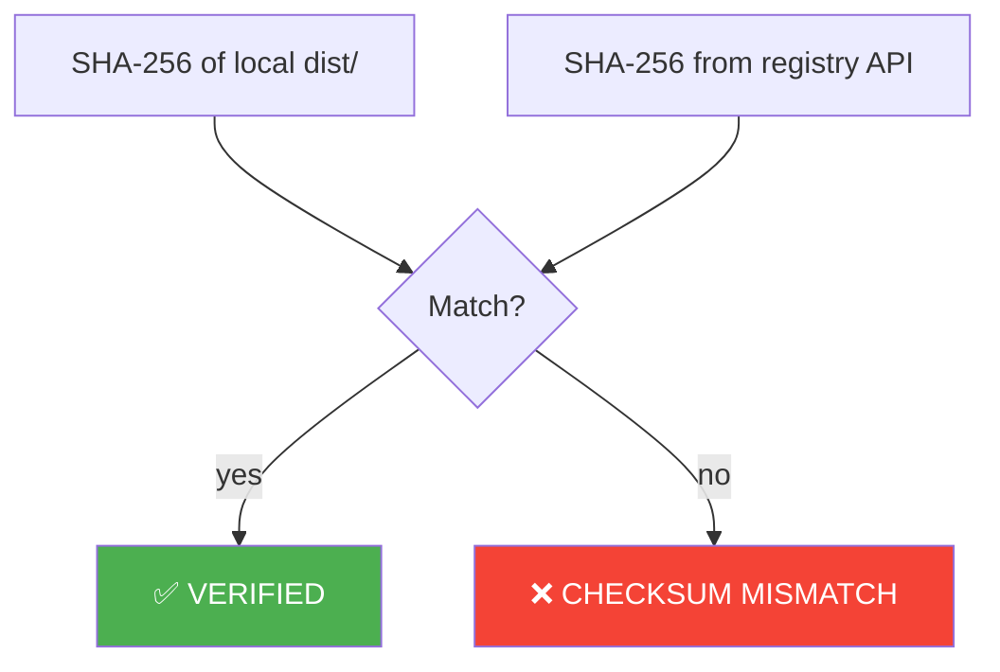
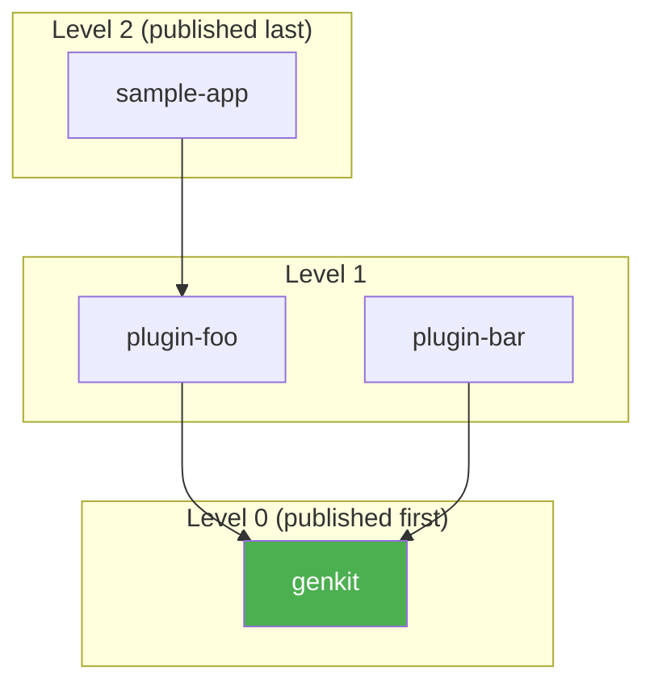

# Publish Pipeline

When you run `releasekit publish`, each package goes through a 6-stage
pipeline. This guide explains what happens at each stage and how to
troubleshoot issues.

## ELI5: What Happens When You Publish?

Think of it like mailing a package:

```
┌─────────────────────────────────────────────────────────────────┐
│                    The 6-Stage Pipeline                          │
│                                                                 │
│  1. PIN       "Write the exact address on the label"            │
│               Lock internal deps to exact versions              │
│                                                                 │
│  2. BUILD     "Pack the box"                                    │
│               Create .whl and .tar.gz (or npm tarball)          │
│                                                                 │
│  3. PUBLISH   "Drop it at the post office"                      │
│               Upload to PyPI / npm / crates.io                  │
│                                                                 │
│  4. POLL      "Track the shipment"                              │
│               Wait until the registry says it's available        │
│                                                                 │
│  5. VERIFY    "Check the tracking receipt"                      │
│               Compare SHA-256 checksums local vs registry        │
│                                                                 │
│  6. RESTORE   "Clean up your desk"                              │
│               Put the original pyproject.toml back               │
│                                                                 │
└─────────────────────────────────────────────────────────────────┘
```

## Visual Pipeline


## Stage Details

### Stage 1: Pin — Lock Internal Dependencies

Before building, ReleaseKit rewrites your internal dependency
specifiers to exact versions:

```
Before:  genkit >= 0.5.0
After:   genkit == 0.6.0
```

**Why?** This ensures the published package declares the exact
dependency versions that were tested together. Without pinning,
a user could install `genkit-plugin-foo@0.6.0` with `genkit@0.5.0`
and hit incompatibilities.

!!! note
    The original `pyproject.toml` is backed up and restored in
    Stage 6. Your working tree is never permanently modified.

### Stage 2: Build — Create Artifacts

| Ecosystem | Command | Output |
|-----------|---------|--------|
| Python (uv) | `uv build` | `dist/*.tar.gz` + `dist/*.whl` |
| JavaScript (pnpm) | `pnpm pack` | `.tgz` tarball |
| Rust (cargo) | `cargo package` | `.crate` file |
| Go | *(no build — published via git tags)* | — |

### Stage 3: Publish — Upload to Registry

| Ecosystem | Command | Registry |
|-----------|---------|----------|
| Python | `uv publish dist/*` | PyPI |
| JavaScript | `pnpm publish` | npm |
| Rust | `cargo publish` | crates.io |
| Go | *(git push tags)* | Go proxy |

### Stage 4: Poll — Wait for Availability

After uploading, ReleaseKit polls the registry until the new version
appears:

```
Polling genkit@0.6.0 on PyPI... ⏳ (5s intervals, 300s timeout)
  attempt 1: not yet
  attempt 2: not yet
  attempt 3: ✅ available
```

This ensures downstream packages can resolve the dependency before
they're published.

### Stage 5: Verify — Checksum Validation



### Stage 6: Restore — Clean Up

The original `pyproject.toml` (backed up in Stage 1) is restored.
This happens **even if publishing fails** — your working tree is
never left in a pinned state.

## Publish Order

Packages are published in **dependency order** using topological
sorting. If `plugin-foo` depends on `genkit`, then `genkit` is
published first:



Within each level, packages are published **concurrently** (up to
`--concurrency` limit, default 5).

## Crash Recovery

If publishing is interrupted (network failure, CI timeout, etc.),
ReleaseKit saves progress to a state file:

```
releasekit--state--py.json
```

When you re-run `releasekit publish`, it **resumes from where it
left off** — already-published packages are skipped:

```bash
# First run: publishes genkit, fails on plugin-foo
releasekit publish

# Second run: skips genkit, retries plugin-foo
releasekit publish
```

## Configuration

| Setting | Default | What It Controls |
|---------|---------|-----------------|
| `--concurrency` | `5` | Max packages publishing in parallel |
| `--max-retries` | `0` | Retry count per package (with exponential backoff) |
| `--dry-run` | `false` | Preview mode — no uploads |
| `--force` | `false` | Skip preflight checks |
| `poll_timeout` | `300.0` | Seconds to wait for registry availability |
| `verify_checksums` | `true` | Post-publish SHA-256 verification |

## Troubleshooting

| Problem | Cause | Fix |
|---------|-------|-----|
| `RK-PUBLISH-BUILD-FAILED` | Source errors | Fix build errors, then re-run |
| `RK-PUBLISH-UPLOAD-FAILED` | Auth or network | Check credentials; retry |
| `RK-PUBLISH-CHECKSUM-MISMATCH` | Registry corruption | Re-publish; contact registry support |
| Publish hangs at "Polling..." | Registry slow | Increase `poll_timeout`; check registry status page |
| "Version already exists" | Already published | Use `--force` or bump version |

## Next Steps

- [Health Checks & Doctor](health-checks.md) — Validate before publishing
- [Signing & Verification](signing.md) — Sign artifacts with Sigstore
- [CI/CD Integration](ci-cd.md) — Automate in GitHub Actions
