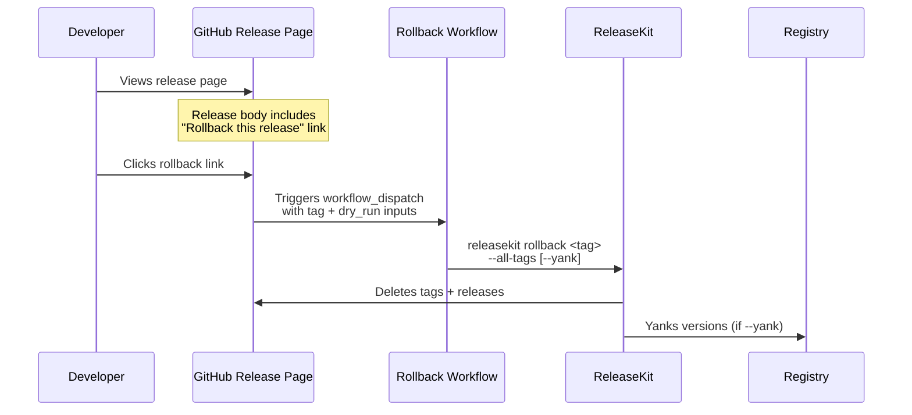

# Rollback

## ELI5 — What Is a Rollback?

Imagine you shipped a package and then realized something is wrong.
A rollback is like pressing **Ctrl+Z** on the release:

1. **Delete the git tags** so the version no longer appears in your history.
2. **Delete the GitHub/GitLab Release** so the release page disappears.
3. *(Optional)* **Yank from the registry** so nobody can install the bad version.

ReleaseKit makes all three steps a single command.

---

## Quick Start

```bash
# Preview what would happen (safe — no changes)
releasekit rollback genkit-v0.5.0 --dry-run

# Delete the single tag + its GitHub Release
releasekit rollback genkit-v0.5.0

# Delete ALL per-package tags from the same release
releasekit rollback genkit-v0.5.0 --all-tags

# Delete all tags AND yank from the registry
releasekit rollback genkit-v0.5.0 --all-tags --yank

# Provide a reason (shown to users who try to install)
releasekit rollback genkit-v0.5.0 --all-tags --yank \
  --yank-reason "Security vulnerability in auth module"
```

---

## How It Works

### Step 1: Tag Discovery

When you pass `--all-tags`, ReleaseKit finds the commit the given tag
points to, then discovers **every tag** on that commit:

```
$ git tag --points-at abc123
genkit-v0.5.0
genkit-ai-v0.5.0
genkit-plugin-firebase-v0.5.0
genkit-plugin-google-cloud-v0.5.0
py/v0.5.0
```

Without `--all-tags`, only the single tag you specified is deleted.

### Step 2: Tag + Release Deletion

For each discovered tag, ReleaseKit:

1. Deletes the **local** git tag.
2. Pushes the deletion to the **remote** (`git push origin :refs/tags/<tag>`).
3. Deletes the **GitHub/GitLab Release** associated with that tag (if the
   forge backend is available).

### Step 3: Registry Yank (opt-in)

With `--yank`, ReleaseKit parses each deleted tag to extract the package
name and version, then calls `yank_version()` on the registry backend.

**What yanking does per registry:**

| Registry | Yank Support | What Happens |
|----------|:---:|-------------|
| **PyPI** | Manual | Logs a URL — yank via the PyPI web UI |
| **npm** | ✅ | Runs `npm deprecate <pkg>@<version> "<reason>"` |
| **crates.io** | ✅ | Runs `cargo yank --version <version>` |
| **Go proxy** | ❌ | Cached forever — logs hint to use `retract` in `go.mod` |
| **pub.dev** | ❌ | Not supported — logs hint to publish a new version |
| **Maven Central** | ❌ | Immutable — logs hint to publish a new version |

!!! warning "Yanking ≠ deleting"
    Yanking **hides** a version from new installs but does **not** delete
    it. Existing lockfiles that pin the exact version continue to resolve.
    This is intentional — deleting published packages breaks the ecosystem.

---

## CLI Reference

```
releasekit rollback <tag> [OPTIONS]
```

| Flag | Default | Description |
|------|---------|-------------|
| `<tag>` | *(required)* | Git tag to rollback (e.g. `genkit-v0.5.0`) |
| `--dry-run` | `false` | Preview mode — log actions without executing |
| `--all-tags` | `false` | Delete ALL tags pointing to the same commit |
| `--yank` | `false` | Also yank versions from the package registry |
| `--yank-reason` | `""` | Human-readable reason for the yank |

---

## One-Click Rollback from GitHub

ReleaseKit can add a **"Rollback this release"** link to every GitHub
Release page. When someone clicks it, a rollback workflow is triggered
automatically.

### How the Flow Works



### Setup: Two Workflows

You need two GitHub Actions workflows:

#### 1. Release Workflow (adds the rollback link)

After publishing, the release workflow appends a rollback link to each
GitHub Release body:

```yaml
# .github/workflows/release.yml (add this step after publish)
      - name: Add rollback link to releases
        if: success()
        run: |
          REPO="${{ github.repository }}"
          ROLLBACK_URL="https://github.com/${REPO}/actions/workflows/rollback.yml"

          for tag in $(git tag --points-at HEAD); do
            RELEASE_ID=$(gh release view "$tag" --json id -q .id 2>/dev/null || echo "")
            if [ -n "$RELEASE_ID" ]; then
              EXISTING_BODY=$(gh release view "$tag" --json body -q .body)
              ROLLBACK_SECTION="

          ---

          > **Need to rollback?** [Click here to rollback this release](${ROLLBACK_URL}?tag=${tag}) — this will delete the git tag and GitHub Release."

              gh release edit "$tag" --notes "${EXISTING_BODY}${ROLLBACK_SECTION}"
              echo "Added rollback link to release: $tag"
            fi
          done
        env:
          GITHUB_TOKEN: ${{ secrets.GITHUB_TOKEN }}
```

This produces a release page that looks like:

> ## genkit-v0.5.0
>
> ### What's Changed
> - feat: add new auth module (#123)
> - fix: resolve timeout in publish (#124)
>
> ---
>
> > **Need to rollback?** [Click here to rollback this release](...) —
> > this will delete the git tag and GitHub Release.

#### 2. Rollback Workflow (does the actual rollback)

```yaml
# .github/workflows/rollback.yml
name: Rollback Release

on:
  workflow_dispatch:
    inputs:
      tag:
        description: "Git tag to rollback (e.g. genkit-v1.2.3)"
        required: true
        type: string
      all_tags:
        description: "Delete ALL per-package tags from the same release"
        required: false
        type: boolean
        default: true
      yank:
        description: "Also yank versions from the package registry"
        required: false
        type: boolean
        default: false
      yank_reason:
        description: "Reason for yanking (shown to users)"
        required: false
        type: string
        default: ""
      dry_run:
        description: "Dry run (preview only, no changes)"
        required: false
        type: boolean
        default: true

env:
  WORKSPACE_DIR: "py"
  PYTHON_VERSION: "3.12"

jobs:
  rollback:
    runs-on: ubuntu-latest
    permissions:
      contents: write
    steps:
      - uses: actions/checkout@v4
        with:
          fetch-depth: 0

      - uses: astral-sh/setup-uv@v4

      - uses: actions/setup-python@v5
        with:
          python-version: ${{ env.PYTHON_VERSION }}

      - name: Install dependencies
        run: uv sync --active
        working-directory: ${{ env.WORKSPACE_DIR }}

      - name: Rollback release
        run: |
          ARGS="${{ inputs.tag }}"
          if [ "${{ inputs.all_tags }}" = "true" ]; then
            ARGS="$ARGS --all-tags"
          fi
          if [ "${{ inputs.yank }}" = "true" ]; then
            ARGS="$ARGS --yank"
          fi
          if [ -n "${{ inputs.yank_reason }}" ]; then
            ARGS="$ARGS --yank-reason '${{ inputs.yank_reason }}'"
          fi
          if [ "${{ inputs.dry_run }}" = "true" ]; then
            ARGS="$ARGS --dry-run"
          fi
          uv run releasekit rollback $ARGS
        working-directory: ${{ env.WORKSPACE_DIR }}
        env:
          GITHUB_TOKEN: ${{ secrets.GITHUB_TOKEN }}
```

!!! tip "Dry run is the default"
    The rollback workflow defaults to `dry_run: true` so you always
    preview before making changes. Uncheck the box to execute for real.

!!! tip "Simpler with the reusable action"
    The rollback step above can be replaced with a single action call:

    ```yaml
    - uses: ./py/tools/releasekit
      with:
        command: rollback
        tag: ${{ inputs.tag }}
        dry-run: ${{ inputs.dry_run }}
    ```

    The action handles Python/uv setup, git config, and job summaries
    automatically. See the [sample rollback workflow](../../../github/workflows/releasekit-rollback.yml).

---

## Best Practices

### Always preview first

```bash
releasekit rollback genkit-v0.5.0 --all-tags --dry-run
```

Check the output before running without `--dry-run`.

### Use `--all-tags` for monorepo releases

A single release in a monorepo creates many per-package tags. Without
`--all-tags`, you'd have to rollback each tag individually.

### Yank sparingly

Yanking is a **last resort** for security issues or broken packages.
For most rollbacks, deleting tags and releases is sufficient — users
who already installed the version are unaffected.

### Document the reason

Always provide `--yank-reason` when yanking. The reason is shown to
users who try to install the yanked version:

```
WARNING: genkit 0.5.0 is yanked.
Reason: Security vulnerability in auth module — upgrade to 0.5.1
```

### Publish a follow-up version

After rolling back, publish a fix:

```bash
# Fix the issue, then:
releasekit prepare
releasekit publish
```

---

## What Rollback Does NOT Do

- **Does not revert commits.** Your code changes remain in the git
  history. Use `git revert` if you need to undo code changes.
- **Does not delete packages from registries.** Yanking hides them
  from new installs but doesn't remove them. Most registries (PyPI,
  Maven Central, Go proxy) don't support true deletion.
- **Does not notify users.** Consider posting an announcement or
  security advisory if the rollback is due to a security issue.

---

## Troubleshooting

### "Tag not found"

The tag may have already been deleted, or it may only exist on the
remote. ReleaseKit checks local tags — make sure you've fetched:

```bash
git fetch --tags
releasekit rollback genkit-v0.5.0 --all-tags
```

### "Forge not available"

ReleaseKit needs the `gh` CLI (for GitHub) or `glab` CLI (for GitLab)
to delete platform releases. Install it and authenticate:

```bash
gh auth login
```

### "Yank unsupported"

Some registries don't support yanking. ReleaseKit logs a warning with
a hint for each unsupported registry. See the table above.

---

## Next Steps

- [Workflow Templates](workflow-templates.md) — Template 5 has the full release + rollback workflow
- [CLI Reference](../reference/cli.md) — All `releasekit rollback` options
- [Signing & Verification](signing.md) — Verify artifacts before deciding to rollback
