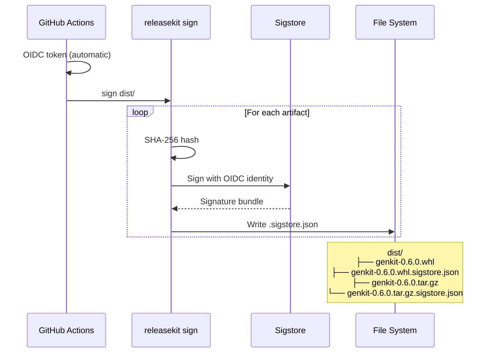

# Signing & Verification

ReleaseKit can sign your release artifacts using **Sigstore keyless
signing** — no GPG keys to manage, no secrets to rotate. In CI, it
uses OIDC identity tokens automatically.

## ELI5: What Is Artifact Signing?

```
┌─────────────────────────────────────────────────────────────────┐
│                   Why Sign Artifacts?                            │
│                                                                 │
│  Without signing:                                               │
│    "Here's genkit-0.6.0.whl. Trust me, it's legit."            │
│                                                                 │
│  With signing:                                                  │
│    "Here's genkit-0.6.0.whl + a cryptographic proof that       │
│     it was built by GitHub Actions in the firebase/genkit       │
│     repo. You can verify this yourself."                        │
│                                                                 │
│  Sigstore keyless = no keys to manage. Your CI identity         │
│  (GitHub OIDC token) IS the key.                                │
└─────────────────────────────────────────────────────────────────┘
```

## Quick Start

### Sign artifacts

```bash
# Sign all artifacts in dist/
releasekit sign dist/

# Sign specific files
releasekit sign dist/genkit-0.6.0.tar.gz dist/genkit-0.6.0-py3-none-any.whl

# Preview without signing
releasekit sign dist/ --dry-run
```

### Verify artifacts

```bash
# Verify all artifacts in dist/
releasekit verify dist/

# Verify with identity constraints
releasekit verify dist/ \
  --cert-identity "https://github.com/firebase/genkit/.github/workflows/release.yml@refs/heads/main" \
  --cert-oidc-issuer "https://token.actions.githubusercontent.com"
```

## How It Works



## CI Integration

### GitHub Actions

```yaml
name: Release

on:
  push:
    branches: [main]

jobs:
  release:
    runs-on: ubuntu-latest
    permissions:
      contents: write
      id-token: write    # Required for Sigstore OIDC

    steps:
      - uses: actions/checkout@v4
        with:
          fetch-depth: 0

      - uses: astral-sh/setup-uv@v4
      - uses: actions/setup-python@v5
        with:
          python-version: "3.12"

      - name: Install
        run: uv sync --active
        working-directory: py

      - name: Publish
        run: uv run releasekit publish
        working-directory: py

      # Sign after publishing
      - name: Sign artifacts
        run: |
          for pkg_dir in packages/*/dist plugins/*/dist; do
            if [ -d "$pkg_dir" ]; then
              uv run releasekit sign "$pkg_dir"
            fi
          done
        working-directory: py

      # Upload signatures as release assets
      - name: Upload signatures
        run: |
          for bundle in $(find . -name '*.sigstore.json'); do
            gh release upload "$TAG" "$bundle"
          done
        env:
          GITHUB_TOKEN: ${{ secrets.GITHUB_TOKEN }}
```

!!! tip "id-token: write"
    The `id-token: write` permission is **required** for Sigstore
    keyless signing in GitHub Actions. Without it, the OIDC token
    request will fail.

## Verification

### Basic verification

```bash
releasekit verify dist/genkit-0.6.0.whl
```

```
  ✅ Verified: genkit-0.6.0.whl
```

### Strict verification (recommended for production)

```bash
releasekit verify dist/ \
  --cert-identity "https://github.com/firebase/genkit/.github/workflows/release.yml@refs/heads/main" \
  --cert-oidc-issuer "https://token.actions.githubusercontent.com"
```

This verifies not just the signature, but that it was created by a
specific workflow in a specific repository.

### What verification checks

| Check | What It Validates |
|-------|------------------|
| Signature validity | Bundle cryptographically matches artifact |
| Certificate chain | Sigstore root of trust |
| Identity (optional) | Who signed it (workflow URL) |
| Issuer (optional) | OIDC provider (GitHub, GitLab) |

## Bundle Format

Each `.sigstore.json` bundle contains:

```json
{
  "mediaType": "application/vnd.dev.sigstore.bundle.v0.3+json",
  "verificationMaterial": {
    "certificate": { "rawBytes": "..." },
    "tlogEntries": [{ "..." }]
  },
  "messageSignature": {
    "messageDigest": { "algorithm": "SHA2_256", "digest": "..." },
    "signature": "..."
  }
}
```

## Troubleshooting

| Problem | Cause | Fix |
|---------|-------|-----|
| "OIDC token request failed" | Missing `id-token: write` permission | Add to workflow `permissions:` |
| "Bundle not found" | No `.sigstore.json` next to artifact | Run `releasekit sign` first |
| "Certificate identity mismatch" | Signed by different workflow | Check `--cert-identity` value |
| "Verification failed" | Artifact modified after signing | Re-download from registry |

## Next Steps

- [SLSA Provenance](slsa-provenance.md) — Generate and verify SLSA Provenance attestations
- [Publish Pipeline](publish-pipeline.md) — The full publish flow
- [Workflow Templates](workflow-templates.md) — CI templates with signing
- [CLI Reference](../reference/cli.md#sign-sign-artifacts-sigstore) — Full `sign` and `verify` flags
