# Snapshots & Pre-Releases

ReleaseKit supports three kinds of non-stable versions:

| Type | Command | Example Version | Use Case |
|------|---------|----------------|----------|
| **Snapshot** | `releasekit snapshot` | `0.6.0.dev20260215+g1a2b3c4` | CI preview builds, PR previews |
| **Pre-release** | `releasekit publish --prerelease rc` | `0.6.0rc1` or `0.6.0-rc.1` | Release candidates, betas |
| **Promote** | `releasekit promote` | `0.6.0` (from `0.6.0rc1`) | Graduate RC to stable |

## ELI5: Snapshot vs Pre-Release

```
┌─────────────────────────────────────────────────────────────────┐
│                                                                 │
│  Snapshot = "Here's what main looks like RIGHT NOW"             │
│  → Throwaway, not published to production registry              │
│  → Version includes git SHA or timestamp                        │
│  → Example: 0.6.0.dev20260215+g1a2b3c4                         │
│                                                                 │
│  Pre-release = "This is ALMOST ready for production"            │
│  → Published to the real registry                               │
│  → Users opt in with pip install genkit==0.6.0rc1               │
│  → Example: 0.6.0rc1 (PEP 440) or 0.6.0-rc.1 (semver)         │
│                                                                 │
│  Promote = "The RC is good, ship it as stable"                  │
│  → Strips the pre-release suffix                                │
│  → 0.6.0rc1 → 0.6.0                                            │
│                                                                 │
└─────────────────────────────────────────────────────────────────┘
```

## Snapshots

### Basic usage

```bash
# Snapshot using git SHA (default)
releasekit snapshot
```

```
  Snapshot version: 0.6.0.dev20260215+g1a2b3c4

  📦 genkit: 0.5.0 → 0.6.0.dev20260215+g1a2b3c4
  📦 genkit-plugin-foo: 0.5.0 → 0.5.1.dev20260215+g1a2b3c4
```

### With PR number

```bash
releasekit snapshot --pr 1234
```

```
  Snapshot version: 0.6.0.dev1234+g1a2b3c4

  📦 genkit: 0.5.0 → 0.6.0.dev1234+g1a2b3c4
```

### With timestamp

```bash
releasekit snapshot --timestamp
```

```
  Snapshot version: 0.6.0.dev20260215143022

  📦 genkit: 0.5.0 → 0.6.0.dev20260215143022
```

### JSON output (for CI)

```bash
releasekit snapshot --format json
```

```json
[
  {
    "name": "genkit",
    "old_version": "0.5.0",
    "new_version": "0.6.0.dev20260215+g1a2b3c4",
    "bump": "minor",
    "skipped": false
  }
]
```

### CI: PR Preview Builds

```yaml
# .github/workflows/preview.yml
name: PR Preview

on:
  pull_request:

jobs:
  preview:
    runs-on: ubuntu-latest
    steps:
      - uses: actions/checkout@v4
        with:
          fetch-depth: 0

      - uses: astral-sh/setup-uv@v4
      - uses: actions/setup-python@v5
        with:
          python-version: "3.12"

      - name: Install
        run: uv sync --active
        working-directory: py

      - name: Compute snapshot versions
        run: |
          uv run releasekit snapshot \
            --pr ${{ github.event.pull_request.number }} \
            --format json > snapshot.json
        working-directory: py

      - name: Comment on PR
        uses: actions/github-script@v7
        with:
          script: |
            const fs = require('fs');
            const snapshot = JSON.parse(fs.readFileSync('py/snapshot.json'));
            const lines = snapshot
              .filter(s => !s.skipped)
              .map(s => `| ${s.name} | ${s.old_version} | ${s.new_version} | ${s.bump} |`);
            const body = [
              '## 📦 Snapshot Preview',
              '| Package | Current | Snapshot | Bump |',
              '|---------|---------|----------|------|',
              ...lines
            ].join('\n');
            github.rest.issues.createComment({
              owner: context.repo.owner,
              repo: context.repo.repo,
              issue_number: context.issue.number,
              body
            });
```

## Pre-Releases

### Creating a release candidate

```bash
releasekit publish --prerelease rc
```

The pre-release label format depends on the versioning scheme:

| Scheme | Label | Result |
|--------|-------|--------|
| `pep440` | `rc` | `0.6.0rc1` |
| `pep440` | `alpha` | `0.6.0a1` |
| `pep440` | `beta` | `0.6.0b1` |
| `pep440` | `dev` | `0.6.0.dev1` |
| `semver` | `rc` | `0.6.0-rc.1` |
| `semver` | `alpha` | `0.6.0-alpha.1` |
| `semver` | `beta` | `0.6.0-beta.1` |

### Pre-release channels

Use branches to create pre-release channels:

```toml
# releasekit.toml
[workspace.py.branches]
main = "latest"
next = "next"
beta = "beta"
```

Pushes to the `beta` branch produce beta versions; pushes to `main`
produce stable versions.

## Promoting and Escalating

ReleaseKit provides two distinct operations for moving versions forward:

| Operation | What it does | Command |
|-----------|-------------|---------|
| **Promote** | Strips the pre-release suffix → **stable** | `releasekit promote` |
| **Escalate** | Moves to a **higher pre-release stage** | `releasekit publish --prerelease <label>` |

### Promote: go straight to stable

`releasekit promote` takes whatever pre-release version a package has
and strips the suffix to produce the stable version. It does **not**
go through intermediate stages — it jumps directly to stable:

```bash
releasekit promote
```

```
  📦 genkit: 0.6.0rc1 → 0.6.0
  📦 genkit-plugin-foo: 0.5.1b2 → 0.5.1

  2 package(s) promoted
```

Only packages with pre-release versions are affected. Packages that are
already stable are skipped.

!!! warning "Promote always goes to stable"
    `promote` does **not** move `alpha` → `beta` or `beta` → `rc`.
    It always produces the stable version by stripping the suffix entirely.
    To move between pre-release stages, use escalation (see below).

### Escalate: move between pre-release stages

To move from one pre-release stage to a higher one (e.g. alpha → beta,
or beta → rc), publish again with the new `--prerelease` label:

```bash
# Currently at 0.6.0a3 (alpha) — escalate to beta
releasekit publish --prerelease beta
# Result: 0.6.0b1 (counter resets to 1)

# Currently at 0.6.0b2 (beta) — escalate to rc
releasekit publish --prerelease rc
# Result: 0.6.0rc1

# Currently at 0.6.0rc1 — ready for stable
releasekit promote
# Result: 0.6.0
```

The escalation order is strictly enforced:

```
dev → alpha → beta → rc → stable
```

You cannot go backwards (e.g. `rc` → `alpha` will error).

### Increment: stay at the same stage

To publish another iteration at the same stage (e.g. `rc1` → `rc2`),
just publish with the same label:

```bash
# Currently at 0.6.0rc1 — found a bug, publish another RC
releasekit publish --prerelease rc
# Result: 0.6.0rc2
```

## Version Lifecycle

```mermaid
graph LR
    DEV["0.6.0.dev1<br/>(snapshot)"]
    ALPHA["0.6.0a1<br/>(alpha)"]
    BETA["0.6.0b1<br/>(beta)"]
    RC["0.6.0rc1<br/>(release candidate)"]
    STABLE["0.6.0<br/>(stable)"]

    DEV -->|"publish --prerelease alpha"| ALPHA
    ALPHA -->|"publish --prerelease beta"| BETA
    BETA -->|"publish --prerelease rc"| RC
    RC -->|"promote"| STABLE

    style DEV fill:#bbdefb,stroke:#1565c0,color:#0d47a1
    style ALPHA fill:#90caf9,stroke:#1565c0,color:#0d47a1
    style BETA fill:#42a5f5,stroke:#1565c0,color:#0d47a1
    style RC fill:#64b5f6,stroke:#1565c0,color:#0d47a1
    style STABLE fill:#a5d6a7,stroke:#2e7d32,color:#1b5e20
```



!!! note "You don't have to go through every stage"
    Most projects skip straight from development to RC to stable:

    ```bash
    releasekit publish --prerelease rc    # 0.6.0 → 0.6.0rc1
    releasekit publish --prerelease rc    # 0.6.0rc1 → 0.6.0rc2 (fix a bug)
    releasekit promote                    # 0.6.0rc2 → 0.6.0
    ```

    The full `dev → alpha → beta → rc` progression is available for
    projects that need it, but it's entirely optional.

## Full Lifecycle Walkthrough

Here's a complete example showing every stage for a major release:

```bash
# 1. Development: snapshot builds for CI/PR previews
releasekit snapshot
#    genkit: 0.5.0 → 0.6.0.dev20260215+g1a2b3c4

# 2. Alpha: first pre-release for internal testing
releasekit publish --prerelease alpha
#    genkit: 0.5.0 → 0.6.0a1

# 3. Alpha iteration: fix issues found in alpha
releasekit publish --prerelease alpha
#    genkit: 0.6.0a1 → 0.6.0a2

# 4. Beta: wider testing, feature-complete
releasekit publish --prerelease beta
#    genkit: 0.6.0a2 → 0.6.0b1

# 5. Release candidate: final validation
releasekit publish --prerelease rc
#    genkit: 0.6.0b1 → 0.6.0rc1

# 6. RC iteration: last-minute fix
releasekit publish --prerelease rc
#    genkit: 0.6.0rc1 → 0.6.0rc2

# 7. Stable: ship it!
releasekit promote
#    genkit: 0.6.0rc2 → 0.6.0
```

### Shortcut: RC → Stable (most common)

Most teams don't need alpha/beta. The typical flow is:

```bash
releasekit publish --prerelease rc    # 0.6.0rc1
releasekit promote                    # 0.6.0
```

### How users install pre-releases

Pre-release versions are published to the real registry but users must
explicitly opt in:

```bash
# Stable (default — pre-releases are excluded)
pip install genkit

# Specific pre-release
pip install genkit==0.6.0rc1

# Latest pre-release
pip install genkit --pre

# npm equivalent
npm install @genkit-ai/core@next
```

## Next Steps

- [Versioning Schemes](versioning-schemes.md) — How pre-release formats differ
- [Publish Pipeline](publish-pipeline.md) — Full publish flow
- [Workflow Templates](workflow-templates.md) — CI templates
