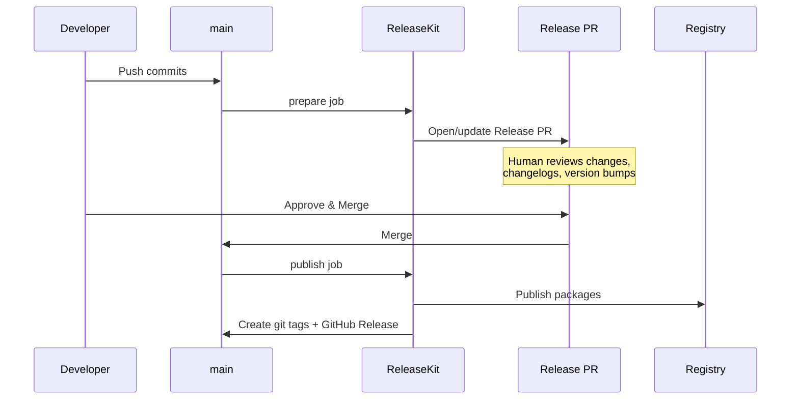

# Workflow Templates

Copy-paste these GitHub Actions workflows and customize them for your
project. Each template is progressively more advanced.

!!! tip "Reusable Composite Action"
    ReleaseKit ships a **reusable composite action** (`action.yml`) that
    handles Python/uv setup, git config, command building, output
    parsing, and job summary generation automatically. Instead of
    writing inline shell steps, you can use:

    ```yaml
    - uses: ./py/tools/releasekit
      with:
        command: publish
        workspace: py
    ```

    See the [sample workflows](../../../github/workflows/) for
    production-ready templates using the action for Python/uv, Go,
    JS/pnpm, Rust/Cargo, Dart/pub, and Java/Gradle.

## ELI5: Which Workflow Do I Need?

```
┌─────────────────────────────────────────────────────────────┐
│                  Pick Your Workflow                           │
│                                                             │
│  "I just want to publish when I push to main"               │
│  → Template 1: Simple Publish                               │
│                                                             │
│  "I want a Release PR that a human reviews first"           │
│  → Template 2: PR-Based Release                             │
│                                                             │
│  "I want scheduled releases (daily/weekly)"                 │
│  → Template 3: Scheduled Release                            │
│                                                             │
│  "I have Python AND JavaScript packages"                    │
│  → Template 4: Multi-Ecosystem                              │
│                                                             │
│  "I want one-click rollback from the GitHub Release page"   │
│  → Template 5: Release with Rollback                        │
│                                                             │
└─────────────────────────────────────────────────────────────┘
```

---

## Template 1: Simple Publish

**Best for:** Single-ecosystem projects, small teams, fast iteration.

Every push to `main` with conventional commits triggers a publish.

```yaml
# .github/workflows/release.yml
name: Release

on:
  push:
    branches: [main]

# ┌──────────────────────────────────────────────────────┐
# │ Configurable parameters — edit these for your project │
# └──────────────────────────────────────────────────────┘
env:
  WORKSPACE_DIR: "py"           # Path to your workspace root
  PYTHON_VERSION: "3.12"        # Python version
  UV_VERSION: "latest"          # uv version

jobs:
  release:
    runs-on: ubuntu-latest
    permissions:
      contents: write
      id-token: write           # For OIDC trusted publishing + SLSA L3 provenance
    steps:
      - uses: actions/checkout@v4
        with:
          fetch-depth: 0        # Full history for version computation

      - uses: astral-sh/setup-uv@v4
        with:
          version: ${{ env.UV_VERSION }}

      - uses: actions/setup-python@v5
        with:
          python-version: ${{ env.PYTHON_VERSION }}

      - name: Install dependencies
        run: uv sync --active
        working-directory: ${{ env.WORKSPACE_DIR }}

      - name: Plan release
        run: uv run releasekit plan --format full
        working-directory: ${{ env.WORKSPACE_DIR }}

      - name: Publish
        run: uv run releasekit publish
        working-directory: ${{ env.WORKSPACE_DIR }}
```

---

## Template 2: PR-Based Release

**Best for:** Teams that want human review before publishing.



```yaml
# .github/workflows/release.yml
name: Release

on:
  push:
    branches: [main]
  pull_request:
    types: [closed]

# ┌──────────────────────────────────────────────────────┐
# │ Configurable parameters — edit these for your project │
# └──────────────────────────────────────────────────────┘
env:
  WORKSPACE_DIR: "py"
  PYTHON_VERSION: "3.12"
  UV_VERSION: "latest"
  CONCURRENCY: "5"              # Max parallel publishes
  MAX_RETRIES: "2"              # Retry count per package

jobs:
  # ── Step 1: On push to main, prepare a Release PR ──────
  prepare:
    if: github.event_name == 'push'
    runs-on: ubuntu-latest
    permissions:
      contents: write
      pull-requests: write
    steps:
      - uses: actions/checkout@v4
        with:
          fetch-depth: 0

      - uses: astral-sh/setup-uv@v4
        with:
          version: ${{ env.UV_VERSION }}

      - uses: actions/setup-python@v5
        with:
          python-version: ${{ env.PYTHON_VERSION }}

      - name: Install dependencies
        run: uv sync --active
        working-directory: ${{ env.WORKSPACE_DIR }}

      - name: Prepare release
        run: uv run releasekit prepare --forge-backend api
        working-directory: ${{ env.WORKSPACE_DIR }}
        env:
          GITHUB_TOKEN: ${{ secrets.GITHUB_TOKEN }}

  # ── Step 2: On Release PR merge, tag + publish ─────────
  publish:
    if: >-
      github.event.pull_request.merged == true &&
      contains(github.event.pull_request.labels.*.name, 'autorelease: pending')
    runs-on: ubuntu-latest
    permissions:
      contents: write
      id-token: write
    steps:
      - uses: actions/checkout@v4
        with:
          fetch-depth: 0

      - uses: astral-sh/setup-uv@v4
        with:
          version: ${{ env.UV_VERSION }}

      - uses: actions/setup-python@v5
        with:
          python-version: ${{ env.PYTHON_VERSION }}

      - name: Install dependencies
        run: uv sync --active
        working-directory: ${{ env.WORKSPACE_DIR }}

      - name: Create tags and GitHub Release
        run: uv run releasekit release --forge-backend api
        working-directory: ${{ env.WORKSPACE_DIR }}
        env:
          GITHUB_TOKEN: ${{ secrets.GITHUB_TOKEN }}

      - name: Publish to registry
        run: |
          uv run releasekit publish \
            --concurrency ${{ env.CONCURRENCY }} \
            --max-retries ${{ env.MAX_RETRIES }}
        working-directory: ${{ env.WORKSPACE_DIR }}
```

---

## Template 3: Scheduled Release

**Best for:** Projects that batch changes into weekly or daily releases.

```yaml
# .github/workflows/scheduled-release.yml
name: Scheduled Release

on:
  schedule:
    - cron: '0 14 * * 1'       # Every Monday at 2 PM UTC
  workflow_dispatch:             # Allow manual trigger

# ┌──────────────────────────────────────────────────────┐
# │ Configurable parameters                               │
# └──────────────────────────────────────────────────────┘
env:
  WORKSPACE_DIR: "py"
  PYTHON_VERSION: "3.12"
  UV_VERSION: "latest"

jobs:
  release:
    runs-on: ubuntu-latest
    permissions:
      contents: write
      id-token: write
    steps:
      - uses: actions/checkout@v4
        with:
          fetch-depth: 0

      - uses: astral-sh/setup-uv@v4
        with:
          version: ${{ env.UV_VERSION }}

      - uses: actions/setup-python@v5
        with:
          python-version: ${{ env.PYTHON_VERSION }}

      - name: Install dependencies
        run: uv sync --active
        working-directory: ${{ env.WORKSPACE_DIR }}

      - name: Check if release needed
        id: check
        run: |
          if uv run releasekit should-release; then
            echo "needed=true" >> "$GITHUB_OUTPUT"
          else
            echo "needed=false" >> "$GITHUB_OUTPUT"
            echo "No releasable changes found. Skipping."
          fi
        working-directory: ${{ env.WORKSPACE_DIR }}

      - name: Prepare release
        if: steps.check.outputs.needed == 'true'
        run: uv run releasekit prepare --forge-backend api
        working-directory: ${{ env.WORKSPACE_DIR }}
        env:
          GITHUB_TOKEN: ${{ secrets.GITHUB_TOKEN }}
```

---

## Template 4: Multi-Ecosystem

**Best for:** Monorepos with Python + JavaScript (or other ecosystems).

```yaml
# .github/workflows/release.yml
name: Release

on:
  push:
    branches: [main]

jobs:
  # ── Python packages ────────────────────────────────────
  release-python:
    runs-on: ubuntu-latest
    permissions:
      contents: write
      id-token: write
    steps:
      - uses: actions/checkout@v4
        with:
          fetch-depth: 0

      - uses: astral-sh/setup-uv@v4

      - uses: actions/setup-python@v5
        with:
          python-version: "3.12"

      - name: Install and publish Python packages
        run: |
          uv sync --active
          uv run releasekit publish --workspace py
        working-directory: py

  # ── JavaScript packages ────────────────────────────────
  release-js:
    runs-on: ubuntu-latest
    permissions:
      contents: write
      id-token: write
    steps:
      - uses: actions/checkout@v4
        with:
          fetch-depth: 0

      - uses: pnpm/action-setup@v4
        with:
          version: 9

      - uses: actions/setup-node@v4
        with:
          node-version: 20
          registry-url: "https://registry.npmjs.org"

      - name: Install and publish JS packages
        run: |
          pnpm install --frozen-lockfile
          pnpm releasekit publish --workspace js
        working-directory: js
        env:
          NODE_AUTH_TOKEN: ${{ secrets.NPM_TOKEN }}
```

---

## Template 5: Release with Rollback Button

**Best for:** Production systems where you want one-click rollback
from the GitHub Release page.

This template adds a **"Rollback this release"** link to every GitHub
Release. Clicking it triggers a rollback workflow.

### Release Workflow

```yaml
# .github/workflows/release.yml
name: Release

on:
  push:
    branches: [main]

env:
  WORKSPACE_DIR: "py"
  PYTHON_VERSION: "3.12"
  UV_VERSION: "latest"

jobs:
  release:
    runs-on: ubuntu-latest
    permissions:
      contents: write
      id-token: write
    outputs:
      tags: ${{ steps.publish.outputs.tags }}
    steps:
      - uses: actions/checkout@v4
        with:
          fetch-depth: 0

      - uses: astral-sh/setup-uv@v4
        with:
          version: ${{ env.UV_VERSION }}

      - uses: actions/setup-python@v5
        with:
          python-version: ${{ env.PYTHON_VERSION }}

      - name: Install dependencies
        run: uv sync --active
        working-directory: ${{ env.WORKSPACE_DIR }}

      - name: Publish
        id: publish
        run: |
          uv run releasekit publish --forge-backend api
        working-directory: ${{ env.WORKSPACE_DIR }}
        env:
          GITHUB_TOKEN: ${{ secrets.GITHUB_TOKEN }}

      # Add rollback link to each GitHub Release
      - name: Add rollback link to releases
        if: success()
        run: |
          # For each tag created, append a rollback link to the release body
          REPO="${{ github.repository }}"
          ROLLBACK_URL="https://github.com/${REPO}/actions/workflows/rollback.yml"

          for tag in $(git tag --points-at HEAD); do
            RELEASE_ID=$(gh release view "$tag" --json id -q .id 2>/dev/null || echo "")
            if [ -n "$RELEASE_ID" ]; then
              EXISTING_BODY=$(gh release view "$tag" --json body -q .body)
              ROLLBACK_SECTION="

          ---

          > **Need to rollback?** [Click here to rollback this release](${ROLLBACK_URL}?tag=${tag}) — this will delete the git tag and GitHub Release."

              gh release edit "$tag" --notes "${EXISTING_BODY}${ROLLBACK_SECTION}"
              echo "Added rollback link to release: $tag"
            fi
          done
        env:
          GITHUB_TOKEN: ${{ secrets.GITHUB_TOKEN }}
```

### Rollback Workflow

```yaml
# .github/workflows/rollback.yml
name: Rollback Release

on:
  workflow_dispatch:
    inputs:
      tag:
        description: "Git tag to rollback (e.g. genkit-v1.2.3)"
        required: true
        type: string
      all_tags:
        description: "Delete ALL per-package tags from the same release"
        required: false
        type: boolean
        default: true
      yank:
        description: "Also yank versions from the package registry"
        required: false
        type: boolean
        default: false
      yank_reason:
        description: "Reason for yanking (shown to users)"
        required: false
        type: string
        default: ""
      dry_run:
        description: "Dry run (preview only, no changes)"
        required: false
        type: boolean
        default: true

env:
  WORKSPACE_DIR: "py"
  PYTHON_VERSION: "3.12"

jobs:
  rollback:
    runs-on: ubuntu-latest
    permissions:
      contents: write
    steps:
      - uses: actions/checkout@v4
        with:
          fetch-depth: 0

      - uses: astral-sh/setup-uv@v4

      - uses: actions/setup-python@v5
        with:
          python-version: ${{ env.PYTHON_VERSION }}

      - name: Install dependencies
        run: uv sync --active
        working-directory: ${{ env.WORKSPACE_DIR }}

      - name: Rollback release
        run: |
          ARGS="${{ inputs.tag }}"
          if [ "${{ inputs.all_tags }}" = "true" ]; then
            ARGS="$ARGS --all-tags"
          fi
          if [ "${{ inputs.yank }}" = "true" ]; then
            ARGS="$ARGS --yank"
          fi
          if [ -n "${{ inputs.yank_reason }}" ]; then
            ARGS="$ARGS --yank-reason '${{ inputs.yank_reason }}'"
          fi
          if [ "${{ inputs.dry_run }}" = "true" ]; then
            ARGS="$ARGS --dry-run"
          fi
          uv run releasekit rollback $ARGS
        working-directory: ${{ env.WORKSPACE_DIR }}
        env:
          GITHUB_TOKEN: ${{ secrets.GITHUB_TOKEN }}
```

!!! tip "Rollback safety"
    The rollback workflow defaults to `dry_run: true` and `all_tags: true`
    so you always preview the full set of tags before deleting. Yank is
    opt-in — check the box only if you need to hide versions from
    registries. See the [Rollback guide](rollback.md) for details.

---

## Template 6: Security & Compliance Gate

**Best for:** Teams that want to enforce security standards before every release.

This template runs compliance checks, health checks, and artifact
validation as a required CI gate.

```yaml
# .github/workflows/security.yml
name: Security & Compliance

on:
  push:
    branches: [main]
  pull_request:
    branches: [main]

# ┌──────────────────────────────────────────────────────────┐
# │ Configurable parameters                                    │
# │                                                          │
# │ COMPLIANCE_LEVEL: Which OSPS level to enforce            │
# │   "L1" = basics (LICENSE, SECURITY.md, SBOM)             │
# │   "L2" = hardened (signing, lockfiles, vuln scanning)    │
# │   "L3" = isolated (SLSA Build L3, signed provenance)     │
# │                                                          │
# │ FAIL_ON_GAP: Whether to fail the build on compliance gaps│
# │   "true"  = strict mode (recommended for releases)       │
# │   "false" = advisory mode (good for onboarding)          │
# │                                                          │
# │ RUN_VULN_SCAN: Whether to run vulnerability scanning     │
# │   "true"  = scan deps for known CVEs                     │
# │   "false" = skip (faster, for quick PRs)                 │
# └──────────────────────────────────────────────────────────┘
env:
  WORKSPACE_DIR: "py"
  PYTHON_VERSION: "3.12"
  UV_VERSION: "latest"
  COMPLIANCE_LEVEL: "L1"        # Minimum OSPS level to enforce
  FAIL_ON_GAP: "true"           # Fail build on compliance gaps
  RUN_VULN_SCAN: "false"        # Run vulnerability scanning

jobs:
  # ── Health checks ───────────────────────────────────────
  health-checks:
    runs-on: ubuntu-latest
    steps:
      - uses: actions/checkout@v4
        with:
          fetch-depth: 0

      - uses: astral-sh/setup-uv@v4
        with:
          version: ${{ env.UV_VERSION }}

      - uses: actions/setup-python@v5
        with:
          python-version: ${{ env.PYTHON_VERSION }}

      - name: Install dependencies
        run: uv sync --active
        working-directory: ${{ env.WORKSPACE_DIR }}

      - name: Run health checks
        run: uv run releasekit check
        working-directory: ${{ env.WORKSPACE_DIR }}

  # ── Compliance evaluation ───────────────────────────────
  compliance:
    runs-on: ubuntu-latest
    steps:
      - uses: actions/checkout@v4
        with:
          fetch-depth: 0

      - uses: astral-sh/setup-uv@v4
        with:
          version: ${{ env.UV_VERSION }}

      - uses: actions/setup-python@v5
        with:
          python-version: ${{ env.PYTHON_VERSION }}

      - name: Install dependencies
        run: uv sync --active
        working-directory: ${{ env.WORKSPACE_DIR }}

      # Print the full compliance table for visibility
      - name: Show compliance status
        run: uv run releasekit compliance
        working-directory: ${{ env.WORKSPACE_DIR }}

      # Enforce minimum compliance level
      - name: Enforce compliance level
        if: env.FAIL_ON_GAP == 'true'
        run: |
          uv run releasekit compliance --format json > compliance.json
          python -c "
          import json, sys
          level = '${{ env.COMPLIANCE_LEVEL }}'
          max_level = int(level[1])  # L1=1, L2=2, L3=3
          controls = json.load(open('compliance.json'))
          gaps = [
              c for c in controls
              if c['status'] == 'gap'
              and int(c['osps_level'][1]) <= max_level
          ]
          if gaps:
              print(f'❌ {len(gaps)} compliance gap(s) at {level} or below:')
              for g in gaps:
                  print(f'  {g[\"id\"]}: {g[\"control\"]} ({g[\"osps_level\"]})')
              sys.exit(1)
          print(f'✅ All {level} compliance controls met')
          "
        working-directory: ${{ env.WORKSPACE_DIR }}

      # Upload compliance report as artifact
      - name: Upload compliance report
        if: always()
        uses: actions/upload-artifact@v4
        with:
          name: compliance-report
          path: ${{ env.WORKSPACE_DIR }}/compliance.json

  # ── Vulnerability scanning (optional) ───────────────────
  vuln-scan:
    if: ${{ github.event_name == 'push' || vars.RUN_VULN_SCAN == 'true' }}
    runs-on: ubuntu-latest
    steps:
      - uses: actions/checkout@v4

      - uses: astral-sh/setup-uv@v4
        with:
          version: ${{ env.UV_VERSION }}

      - uses: actions/setup-python@v5
        with:
          python-version: ${{ env.PYTHON_VERSION }}

      - name: Install dependencies
        run: uv sync --active
        working-directory: ${{ env.WORKSPACE_DIR }}

      - name: Run pip-audit
        run: uv run pip-audit --strict
        working-directory: ${{ env.WORKSPACE_DIR }}
        continue-on-error: true
```

!!! tip "Start with L1, graduate to L2"
    Set `COMPLIANCE_LEVEL: "L1"` when onboarding. Once all L1 controls
    are met, bump to `"L2"` to enforce signing, lockfiles, and vuln
    scanning. L3 is for projects that need SLSA Build L3 isolation.

---

## Customization Cheat Sheet

All templates use `env:` blocks at the top for easy customization:

| Variable | Default | What It Controls |
|----------|---------|-----------------|
| `WORKSPACE_DIR` | `"py"` | Path to your workspace root |
| `PYTHON_VERSION` | `"3.12"` | Python version for the runner |
| `UV_VERSION` | `"latest"` | uv version |
| `CONCURRENCY` | `"5"` | Max parallel package publishes |
| `MAX_RETRIES` | `"2"` | Retry count per package |

### Adding Custom Steps

Insert steps between `Install dependencies` and `Publish` for custom
build steps:

```yaml
      - name: Run custom pre-release checks
        run: ./scripts/pre-release-checks.sh
        working-directory: ${{ env.WORKSPACE_DIR }}

      - name: Build documentation
        run: uv run mkdocs build
        working-directory: ${{ env.WORKSPACE_DIR }}
```

!!! success "SLSA L3 provenance is automatic"
    All templates above include `id-token: write` on hosted runners,
    which means ReleaseKit **automatically** achieves SLSA Build L3 —
    signed provenance with hardened, isolated builds. No extra flags
    needed. See the [SLSA Provenance guide](slsa-provenance.md) for
    details.

## Next Steps

- [Rollback](rollback.md) — Undo a release from CLI or GitHub
- [Security & Compliance](compliance.md) — OSPS Baseline compliance evaluation
- [Skipping Checks](skip-checks.md) — Per-package check skipping
- [SLSA Provenance](slsa-provenance.md) — How provenance auto-detection works
- [CI/CD Integration](ci-cd.md) — Detailed CI/CD guide
- [Configuration](configuration.md) — Customize `releasekit.toml`
- [FAQ](faq.md) — Common questions
