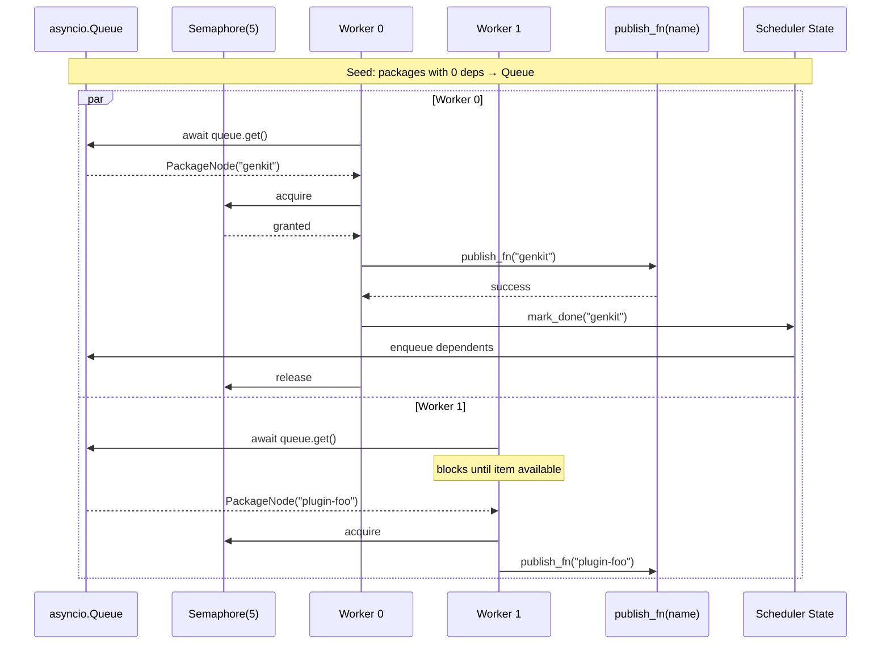
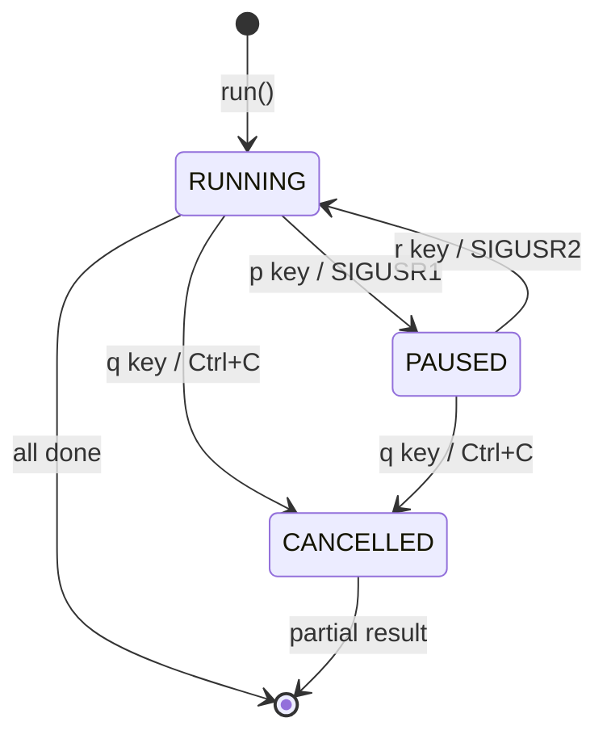
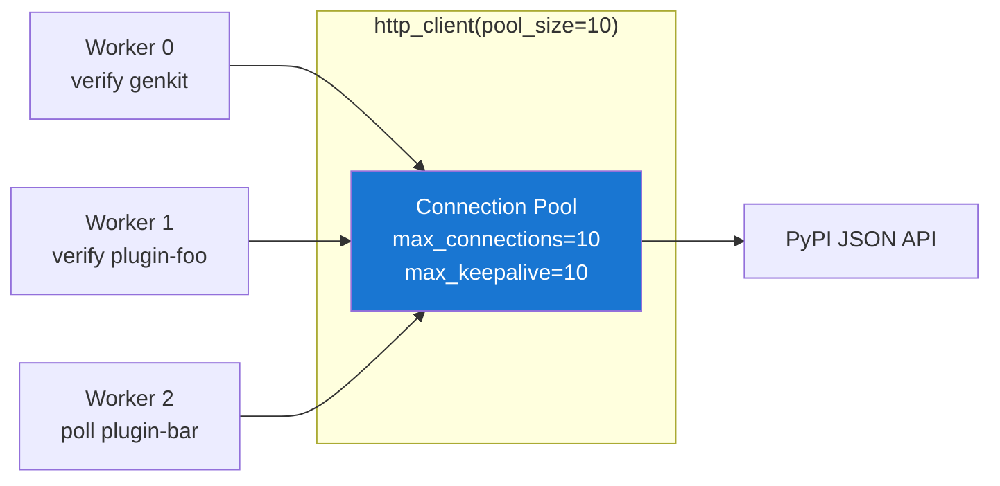
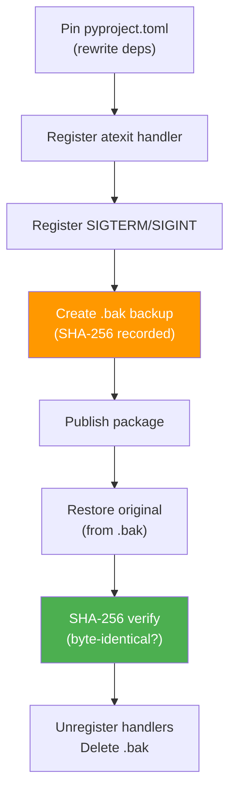

# Async & Concurrency

ReleaseKit is a concurrent publish pipeline built on Python's `asyncio`.
This page documents the concurrency architecture, the primitives used,
and the real problems we solved during development.

## Concurrency Model

ReleaseKit uses a **single event loop** with cooperative scheduling:

```
┌─────────────────────────────────────────────────────────────────────┐
│                        asyncio Event Loop                           │
│                                                                     │
│  ┌──────────┐  ┌──────────┐  ┌──────────┐  ┌────────────────┐     │
│  │ Worker 0 │  │ Worker 1 │  │ Worker N │  │ Key Listener   │     │
│  │          │  │          │  │          │  │ (stdin reader) │     │
│  └────┬─────┘  └────┬─────┘  └────┬─────┘  └────────────────┘     │
│       │              │              │                               │
│       └──────────────┴──────────────┘                               │
│                      │                                              │
│               asyncio.Queue                                         │
│               asyncio.Semaphore(N)                                  │
│               asyncio.Event (pause/resume gate)                     │
│                                                                     │
│  Advisory File Lock (.releasekit.lock) — cross-process exclusion    │
│  Ephemeral Pin (signal handlers) — crash-safe file restoration      │
│  HTTP Connection Pool (httpx) — async registry queries              │
└─────────────────────────────────────────────────────────────────────┘
```

### Why Single Loop?

!!! info "Design Decision"
    We deliberately chose a single event loop over multi-threaded or
    multi-process designs:

    - **No shared mutable state** — asyncio's cooperative scheduling
      guarantees no interleaving between `await` points, so no locks
      are needed for scheduler state
    - **`threading.Lock` blocks the event loop** — mixing threads with
      async is dangerous; a thread lock can deadlock the entire pipeline
    - **Cross-process coordination** uses the advisory file lock
      instead of multi-loop scheduling
    - **Python's `asyncio.run()` creates one loop** — this is the
      standard pattern for CLI tools

## Async Primitives Used

| Primitive | Where | Purpose |
|-----------|-------|---------|
| `asyncio.Queue` | Scheduler | Ready-package dispatch to workers |
| `asyncio.Semaphore` | Scheduler | Concurrency limiter (max N packages) |
| `asyncio.Event` | Scheduler | Pause/resume gate (`_resume_event`) |
| `asyncio.wait_for` | Scheduler | Per-task timeout enforcement |
| `asyncio.create_task` | Scheduler | Worker pool + keyboard listener |
| `asyncio.gather` | Scheduler | Clean shutdown of all workers |
| `asyncio.sleep` | Scheduler, net.py | Backoff delays without blocking |
| `httpx.AsyncClient` | net.py | Non-blocking HTTP to PyPI/npm |
| `asyncio.Queue.join` | Scheduler | Wait for all items processed |

## Worker Pool Architecture



## Retry with Full Jitter

Failed publishes use **exponential backoff with full jitter** to
avoid thundering herd when retrying against a congested registry:

```
┌──────────────────────────────────────────────────────┐
│              Retry Backoff Algorithm                   │
│                                                      │
│  for attempt in range(1 + max_retries):              │
│      try:                                            │
│          await publish_fn(name)                      │
│          break  # success                            │
│      except Exception:                               │
│          if attempt < max_retries:                   │
│              max_delay = min(                        │
│                  base_delay × 2^attempt,             │
│                  60.0  # cap                         │
│              )                                       │
│              delay = random.uniform(0, max_delay)    │
│                                     ↑                │
│                              "full jitter"           │
│              await asyncio.sleep(delay)              │
│                                                      │
│  Example delays (base=1.0s):                         │
│    Attempt 0: uniform(0, 1.0s)                       │
│    Attempt 1: uniform(0, 2.0s)                       │
│    Attempt 2: uniform(0, 4.0s)                       │
│    Attempt 3: uniform(0, 8.0s)                       │
│    Attempt 4: uniform(0, 16.0s)                      │
│    Attempt 5+: uniform(0, 60.0s)  ← capped          │
└──────────────────────────────────────────────────────┘
```

!!! tip "Why full jitter?"
    **Exponential backoff** alone causes synchronized retries when
    multiple packages fail at the same time. **Full jitter** (uniform
    random between 0 and max) spreads retries across the entire window,
    reducing registry contention. See [AWS Architecture Blog](https://aws.amazon.com/blogs/architecture/exponential-backoff-and-jitter/).

## Pause/Resume/Cancel

The scheduler supports interactive control during long runs:



**Implementation details:**

- **Pause** clears `asyncio.Event` → workers block on `await event.wait()`
  after finishing their current package
- **Resume** sets the event → all blocked workers wake up
- **Cancel** raises `CancelledError` → workers finish in-flight work,
  then `asyncio.gather(..., return_exceptions=True)` collects them
- **Signal handlers** (`SIGUSR1`/`SIGUSR2`) allow external pause/resume
  (e.g., `kill -USR1 <pid>`)
- **Keyboard listener** runs in a thread executor with `select()` timeout
  to avoid blocking shutdown

## HTTP Connection Pooling

Registry queries (version checks, checksum verification) use a shared
`httpx.AsyncClient` with connection pooling:



**Retry logic** (`request_with_retry`):

- Retries on `429`, `500`, `502`, `503`, `504` status codes
- Retries on `ConnectError`, `ReadTimeout`, `WriteTimeout`
- Exponential backoff: `base * 2^attempt`
- Max 3 retries by default

## Problems Tackled

### Problem 1: Level-Based Lockstep Wasted Time

**Before:** All packages in a topological level had to finish before
the next level could start. A slow package (e.g., large build) blocked
fast packages in the same level from starting their dependents.

```
Level 0: [A(1s), B(30s)] ─── must wait 30s ──▶ Level 1: [C, D]
                                                   ↑
                                         C only depends on A,
                                         but waited 29s for B
```

**Solution:** Dependency-triggered scheduling. `mark_done(A)` immediately
decrements C's counter and enqueues it. No waiting for B.

### Problem 2: `asyncio.Queue` Has No Remove

**Problem:** When a package is removed at runtime (`remove_package()`),
it may already be in the `asyncio.Queue`. Python's `asyncio.Queue` has
no `remove()` method.

**Solution:** Lazy cancellation via a `_cancelled` set. Workers check
the set after `queue.get()` and skip cancelled nodes:

```python
node = await self._queue.get()
if node.name in self._cancelled:
    self._result.skipped.append(node.name)
    self._queue.task_done()
    continue  # skip without processing
```

### Problem 3: `queue.join()` Hangs on Blocked Dependents

**Problem:** When a package fails, its dependents are never enqueued.
But `queue.join()` waits until `task_done()` is called for every
`put()`. Dependents that were never put into the queue never call
`task_done()`, so `join()` hangs forever.

**Solution:** `_block_dependents()` increments `_completed` for each
blocked descendant and marks them done. Workers use a timeout on
`queue.get()` and check `_completed >= _total` to exit:

```python
try:
    node = await asyncio.wait_for(self._queue.get(), timeout=1.0)
except TimeoutError:
    if self._completed >= self._total:
        break
    continue
```

### Problem 4: CancelledError Skips `task_done()`

**Problem:** If a worker is cancelled (Ctrl+C, `q` key), `CancelledError`
is a `BaseException` that skips the `except Exception` handler. Without
calling `task_done()`, `queue.join()` hangs during shutdown.

**Solution:** `task_done()` is in a `finally` block that executes even
on cancellation:

```python
try:
    async with self._semaphore:
        await publish_fn(node.name)
finally:
    self._completed += 1
    self._queue.task_done()  # always called
```

### Problem 5: Crash-Safe File Restoration

**Problem:** Ephemeral pinning rewrites `pyproject.toml` during publish.
If the process crashes (OOM kill, SIGKILL, power loss), the file is
left in a modified state with pinned versions.

**Solution:** Three layers of crash safety in `EphemeralPin`:

```
Layer 1: atexit handler    → restores on normal Python exit
Layer 2: SIGTERM/SIGINT    → restores on kill signals
Layer 3: .bak file         → manual recovery as last resort
         + SHA-256 verify  → byte-identical restoration guaranteed
```



### Problem 6: Advisory Lock Race Conditions

**Problem:** Two `releasekit publish` invocations on the same machine
could race to acquire the lock file.

**Solution:** Advisory lock with stale detection:

- **PID + hostname** stored in the lock file
- **Stale timeout** (30 min) automatically cleans abandoned locks
- **Process liveness check** (`os.kill(pid, 0)`) verifies the holder
  is still alive
- **atexit cleanup** ensures the lock is released on exit

### Problem 7: Keyboard Input Blocking Shutdown

**Problem:** The keyboard listener reads from stdin in a thread executor.
If the read blocks indefinitely, `asyncio.gather()` during shutdown
waits forever.

**Solution:** `select()` with a 0.5s timeout before reading:

```python
def _read_key() -> str | None:
    readable, _, _ = select.select([fd], [], [], 0.5)
    if readable:
        return sys.stdin.read(1)
    return None

# In async context:
char = await loop.run_in_executor(None, _read_key)
```

The timeout ensures the function returns periodically so the worker
can check `done_event.is_set()` and exit cleanly.

### Problem 8: Double Completion

**Problem:** A race between `mark_done()` and `_block_dependents()`
could mark the same package as completed twice, corrupting the
`_completed` counter.

**Solution:** Guard sets prevent double processing:

```python
# mark_done() checks
if name in self._done:
    return []  # already done, no-op
self._done.add(name)

# _block_dependents() checks
if dep_name in self._done:
    continue  # already blocked, skip
self._done.add(dep_name)
```

### Problem 9: Signal Handlers in Non-Main Thread

**Problem:** Signal handlers can only be registered from the main thread.
When running under pytest or embedded in another application, the
scheduler may not be on the main thread.

**Solution:** Graceful fallback with `(ValueError, OSError)` catch:

```python
try:
    loop.add_signal_handler(signal.SIGUSR1, self.pause)
except (ValueError, OSError):
    logger.debug('signals_skipped', reason='not main thread')
```

## Thread Safety Guarantees

```
┌──────────────────────────────────────────────────────────────────┐
│                       Thread Safety Model                        │
│                                                                  │
│  Single Event Loop (asyncio.run)                                 │
│  ├── All shared state mutated only between await points          │
│  ├── No threading.Lock needed (cooperative scheduling)           │
│  ├── asyncio.Queue, Event, Semaphore are NOT thread-safe         │
│  │   └── But that's fine — we use them from one loop only        │
│  ├── Cross-thread calls use loop.call_soon_threadsafe()          │
│  │   └── Only needed for signal handlers → pause/resume          │
│  └── Cross-process coordination uses file-based advisory lock    │
│                                                                  │
│  ⚠ Multiple event loops are NOT supported by design              │
└──────────────────────────────────────────────────────────────────┘
```
