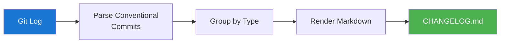
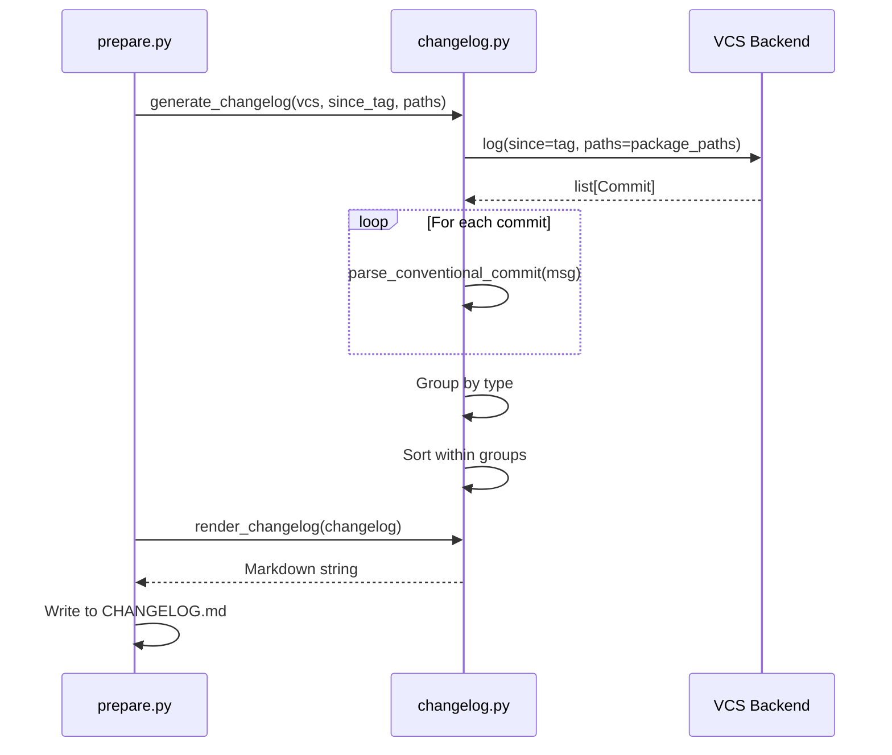

# Changelog Generation

ReleaseKit generates per-package changelogs by reading commits since the
last tag, grouping them by type, and rendering into Markdown.

## Data Flow



## Algorithm

```
┌─────────────────────────────────────────────────────────────────┐
│ generate_changelog(vcs, since_tag, paths)                       │
│                                                                 │
│  1. vcs.log(since=since_tag, paths=paths)                      │
│     → list of commits touching this package                     │
│                                                                 │
│  2. parse_conventional_commit(msg) for each commit              │
│     → ConventionalCommit with type, scope, description          │
│                                                                 │
│  3. Group by commit type:                                       │
│     ┌──────────────┬────────────────────────────┐               │
│     │ Group        │ Commit Types               │               │
│     ├──────────────┼────────────────────────────┤               │
│     │ ⚠ Breaking   │ BREAKING CHANGE, !          │               │
│     │ ✨ Features   │ feat                        │               │
│     │ 🐛 Bug Fixes  │ fix                         │               │
│     │ ⚡ Performance│ perf                        │               │
│     │ 📚 Docs       │ docs                        │               │
│     │ 🔧 Chores     │ chore, ci, build, test      │               │
│     └──────────────┴────────────────────────────┘               │
│                                                                 │
│  4. render_changelog(changelog)                                 │
│     → Markdown string grouped by section                        │
└─────────────────────────────────────────────────────────────────┘
```

## Output Format

```markdown
## 0.6.0 (2026-02-11)

### ⚠ BREAKING CHANGES

* **auth**: Redesign authentication API (#123)

### Features

* **core**: Add streaming support (#456)
* **plugins**: New Ollama embedding model (#789)

### Bug Fixes

* **google-genai**: Fix null pointer in response parser (#101)
* Handle edge case in version calculation (#102)
```

## Filtering

Exclude specific commit types from changelogs:

```python
changelog = generate_changelog(
    vcs=vcs,
    since_tag='genkit-v0.5.0',
    paths=['packages/genkit/'],
    exclude_types=frozenset({'docs', 'chore', 'ci', 'test'}),
)
```

## Sequence Diagram



## Integration with Prepare

During `releasekit prepare`, changelogs are:

1. Generated for each bumped package
2. Prepended to the package's `CHANGELOG.md`
3. Embedded in the Release PR body
4. Committed on the release branch

## Data Types

```python
@dataclass
class ChangelogEntry:
    sha: str
    type: str
    scope: str
    description: str
    breaking: bool

@dataclass
class Changelog:
    version: str
    date: str
    entries: list[ChangelogEntry]
    breaking_entries: list[ChangelogEntry]
```
