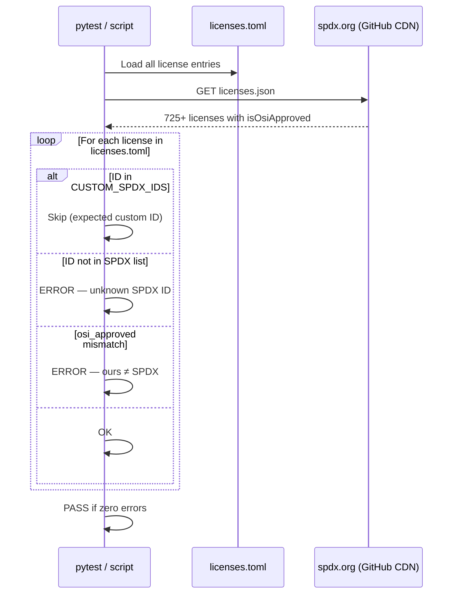
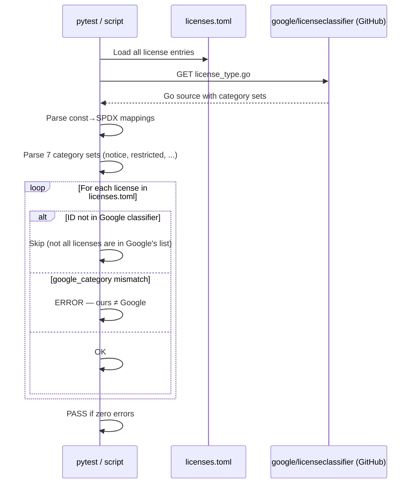
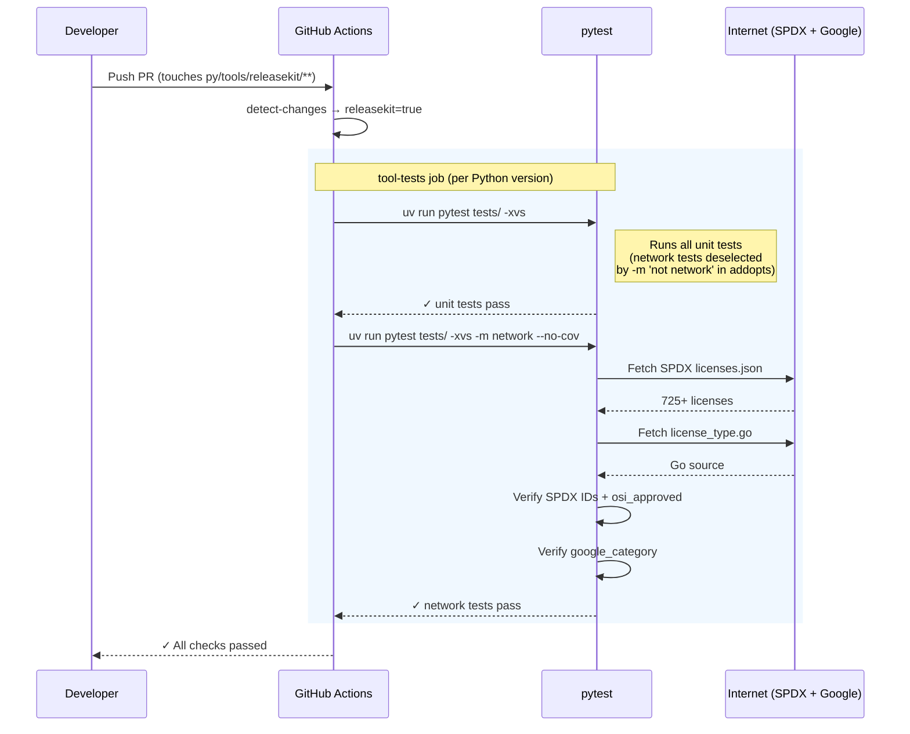

# License Data Verification

ReleaseKit maintains a curated license database in two TOML files:

| File | Purpose |
|------|---------|
| `src/releasekit/data/licenses.toml` | SPDX IDs, names, categories, OSI approval, aliases |
| `src/releasekit/data/license_compatibility.toml` | Directed compatibility graph between licenses |

These files are verified against two authoritative upstream sources:

1. **[SPDX License List](https://spdx.org/licenses/)** — the canonical
   registry of open-source license identifiers.
2. **[Google licenseclassifier](https://github.com/google/licenseclassifier)** —
   Google's license categorization used internally (`notice`, `reciprocal`,
   `restricted`, `permissive`, `unencumbered`, `by_exception_only`,
   `forbidden`).

## How it works

### SPDX verification flow

Every SPDX ID and `osi_approved` value in `licenses.toml` is checked
against the official SPDX license list JSON:



### Google licenseclassifier verification flow

Every `google_category` value is checked against the category sets
defined in `license_type.go`:



### CI integration flow

On every PR that touches `py/tools/releasekit/**`, the verification
tests run automatically as part of the `tool-tests` job:



## What is checked

### SPDX check

- Every SPDX ID in `licenses.toml` exists in the official SPDX license
  list (custom IDs like `Proprietary` or `Python-2.0-complete` are
  allowlisted).
- The `osi_approved` field matches the SPDX-provided value.

### Google licenseclassifier check

- Every `google_category` value matches the category assigned in
  `license_type.go` from `google/licenseclassifier`.

## Running the checks

### Integration tests (recommended for CI)

The checks are implemented as pytest integration tests marked with
`@pytest.mark.network`.  They are **deselected by default** so they
never run offline or slow down the normal test suite.

```shell
# Run the network integration tests explicitly.
pytest -m network tests/rk_license_data_integ_test.py --no-cov

# Run everything including network tests.
pytest -m '' --no-cov
```

If the machine has no internet access, the tests skip automatically
via a socket probe — they will never fail due to connectivity.

### Standalone script

A richer CLI is available for interactive use:

```shell
# Run both checks (default).
python scripts/verify_license_data.py

# Run only the SPDX check.
python scripts/verify_license_data.py --spdx

# Run only the Google classifier check.
python scripts/verify_license_data.py --google
```

## CI configuration

In the GitHub Actions workflow (`python.yml`), the `tool-tests` job
runs the network integration tests as a separate step after the main
unit tests:

```yaml
- name: Run tool tests
  run: |
    cd py/tools/${{ matrix.tool }}
    uv run pytest tests/ -xvs

- name: Run network integration tests
  run: |
    cd py/tools/${{ matrix.tool }}
    uv run pytest tests/ -xvs -m network --no-cov
```

### Porting to a new repo

When moving ReleaseKit to a standalone repository:

1. **pytest marker** — The `network` marker is registered in
   `pyproject.toml` under `[tool.pytest.ini_options]`:

    ```toml
    [tool.pytest.ini_options]
    addopts = "... -m 'not network'"
    markers = [
        "network: requires internet access (deselected by default, run with: pytest -m network)",
    ]
    ```

2. **CI step** — Add a step that runs `pytest -m network --no-cov`
   after the main test step.  CI runners have internet access so these
   tests will always execute.

3. **Files involved**:

    | File | Role |
    |------|------|
    | `tests/rk_license_data_integ_test.py` | pytest integration tests (3 tests) |
    | `scripts/verify_license_data.py` | Standalone CLI script |
    | `pyproject.toml` | `network` marker registration + default deselection |

4. **Custom SPDX IDs** — Both the test file and the script maintain a
   `CUSTOM_SPDX_IDS` frozenset of IDs that are not in the official SPDX
   list (e.g. `Proprietary`, `Python-2.0-complete`, `JSON`).  If you add
   a new custom license to `licenses.toml`, add its ID to this set in
   both files to avoid false failures.

## Editing the license database

After editing `licenses.toml` or `license_compatibility.toml`:

1. Run the verification script or tests to catch errors immediately:

    ```shell
    python scripts/verify_license_data.py
    ```

2. Run the license graph unit tests to ensure compatibility rules are
   consistent:

    ```shell
    pytest tests/rk_license_graph_test.py -xvs
    ```

3. Commit.  CI will run both the unit tests and the network integration
   tests on your PR.
