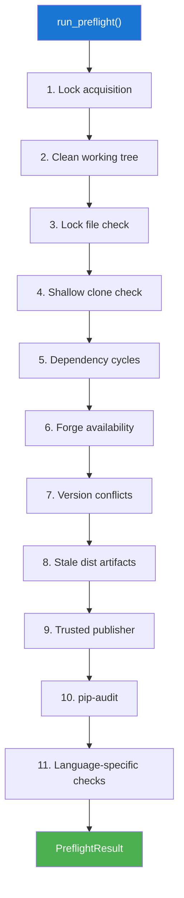
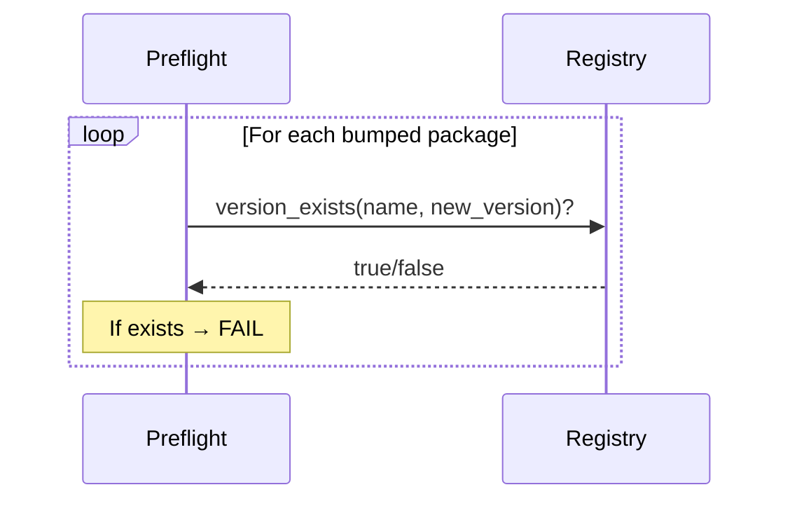

# Preflight Checks

Preflight checks validate that the workspace is in a correct state
before starting a release. All checks are **non-destructive** — they
only read state, never modify it.

## Check Pipeline



## Check Details

### 1. Lock Acquisition

Acquires an advisory file lock (`.releasekit.lock`) to prevent
concurrent releases. Non-blocking — fails immediately if another
instance holds the lock.

### 2. Clean Working Tree

```bash
git status --porcelain
```

Ensures no uncommitted changes. Publishing with a dirty tree risks
including unintended changes in the version bump.

### 3. Lock File Check

```bash
uv lock --check  # Python
pnpm install --frozen-lockfile  # JavaScript
```

Ensures the lock file is in sync with `pyproject.toml` / `package.json`.

### 4. Shallow Clone Warning

```bash
git rev-parse --is-shallow-repository
```

Warns if the repo is a shallow clone (common in CI), which may cause
inaccurate version computation due to missing tag history.

!!! tip "Fix in CI"
    ```yaml
    - uses: actions/checkout@v4
      with:
        fetch-depth: 0  # Full history
    ```

### 5. Dependency Cycle Detection

Runs DFS cycle detection on the dependency graph. Cycles make
topological sorting impossible.

### 6. Forge Availability

Checks if the forge CLI (`gh`, `glab`) is installed. Warning only —
releases work without a forge (no PR creation or GitHub Releases).

### 7. Version Conflict Check



Queries the registry to ensure none of the target versions already
exist. Prevents accidentally overwriting a published version.

### 8. Stale Dist Artifacts

Checks for non-empty `dist/` directories from previous builds.
`uv publish` would upload old artifacts by mistake.

### 9. Trusted Publisher

Warns if OIDC trusted publishing is not configured for CI mode.
Trusted publishing is more secure than long-lived API tokens.

### 10. pip-audit

Runs `pip-audit` (if available) to check for known vulnerabilities.
**Non-blocking** — produces a warning, not a failure.

### 11. Language-Specific Checks

Delegates to the `CheckBackend` protocol for ecosystem-specific
validation:

| Check | Python | JavaScript | Go |
|-------|--------|------------|-----|
| Type markers (`py.typed`) | ✅ | — | — |
| Version consistency | ✅ | ✅ | — |
| Naming convention | ✅ | ✅ | — |
| Metadata completeness | ✅ | ✅ | — |
| Python classifiers | ✅ | — | — |
| Namespace `__init__.py` | ✅ | — | — |
| OSS files (README, LICENSE) | ✅ | ✅ | ✅ |

## Source-Level Diagnostics

Health checks can attach **source-level context** to warnings and
failures via `SourceContext` objects. The CLI renders these as
Rust-compiler-style diagnostics with file paths, line numbers, and
source excerpts.

### SourceContext

```python
@dataclass(frozen=True)
class SourceContext:
    path: str       # File path (absolute or relative)
    line: int = 0   # 1-based line number (0 = unknown)
    key: str = ''   # TOML key or search term matched
    label: str = '' # Short annotation (e.g. "missing here")
```

### Helpers

| Helper | Purpose |
|--------|---------|
| `find_key_line(content, key, section=)` | Find 1-based line of a TOML key or `[section]` header |
| `read_source_snippet(path, line, context_lines=2)` | Read lines around a location for display |

### Example

```python
from releasekit.preflight import SourceContext, find_key_line

content = pkg.manifest_path.read_text(encoding='utf-8')
line = find_key_line(content, 'build-backend', section='build-system')
result.add_failure(
    'build_system',
    'Missing build-backend',
    hint='Add build-backend = "hatchling.build" to [build-system].',
    context=[SourceContext(
        path=str(pkg.manifest_path),
        line=line,
        key='build-backend',
        label='build-backend missing',
    )],
)
```

## Result Types

```python
class PreflightResult:
    passed: list[str]                                  # Checks that passed
    warnings: list[str]                                # Non-blocking warnings
    failed: list[str]                                  # Blocking failures
    errors: dict[str, str]                             # Failed check → message
    warning_messages: dict[str, str]                   # Warning check → message
    hints: dict[str, str]                              # Check → actionable hint
    context: dict[str, Sequence[str | SourceContext]]   # Check → file locations

    def ok(self) -> bool:
        return len(self.failed) == 0
```

The `context` parameter on `add_warning()` and `add_failure()` accepts
`Sequence[str | SourceContext]` — callers can pass plain `list[str]`
(file paths only) or `list[SourceContext]` (with line numbers) without
type errors.

**Warnings** are displayed but don't block publishing.
**Failures** abort the release with a non-zero exit code.

## Skipping Preflight

```bash
releasekit publish --force  # Skip all preflight checks
```

!!! warning
    Use `--force` only when you understand the risks. Preflight
    checks exist to prevent common release mistakes.
