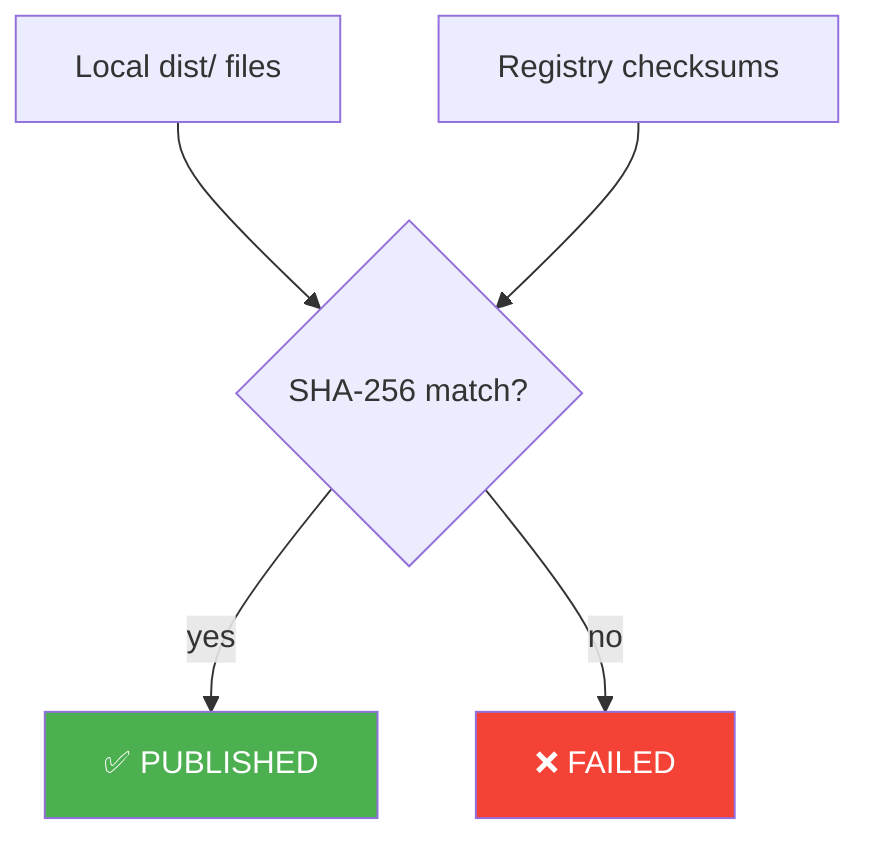
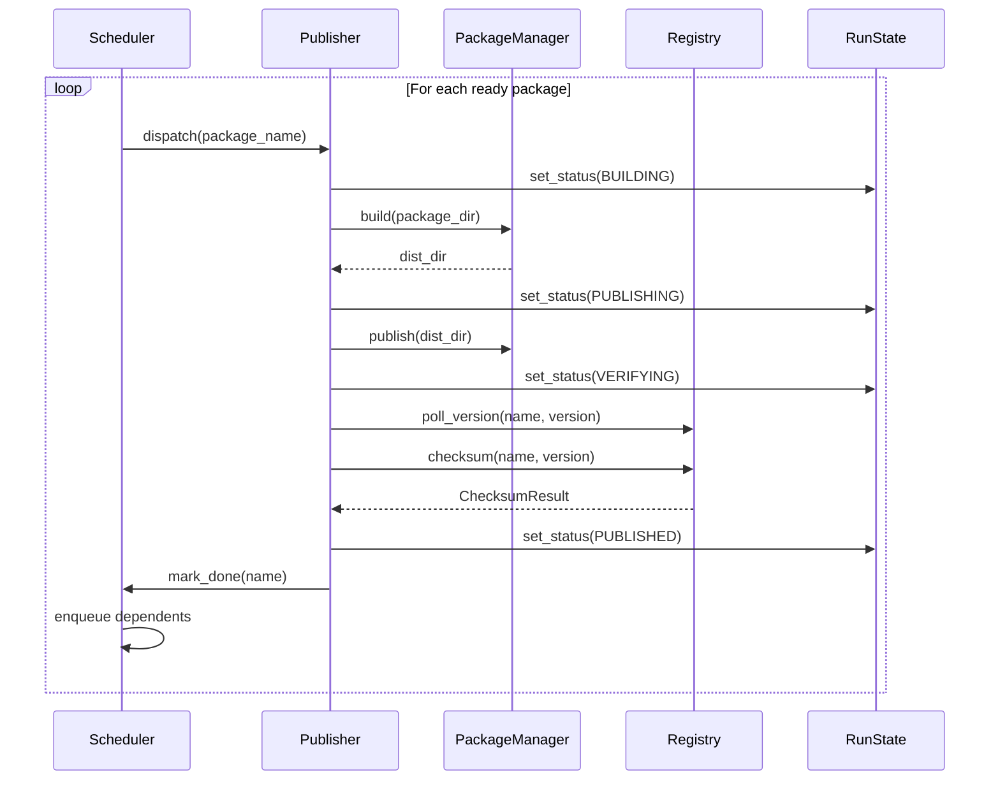
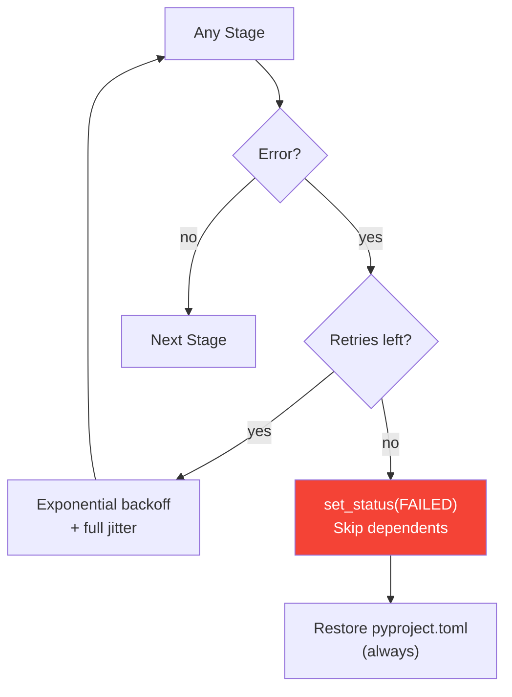

# Publisher Pipeline

The publisher orchestrates building and uploading packages to registries
in dependency order with crash-safe state tracking.

## Pipeline Stages

Each package goes through 6 stages:

```
┌──────────────────────────────────────────────────────────────────────┐
│                    Per-Package Pipeline                               │
│                                                                      │
│  ┌─────┐   ┌───────┐   ┌─────────┐   ┌──────┐   ┌────────┐   ┌───────┐
│  │ PIN │──▶│ BUILD │──▶│ PUBLISH │──▶│ POLL │──▶│ VERIFY │──▶│RESTORE│
│  └─────┘   └───────┘   └─────────┘   └──────┘   └────────┘   └───────┘
│     │          │            │            │           │            │
│     │          │            │            │           │            │
│  Rewrite    uv build    uv publish    Poll       SHA-256      Restore
│  internal   → dist/     → PyPI       registry   checksum     original
│  deps to                              until      against      pyproject
│  exact                                version    local        .toml
│  versions                             appears    dist files
│                                                                      │
└──────────────────────────────────────────────────────────────────────┘
```

### Stage 1: Pin

**Ephemeral version pinning** rewrites internal dependency specifiers
to exact versions:

```
Before:  genkit >= 0.5.0
After:   genkit == 0.6.0
```

This ensures the published package declares the exact dependency
versions that were tested together. The original `pyproject.toml`
is backed up and restored in Stage 6.

### Stage 2: Build

Invokes the package manager's build command:

- **Python (uv)**: `uv build` → creates `dist/*.tar.gz` and `dist/*.whl`
- **JavaScript (pnpm)**: `pnpm build` → creates package tarball

### Stage 3: Publish

Uploads built artifacts to the registry:

- **Python**: `uv publish dist/*`
- **JavaScript**: `pnpm publish`

### Stage 4: Poll

Polls the registry until the new version appears (or timeout):

```python
while elapsed < poll_timeout:
    if registry.version_exists(name, version):
        return True
    await asyncio.sleep(poll_interval)
```

Default: 5s interval, 300s timeout.

### Stage 5: Verify

Computes SHA-256 checksums of local `dist/` files and compares them
against the registry's reported checksums:



### Stage 6: Restore

Restores the original `pyproject.toml` that was backed up in Stage 1.
Uses atomic file operations for crash safety.

## Orchestration

The publisher uses the [Scheduler](../architecture/scheduler.md) to
dispatch packages as their dependencies complete:



## Error Handling



The `pyproject.toml` is **always** restored, even on failure. This is
critical — a crash during publishing must not leave pinned versions in
the working tree.

## Configuration

```python
@dataclass
class PublishConfig:
    concurrency: int = 5           # Max parallel publishes
    dry_run: bool = False          # Preview mode
    verify_checksums: bool = True  # Post-publish verification
    poll_timeout: float = 300.0    # Seconds to wait for registry
    poll_interval: float = 5.0     # Seconds between polls
    max_retries: int = 0           # Retry count
    retry_base_delay: float = 1.0  # Base delay for backoff
    task_timeout: float = 600.0    # Per-package timeout
    force: bool = False            # Skip preflight
```
